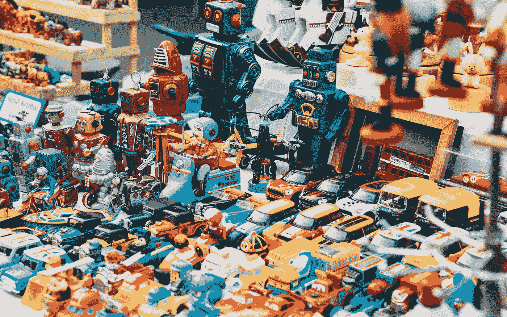

# 机器学习模型已经是你的管理者了

> 原文：<https://betterprogramming.pub/algorithms-are-already-acting-as-middle-managers-fcbaeb27317f>

## 用机器学习管理人类生产力和创造力

Jack Hung Tr 拍摄的照片。 on [Unsplash](https://unsplash.com/s/photos/robots?utm_source=unsplash&utm_medium=referral&utm_content=creditCopyText)

有很多关于机器学习模型和自动化夺走工作岗位和取代每个行业工人的谈论。

然而，中层管理算法已经产生的影响却很少被提及。这不是什么遥远的未来的概念。机器学习模型已经在充当人类的管理者。

一些公司已经开始使用算法和模型来管理人员，而不是人(具有不同程度的人类互动)。看看优步、Lyft、YouTube、SoundCloud 和类似的公司就知道了。所有这些公司都用算法和模型来管理人和他们的生产力和创造力。

这些公司管理内容创建、性能和生产效率，无需或只需极少的人工干预。相反，他们颠覆了对大量人类互动的需求，并允许某个数据中心的算法做出这些决定。

## 优步/Lyft——管理人类生产力

优步和 Lyft 可能是管理人员的算法中最明显的例子。

这些公司使用各种算法来有效地为他们的客户找到最近的司机、最佳路线和最有效的交通方式。

这需要最少的人工干预。优步司机从来不需要和他们的人类老板交流。相反，他们的生计由远处某处服务器中的一个模型决定，该模型告诉他们需要在高峰时间去第四街接需要去机场的杰米。

这位经理还听取大规模的客户评论(这在以前是不可能做到的)。这确保了司机即使在无人监视的情况下也能表现良好。如果你的评分下降到很低，该算法甚至会提供如何提高你的评分的提示……就像一些奇怪的自动绩效改进计划(PIP)。

优步网站上目前的措辞是，“停用只是作为最后的手段，如果你采取某些措施来改善，你的帐户可能会被激活。”这种措辞听起来像 PIP，一种老式的人力资源工具，如果你的评级或工作没有改善，你就会被解雇。

优步和 Lyft 不仅仅是平台。他们创造了大规模的中层管理。他们管理、审查并试图在最少的人为干预下改善驾驶员的行为。

## YouTube/SoundCloud——管理人类创造力

每个人都喜欢谈论 YouTube 算法，以及它如何成就或毁灭你。如果你被这个神话般的算法注意到并得到推荐，那么你就会自动在互联网上声名鹊起(至少是因为那个视频)——类似于曾经由经纪人、经理和选角导演制造明星的方式。

有些人意识到而有些人没有意识到的是，YouTube 算法扮演着类似于代理人的角色。它大体上知道什么是受欢迎的，什么是观众的趋势，然后挑选符合当前需求的人才。烦躁纺纱可能是本周的趋势。或者可能会出现很多关于即将到来的比赛或音乐活动的文章。

该算法使用这一知识来推动它认为将受欢迎的内容到顶部。这种算法取代了经理，他走遍所有的酒吧听下一个甲壳虫乐队。算法只是测试新的艺术家和创作者，看看观众想要什么。

在许多方面，这种算法不仅仅是规定了将观看什么内容。这也推动了创造力。

想想 SoundCloud。SoundCloud 的行为类似于 YouTube，它决定了什么样的新人才会大规模流行。 [Lil Nas X 用这个帮助推动《老城路》](https://medium.com/@beausoleil/how-old-town-road-hacked-the-algorithm-and-became-a-billboard-1-song-162873716180)登顶。他创作了一首混合歌曲，并以这样一种方式进行营销，这首歌一飞冲天。

即使在这种情况下，有人可能会认为算法迫使创造力。奇怪的是，这些机器学习模型几乎比典型的经理更灵活。当涉及到内容时，他们似乎允许人们试验和测试想法的空间。

# 结论

算法和机器学习已经在管理人了。这不是什么未来事件。它已经开始慢慢决定我们看什么，听什么，以及谁开车带我们到处走。

所有这些都是在最少的人类互动下发生的(除非有某种问题)。

这些公司找到了大规模管理人员的方法。他们只需对模型稍加调整，就能推动创造力、生产力以及更多。在这个由算法驱动的世界里，关键是要记住，归根结底，人就是人。[我们不是机器，也不应该像机器一样工作](https://medium.com/better-programming/the-problem-with-machine-learning-in-healthcare-406c97cb311)。