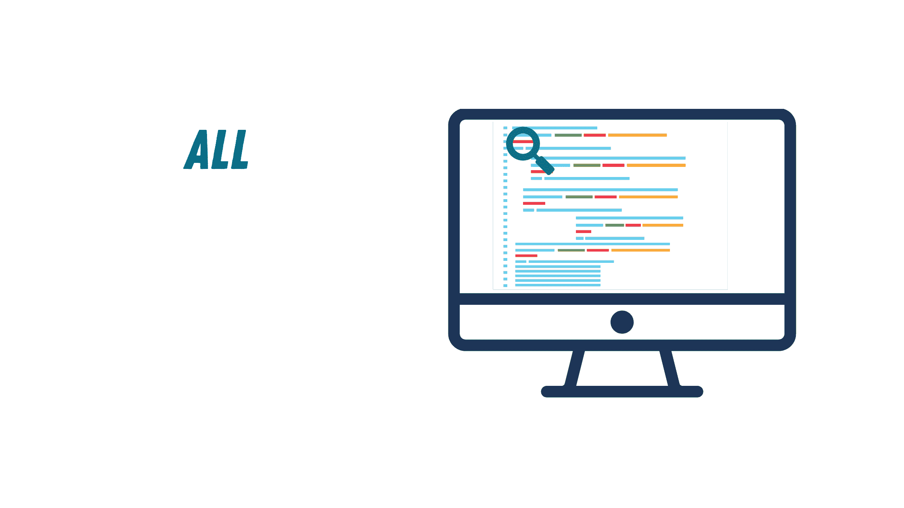

# 关于调试的一切:简介

> 原文：<https://betterprogramming.pub/all-about-debugging-an-introduction-b9eeb0b24681>

## 调试什么、为什么以及如何调试

作者照片(使用 [Canva](https://www.canva.com/) 制作)

在计算机科学中，调试是指开发人员或程序员试图找到错误来源、隔离错误、然后修复错误或创建解决方法的过程。“调试”一词最早出现在 20 世纪 40 年代，当时格蕾丝·赫柏正在马克 2 号计算机上工作，发现它不能正常工作。原因是一只蛾子卡在了电脑的继电器里，导致电脑失灵。所以在那个时候,“bug”是一个字面上的术语！

发现并修复 bug 是软件开发周期中的一个重要步骤。通常，寻找程序不能正常运行的 bug 或场景的过程是开发软件的测试阶段的一部分。

作者照片(使用 [Canva](https://www.canva.com/) 拍摄)

尽管在循环中测试步骤在设计步骤(包括设计、概述和实现代码)之后，但实际上，测试与编写代码是并行的。通常，大的软件项目被分成几个部分。每个都有自己的开发团队和独立的功能。然后将这些部分组合起来，形成整个软件产品。这就是为什么每个部分都必须经历自己的测试过程，以确保它在添加到主项目之前正常工作。

> “优秀的程序员知道他们花在调试上的时间和写东西的时间一样多，所以他们会试着从错误中学习。”— [布莱恩·w·克尼根，罗布·派克](https://books.google.ca/books?id=_KbfCQAAQBAJ&pg=PA117&lpg=PA117&dq=#v=onepage&q&f=false)

# 为什么要调试？

对于开发人员来说，调试无疑是最可怕的任务。毕竟，我们喜欢构建东西而不是修复 bug！尽管如此，没有人能否认调试的重要性。从第一次尝试就能完美运行的程序或应用程序是例外，而不是规则。

调试可以帮助开发人员查明各种类型的错误，包括语法错误、语义错误和逻辑错误。虽然编译器在查找一些语法错误方面有很大的帮助，但其中一些错误(如运行时错误)可能取决于环境和依赖关系，这意味着它们不会在应用程序的每次运行中出现。

通常，测试和调试软件要比编写软件本身花费更长的时间。能够找到并修复 bug 对于任何开发人员来说都是一项有价值的技能，因为这意味着你是一个有创造力的思考者和解决问题的人。然而，如果公司或团队有一套调试策略，这个过程可以变得更有效。更不用说如果在产品部署之前就发现了严重的缺陷，可以避免的经济损失了。

# 如何调试

图像由 [Pixabay](https://pixabay.com/?utm_source=link-attribution&utm_medium=referral&utm_campaign=image&utm_content=762486) 上的 [testbytes](https://pixabay.com/users/testbytes-1013799/?utm_source=link-attribution&utm_medium=referral&utm_campaign=image&utm_content=762486) 显示。

有不同的调试方法来执行不同的功能。一些方法再现了导致失败的错误条件，而另一些方法在应用程序的每一步检查程序状态并定位导致错误的 bug。这些技术可以帮助程序员一步一步地跟踪代码的执行，并在出现错误时停止执行。

我们可以将调试技术分为两大类:

1.  通过检查主内存来分析程序性能的技术 程序崩溃后*(事后调试)。*
2.  通过在调试器下运行程序*来逐步分析程序*的技术(“动态调试”或“跟踪调试”)。

如今，大多数应用程序包含数千行代码，这使得调试过程变得复杂。可以遵循一些策略来简化调试，例如单元测试、代码审查和结对编程。

## **单元测试**

有时，可以清楚地识别代码中发生错误的位置。然而，情况并非总是如此。大多数时候，错误的位置是不清楚的。这就是单元测试有用的地方。它允许程序员用特定的输入运行代码的特定部分。这样做可以简化定位 bug 的过程。

## **成对编程**

一种敏捷软件开发技术，其中两个程序员在同一个代码库上一起工作，通常在同一个物理位置。这两个程序员将有不同的角色。驾驶员编写代码，而观察者或导航员审查驾驶员编写的每一行代码。两位程序员频繁地交换角色，以提高这种方法的效率。

## **代码评审**

一种软件质量保证方法，其中两个或更多的程序员系统地检查彼此代码中的错误和不确定性。

# 调试工具

调试工具，或调试器，是专门为分析程序和查找错误而构建的特殊工具。一些调试器分析并运行测试用例，以确定哪些代码行没有正确执行或者根本没有执行。相比之下，其他人提供代码行为的模拟，允许程序员基于特定的依赖关系来模拟程序在给定软件(操作系统)上的行为。

# 测试与调试

测试和调试是通常一起使用的两个术语，这可能会导致误解，认为它们是一回事。

事实上，他们彼此有很大的不同。它们确实共享一些功能，但是它们在设计、执行和好处方面有所不同。测试和调试都是软件开发的重要阶段，会带来各种各样的结果。这就是为什么有必要正确理解它们之间的差异，以优化我们的软件开发过程。

## 测试

测试通常由开发人员(或测试人员)来完成，以找出软件中的任何问题和奇怪的行为。测试人员在软件上执行手动和/或自动测试用例，并收集关于结果的信息。这些结果被发送给开发人员，以便他们可以修复问题的原因。一旦他们完成了，他们就把软件送回给测试人员。

## 排除故障

开发人员在从测试人员那里得到关于错误的测试报告后，对软件进行调试。然后，开发人员使用适当的调试技术，通过搜索来找到错误的原因，从而调试他们的工作。一旦他们找到了错误，他们就继续修改代码，检查错误是否被修复。

所以测试是为了*找到*错误，而调试是为了找到*特定错误*的原因(或者导致错误的 bug)。

# 结论

调试是一项艰巨的任务，可能会花费大量不可预知的时间。因此，目标是尽可能简化它。有助于实现这一目标的技术包括良好的设计、良好的风格、规定测试、断言、在代码中添加检查、拥有设计良好的接口以及限制全局数据的使用。

本文是深入探讨与调试相关的一切的四部分系列文章的第一部分。即将发布的文章包括:

*   所有关于调试:技术。我将详细讨论调试工具中使用的不同调试技术。
*   所有关于调试:特殊系统。我将讨论特殊系统的调试，比如大规模调试、并行系统调试等等。
*   关于调试的一切:高级方法。我将讨论关于调试器、可视化调试器和最新调试研究的未解问题。

# 参考

1.  Brian W. Kernighan/Rob Pike: *编程的实践*。艾迪森-韦斯利，1999 年。
2.  Ko，a .，& Myers，B. (2008 年 5 月)。*调试脱胎换骨*。2008 年 ACM/IEEE 第 30 届国际软件工程会议。
3.  Hailpern 和 p . Santhanam(2002 年)。*软件调试、测试和验证*。IBM 系统杂志。