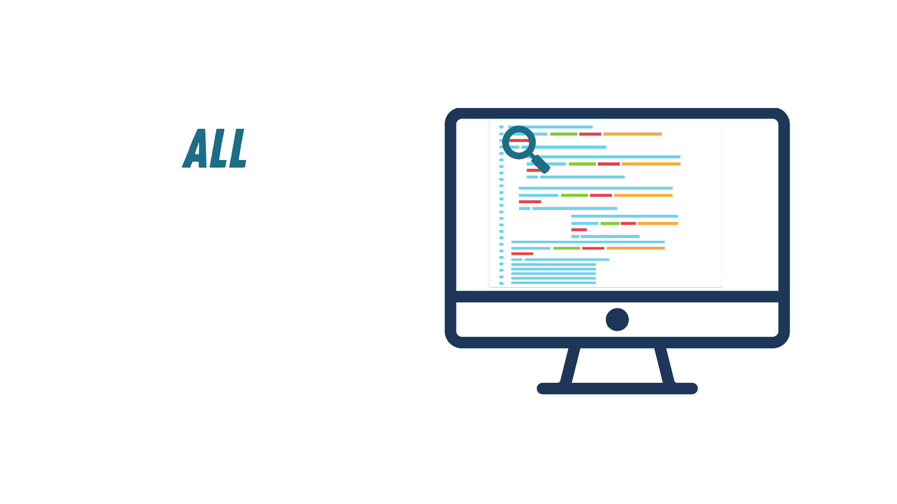
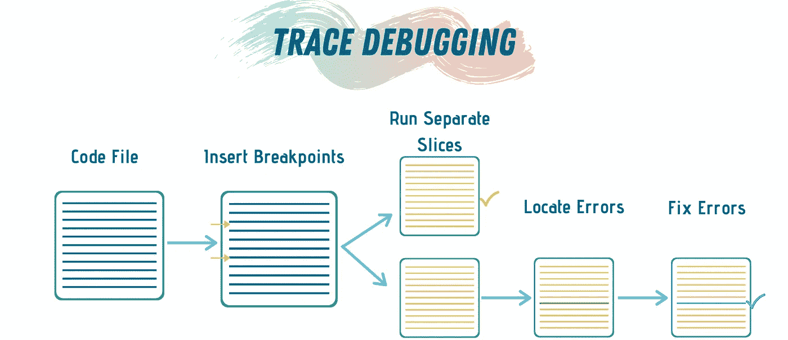
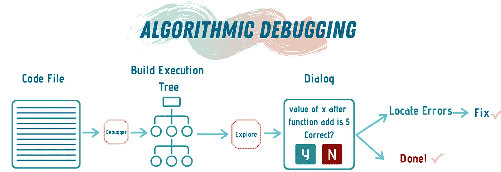
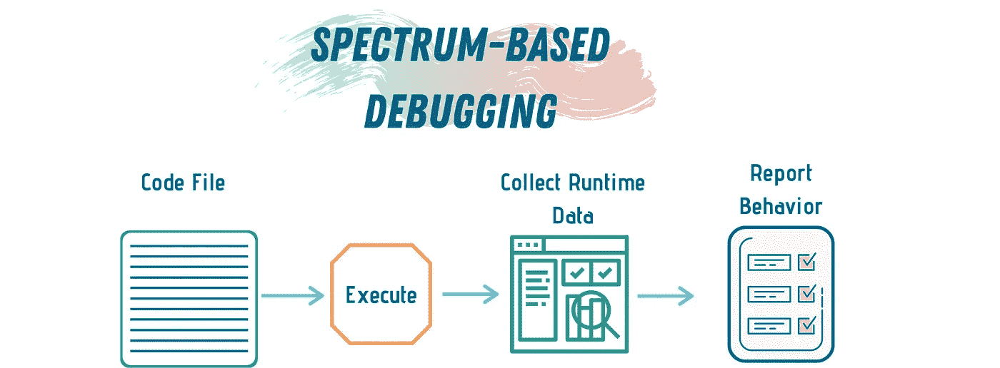

# 关于调试的一切:技术

> 原文：<https://betterprogramming.pub/all-about-debugging-the-techniques-920b06d61a9e>

## 调试器工作的不同方式

作者照片(使用 [Canva](https://www.canva.com/) 制作)

对于任何软件项目来说，调试都被认为是一项必不可少但要求很高的任务。开发人员必须进入一个连续的测试、调试和部署周期，以确保他们的产品是最新的，并能在所有目标平台上正常运行。

通常，这个过程是这样进行的:一旦开发人员最终确定了产品的程序代码库，这个代码库就被发送给测试人员。测试人员根据明确定义的输入测试运行代码库，以检查程序是否给出了预期的输出。在测试过程中，测试人员观察程序的输入和输出之间的关系。如果其中一个测试用例产生了错误的结果，测试会将结果报告给最初的开发人员。

程序故障意味着代码库包含一个错误，但这并不能给我们任何关于错误位置的进一步信息。换句话说，测试揭示了错误的存在和影响——而不是错误的*原因*。然后，开发人员必须经历一个调试过程，以确定原因并修复导致它们的错误。

虽然没有固定的过程来修复所有的错误，但是有几种技术可以减少您的调试工作。这个过程的很大一部分(如果不是全部的话)花费在寻找 bug 的位置上。

在本文中，我们将讨论三种最常见和最常用的技术:

*   基于跟踪的调试
*   基于频谱的调试
*   增量调试

不同的技术更适合不同的情况。没有精确的最佳方法。这完全取决于您正在测试的代码库的类型和您的偏好。然而，它适合于拥有所有这些方法的知识和经验的开发人员。有时，这些方法中的一种或多种的组合将引导您找到 bug 的位置。

所以，我们开始调试吧。

# 基于跟踪的调试

作者照片(使用 [Canva](https://www.canva.com/) 制作)

基于跟踪的调试是传统的，也是当今大多数调试工具中最常用的调试技术。基于跟踪的调试基于断点的概念。

断点是添加到程序中的暂停或停止点，用于检查程序执行到该点的状态。在纠正了当前的 bug 之后，开发人员通常会设置下一个断点，并重复相同的过程，直到所有的 bug 都被纠正。

基于跟踪的调试有四个子技术

1.  跟踪调试(TD)
2.  全知调试
3.  算法调试
4.  混合调试(高清)

所有这些子技术都基于同一个概念:程序切片。

## 限幅

程序切片是计算机科学中使用的一种技术，通过专注于程序中较小的、选定的部分来简化大程序。切片过程删除了程序中对被测试的方面或程序的整体输出没有影响或影响很小的部分。1981 年，PARC 施乐公司的计算机科学家兼首席技术官马克·魏泽将程序切片定义为:

> "人们在调试程序时所做的精神抽象."

程序切片在计算机科学中有许多应用:

1.  调试。
2.  对程序进行逆向工程。
3.  测量程序的覆盖范围、重叠或聚类。
4.  更深入地理解程序的内部运作。

对程序进行切片有几种可能的方法，比如静态切片、动态切片、条件切片和无定形切片。

*   静态切片:静态切片是对程序变量的子集构造的，对程序的输入没有任何假设。在选择一个切片的变量集后，我们可以构造两种类型的切片之一:向后切片或向前**切片。后向切片包含可能影响切片变量的程序部分，而前向切片包含受切片变量影响的那些部分。**
*   动态切片:除了程序产生错误的输入值序列之外，动态切片是基于变量集和我们想要检查的代码点形成的。这个信息被称为动态切片标准。

作者照片(使用 [Canva](https://www.canva.com/) 拍摄)

*   条件切片:在静态切片中，我们不提供任何关于输入的内容。在动态切片中，我们基于特定的输入来构建它。条件切片位于中间。在条件切片中，我们可以向切片工具提供关于输入的信息，而不需要对精确值如此具体。
*   无定形切片:到目前为止讨论的所有切片都表示语法保留。这些方法是通过删除不影响相关变量集的语句来构建的。然而，无定形切片是使用任何程序转换来构造的，这简化了程序，同时保留了整个程序的功能。

在这四种类型中，动态切片是调试中最常用的技术。这是因为当我们调试时，我们有一个产生错误的特定测试用例，所以我们可以使用这个测试用例作为输入来构造我们的切片。

# 跟踪调试

作者照片(使用 [Canva](https://www.canva.com/) 制作)

在跟踪调试(TD)中，调试器可以设置断点，当程序执行过程中到达断点时，程序将被挂起。然后，程序员可以通过逐行运行来检查程序状态。调试器只控制解释器，因此 TD 的可伸缩性与解释器相同。在查找 bug 位置的过程中，如果在断点之前发现了 bug，那么调试过程需要重新启动来捕捉它。

## 全知调试

在全知调试(OD)中，也称为及时返回调试，调试器可以向前和向后跟踪程序的计算。在这种类型的调试中，执行跟踪是巨大的，存储它们是一项具有挑战性的任务，因此 OD 的可伸缩性相当棘手。

## 算法调试

作者照片(使用 [Canva](https://www.canva.com/) 拍摄)

算法调试(AD)是一种半自动调试技术，它在调试器和开发人员之间产生一个对话来查找 bug。因此，不需要查看代码来执行实际的调试。这也是 AD 抽象程度高的原因。AD 分两个阶段完成:首先，构建给定程序的执行树。然后，对生成的执行树进行了详细的研究。

## 混合调试

混合调试(HD)是一种结合了跟踪调试、全知调试和算法调试的调试技术。首先，它使用跟踪调试来找出程序中发生错误的部分。然后，它只对程序的这一部分使用算法调试，并生成它的执行树。之后，它将全知调试应用到算法调试识别出一个 bug 的单个方法中。

# 基于频谱的调试

作者照片(使用 [Canva](https://www.canva.com/) 制作)

在基于频谱的调试中，也称为基于频谱的故障定位(SFL)，调试过程是通过监控特定执行树中包含的语句来完成的。这是通过使用程序谱来识别程序运行期间的活动部分来实现的。程序谱是运行时信息的集合，给出了程序动态行为的视图。它包括一些对应于程序不同部分的标志。存在不同类型的程序谱，例如`block hit/miss`和`function hit/miss`。这些谱用于精确定位为特定或抽象输入运行的代码的确切部分。

# 增量调试

作者照片(使用 [Canva](https://www.canva.com/) 制作)

增量调试(DD)的过程是最小化自动化测试用例。它获取可能导致错误的测试用例，并准备一份错误报告。从那个错误报告中，根据产生错误的高概率选择最小的测试用例。最少的测试用例将重新产生相同的错误，从而帮助开发人员定位错误背后的 bug。

# 结论

有许多其他策略可以用来帮助开发人员定位代码中存在的 bug。作为一名开发人员，我总是提醒自己一些事情:

*   bug 可能不在你要找的地方。有时候当一个开发人员寻找一个 bug 时，他们会花很长时间检查代码的一个特定部分，只是为了发现这个 bug 在别的地方。
*   换个角度看问题，视角就不一样了。通过指出没有 bug 的代码部分，我们可以揭示 bug 到底在哪里。
*   检查输入数据和测试细节。有时候，测试用例可能会被打破。所以，从头到尾看一遍，确保每件事都准确无误，总是一个好主意。

以上都是用来定位 bug 错误的技术，但是接下来呢？

一旦发现了错误，就必须纠正错误。在某些情况下，这可能是微不足道的。在其他时候，它会很简单。开发人员必须彻底考虑特定的修复将如何影响代码的其余部分。他们需要确保修复不会导致代码的其他部分中断。毫无疑问，代表代码中概念错误的 bug 是最难修复的。这就是为什么开发人员不仅要重新考虑修复，还要重新考虑程序的逻辑。

这是讨论调试和调试器的系列文章中的第二篇。第一条是:

*   关于调试的一切:简介。它概述了调试，为什么它是软件开发人员的基本工具/技能，以及调试和测试之间的区别。

即将发布的文章包括:

*   所有关于调试:特殊系统。我将讨论调试特殊系统，如大规模调试、并行系统调试等等。
*   关于调试的一切:高级方法。我将讨论关于调试器、可视化调试器以及最新调试研究的未解问题。

# 参考

1.  B.Korel，J. Rilling，*动态切片在程序调试中的应用*。
2.  G.Pothier，E. Tanter，J. Piquer，*可扩展全知调试*。
3.  页（page 的缩写）Fritzson，*广义算法调试，以及测试*。
4.  J.Gonzlez，D. Insa，J. Silva，*一种新的 eclipse 混合调试架构*。
5.  G.Mariga，K. Mwiti，*自动调试方法:文献综述*。