# 关于包裹你需要知道的一切:超快的网络应用 Bundler🚀

> 原文：<https://betterprogramming.pub/all-you-need-to-know-about-parcel-dbe151b70082>

## 零配置的发展和创新


还有其他捆绑器/构建工具？*真的？*没错——没错，进化和创新结合在一起给你带来了[包裹](https://parceljs.org/)！


# **包裹有什么特别之处，我为什么要关心它？**

虽然 webpack 带来了很多可配置性，但代价是复杂性—**package 带来了简单性**。包裹标榜自己是“零配置”。

*解开上面的*—package 有一个内置的、开箱即用的开发服务器。开发服务器将在您更改文件时自动重建您的应用程序，并支持[热模块替换](https://parceljs.org/hmr.html)以实现快速开发。

# **包裹有什么好处？**

*   快速捆绑时间-包裹比 Webpack、Rollup 和 Browserify 更快。

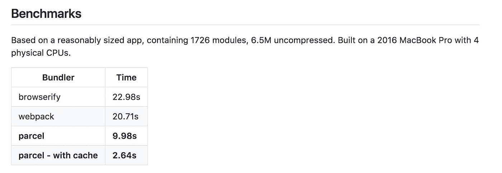

包裹基准

需要考虑的事情:Webpack 仍然很棒，有时会更快。

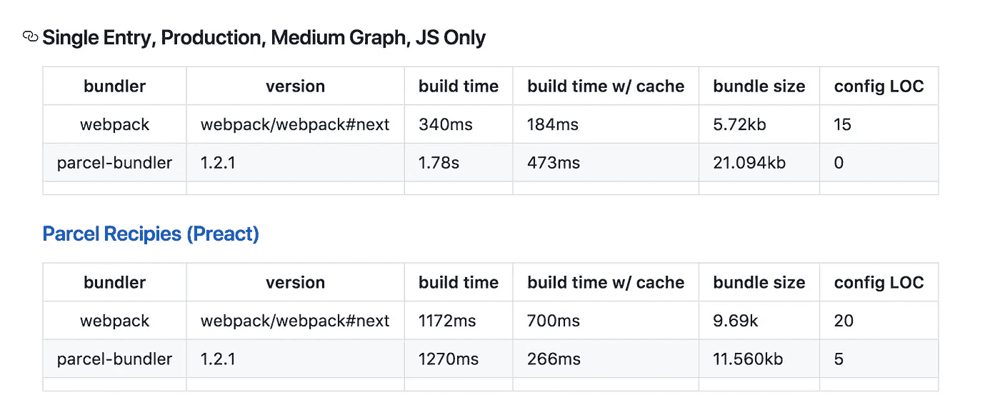

[来源](https://github.com/TheLarkInn/bundler-performance-benchmark/blob/master/README.md)

*   package 对 JS、CSS、HTML、文件资产等的开箱即用支持——不需要插件——更加用户友好。
*   无需配置。开箱即用的代码分割、热模块重载、CSS 预处理程序、开发服务器、缓存等等！
*   更友好的错误日志。

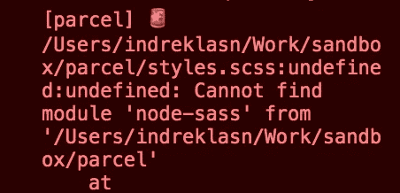

包裹错误处理

# 好的——那么我应该什么时候使用包裹、网袋还是卷装呢？

这完全取决于你，但我个人会在以下情况下使用每个捆绑器:

***宗地*** —中小型项目(< 15k 行代码)

***Webpack*** —大型到企业规模的项目。

***汇总*** —适用于 NPM 包裹。

让我们给包裹一个机会吧！

# 安装相当简单

我们在本地安装了[package-bundler NPM 包](https://www.npmjs.com/package/parcel-bundler)。现在我们需要初始化一个节点项目:


接下来，创建`index.html` 和`index.js`文件。


让我们连接我们的`index.html`和`index.js`


最后，给我们的`package.json`添加包裹脚本:

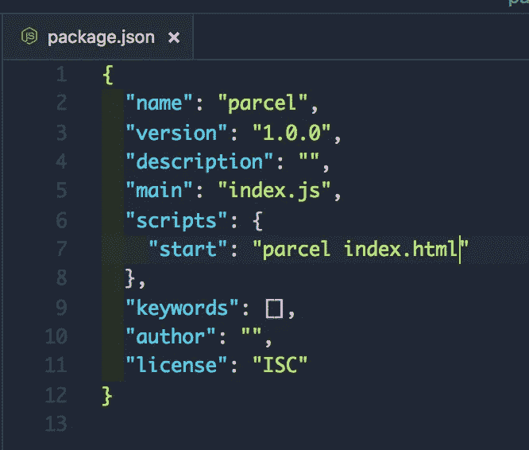

这就是配置的全部内容——惊人的时间节省！

接下来，让我们启动服务器。

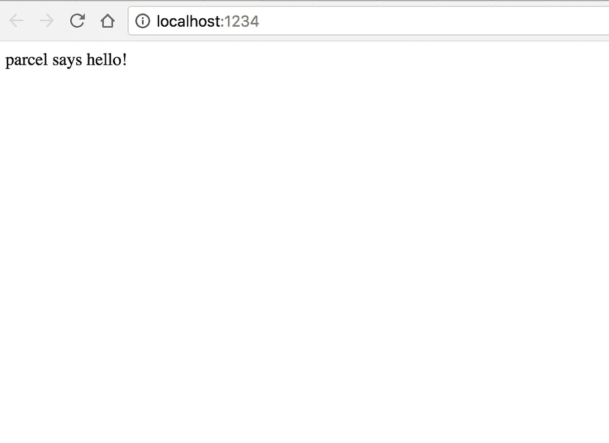

像魔咒一样工作！请注意构建时间。


***15ms？！*** 哇——真快！

HMR 怎么样？

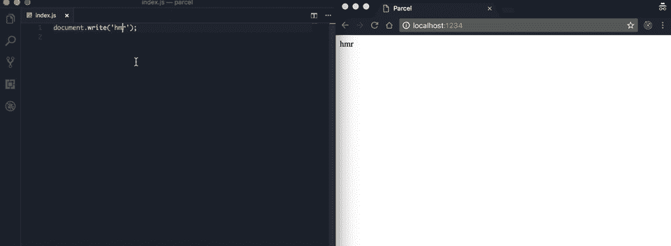

也感觉很快。

# SCSS


我们所需要的是`node-sass`包，我们准备好了！

接下来，添加一些样式并将`styles.scss`导入到`index.js`:

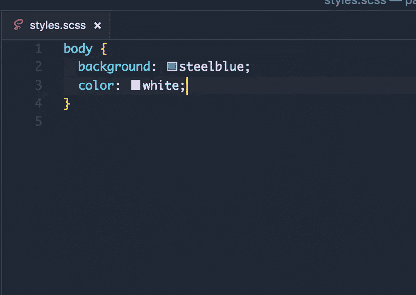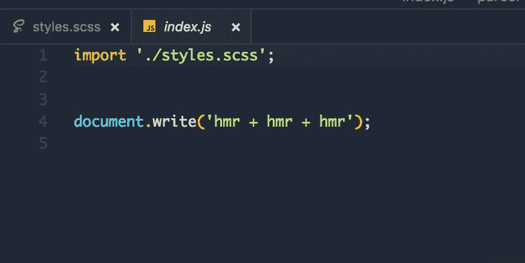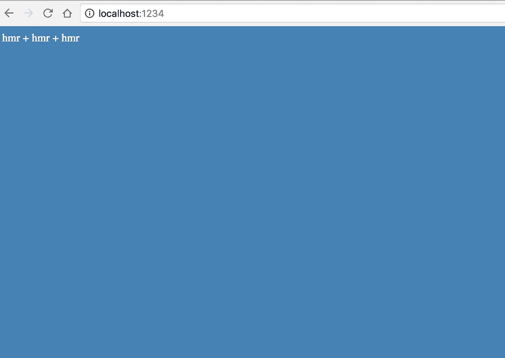

# 生产构建

我们所需要的就是给我们的`package.json`添加一个`build`脚本:


运行我们的构建脚本:

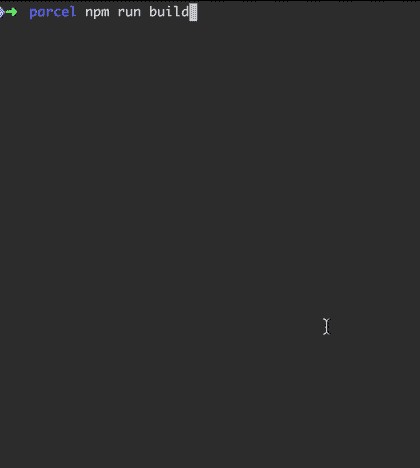

看看包裹让我们的生活变得多简单？


您可以指定特定的构建路径，如下所示:

```
parcel build index.js -d build/output
```

# 反应


设置 react 非常简单，我们需要做的就是安装我们的依赖项并设置我们的`.babelrc`:

```
npm install *--save react react-dom babel-preset-env babel-preset-react && touch .babelrc*
```

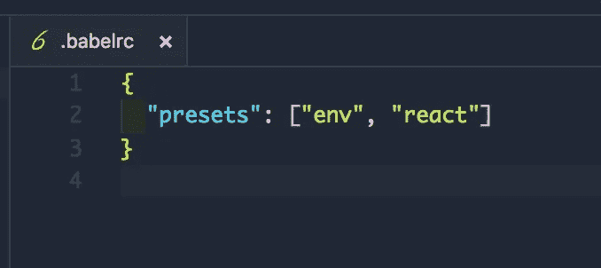

好吧，让我们拿出大枪！尝试在滚动之前自己编写我们的初始 react 组件…

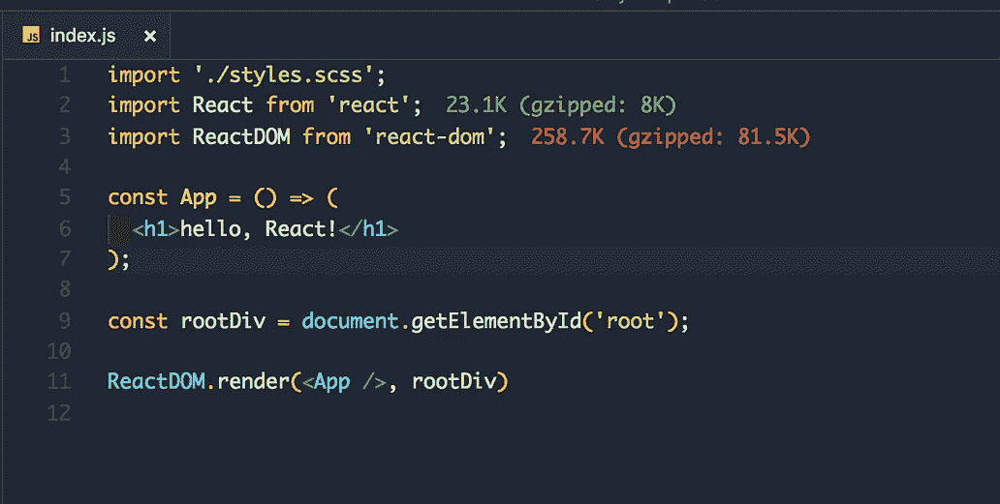

# 某视频剪辑软件


根据要求，这里是 Vue 的例子。

从安装`vue`和`parcel-plugin-vue`开始，后者用于`.vue` 组件支撑。

```
$ npm i --save vue parcel-plugin-vue
```

我们需要添加我们的根元素，导入 vue 索引文件并初始化 Vue。

首先创建一个 vue 目录，让我们也创建`index.js`和`app.vue`

```
$ mkdir vue && cd vue && touch index.js app.vue
```

现在让我们将`index.js` 和`index.html`挂钩:

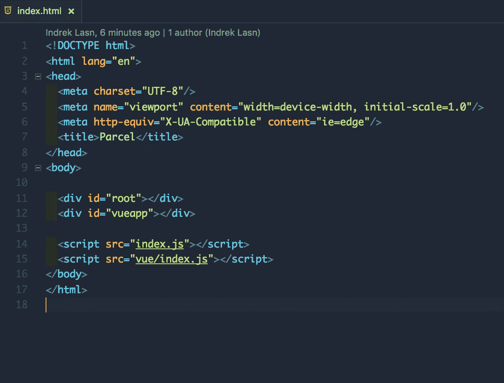

最后，让我们初始化 vue，编写我们的第一个 vue 组件！

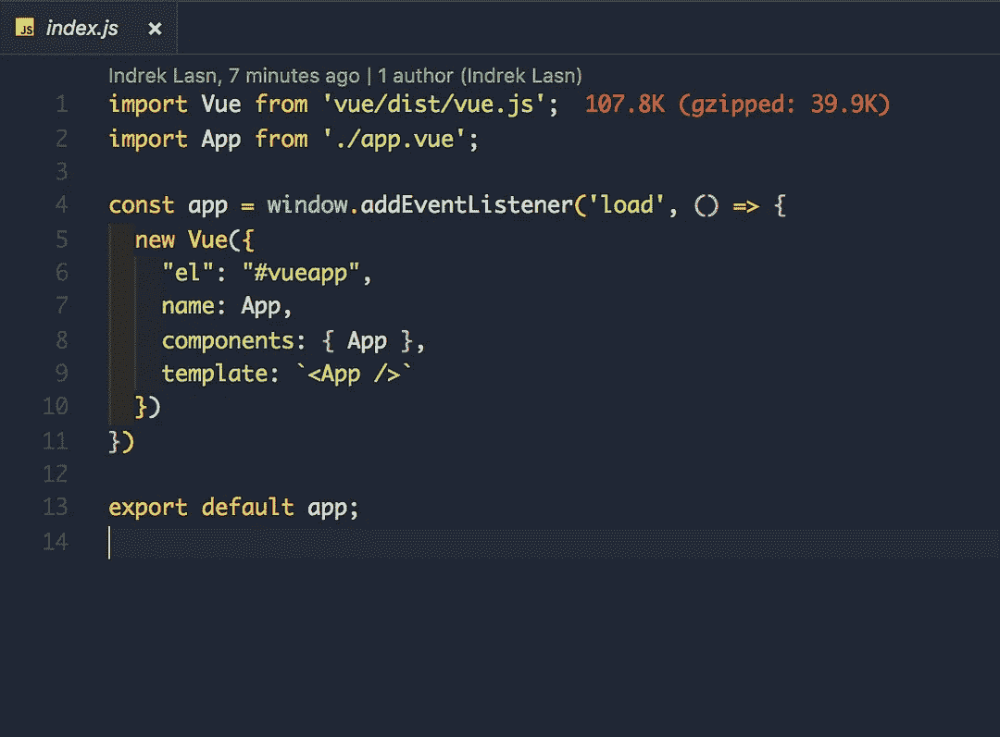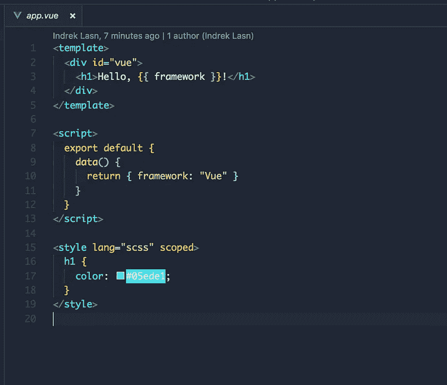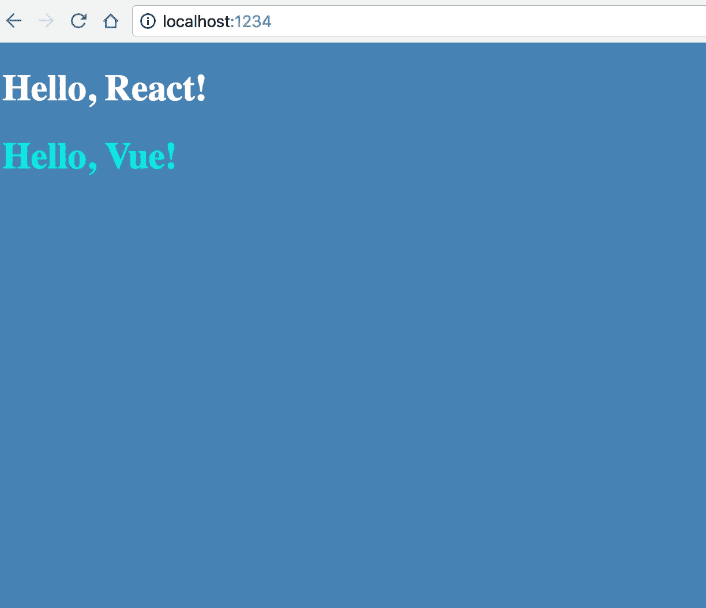

瞧啊。—我们安装了带有`.vue`支持的 Vue！

# 以打字打的文件


这个非常简单——只需安装 TypeScript，我们就可以开始了！

```
npm i --save typescript
```

制作一个名为`index.ts`的文件并插入到`index.html`中:

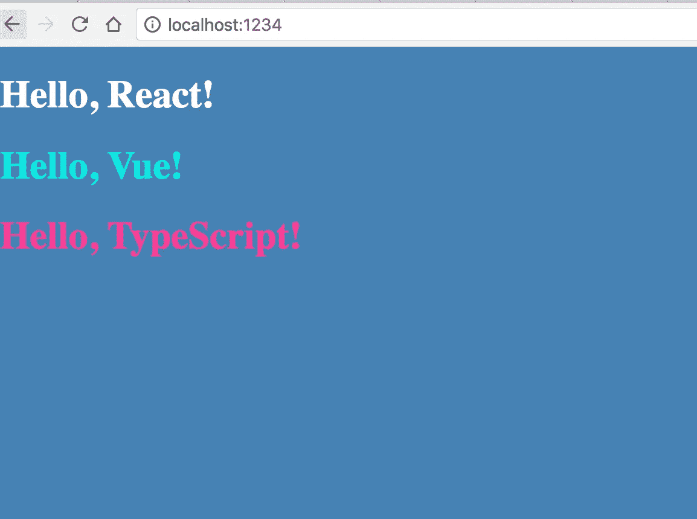

## 可以走了！

如果你想让你的 JavaScript 能力更上一层楼，我推荐你阅读“ [*你不知道的 JS*](https://amzn.to/2LSDpG6?source=post_page---------------------------) ”系列丛书。

## 下面是[源代码](https://github.com/wesharehoodies/parcel-examples-vue-react-ts)！

感谢阅读！❤