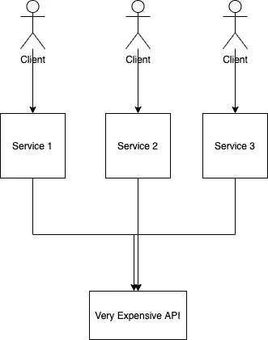

# 一个真正考验你作为软件工程师的经验的面试问题

> 原文：<https://betterprogramming.pub/an-interview-question-that-truly-tests-your-experience-as-a-software-engineer-e188efa4e5b6>

## 你知道如何避免缓存踩踏事件吗？

尼古拉斯·托马斯在 [Unsplash](https://unsplash.com?utm_source=medium&utm_medium=referral) 上的照片

Leetcode 一直是破解编码面试的圣杯。很多工程师都说技术面试管道坏了。三年前，技术公司不会告诉你在一个环境中解决两个 Leetcode 难题。现在很多科技公司，比如脸书，希望你能回答两个中等难度的问题，否则你可能无法进入下一轮面试。

这种面试方式变成了一场比赛，看谁能在一次会议中识别出最多的 Leetcode 式问题，而不是测试一个人解决问题的能力和经验。

许多公司也意识到，拥有 Leetcode 的常规算法并不是考察候选人在职场中成功能力的有效方法。因此，一些其他类型的面试问题被用来测试候选人解决问题的能力和衡量候选人的经验。

# 这个问题

假设您有一个服务需要做一些工作并调用一个第三方 API——姑且称之为`API A`。`API A`计算时间长。因此，您的服务应该只呼叫`API A`一次。

作者图片

你如何保证不去取`API A`？

大多数候选人会提到的一个解决方案是使用缓存。

由作者提供

假设您想要创建一个缓存。缓存接口如下所示:

缓存有一个`get`和一个`compareAndSet`操作。对于`get`，如果键不存在，将返回一个`null`值。`compareAndSet`将把`prevValue`，即先前的值，与缓存中的值进行比较。如果`prevValue`是我们提到的那个，`currValue`将覆盖那个`prevValue`。假设插入到参数中的`prevValue`不是缓存中的最后一个值。在这种情况下，`currValue`不会被插入到缓存中。`compareAndSet`如果操作成功，返回一个布尔值，插入`currValue`。

您必须实现将包含`cache`接口的`getAPI`:

# 他们测试你什么

这个问题不只是问你一些琐碎的事情，比如缓存失效策略、缓存回收策略或者缓存的用途。

大多数候选人都听说过缓存，创建缓存的目的是减少应用程序的延迟或增加吞吐量。此外，简单的谷歌搜索就能回答这些问题。

这个关于实现缓存的问题是为了测试和评估考生的知识，他们是否有编写服务和 API 的经验。您可以评估他们是否了解错误处理。您还可以通过实现工程师在真实场景中使用的解决方案来查看他们是否能够编写代码。

大多数实现`getAPI`的基本答案是使用 if 语句。

# 直觉

用给定的键调用`get`。如果操作遇到缓存未命中，调用`fetchAPIA`。一旦调用完`fetchAPIA`，调用`compareAndSet`操作，用给定的键刷新缓存。

上面的初始实现看起来不错。然而，如果您只有一个请求和一个用户，这是没问题的。如果有多个对缓存的并发调用，并且它们都命中缓存未命中，则第三方服务可能会受到多个并发调用的轰炸。如果服务上的流量突然激增，服务可能会中断。这种现象通常被称为缓存踩踏。

如何编写函数来防止缓存混乱？

遇到这个问题的考生会知道怎么解决。但是，如果他们没有看到这个问题，你也可以通过观察他们如何解决这个问题来测试他们解决问题的能力。

此外，你可以测试候选人处理错误的能力。如果`compareAndSet`返回一个`false`会怎么样？您是重试，还是返回带有错误消息的值？

这些问题有时会触及简单编码练习的不同方面。有经验的考生会知道你想挽回的某些类型的错误和你想优雅地抛出的某些类型的错误。

# 解决办法

缓存拥挤的根本问题是并发编程中的一个经典问题。如果多个线程试图访问一个内存位置，如何确保只有一个值可以访问该内存位置？换句话说，如何确保一次只有一个线程访问应用程序？解决方案是使用锁定。

当其中一个工作线程在缓存上执行一些计算时，它将获取资源，从而阻止其他工作线程计算该内存位置。任何其他具有过时或缺失缓存的工作线程都需要等待，直到锁被释放。然后，它们将重试缓存读取。因此，主数据源不会因请求而过载。

因此，任何避免缓存拥挤的方法都会限制对主资源的请求数量。有多种方法可以解决这个问题。下面两个是避免缓存拥挤的最简单的方法。

# 拒绝请求

第一个来自于常见的 JavaScript 实践，即防止重复事件触发并在系统中引起噪音。

这是前端工程师经常使用的去抖技术。去抖功能所做的是在自系统最后一次调用去抖功能起 100 毫秒后延迟调用功能。

DoorDash 使用 Kotlin 协程在他们的后端做了这件事。然而，如果你不使用特定的语言来实现这种机制，你必须实现你的去抖方法。因此，这可能不是很难做到。此外，这个解决方案将需要另一个服务或者依赖调用者来拥有那个机制，这增加了服务内的依赖性。

# 比较和设置

`compareAndSet`是这个问题的关键，因为这是唯一一种内部同步的方法。

在缓存中插入一些关键字，以表明已经有一个工作者在进行提取。因此，另一个工作线程可以等待并重试。

例如，一旦一个工作者调用缓存，并且它得到缓存未命中，它将把带有键的值写入缓存，例如“进行中”，以向其他工作暗示当前键是缓存未命中，并且已经有一个工作者获取主要源。

这里的问题是，调用操作需要用原子原语来比较和设置流程。另一个工作者可以等待并再次递归调用该函数，以检查“进行中”是否必须变成其他东西。

我们说完了吗？你注意到我们需要处理的任何其他可能的故障了吗？

有一个关于初始`compareAndSet`返回一个`false`的场景。还有另一个场景，最后一个`compareAndSet`返回一个`false`。

上面的方法没有实现当`get(key)`返回一个`in-progress`时会发生什么。他们应该等待并重试，还是应该向调用者返回一个特殊的消息说他们正在“等待”？

# 闭幕词

这种新的问题测试候选人解决问题的能力和他们在软件开发方面的经验。

有经验的候选人可能知道什么时候应该重试，什么时候不应该重试。对于技术面试来说，现实世界系统设计的混合实现问题比“如何遍历 BST”更好

如果那个候选人是你，你会怎么解决上面的问题？你应该如何处理上面的错误？你还需要处理其他潜在的情况吗？有没有其他好的考察考生解题能力和经验的面试问题？请在下面评论并分享你的想法！

*最初发表于*[*【https://edward-huang.com】*](https://edward-huang.com/tech/software-development/2021/09/14/an-interview-question-that-truly-tests-your-experience-as-a-software-engineer/)*。*