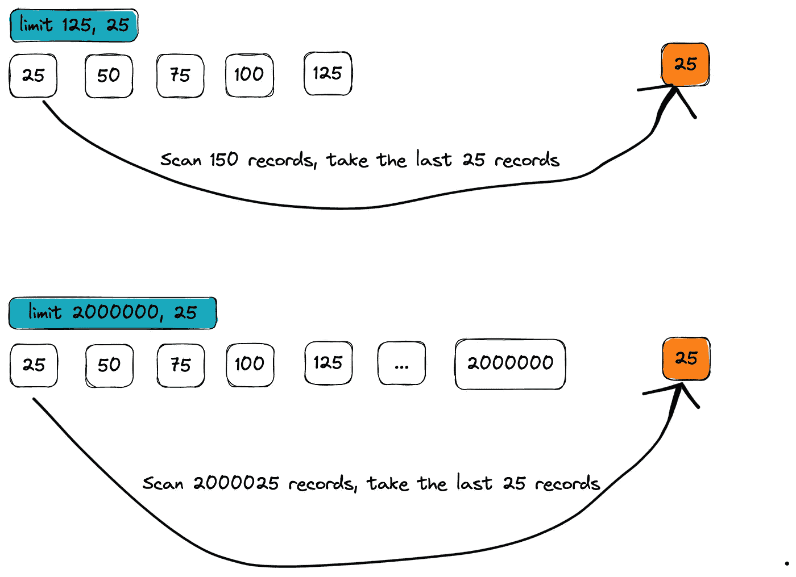

# 一个在线 MySQL 分页事件花了一整夜才修复

> 原文：<https://betterprogramming.pub/an-online-mysql-paging-incident-that-took-all-night-to-fix-805cc868dbb2>

## MySQL 分页事故，经验分享


[莱昂·温特](https://unsplash.com/@fempreneurstyledstock?utm_source=unsplash&utm_medium=referral&utm_content=creditCopyText)在 [Unsplash](https://unsplash.com/s/photos/desk?utm_source=unsplash&utm_medium=referral&utm_content=creditCopyText) 上的照片

今天给大家分享一个生产事故，一个 MySQL 分页导致的线上事故。

一天晚上十点半，下班后我正开心地坐在回家的地铁上，想着如何安排周末的生活。

突然电话响了，一看是我们一个运维同事，我就紧张了。本周版本已经发布。这时候打电话一般是在线问题。

果然沟通情况是一个查询数据的在线界面被骂疯了，不理智，这个操作直接导致在线 MySQL 集群变慢。

嗯，这个问题很严重。赶回家后，我打开电脑，和同事一起在 Pinpoint 上翻出缓慢的查询日志。

看到一个非常奇怪的查询，如下:

```
POST  domain/v1.0/module/method?order=condition&orderType=desc&offset=1800000&limit=500
```

`domain, module, method`是别名，代表接口的域、模块和实例方法名。下面的 offset 和 limit 表示分页操作的偏移量和每页的页数。

也就是说同事在翻页(1800000/500+1=3601)。经过对日志的初步搜索，我发现有 8000 多个这样的电话。

这太奇怪了。我们页面的单页数量根本不是 500，而是每页 25。这绝对不是在功能页面上人为的翻页操作，而是数据被刷了。(描述下，我们的生产环境数据有 1 亿+)。

详细对比日志发现，很多分页时间重叠，对方应该是多线程调用。

通过对认证令牌的分析，基本定位到该请求来自正在进行该操作的名为 ApiAutotest 的客户端程序，还定位到生成认证令牌的账户来自一个 QA 同事。

马上给同事打电话，沟通，处理。

其实对于我们的 MySQL 查询语句来说，整体效率还是可以的。有一些连接表查询优化，也有简单的查询内容。

还有针对关键条件字段和排序字段的索引。问题就在于他一页一页的分页去查询，然后越往后找到页数，扫描的数据越多，就会越慢。

我们查前几页的时候发现速度很快，比如`limit 200, 25`，瞬间就出来了。但是越往前走速度会越慢，特别是一百万条记录之后就会卡死，那么这是什么原理呢？

让我们首先看看当我们把页面翻到后面时，SQL 查询是什么样子的:

```
select * from t_name where c_name1='xxx' order by c_name2 limit 2000000,25;
```

这个查询的缓慢实际上是由限制后面的大偏移量造成的。

比如上面的限制是 2000000，25，相当于数据库扫描出 2000025 条数据，然后丢弃之前的 20000000 条数据，将剩下的 25 条数据返回给用户。这种方法显然不合理。



现在确认了这个问题:当偏移量非常大的时候，会导致 MySQL 扫描很多不需要的行，然后把它们扔掉。

好了，既然你明白了问题的原理，那我们就试着解决它吧。涉及到数据敏感性，我们在这里模拟一下这种情况，构造一些数据进行测试。

## **步骤 1 —创建两个表格，** `**employee**` **和** `**department**`

```
/* department table */
drop table if EXISTS dep;
create table dep(
    id int unsigned primary key auto_increment,
    depno mediumint unsigned not null default 0,
    depname varchar(20) not null default "",
    memo varchar(200) not null default ""
);

/* employee table */
drop table if EXISTS emp;
create table emp(
    id int unsigned primary key auto_increment,
    empno mediumint unsigned not null default 0,
    empname varchar(20) not null default "",
    job varchar(9) not null default "",
    mgr mediumint unsigned not null default 0,
    hiredate datetime not null,
    sal decimal(7,2) not null,
    comn decimal(7,2) not null,
    depno mediumint unsigned not null default 0
);
```

## **步骤 2 —创建两个函数**

生成随机字符串和随机数的函数。

```
/* A function that generates random strings */
DELIMITER $ 
drop FUNCTION if EXISTS rand_string;
CREATE FUNCTION rand_string(n INT) RETURNS VARCHAR(255)
BEGIN
    DECLARE chars_str VARCHAR(100) DEFAULT 'abcdefghijklmlopqrstuvwxyzABCDEFGHIJKLMNOPQRSTUVWXYZ';
    DECLARE return_str VARCHAR(255) DEFAULT '';
    DECLARE i INT DEFAULT 0;
    WHILE i < n DO
    SET return_str = CONCAT(return_str,SUBSTRING(chars_str,FLOOR(1+RAND()*52),1));
    SET i = i+1;
    END WHILE;
    RETURN return_str;
END $
DELIMITER;

/* A function to generate random department numbers */
DELIMITER $ 
drop FUNCTION if EXISTS rand_num;
CREATE FUNCTION rand_num() RETURNS INT(5)
BEGIN
    DECLARE i INT DEFAULT 0;
    SET i = FLOOR(100+RAND()*10);
    RETURN i;
END $
DELIMITER;
```

## **步骤 3 —编写一个存储过程来模拟 500 万个员工数据**

```
/*Create a stored procedure: insert data into the emp table*/
 DELIMITER $
 drop PROCEDURE if EXISTS insert_emp;
 CREATE PROCEDURE insert_emp(IN START INT(10),IN max_num INT(10))
 BEGIN
     DECLARE i INT DEFAULT 0;
     /*set autocommit =0 Set autocommit to 0 to turn off the default commit*/
     SET autocommit = 0;
     REPEAT
     SET i = i + 1;
     INSERT INTO emp(empno,empname,job,mgr,hiredate,sal,comn,depno) VALUES ((START+i),rand_string(6),'SALEMAN',0001,now(),2000,400,rand_num());
     UNTIL i = max_num
     END REPEAT;
     COMMIT;
 END $
 DELIMITER;
 /*Insert 5 million pieces of data*/
 call insert_emp(0,5000000);
```

## **步骤 4 —编写一个存储过程来模拟 120 个部门数据。**

```
/*Create a stored procedure: insert data into the dep table*/
 DELIMITER $
 drop PROCEDURE if EXISTS insert_dept;
 CREATE PROCEDURE insert_dept(IN START INT(10),IN max_num INT(10))
 BEGIN
     DECLARE i INT DEFAULT 0;
     SET autocommit = 0;
     REPEAT
     SET i = i+1;
     INSERT  INTO dep( depno,depname,memo) VALUES((START+i),rand_string(10),rand_string(8));
     UNTIL i = max_num
     END REPEAT;
     COMMIT;
 END $
 DELIMITER;
 /*Insert 120 pieces of data*/
 call insert_dept(1,120);
```

## **第五步——建立关键字段索引**

这里，在运行数据之后构建索引。建立索引需要很长时间，但是运行数据会更快。

```
/*Build index of key fields: sort, condition*/
CREATE INDEX idx_emp_id ON emp(id);
CREATE INDEX idx_emp_depno ON emp(depno);
CREATE INDEX idx_dep_depno ON dep(depno);
```

开始测试吧。

测试数据:

```
/*Offset is 100, take 25*/
SELECT a.empno,a.empname,a.job,a.sal,b.depno,b.depname
from emp a left join dep b on a.depno = b.depno order by a.id desc limit 100,25;
/*Offset is4800000, take 25*/
SELECT a.empno,a.empname,a.job,a.sal,b.depno,b.depname
from emp a left join dep b on a.depno = b.depno order by a.id desc limit 4800000,25;
```

结果如下:

```
[SQL]
SELECT a.empno,a.empname,a.job,a.sal,b.depno,b.depname
from emp a left join dep b on a.depno = b.depno order by a.id desc limit 100,25;
affected row: 0
time: 0.001s[SQL]
SELECT a.empno,a.empname,a.job,a.sal,b.depno,b.depname
from emp a left join dep b on a.depno = b.depno order by a.id desc limit 4800000,25;
affected row: 0
time: 12.275s
```

因为扫描的数据很多，这显然不是一个数量级的耗时。

让我们开始解决这个问题。

## **1。使用索引覆盖+子查询优化。**

因为我们有了主键 id，并在其上建立了索引，所以可以先在索引树中找到起始位置的 id 值，然后根据找到的 id 值查询行数据。

```
/*The subquery gets the id of the position offset by 100, and then takes 25 from this position*/
 SELECT a.empno,a.empname,a.job,a.sal,b.depno,b.depname
 from emp a left join dep b on a.depno = b.depno
 where a.id >= (select id from emp order by id limit 100,1)
 order by a.id limit 25;

 /*The subquery obtains the id of the position offset by 4800000, and takes 25 from this position*/
 SELECT a.empno,a.empname,a.job,a.sal,b.depno,b.depname
 from emp a left join dep b on a.depno = b.depno
 where a.id >= (select id from emp order by id limit 4800000,1)
 order by a.id limit 25;
```

执行效率相比之前有了很大的提升。以下是结果。

```
[SQL]
 SELECT a.empno,a.empname,a.job,a.sal,b.depno,b.depname
 from emp a left join dep b on a.depno = b.depno
 where a.id >= (select id from emp order by id limit 100,1)
 order by a.id limit 25;
 affected row: 0
 time: 0.106s

 [SQL]
 SELECT a.empno,a.empname,a.job,a.sal,b.depno,b.depname
 from emp a left join dep b on a.depno = b.depno
 where a.id >= (select id from emp order by id limit 4800000,1)
 order by a.id limit 25;
 affected row: 0
 time: 1.541s
```

## **2。开始位置重新定义**

记住最后一次查找结果的主键位置，避免使用偏移量:

```
/*Remember that the id of the last piece of data in the last paging is 100, here we just skip 100 and start scanning the table from 101*/
 SELECT a.id,a.empno,a.empname,a.job,a.sal,b.depno,b.depname
 from emp a left join dep b on a.depno = b.depno
 where a.id > 100 order by a.id limit 25;

 /*Remember that the id of the last piece of data in the last paging is 4800000, here we just skip 4800000 and start scanning the table from 4800001*/
 SELECT a.id,a.empno,a.empname,a.job,a.sal,b.depno,b.depname
 from emp a left join dep b on a.depno = b.depno
 where a.id > 4800000
 order by a.id limit 25;
```

结果如下:

```
[SQL]
SELECT a.id,a.empno,a.empname,a.job,a.sal,b.depno,b.depname
from emp a left join dep b on a.depno = b.depno
where a.id > 100 order by a.id limit 25;
affected row: 0
time: 0.001s

[SQL]
SELECT a.id,a.empno,a.empname,a.job,a.sal,b.depno,b.depname
from emp a left join dep b on a.depno = b.depno
where a.id > 4800000
order by a.id limit 25;
affected row: 0
time: 0.001s
```

这样的效率是最好的。无论如何分页，耗时基本相同，因为执行完条件后，只扫描了 25 条数据。

但有个问题，它只适合逐页分页以便能记住上一页的最后一个 id。如果用户跳到分页，就有问题了。

比如用户刚看完第 25 页，马上跳到第 35 页，数据就会出错。

## **3。降级策略**

配置极限偏移量和最大采集次数。如果超过最大值，将返回空数据。

因为他认为超过这个值就不是分页，而是刷数据。如果确认要查找数据，就要输入适当的条件缩小范围，而不是一页一页的查找。

这和我同事的想法大致相同:如果请求时偏移量大于某个值，会先返回一个 4xx 的错误。

那天晚上，我们应用了上面的第三个方案来限制 offset 的电流，如果超过了某个值，就会返回一个空值。

第二天，使用第一个和第二个解决方案进一步优化了程序和数据库脚本。

做任何应该考虑极端情况的功能都是合理的，设计能力应该覆盖极端边界测试。

此外，目前的一些限制和降级也要考虑。

比如多线程工具调用，短时间内 8000 次调用，可以使用计数服务判断并反馈用户调用过于频繁，直接中断。

感谢您阅读这篇文章。如果你在这篇文章中发现任何错误，请告诉我。