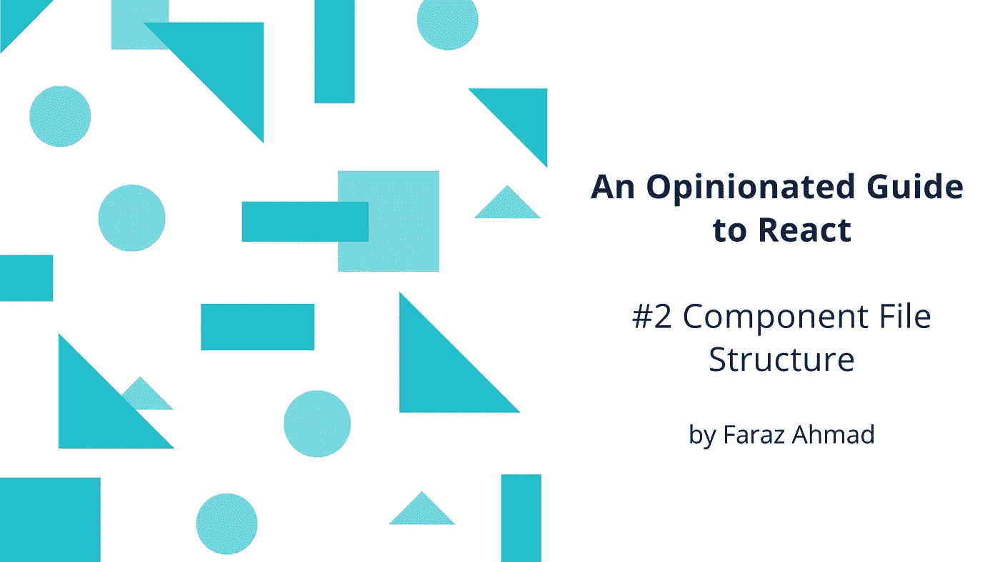

# 固执己见的反应指南

> 原文：<https://betterprogramming.pub/an-opinionated-guide-to-react-component-file-structure-5eb9f4a8d763>

## 组件文件结构

#2 组件文件结构

# 介绍

我已经和 React 合作了四年多。在这段时间里，我形成了一些我认为应用程序应该是什么样子的观点。这是这类固执己见的文章的第二部分。

# 组件文件结构

我在创建组件文件时有一个惯例。我喜欢把我认为最重要的东西放在最上面，任何不需要让使用我的组件的人知道的东西放在最下面。

# 文件结构

当我使用一个组件时，我会问自己这些问题:

*   该组件正在获取任何数据吗？
*   这个组件期待的道具是什么？
*   这个组件渲染什么？

这就是为什么我这样摆放我的文件:

*   **查询优先**:我首先想看的是这个组件正在使用什么外部数据，如果有的话。这就是我将 GraphQL 调用放在文件顶部的原因。当我第一次打开这个文件时，我可以看到这个组件正在获取一个电影列表，我知道这个响应会是什么样子。我将 GraphQL 查询放在使用它们的组件所在的同一个文件中，因为我不想为了知道正在获取什么而在文件之间跳转。
*   **类型定义:**我遵循组件类型定义的数据依赖关系。这样我就知道这个组件需要什么道具才能让我传入。
*   **实际的组件:**这是我放置组件代码的时候。在我知道它正在获取什么数据和它需要什么道具之后，我想知道 JSX 实际上正在渲染什么。我使用命名导出并内联导出组件，以便在需要时更容易更改组件的名称。
*   **子组件:**在我的上一篇文章[React 文件夹结构和文件命名的自以为是的指南](https://medium.com/better-programming/an-opinionated-guide-to-react-folder-structure-file-naming-8b723d39a0d6)中，我提到过我喜欢在同一个文件中包含与当前组件相关的任何子组件。我把这些放在主要组件之后，因为用户根本不需要知道这些组件。

# 包扎

这是我将撰写的系列文章的第二部分。如果你喜欢这个，请在下面评论。你还想让我报道什么？一如既往，我乐于接受建议。

感谢阅读。