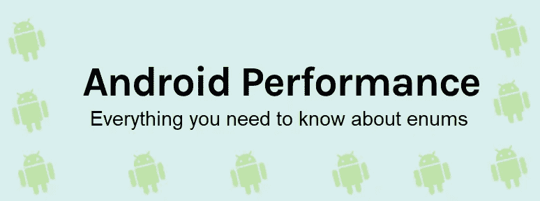

# 枚举如何影响 Android 应用的性能

> 原文：<https://betterprogramming.pub/android-how-enums-can-impact-the-performance-f787ef5903dd>

## 在使用它们之前知道枚举的价格



在开发应用程序时，您可能偶尔会用到枚举。它们很方便。但是当你使用它们时，你可能不知道枚举的全部影响。枚举非常方便，但不幸的是，当涉及到内存大小和速度时，可能会很痛苦。让我们探索枚举如何影响性能，以及我们如何停止使用它们。

# 什么是枚举？

Java 中的*枚举*是一种包含一组固定常数的数据类型。

这是一种特殊的数据类型，它使变量成为一组预定义的常量。它的变量必须等于为它预定义的值之一。

# 我们为什么使用枚举？

当一个变量只能从一组可能的值中取一个值时，我们使用枚举。让我们考虑一个例子:

```
public enum Fruits{ Apple, Bannana, Grape, Mango }
```

现在名为`Fruits`的枚举只能有一个值，除了已经定义的值之外，不能有其他值。

但是如果我们使用整数或字符串常量，就有可能传递无效的常量。因此，为了避免这些无效的常量错误并增加编译时检查，我们通常使用枚举。

# 埃努姆的价格

与 int 常量相比，枚举值将占用更多内存。添加一个枚举会将最终的 DEX 文件的大小增加大约 13 倍。

这是因为枚举类中的每个值都被视为一个对象，并且每个值都将占用一些堆内存来引用该对象。这消耗了可用的 geap 空间。

应用程序中的枚举越多，占用的空间就越多。

我们甚至可能不知道 enum 正在影响我们的应用程序的性能。可能写一两个 enum 类对我们的 app 影响可能不大。但是，如果您正在使用一些枚举类，并且您的应用程序中包含的库正在使用一些其他枚举类，则组合所有这些枚举可能会对您的应用程序产生相当大的影响，这可能会增加文件大小，并影响性能。

**注意:**核心平台团队的作者强烈建议不要在他们编写的代码的任何部分使用枚举。

# 解决办法

Android 通过注释支持库支持多种注释。可以通过`android.support.annotation`包访问库。本库有`TypeDef`注解。这些注释确保特定的参数、返回值或字段引用一组特定的常量。它们还使代码完成能够自动提供允许的常数。

`@IntDef`和`@StringDef` 是两个常量注释，可以用来代替 int 和 string 常量的枚举，从而提供编译时安全性。这些注释将帮助我们在编译时检查变量赋值——就像枚举一样。

# 如何使用注释

我们用一个例子来理解这一点。

我们有一个带有一组 int 常量的`Fruit`类。因此，在创建对象时，我们需要从可用集合中传递 int 类型的值。但是在我的 main 方法中，我传递了一个不在常量集中的值——这可能会导致一个有问题的情况。下面的代码片段中没有类型安全。

```
public class Fruit {  
     public static final int APPLE = 0;   
     public static final int BANNANA = 1;    
     public static final int GRAPE = 2;   
     public static final int MANGO = 3;public Fruit(int fruit) {   
       System.out.println("Fruit Selected:" + fruit);   
     }public static void main(String[] args) {     
       //Passing Invalid value       
       Fruit fruit = new Fruit(4);    
     }
}
```

使用枚举的类似代码实现如下:

```
public class EnumFruit {
   public EnumFruit(Fruit fruit) {             .                 
   System.out.println("Fruit selected is:" + fruit);
 }public enum Fruit {  
    APPLE, BANNANA, GRAPE, MANGO   
 }public static void main(String[] args) {        
   EnumFruit enumFruitInstance = new EnumFruit(Fruit.APPLE);  
 }}
```

在应用程序级别添加支持-注释依赖关系`build.gradle`:

```
dependencies {
    implementation 'com.android.support:support-annotations:28.0.0'
}
```

声明常数**和** `@IntDef` 为这些常数:

```
public class AnnotationFruit {     
   public static final int APPLE = 0;    
   public static final int BANNANA = 1;  
   public static final int GRAPE = 2;    
   public static final int MANGO = 3;   

   public AnnotationFruit(@Fruit int fruit) {         
     System.out.println("Fruit Selected is :" + fruit);   
   }@IntDef({APPLE, BANNANA, GRAPE, MANGO})        
   @Retention(RetentionPolicy.SOURCE) 
   public @interface Fruit {}public static void main(String[] args) {       
   AnnotationFruit  annotationSeason = new AnnotationFruit(GRAPE);   
   }
}
```

在上例中，`Typedef` 标注使用:

*   `@interface` 声明新的枚举注释类型
*   `@IntDef` 和`@StringDef` 注释以及`@Retention`是定义枚举类型所必需的

`@Retention(RetentionPolicy.SOURCE)`注释告诉编译器不要在`.class`文件中存储枚举的注释数据。

设置器和获取器可以定义如下:

```
// Decorate the target methods with the annotation     
   @Fruit    
   public abstract int getFruitName();// Attach the annotation    
   public abstract void setFruitName(@Fruit int fuitValue);
```

如果 Proguard 配置正确，它可以在某些情况下代表我们将枚举优化为 int 值。所以我们可能不需要担心。

# 结论

枚举的总 APK 大小至少比普通常数多 2 倍，并且使用的 RAM 比等效常数多 5-10 倍。

因此，如果你希望你的应用程序在内存和性能上更高效，尽量避免在代码中使用枚举。

# **参考文献:**

*   [“enum 的价格(Google Dev 的 100 天)](https://www.youtube.com/watch?v=Hzs6OBcvNQE)”