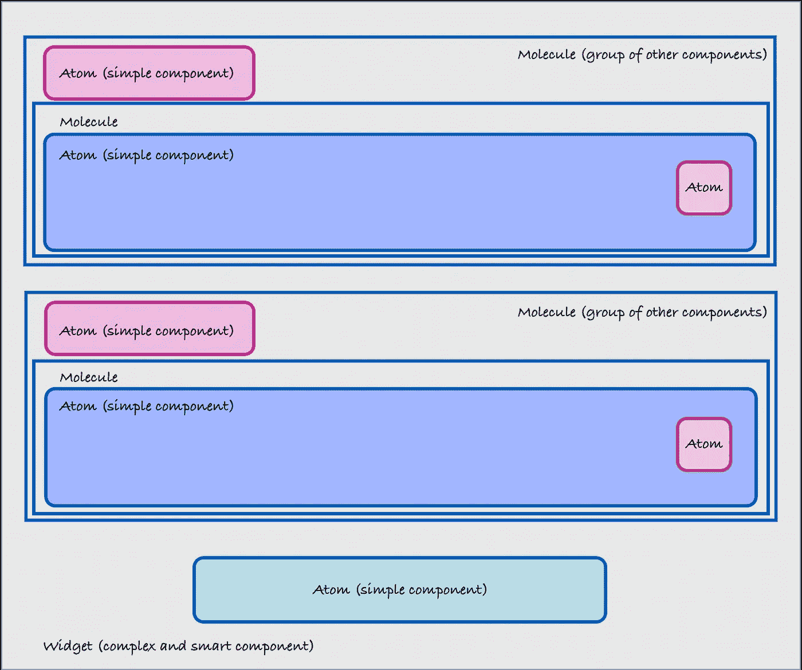
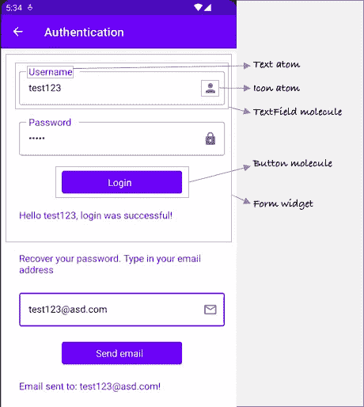

# Android Jetpack 编写和原子设计

> 原文：<https://betterprogramming.pub/android-jetpack-compose-and-atomic-design-1395502c5c05>

## 在 Android UI 开发的新时代，向可重用组件和封装迈进了一步

格伦·卡斯滕斯-彼得斯在 [Unsplash](https://unsplash.com?utm_source=medium&utm_medium=referral) 上拍摄的照片

如今，Android 开发正在向前发展，以跟上潮流，创建现代 UI，这对于有经验的移动开发人员或来自与面向客户端的应用程序相关的其他技术背景的开发人员来说是有意义的。例如，它可以帮助 web 开发人员使用最流行的框架的原理和机制来处理组件、可重用性和模块化(Reactjs、Angular、vuejs 等)。).

在过去的几年里，Android 技术不断发展。Google 将 Kotlin 作为主要的推荐编程语言，并重写了一些核心组件。这些是在 Android Jetpack 中引入的(这是一套核心组件和库，Android 开发人员已经在使用，但比以前更好)。在过去几年中，为了便于创建 UI，他们引入了 Jetpack Compose。

因为谷歌和苹果是市场上唯一的竞争对手，所以他们也想出了新点子，这些点子并不新鲜，但类似于 Jetpack Compose。苹果有自己创造现代 UI 的方式，叫做 Swift UI。本质上，这两种技术非常相似，但各有特色。

在本文中，我们将更多地讨论 Jetpack Compose，但本质上，由于 Jetpack Compose 和Swift UI 之间的相似性，您可以将相同的原则应用于这两个平台。

# 什么是喷气背包组成

Paul Arky 在 [Unsplash](https://unsplash.com?utm_source=medium&utm_medium=referral) 上拍摄的照片

从官方的 Android 开发者平台来看，Jetpack Compose 寻址简单，可以看官方文档，[为什么采用 Compose](https://developer.android.com/jetpack/compose/why-adopt) 。

在 Jetpack Compose 中，创建 UI 时需要一种与 Android 视图(XMLs)不同的思维方式。总的来说，它更加灵活，并且使用现代技术来绑定业务逻辑和用户交互。此外，它有助于封装组件(这也很容易测试)，这是模块化和可重用性方面的一个重大变化。

我们将讨论一个非常方便的原则，它可以将一个屏幕分割成多个部分，并灵活地重用多个屏幕中的所有组件。

在实际演示原子设计原则如何与 Jetpack Compose 完美结合之前，让我们回顾一下历史，看看这种方法是如何创建的。

# 什么是原子设计

映射到简单表单的原子设计组件示例

原子设计是一种方法论，或者更像是一种设计系统，由 Brad Frost 创建，在处理用户界面时提供指导和原则。这种方法的核心并不特定于前端编程或计算机科学。它更多的是一种将事情分解成最小的部分，然后从最小的部分到最大的部分的想法。您可以通过隔离小组件或小块并在该过程中重用它们来做到这一点。

原子设计的整个思想可以归结为模块化。在弗罗斯特的书中，有一个比较可能是最符合逻辑的例子之一——汽车制造商中的一条装配线。这个例子很简洁，它解释了很多:

> “最早的汽车和部件都是单独制造的，这导致了许多安全和可维护性的噩梦。福特把汽车分解成零部件，并把装配过程模块化。结果不言而喻:更统一、更可靠、更安全的汽车在创纪录的时间内出厂。”布拉德·弗罗斯特

我们可以将相同的原则应用于前端开发(就像 jQuery UI 在 21 世纪初所做的那样)，也可以应用于 Jetpack Compose 和 Swift UI 等现代技术。

为了简化原子设计的解释，有五个不同的层次来创建这个设计系统:

1.  原子
2.  分子
3.  有机体
4.  模板
5.  页

关于原子设计系统的每个层次的定义的更详尽的讲座，你可以阅读布拉德·弗罗斯特的原子设计方法论的原著。

 [## 原子设计方法论|原子设计

### 我对设计界面设计系统的方法论的探索让我在其他领域寻找灵感…

atomicdesign.bradfrost.com](https://atomicdesign.bradfrost.com/chapter-2/) 

为了分解在移动开发中如何使用这些级别，下面是对每个级别的简要描述:

# 原子

正如原子设计系统中所描述的，原子是最基本的组件。在移动开发中，它可能是最基本的 Jetpack 组合组件(`Text`、`TextField`、`Button`等)。).

# 分子

这是最常见的可重用类型的组件，它可以被描述为这个设计系统的主干。

举个例子，一个`TextField`加一个`Text`用作文本字段的标签，一个`Button`将文本字段的值发送给另一个组件，这些可以被分组并排列成一个分子。这种成分(分子)可以在任何地方重复使用。它可能包含自己的风格，规格和一套测试，可以单独运送或在图书馆。

# 有机体(或部件)

有机体可以是可以重用的页面的一部分。举个例子，一个可以注入页面的联系人列表。我也更喜欢把这个层次称为“小部件”，而不是“有机体”，因为它封装了一堆分子和原子(其他组件)。它创造了一种 widget(这是计算机科学中比有机体更常见的词)。这也可能包含它自己的风格，或者可以继承一个、规范和一组测试，并且可以单独发布或者在特定的库中发布。

## 页

它是不言自明的，也是 UI 中最复杂的部分。它是通过使用组件、原子、分子和部件(有机体)的其他层来构建的。在这个层次上，你可以有一个状态存储(例如，在你的视图模型中),它将保存每个组件的状态，或者你可以简单地使用在应用程序层次上保持状态的其他原则。

## 日常如何使用？

嗯，方法很简单:在开始一个新的应用程序或创建一个新的片段之前，你应该花一点时间分析你想要创建的 UI 原型，并把原型/模型分割成小块(尽可能细化)。试着想想哪些片段看起来相似，做的事情也相似。然后，试着以一种最基本和最复杂的方式来适应每一个组件，然后你应该能够将你的组件映射到原子设计的每一层。

# Jetpack 合成和原子设计实践

现在，让我们更实际一点，看看原子设计如何适应现代 Android 开发。

下面是一个如何分解和分割用户界面片段并将其映射到原子设计级别的示例:

将屏幕分割成小块以映射原子设计组件的示例

正如已经提到的，构建块是原子，它们被用作最基本的 Jetpack Compose 组件。从我们在原型中使用的例子来看，一个原子可能就像`Text`组件或`Icon`组件一样简单。下面是最简单的原子的实际实现:

最后一个名为`AtomText`的可组合组件被描述为可重用组件(就像 Jetpack 提供的开箱即用的组件一样)，它可以通过与另一个原子或分子组合来创建分子或小部件(有机体)。

基本上，我们所做的是创建一个简单的文本，带有自定义的样式、规格、字体等。通过只传递文本，您可以在其他组件(composable)的任何地方使用这个 atom 组件，并且，如果您想从外部明确地更改规范，您可以选择传递一个`Modifier`，它将通过覆盖默认的修饰符规范而生效。传递`Modifier`这不在本文的讨论范围内，但是一般来说，总是从外部发送一个修饰符来拥有一个可定制的组件是一个很好的实践。

另一个原子的例子是`Buttons`、`Icons`、`Rows`、`Columns`等，它们已经在 Jetpack Compose 库中现成可用。

既然我们已经创建了一个定制组件，那么让我们从组件(可重用性最高的组件类型)进入下一个层次。这些是之前切片的，我们可以通过使用`AtomText`和 Jetpack Compose 库中的一些其他组件、`OutlinedTextField` **、** `Icon` 和`Button`来创建一些分子。

创造一个分子有什么不同？嗯，分子是一组其他成分，与原子相比，分子可以有自己的状态。例如，一个分子可以具有为`TextField`切换边框颜色的状态，或者存储一个值并稍后发送。

在初始化时，我们使用相同的原理传递参数，如`text`、`modifier`、`onClick`和`onValueChanged`。最后两个是新的，但我们不打算在本文中详细介绍，因为它们是 Jetpack Compose 组件中组件之间的基本通信——但它更像是功能性讨论，我们现在试图通过使用原子设计原则来理解模块化原则。

现在我们已经创建了一些可重用的组件，让我们创建下一层组件，称为小部件(有机体):

`WidgetEmailForm`是一个可以重用的独立组件/小部件。它也可以被更改为发出邮件已发送的消息，但它现在不在我们的范围内。可以在第一级定制(在列中)，但是如果需要更多级别的定制，可以将多个修饰符传递给该可组合对象。

让我们通过重用相同的原子和分子来创建另一个小部件:

一个页面的例子看起来类似于这个小部件，但是它不能通过注入到另一个页面中而被重用，它只能在你的导航主机配置中作为一个完整的页面使用。一个例子可能是这样的:

这就是在 Android 项目中使用原子设计原则的基础，以及如何分解页面来创建简单或复杂(智能)的组件，以便重用、封装和单独测试。

一个工作项目可以在这里找到:

 [## GitHub—adrianburcin/AtomicDesignAndroidCompose

### 此时您不能执行该操作。您已使用另一个标签页或窗口登录。您已在另一个选项卡中注销，或者…

github.com](https://github.com/adrianburcin/AtomicDesignAndroidCompose)