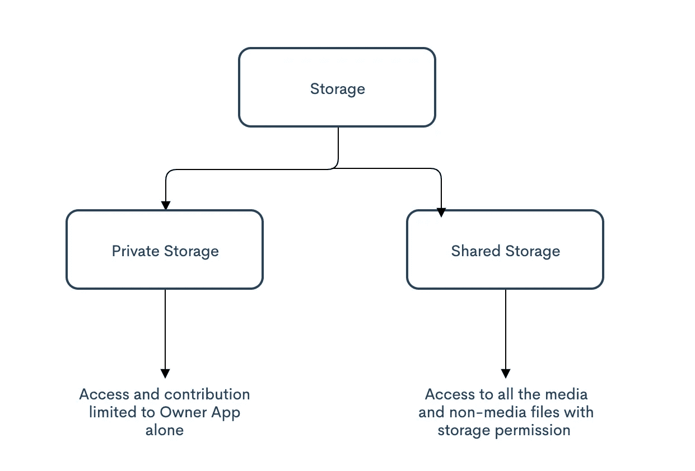
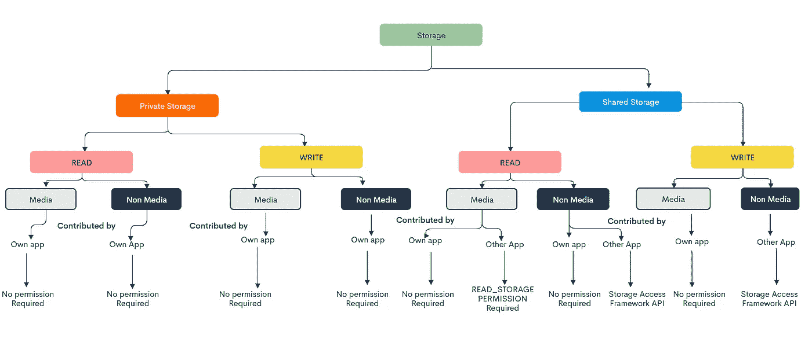

# Android 范围存储去神秘化

> 原文：<https://betterprogramming.pub/android-scoped-storage-demystified-3024a062ba24>

## 使用作用域存储来防止应用程序不受限制地访问文件系统，并帮助减少文件混乱

图片来源: [Android Central](https://www.androidcentral.com/what-scoped-storage)

如果我谈论 Android 最近在操作系统层面的改进，那都是关于保护应用程序和用户数据，并以更有组织的形式提供访问。改变的理由是好的，但这意味着开发人员要做更多的工作。

在 Android 11 中，添加了一些主要的更改和限制来增强用户隐私，包括，如[行为更改](https://developer.android.com/preview/behavior-changes-11)预览中所列的，以下内容:

> [**限定范围的存储实施**](https://developer.android.com/preview/privacy/storage#scoped-storage) **:** 对外部存储目录的访问仅限于应用特定的目录和应用创建的特定类型的媒体。
> 
> [**权限自动重置**](https://developer.android.com/preview/privacy/permissions#auto-reset) **:** 如果用户几个月没有与某个 app 交互，系统会自动重置该 app 的敏感权限。
> 
> [**后台位置访问**](https://developer.android.com/preview/privacy/location#background-location) **:** 用户必须被引导至系统设置，以便向应用授予后台位置权限。
> 
> [**包可见性**](https://developer.android.com/preview/privacy/package-visibility) **:** 某 app 查询设备上已安装 app 列表时，对返回的列表进行过滤。

最近，我深入研究了作用域存储的概念，以了解其意图，并相应地为我的 Android 应用程序做好准备。

# 存储结构(Android 10 之前)

在进入实现部分之前，我们先来了解一下 Android 10 之前的数据组织方式:

Android 10 之前的存储结构(图片来源:作者)

*   **私有存储**:所有 app 在内部存储中都有自己的私有目录，即 Android/data/{package name}，其他 app 看不到。
*   **共享存储**:除私有存储外，其余存储称为*共享存储*。这包括所有正在存储的媒体和非媒体文件，具有存储权限的应用程序可以轻松访问它们。

# 当前结构和访问的问题

你觉得这种结构有什么问题吗，或者你希望谷歌改变什么？

我来阐述一些问题:

*   如果我是一个电子商务应用程序，我需要存储访问权限，只要求用户上传他们的个人资料图片，这意味着访问某个文件或文件系统。你可以举另一个例子:一个聊天应用程序，我想上传媒体或将一个媒体文件写入系统，这意味着访问单个媒体文件。那么，我为什么要求整个存储访问权限呢？
*   您是否曾经担心过您的敏感数据，如您的医疗处方或银行文件，会被安装在您设备上的所有应用程序访问？
*   如果我正在卸载一个应用程序，并且需要从我使用该应用程序时起就与之相关的数据/文件，我有什么简单的方法来清除所有的混乱吗？

我敢肯定，这一定让你想到了你的应用和数据安全，隐私和组织。不要担心，谷歌最近与存储相关的 Android 更新来救你了。

# 作用域存储

## 想法

谷歌给出了做出这一改变的两个有效理由:安全性和减少遗留的“应用混乱”

[应用沙箱](https://source.android.com/security/app-sandbox)是 Android 设计的核心部分，将应用程序相互隔离。在 Android Q 中，Google 从应用程序沙箱中吸取了相同的基本原理，引入了作用域存储。

> “这些变化原本计划应用于运行 Android 10 或更高版本的手机上的每一个应用程序，但由于开发者的强烈反对，谷歌改变了方针，只要求针对 Android API 级别 29(即 Android 10)的应用程序使用范围存储。但随着 [Android 11](https://www.androidcentral.com/android-11) 的推出，范围存储又回来了，谷歌这次不太可能改变主意。”—[Android 11 中的作用域存储是什么？](https://www.androidcentral.com/what-scoped-storage)

*   **更好的归属**:应用程序将被提供对存储块的访问，这些存储块具有应用程序的相关数据。

看看 Android 10 &以上的存储结构:

Android 10 及以上版本上的存储结构(图片来源:作者)

现在私有存储和以前一样，但是共享存储进一步分为媒体和下载(非媒体文件)集合。

*   **减少文件混乱**:系统会将存储绑定到所有者应用，以便系统更容易找到与应用对应的相关文件。卸载应用程序时这很有用，因为与应用程序相关的所有数据也会被卸载。
*   **防止滥用 READ_EXTERNAL_STORAGE 权限:**现在，授予应用程序此权限将使其能够访问整个外部存储，我们可以在其中保存照片、私人文档、视频和其他潜在的敏感文件。正如[中提到的，Android 11 中的范围存储是什么？](https://www.androidcentral.com/what-scoped-storage)“强制实施范围存储后，应用程序只能看到自己的数据文件夹以及某些媒体类型，如使用其他存储 API 的音乐文件。”

哇，现在这看起来很酷，不是吗？

作为一个用户，我对我的文件和我授予访问权限的人有更多的控制权。此外，如果应用程序本身删除了不需要的文件，它将为我的设备腾出额外的空间。

# 文件访问权限的更改

作用域存储结构(图片来源:作者)

*   **不受限制地访问其单独的应用程序存储:** An **a** pp 将不受限制地访问内部和外部存储进行读写操作。使用 Android 10，将文件写入 SD 卡上自己的 app 目录不需要提供存储权限。
*   **无限制地访问媒体文件和下载收藏(已贡献):**您可以无限制地将文件贡献到您自己的应用程序的媒体收藏和下载中。如果您想在媒体收藏中保存任何图像、视频或任何其他媒体文件，不需要获得许可(只要文件存储在有序收藏中)。)
*   可以使用 READ_STORAGE_PERMISSION 权限访问其他应用程序提供的媒体收藏。从下一版本开始，将不再推荐使用 WRITE_STORAGE_PERMISSION 权限，如果使用，其作用与 READ_STORAGE_PERMISSION 相同。
*   其他应用程序贡献的非媒体文件将需要存储访问框架 API 来进行读取和写入操作。

> “注意:如果您的应用程序使用传统存储模型和以前针对的 Android 10 或更低版本，当启用[范围存储](https://developer.android.com/training/data-storage#scoped-storage)模型时，您可能会将数据存储在您的应用程序无法访问的目录中。在你瞄准 Android 11 之前，将数据迁移到一个与作用域存储兼容的目录。在大多数情况下，您可以将数据迁移到您的[应用特定目录](https://developer.android.com/training/data-storage/app-specific)。”—[Android 11 中的存储更新](https://developer.android.com/preview/privacy/storage)

图片来源:作者

呜哇！！更具体的权限。我现在很开心，也更有安全感。

# 选择退出针对 Android 10 及以上版本的应用

来自 [Android 开发者网站](https://developer.android.com/preview/privacy/storage):

> “为了给开发者额外的测试时间，针对 Android 10 (API 级别 29)的应用仍然可以请求 requestLegacyExternalStorage 属性。此标志允许应用程序暂时退出与作用域存储相关的更改，例如授予对不同目录和不同类型媒体文件的访问权限。”

据[Android 11 中什么是作用域存储？](https://www.androidcentral.com/what-scoped-storage):

> “任何面向 Android 11 或更高版本的应用程序都必须使用新的存储 API，其中包括作用域存储。对 Google Play 开发者协议的修改称，从 2020 年 8 月 1 日开始，所有提交到 Google Play 的新应用必须针对 Android 10 或更高版本，所有对现有应用的更新必须截至 2020 年 11 月 1 日针对 Android 10 或更高版本。预计同样的行为，明年可能会要求应用程序针对 Android 11。”

是时候了。学习、理解并执行它。

# 存储操作

让我简要介绍一些常见的存储操作以及如何操作:

*   **选择一个文件**:使用`[ACTION_OPEN_DOCUMENT](https://developer.android.com/reference/android/content/Intent.html#ACTION_OPEN_DOCUMENT)`打开系统的文件选择器应用程序，允许用户选择要打开的文件。若要仅显示应用程序支持的文件类型，请指定 MIME 类型。

*   **选择一个文件夹:**意图`[ACTION_OPEN_DOCUMENT](https://developer.android.com/reference/android/content/Intent.html#ACTION_OPEN_DOCUMENT)`可以替换为`[ACTION_OPEN_DOCUMENT_TREE](https://developer.android.com/reference/android/content/Intent#ACTION_OPEN_DOCUMENT_TREE)`。

注意:在用户重新启动设备之前，此访问将一直有效。如果应用程序希望保持访问，在使用内容解析器访问 URI 时，内容解析器必须调用`[takePersistableUriPermission](https://developer.android.com/reference/android/content/ContentResolver#takePersistableUriPermission(android.net.Uri,%20int))`方法。

此外，如果你使用`ACTION_OPEN_DOCUMENT_TREE`遍历目录中的大量文件，你的应用程序的性能可能会降低。

*   **创建文件:**使用`[ACTION_CREATE_DOCUMENT](https://developer.android.com/reference/android/content/Intent#ACTION_CREATE_DOCUMENT)`将文件保存在特定位置。

> "注意:`ACTION_CREATE_DOCUMENT`不能覆盖现有文件。如果您的应用程序试图以相同的名称保存文件，系统会在文件名末尾的括号中附加一个数字。”— [Android 开发者文档](https://developer.android.com/training/data-storage/shared/documents-files)

等等，我无法获取元数据，即我的图像的位置。这种情况改变了吗？怎么才能拿到？

# 媒体位置权限

正如 [Android 开发者文档](https://developer.android.com/training/data-storage/shared/media)所述:

> “如果你的应用程序面向 Android 10 (API 级别 29)或更高版本，为了让你的应用程序从照片中检索未经编辑的 Exif 元数据，你需要在你的应用程序清单中声明`[ACCESS_MEDIA_LOCATION](https://developer.android.com/reference/android/Manifest.permission#ACCESS_MEDIA_LOCATION)`权限，然后在运行时请求此权限。”

> **"** 注意:由于您在运行时请求了`ACCESS_MEDIA_LOCATION`权限，因此无法保证您的应用程序能够访问照片中未编辑的 Exif 元数据。您的应用程序需要明确的用户同意才能访问这些信息。”— [Android 开发者文档](https://developer.android.com/training/data-storage/shared/media)

# 备份应用程序的文件管理器类型

对于需要访问所有内容的文件管理器类应用程序，我们也有一个解决方案。你需要遵循 Android 11 中[存储更新中列出的这些简单步骤:](https://developer.android.com/preview/privacy/storage)

> 通过执行以下操作，应用程序可以向用户请求名为“所有文件访问”的特殊应用程序访问权限:
> 
> 1.在清单中声明`[MANAGE_EXTERNAL_STORAGE](https://developer.android.com/reference/android/Manifest.permission#MANAGE_EXTERNAL_STORAGE)`权限
> 
> 2.使用`[ACTION_MANAGE_ALL_FILES_ACCESS_PERMISSION](https://developer.android.com/reference/android/provider/Settings#ACTION_MANAGE_ALL_FILES_ACCESS_PERMISSION)`意图动作将用户引导至系统设置页面，在该页面中他们可以为您的应用启用以下选项:允许访问以管理所有文件。"

合法应用程序需要这些特殊权限。

一旦用户授予广泛访问权限，用户将获得包含非媒体文件的 MediaStore 的未过滤视图。

只有谷歌授权的应用程序才能完全访问存储空间。为此，将声明表提交到 Google Play，并被列入批准列表。

# **使用自定义文件选择器的应用**

如果我的应用程序使用显示精确数据目录的自定义文件选择器会怎样？你对此无能为力。从现在开始，你可能需要使用一个系统选择器。

# 实施过程中要记住的事项

1.  不要使用静态路径。锁定文件路径访问。
2.  使用[媒体商店](https://developer.android.com/training/data-storage/shared/media)(推荐)。
3.  应该正确使用媒体存储。比如不要把你的音乐文件放在图片目录里。
4.  非媒体文件应该在下载目录中(推荐)。
5.  要通过其他应用程序访问非媒体文件，请将[系统选择器](https://developer.android.com/guide/topics/providers/document-provider)与 SAF(存储访问框架)配合使用。需要运行时权限才能完全访问该应用程序。

您可以在这里查看 Github 示例实现:

 [## niharika2810/ScopedStorageDemo

### 一个示例项目解释了在文件和映像上执行不同操作的作用域存储。注意:您有…

github.com](https://github.com/niharika2810/ScopedStorageDemo) 

原发表[此处](https://thedroidlady.com/2020-08-24-android-scoped-storage-demystified)。

# 参考

*   [https://www.androidcentral.com/what-scoped-storage](https://www.androidcentral.com/what-scoped-storage)
*   [https://developer.android.com/preview/privacy/storage](https://developer.android.com/preview/privacy/storage)
*   [https://medium . com/Android developers/Android-11-storage-FAQ-78 ce FEA 52 b 7 c](https://medium.com/androiddevelopers/android-11-storage-faq-78cefea52b7c)
*   [https://medium . com/Android developers/scope-storage-myths-ca 6a 97d 7 ff 37](https://medium.com/androiddevelopers/scope-storage-myths-ca6a97d7ff37)

以上就是我对这篇文章的看法。我希望你学到了一些东西。如果你知道更多，请留下评论，这样我们可以一起学习。