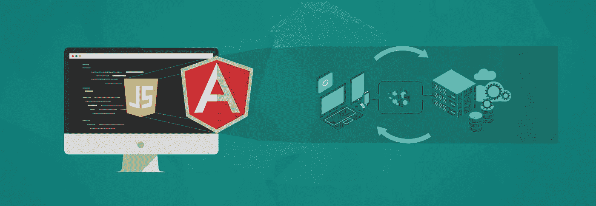

# Angular:动态加载外部 JavaScript 文件

> 原文：<https://betterprogramming.pub/angular-load-external-javascript-file-dynamically-3d14dde815cb>

使用 Angular 2+加载外部 JavaScript 文件

如果您正在使用 **Angular 2+** 创建一个大规模的应用程序或企业应用程序，那么您的组件或指令需要某些外部 JavaScript 依赖，比如用于支付集成的 **Stripe.js** (当然，这肯定不是所有视图都需要的)。

# 为什么需要按需加载 JS 插件文件？

Angular 是一个 SPA(单页面应用程序)，它在初始页面加载时加载所有的脚本。因此，如果 index.html 包含任何并非所有视图都需要的外部 JS 脚本，它可能会*增加*页面完全加载的延迟时间，在我看来这不是最佳实践。

# 那么，如何解决这个问题呢？

假设您想要使用 [**Chart.js**](https://www.chartjs.org/) **在仪表板上显示一个图表。**

事不宜迟，我们来看看是怎么做的。

## **第一步**

创建一个名为**DynamicScriptLoaderService**的角度服务

## **第二步:**

是的，你没看错:你所需要做的就是用你想要加载到 **DashboardComponent** 中的脚本的键调用服务加载方法

让我告诉你怎么做:

还有… ***搞定了*** ！

# **结论**

打开您的**网络**面板，进入您的应用程序的**主页**。您不会看到正在获取 chart.js 脚本。

现在，尝试打开仪表板视图，您将看到一个请求被发送到 chart.js CDN。

那都是乡亲们！！

有什么问题吗？留下评论。