# Angular + @ngx-translate +打字

> 原文：<https://betterprogramming.pub/angular-ngx-translate-typings-816eb4b5d92>

## 一步一步的角度教程:在@ngx-translate 中打字

资料来源:卡洛斯·卡瓦列罗

# 介绍

当你决定在一个项目中使用 Angular，这意味着你正在建立一个大型的 SPA(否则，你应该考虑另一个框架)。大型项目通常面向不同国家的用户，并通过应用程序的翻译来实施。

在我看来，属于 Angular 生态系统的应用中最好实现翻译的库是 [@ngx-translate](http://www.ngx-translate.com/) 。我从一开始就使用这个库，因为它简单、强大、非常有用。

然而，我发现这个库最大的缺点是翻译是基于一个键值翻译对象，在这个对象中，要识别你想要翻译的键，你必须指定一个字符串。使用字符串的事实导致我们失去了对想要翻译的变量的所有类型控制。

## 由此产生的问题有哪些？

1.  我们无法知道某个密钥是否丢失、不完整或有打印错误。
2.  我们没有自动完成功能，尽管有可能很复杂的嵌套对象。
3.  您不能在所有语言之间自动更改(重构)键的名称；您必须逐个修改每个语言文件。

在这一部分中，我们将构建一个小服务，它将允许我们在软件开发中极大地改进`@ngx-translate`的使用。

在开始之前，你可以在下一个 gif 中看到我们将要构建的最终结果:

# @ngx-translate 的安装和配置

首先，您将按照 GitHub 页面上作者的建议，以常规方式配置`@ngx-translate`。

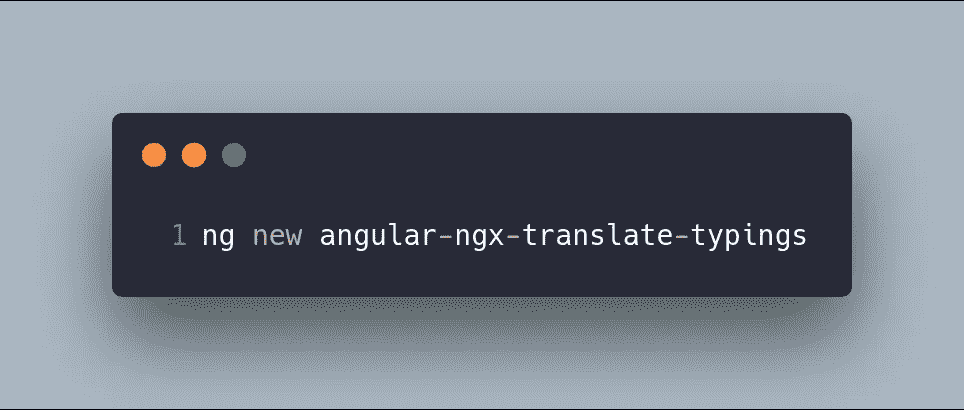

首先，您需要安装 npm 模块:

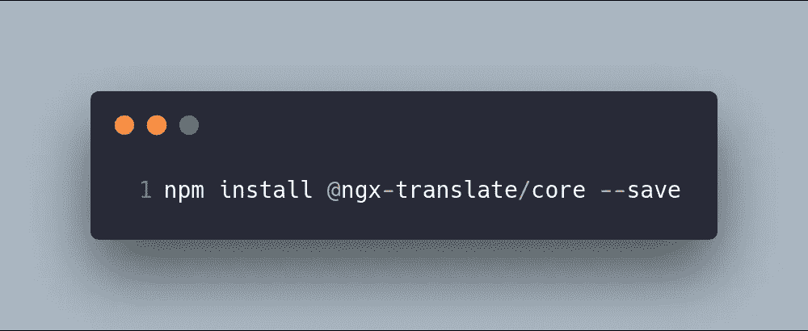

你必须在你的应用程序的根模块中导入`TranslateModule.forRoot()`。

forRoot 静态方法是一种同时提供和配置服务的约定。确保你只在你的应用程序的根模块中调用这个方法，大多数时候叫做`AppModule`。该方法允许您通过指定加载器、解析器和/或缺失的翻译处理程序来配置`TranslateModule`。

默认情况下，没有可用的加载程序。您可以编写自己的加载程序，或者导入现有的加载程序。例如，您可以使用`TranslateHttpLoader`，它将使用`HttpClient`从文件中加载翻译。

要使用它，您需要从`@ngx-translate`安装`http-loader`包:

一旦你导入了`TranslateModule`，你就可以把你的翻译放到一个`.json`文件中，这个文件将和`TranslateHttpLoader`一起导入。下面的翻译应该存储在`eng.json`和`span.json`中。

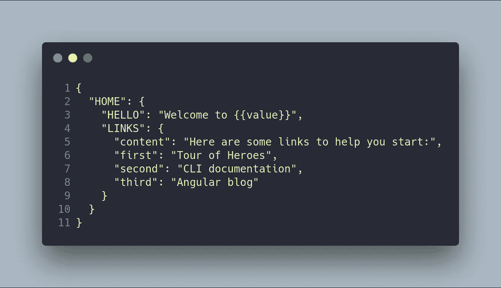

您可以使用`TranslateService`、`TranslatePipe`或`TranslateDirective`来获取您的翻译值。

在组件中，如下定义 param:

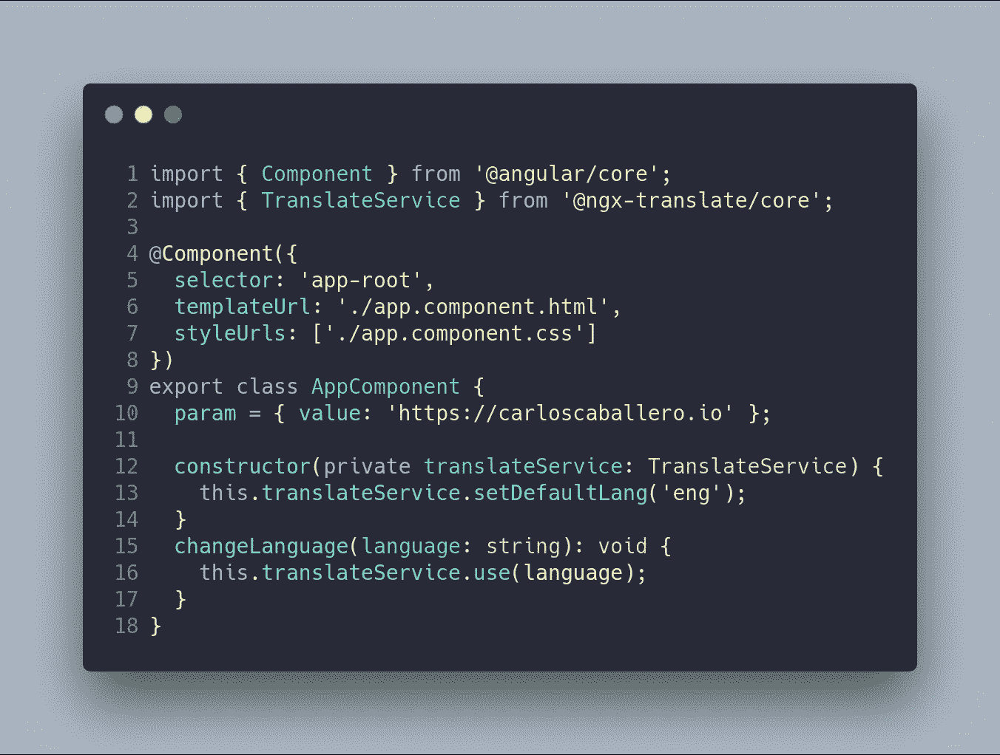

# 键入@ngx-translate

我们需要做的第一件事是创建一个名为`translations`的新服务，它将解析指定翻译`key`的位置的`path`。

当然，稍后可以重构代码，但是这篇文章的目的是说明如何输入`@ngx-translate`。

首先，已经定义了`GenericClass`函数，该函数用于向从其扩展的任何类提供属性:

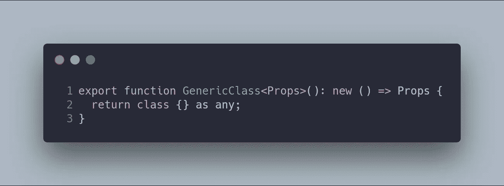

第二步是创建从`GenericClass`扩展的服务，其中您指定属于`eng.ts`文件的属性将是`Translations`类的属性。

下一步是构建`transformObjectToPath`函数，该函数负责用`.ts`文件的键路径构建一个对象，其中的值是完整的路径，以便`@ngx-translate`接收它期望的字符串。

在执行此方法的末尾，该类将包含以下复合对象:

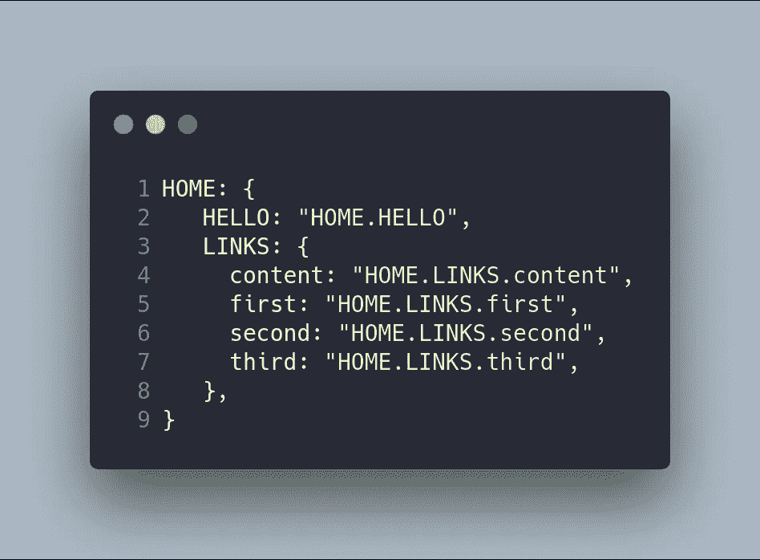

最后，与服务相关的代码如下:

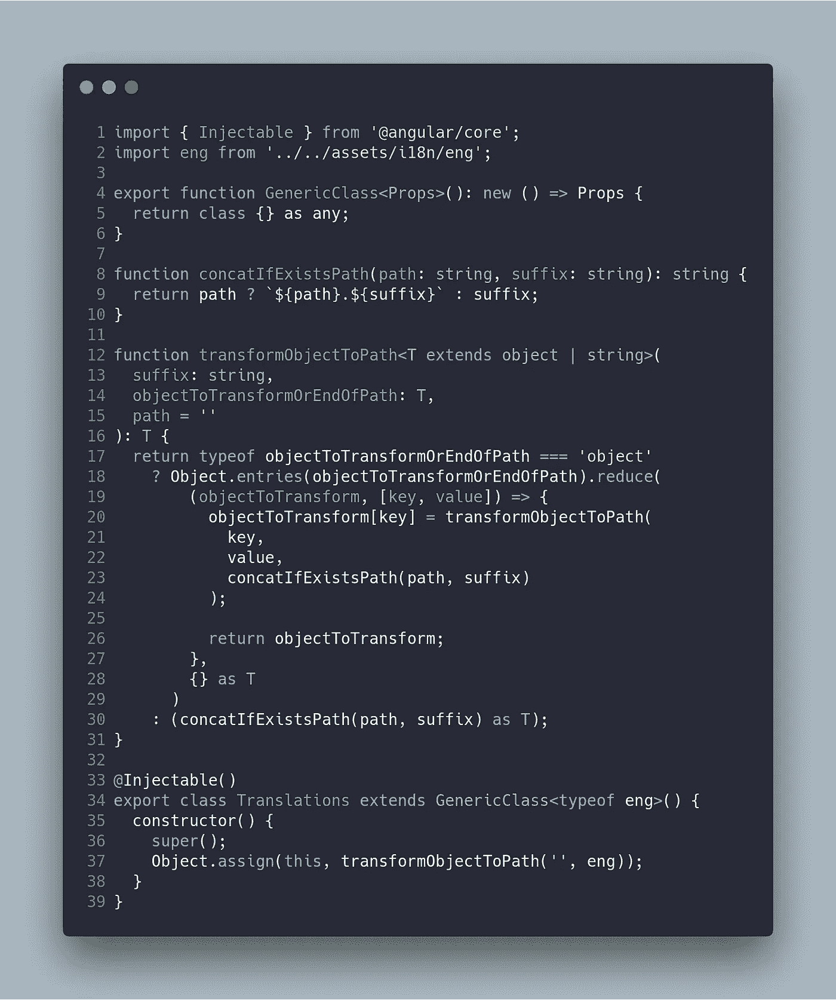

有翻译的文件是`.TS`文件，而不是`.json`文件，所以如下:

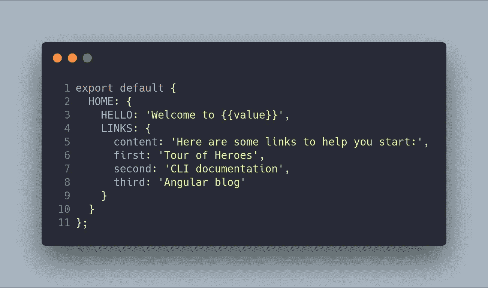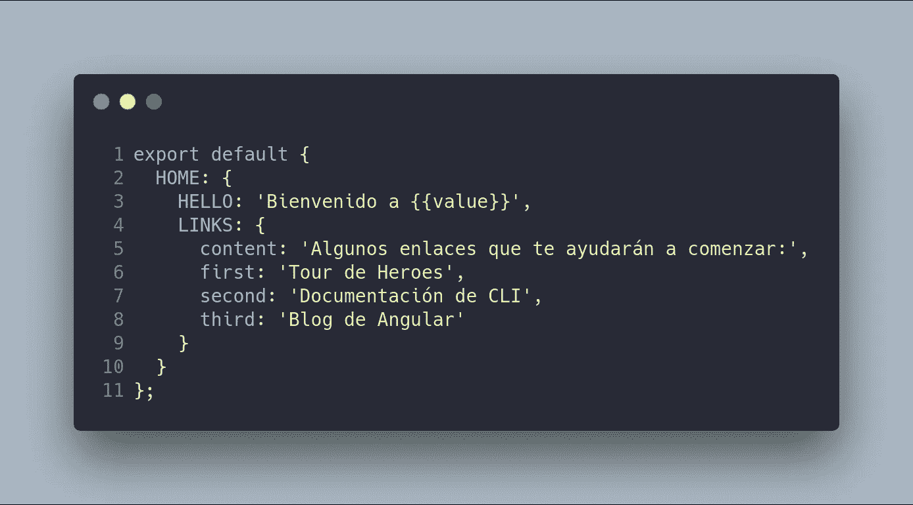

代码中必须做的另一个修改是为`@ngx-translate`定义我们自己的加载器，因为`.json`文件不是使用`httpClient`服务下载的，而是创建一个充电器来执行`.TS`文件的加载，如下所示:

加载器之所以被称为`WebpackTranslateLoader`，是因为`Webpack`是分析用关键字`import (...)`导入的可能文件，并将它们打包成独立的源文件，以便动态地执行它们的请求。因此，在请求文件的时刻，请求被发送到文件`/assets/i18n/language.js`。

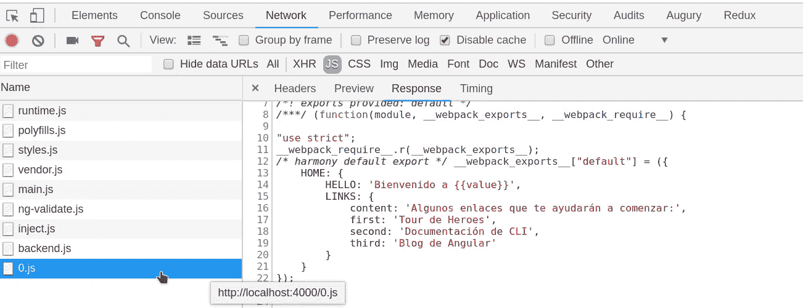

最后也是最令人愉快的一步是使用`@ngx-translate`，在您想要注入多语言文本的组件中键入内容。有必要注入`translations`服务，该服务必须是公共的，以便能够与模板交互。

最后，魔法可以在可用的东西中看到:

1.  自动完成

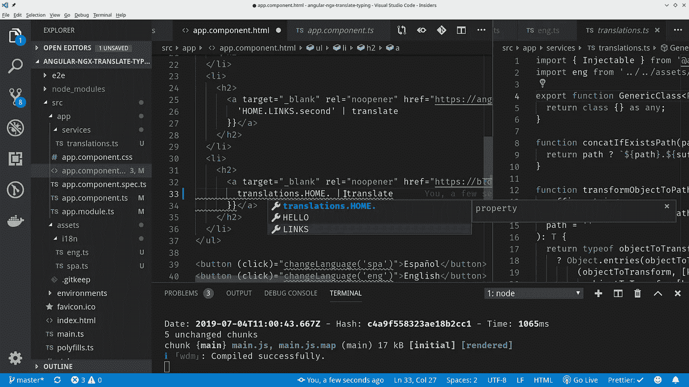

2.丢失钥匙的检测

另一个有趣的可以锦上添花的地方是能够轻松地重构所有的语言文件。

在这种情况下，我们可以应用两种技术:

1.  强键入—如果语言文件中没有某个键，则发出警告

2.键入— 一个让你键入的造型，但是如果一个键丢失了，它不会警告你

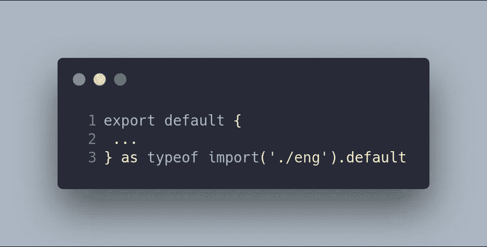

不可思议的最终结果是下面这张 GIF 中显示的结果。

这首曲子的 GitHub 分支是[https://github.com/Caballerog/angular-ngx-translate-typing](https://github.com/Caballerog/angular-ngx-translate-typing)