# 如何生成用于记录案例场景的动画交互式流程图

> 原文：<https://betterprogramming.pub/animated-interactive-flowchart-diagrams-for-documenting-case-scenarios-a7bdbb5400bb>

## 作为一名技术写作者构建交互式图表


作为一名技术作家，我最喜欢的工具之一是图表。这种类型的视觉内容不仅能让读者更好地理解材料，还能让作者用创造力来丰富专业知识。

我的第一篇关于交互图的文章吸引了如此多的关注和积极的反馈，以至于我决定进一步探索这个主题。在这篇文章中，我们将看到动画流程图(当然是交互式的！)解释了软件业务逻辑中的多个场景。

当谈到描述软件业务逻辑时，我通常使用流程图池图。它们允许引导读者一步一步地完成这个过程，强调软件的哪一部分负责特定的动作。

例如，想象一下，一个移动应用程序有一个负责注册用户的模块。该模块分为几个类，每个类执行流程中的特定活动:

*   验证用户数据
*   压缩用户的照片
*   基于用户的地理位置获取用户的地址
*   将数据保存到服务器存储器
*   等等。

概览模式可能如下所示:

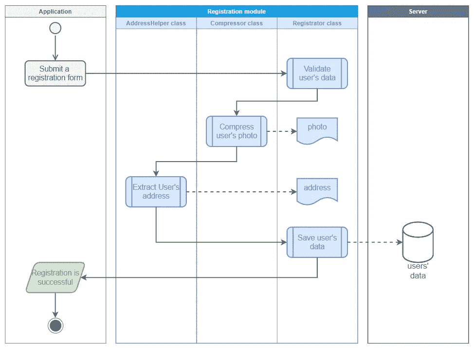

但是，如果我们需要更深入地研究“验证用户数据”、“压缩用户照片”和“提取用户地址”的过程，图表可能会被许多嵌套条件、长循环、并行过程等填满。：

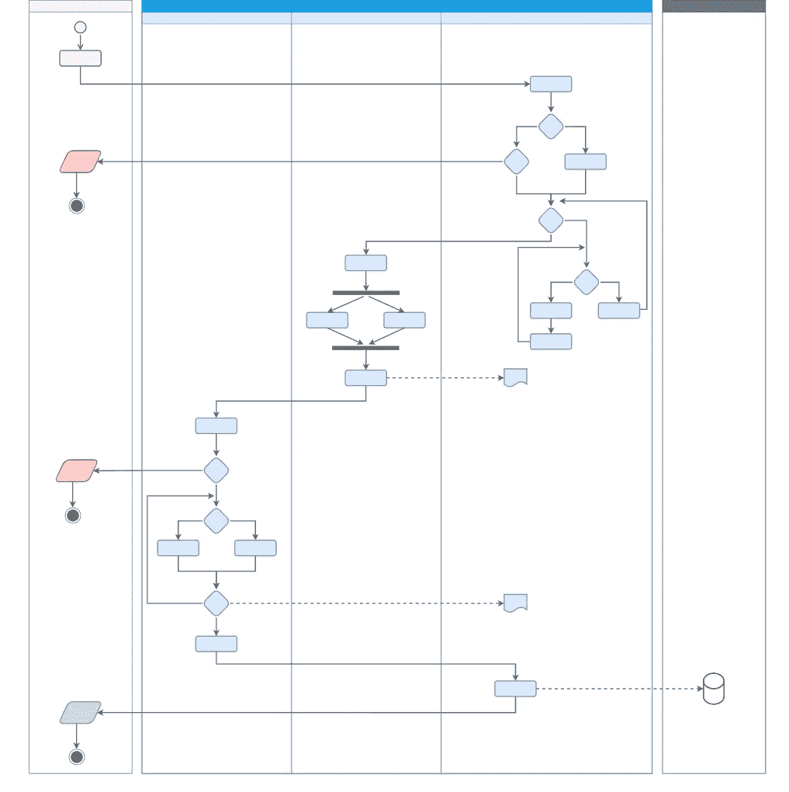

当然，这个例子是人为的，注册过程看起来不太可能如此复杂。

但是，即使看起来确实如此，将这个繁琐的图表分成几个图表，将它们放在不同的页面上，并在它们之间导航也是一个很好的建议。然而，有时，读者会发现跨页很不方便。他们希望在同一时间将所有内容显示在同一个屏幕上，以便于理解。

为了满足这一需求，让我们试着让目前占主导地位的模式更加用户友好。通过添加一些成功和不成功的注册场景的具体示例，我们可以平稳地引导读者通过重点关注关键步骤的过程。

所以，我们的目标是这样的:


我们将使用 **draw.io** 作为绘图工具。

# 设置背景

在*背景层*上，连同图表本身，我们需要一个带按钮的控制面板，在不同的场景之间切换。我们将描述一个成功的场景和两个注册失败的场景:


在此阶段，图表如下所示:


## 重要注意事项

*   在*背景层*上，三个场景对应的按钮不透明度= 50%，而**无场景**按钮不透明度=100%，并以不同的样式强调此时没有选中的场景。

# 成功场景

主要的想法是将一个成功场景的新图层放在*背景图层*的上面。在这个新层上，我们将在执行的活动上添加重音符号，在箭头上添加数字以指定活动的具体顺序，并在文本面板中描述整个场景。

1.在*背景层*，选择所有参与成功场景的元素(箭头、活动、条件)。
❗You 可以选择所有元素，然后释放不必要的元素，因为在成功的场景中，几乎所有的活动都被执行。
复制选中的物品。

2.转到图层面板，创建一个名为*success scenario*的新图层。
锁定*背景层*，解锁*成功场景层*，并将焦点放在后者。

3.将步骤 1 中复制的项目粘贴到*成功场景层*。更改元素的颜色和样式以突出显示它们:


4.在 *SuccessfulScenario 图层*上，选择所有元素并将其移动到*背景图层*上相应元素的正上方。完成这一步后，您就不会有这种令人眼花缭乱的模式分割了。

5.对于箭头，用数字表示流程流动的顺序:

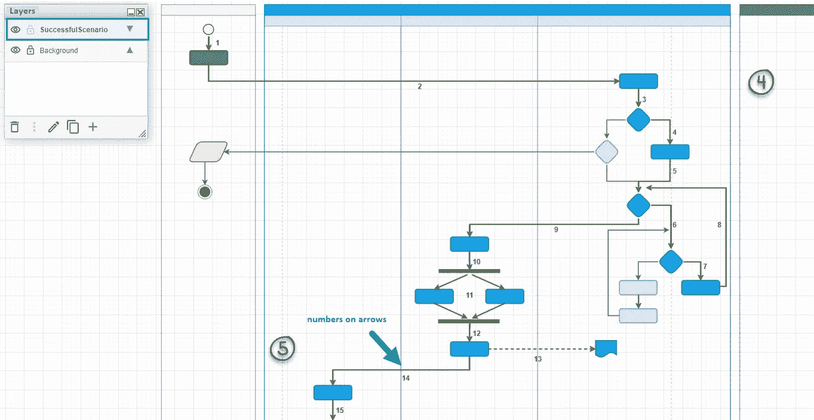

6.在*成功场景层*上创建两个新按钮:

*   一个从*背景层*复制**成功场景**按钮；这个新按钮有一种被点击的样式；
*   一个从*背景层*复制**无场景**按钮；这个新按钮的风格就像是刚发布的一样。

将这些按钮放在*背景层*的相应按钮之上。

7.在控制面板下，创建一个新的文本面板，其中包含对成功场景的描述:

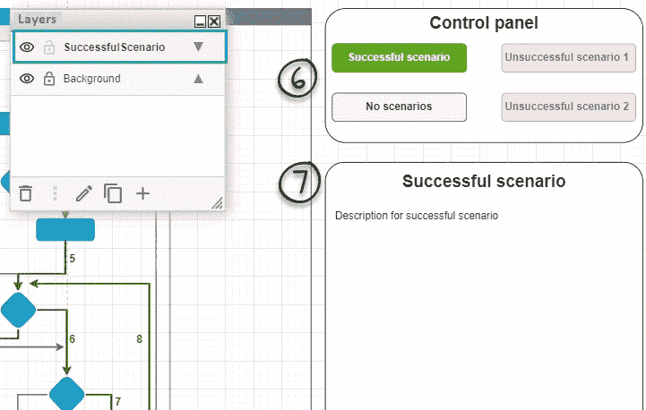

现在，我们已经强调了足够多的成功流程，可以进入下一个场景了。不过我一开始就宣布了动画，所以还是给图加点动态吧。

8.在 draw.io 顶部菜单中，转到**附加功能- >插件**。点击按钮**添加**并选择选项**流量**。

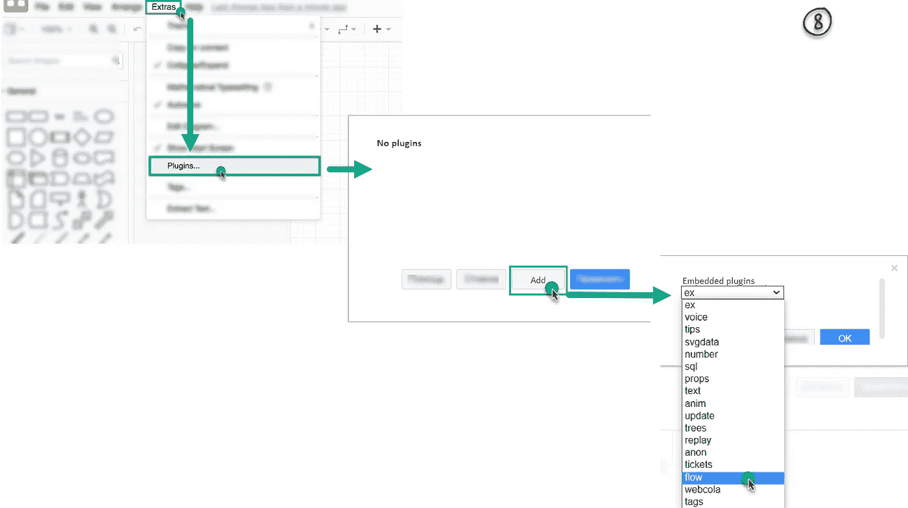

重新加载页面以激活添加的功能。

9.在图上，切换到*成功场景层*。在 draw.io 顶部菜单，进入**编辑- >选择边。** 当图上的所有箭头都被标记为选中时，进入右边的设置面板，检查参数**流动画**:

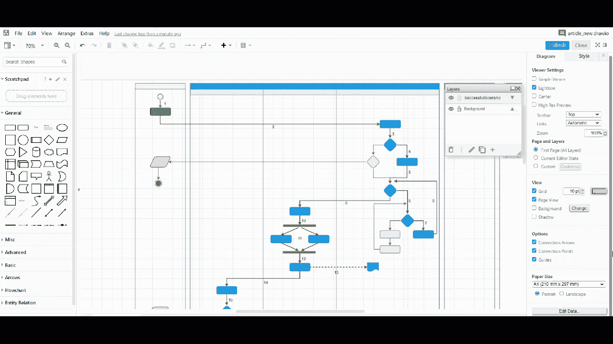

在这个阶段，我们的*成功场景层*看起来如下:


## 重要注意事项

*   当您在步骤 9 中选择边缘时，您可以移动所有的箭头，这样它们就不会正好在背景箭头所在的位置。如果它们在背景箭头的正上方，动画就不会那么引人注目。

# 不成功的场景

不成功场景的想法是一样的——我们为每个不成功场景在*背景层*之上放置一个新层。

1.在图层面板中，只让*背景图层*可见，并将焦点放在它上面。

2.在*背景层*选择第一个失败场景中的所有元素(箭头、活动、条件)。
复制选中的项目。

3.转到图层面板，创建一个名为 *UnsuccessfulScenario1* 的新图层。
锁定*背景图层*，解锁*未成功场景 1 图层*，并将焦点放在后者。

4.将步骤 2 中复制的项目粘贴到*不成功场景 1 层*上。更改元素的颜色和样式以突出显示它们:


5.在 *UnsuccessfulScenario1 图层*上，选择所有元素并将其移动到*背景图层*上相应元素的正上方。

6.对于箭头，用数字表示流程流动的顺序:


7.在*不成功场景 1 层*上创建两个新按钮:

*   一个从*背景层*复制**不成功场景 1** 按钮；这个新按钮有一种被点击的样式；
*   一个从*背景层*复制**无场景**按钮；这个新按钮的风格就像是刚发布的一样。

将这些按钮放在*背景层*的相应按钮之上。

8.在控制面板下，创建一个新的文本面板，其中包含对第一个不成功场景的描述:


9.在 draw.io 顶部菜单中，进入**编辑- >选择边。** 当图上的所有箭头都被标记为选中时，转到右边的设置面板并检查参数**流动画。**

第一个不成功的场景如下:


当对第二个不成功的场景执行相同的例程时，它将如下所示:

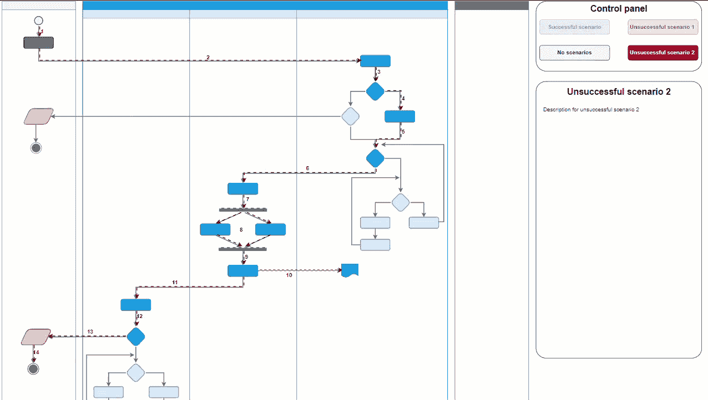

现在，我们已经完成了场景，可以开始互动了。

# 交互性

现在，让我们为`Successful`场景和`Unsuccessful`场景的按钮添加一些可点击性。

## 成功方案按钮

1.在图层面板中，点击`SuccessfulScenario` *图层*；

2.在图层面板的底部菜单中，点击钢笔图标打开图层进行编辑；

3.复制层的 ID:

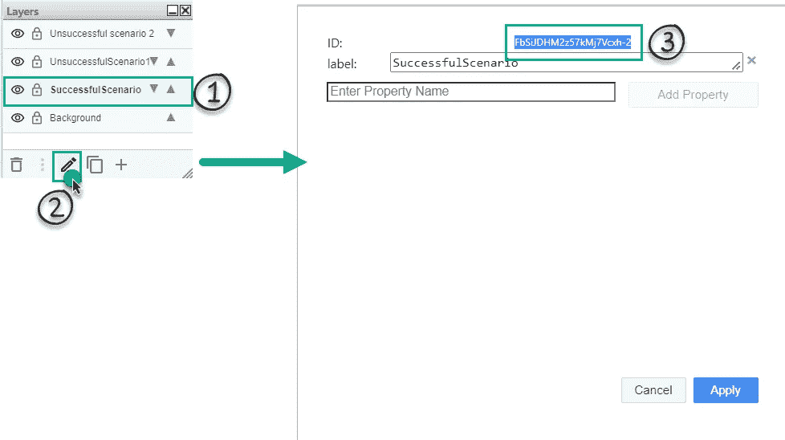

❗也复制了层*未获得全场景 1* 和*未获得全场景 2* 的 id。

4.切换到图的*背景层*:

*   锁定并隐藏所有其他图层(`SuccessfulScenario`*`UnsuccessfulScenario1``UnsuccessfulScenario2`)；*
*   *显示并解锁*背景层*；*
*   *将焦点设置在*背景层*上。*

*5.右键点击**成功场景**按钮，在弹出菜单中选择**编辑链接…** :*

**

*6.在第一个文本区域中，粘贴以下代码:*

```
*data:action/json,{“actions”:[{“toggle”: {“cells”: [“layer_ID_toShow”]}},{“hide”: {“cells”: [“layer_ID_toHide1”, “layer_ID_toHide2”]}}]}*
```

*   *`layer_ID_toShow`是步骤 3 中复制的`SuccessfulScenario`图层的 ID；*
*   *`layer_ID_toHide1`是步骤 3 中复制的`UnsuccessfulScenario1`图层的 ID；*
*   *`layer_ID_toHide2`是步骤 3 中复制的`UnsuccessfulScenario2`图层的 ID；*

*7.点击按钮**应用**:*

*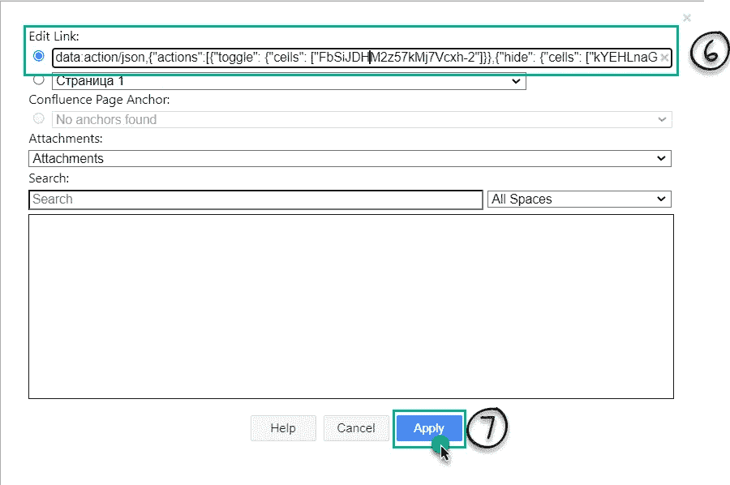*

*这段代码将显示读者点击*背景层*上的`Successful`场景按钮时的场景，并隐藏两个不成功的场景。*

*我们对其余场景使用相同的方法。将`toggle`和`hide`动作添加到所有三个场景按钮后，我们得到以下结果:*

*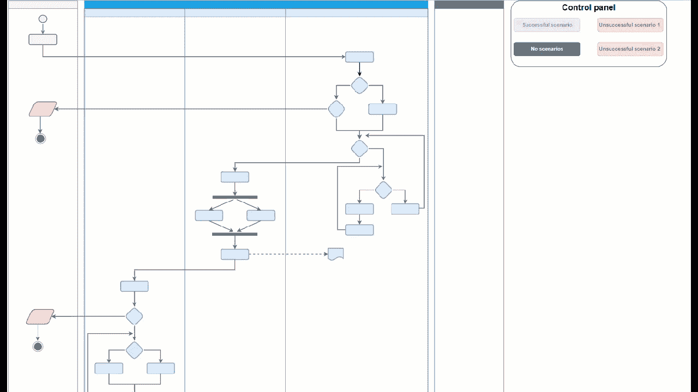*

*唯一要做的就是给按钮**添加可点击性，除了背景层，每层都没有场景**。*

*1.切换到图表的`SuccessfulScenario`层:*

*   *锁定并隐藏所有其他图层(`UnsuccessfulScenario1`、`UnsuccessfulScenario2`、`background`)；*
*   *显示并解锁`SuccessfulScenario`图层；*
*   *将焦点设置在`SuccessfulScenario`层上。*

*2.右击**无场景**按钮，在弹出菜单中选择**编辑链接…** :*

**

*3.在第一个文本区域中，粘贴以下代码:*

```
*data:action/json,{"actions":[{"hide": {"cells": ["layer_ID_toHide1", "layer_ID_toHide2", "layer_ID_toHide13"]}}]}*
```

*   *`layer_ID_toHide1`是步骤 3 中复制的`SuccessfulScenario`层的 ID；*
*   *`layer_ID_toHide2`是步骤 3 中复制的`UnsuccessfulScenario1`图层的 ID；*
*   *`layer_ID_toHide3`是步骤 3 中复制的`UnsuccessfulScenario2`图层的 ID；*

*4.点击**按钮应用**:*

*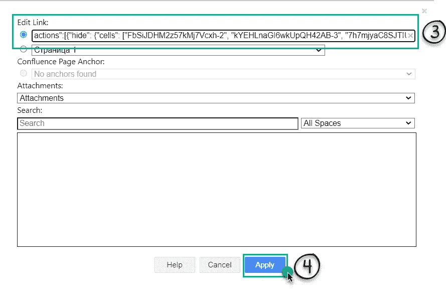*

*对`UnsuccessfulScenario1`和`UnsuccessfulScenario2`层重复本节的步骤 1-4。每个层的按钮代码保持不变。*

*所以，就是这样！我们完成了我们的图表:*

**

*尽管本文没有提供具体的工作示例，但我相信您会在积压的工作中找到大量可以应用该功能的任务。*

# *有用的资源*

*   *[带有自定义链接和动作的交互图](https://drawio-app.com/interactive-diagrams-with-custom-links-and-actions/)*
*   *[使用自定义链接](https://drawio.freshdesk.com/support/solutions/articles/16000080137-work-with-custom-links)*
*   *[制作 Atlassian Confluence 中 draw.io 连接器的动画](https://www.youtube.com/watch?v=MLlal_jRoXQ)*

*图表的 XML 代码可在本[要点](https://gist.github.com/rinagreen0902/20f511b07e02991ba5e4cb1e173955ca)中找到。*