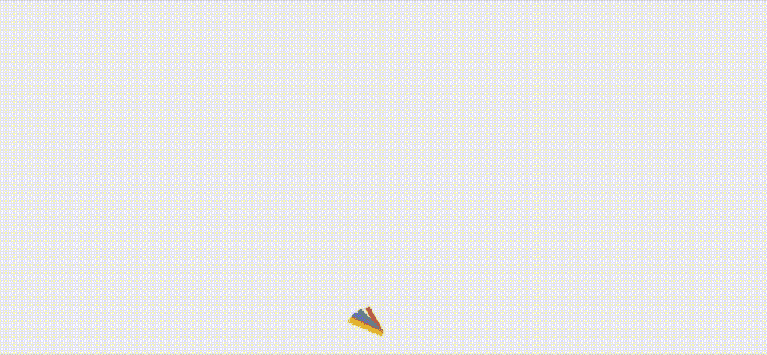

# SwiftUI 中的动画路径绘制

> 原文：<https://betterprogramming.pub/animating-path-drawing-in-swiftui-5708aad900ec>

## 更巧妙的使用动画数据

作者 Gif

之前我介绍过[如何使用](https://medium.com/r?url=https%3A%2F%2Fbetterprogramming.pub%2Flinking-animations-using-animatablemodifier-in-swiftui-30269f99bef0) `[animatableModifier](https://medium.com/r?url=https%3A%2F%2Fbetterprogramming.pub%2Flinking-animations-using-animatablemodifier-in-swiftui-30269f99bef0)` [将动画](https://medium.com/r?url=https%3A%2F%2Fbetterprogramming.pub%2Flinking-animations-using-animatablemodifier-in-swiftui-30269f99bef0)链接在一起。

效果很好，我想如果我给绘画艺术一个类似的待遇会很好。

我说不出为什么，但是看着图画出现的神奇之处就好像它们是由一只看不见的手画出来的。

过去你可以使用 UIKit 使用`CABasicAnimation`轻松完成这件事 SwiftUI 中没有这条路线。

因此，让我们探索一条在 SwiftUI 应用程序中制作动画的新路。

让我从头开始——我想画一个形状。当然 SwiftUI 中有几个内置的形状，比如圆形、椭圆形、矩形等等。但是我想要一个不从盒子里出来的形状。一个定制的形状，一个漂亮简单的形状。像一个三角形。

现在我使用路径来画一个三角形，在一小段代码中，如下所示:

但是好吧——这并没有画出任何东西，它在屏幕上显示一个三角形的速度比你说胡言乱语还快。

更糟糕的是，这段代码没有任何可远程配置的地方。它比一块有洞的瑞士奶酪有更多的神奇数字。

我需要做的是让它更通用。我想要一个例程，我可以把我的三角坐标输入其中。我需要这样的代码:

现在，它接受一个坐标数组，使用第一个坐标作为初始起点，然后绘制到数组中剩余的`CGPoints`的线条。

这个很好用。我不仅可以创建三角形，还可以在我的坐标数组中绘制出任何我想要的形状。

好的，但是——它还没有制作成动画。使用 SwiftUI 这样做虽然出乎意料地容易，但是有点神秘。除了将`animatableData`变量添加到`Drawing2`结构`Shape`中，我还需要对调用它的代码进行修改。

下面是准备制作动画的代码:

您需要在 SwiftUI 调用代码中使用 trim 指令来在屏幕上“绘制”路径，而不是一次性完成。

注意:我已经在这里说明了隐式和显式动画。我把这两者都包括进来不仅是为了完整性，也是因为在我写作的时候，隐式动画在 SwiftUI 中似乎特别脆弱——根据我的发现。

太好了！我们已经开始了，但是你知道计算三角形的坐标感觉不是很快。

这是一个预先计算出我们需要的坐标的函数。我将它和调用代码一起包含在这里，因为您还需要将`GeometryReader`包含到等式中以获得正确的定位:

注意:我已经在`GeometryReader`中添加了框架来调整多边形的大小，以及`Color.clear`指令。

# 结论

您在本文顶部看到的主要图片就是最终结果。为了得到你在顶部看到的图像，我多次调用多边形构建程序，在一个循环中使用不同数量的边。

因为我希望路径是不同的颜色，所以我使用了一个多维数组来同时存储和绘制每个形状。

所有这些都让我想到了这篇文章的结尾。我希望你喜欢读它，就像我喜欢写它一样。