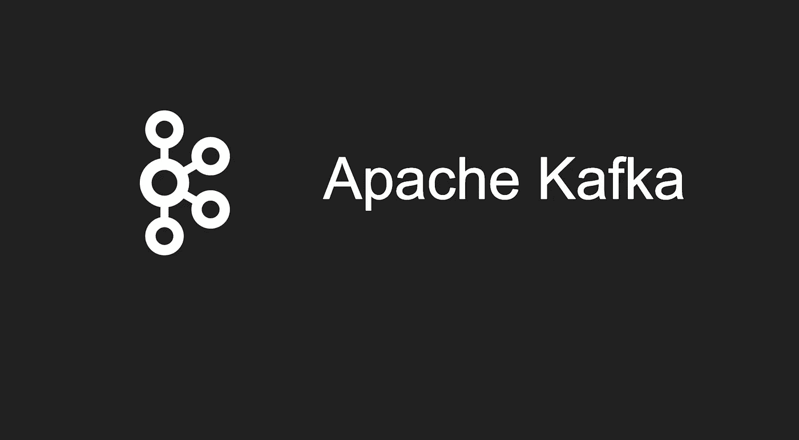

# 阿帕奇·卡夫卡在行动

> 原文：<https://betterprogramming.pub/apache-kafka-in-action-6e19836c9d7b>

## 了解 Apache Kafka 中不同组件的作用

# **什么是阿帕奇卡夫卡？**

[阿帕奇卡夫卡](https://kafka.apache.org/)都是关于数据的。这一切都是为了以可靠、快速和可扩展的方式传输大量数据。

在计算世界中，传输数据意味着消息传递。Kafka 用于以可伸缩和容错的方式移动大量数据的高吞吐量用例。

# **信息传递的挑战和局限**

对于应用程序和数据存储之间的数据传输，消息传递是一个相当简单的范例。

然而，这也带来了诸多挑战:

*   由于代理成为瓶颈，可伸缩性有限。
*   由于更大的消息大小，消息代理变得紧张。
*   消费者能够以合理的速度消费消息。
*   消费者通过确保所消费的消息不会永远消失，表现出无容错能力。

# 消息传递限制

消息传递的限制是由于:

## **1。高音量**

消息传递应用程序托管在单个主机或节点上。因此，由于单一主机或本地存储，代理有可能成为瓶颈。

此外，如果订阅者消耗数据的速度很慢，或者没有消耗数据，那么代理或发布者就有可能崩溃，从而导致完全拒绝服务。

## 2.**应用故障**

订户逻辑中可能存在错误，因此可能无法正确处理数据。

这可能导致数据中毒或掺假。在订户中发布错误被修复后，必须有能力获取旧数据进行处理。如果订户把数据藏起来，这将会很有帮助。

一旦错误被修复，重新处理所有的消息也是一项任务。

## 3.**中间件逻辑**

充当发布者-订阅者角色的不同应用程序具有向代理写入的自定义逻辑。它们中的每一个都有不同的错误处理。因此，在这种情况下，维护数据一致性将会很困难。

# 解决挑战

卡夫卡是如何解决这些挑战的？

*   为 TB 级或更大容量的数据提供高吞吐量。
*   可水平扩展，并且能够通过添加机器来无缝分担负载。
*   提供可靠性，在发生故障时不会丢失任何数据。
*   发布者和消费者是松散耦合的，他们只参与数据交换。
*   它利用了发布-订阅消息语义，独立的应用程序发送关于主题的数据，感兴趣的订阅者可以使用关于主题的数据。

您可以观看以下视频教程:

1.  设置 Apache Kafka 集群。
2.  设置动物园管理员和经纪人。
3.  制作关于该主题的信息。
4.  消费来自同一主题的消息。

视频教程的步骤如下所示:

# **参考文献**

*   https://kafka.apache.org/