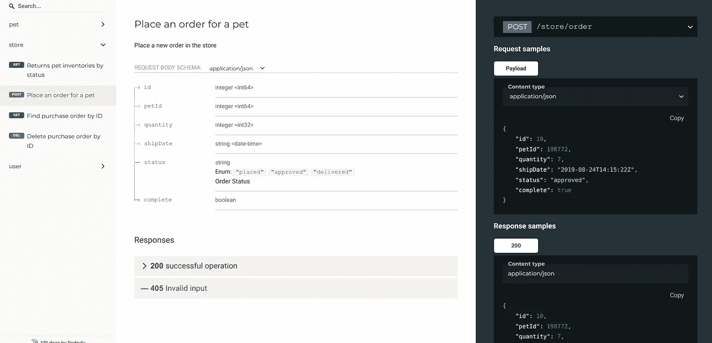

# API:对不喜欢科技的人的深入解释

> 原文：<https://betterprogramming.pub/apis-an-in-depth-explanation-for-people-who-arent-into-tech-a6174f944385>

## 什么是 API？是什么让它变好或变坏？

在本文中，您将了解什么是 API。

在过去的 200 年里，我们生产和交换信息的速度大大提高了。它始于 1833 年的电磁电报，但在 1971 年第一封电子邮件发出后，它就变得疯狂了。

这是一场革命。突然间，世界各地的人们可以交换书面信息。

与此同时，我们开始自动化越来越多的任务。自动取款机在 1972 年开始取代银行出纳员；公共交通取代了很大一部分个人交通，更大的农业机械提高了效率。

越多的事物和服务被数字化，我们就越能实现自动化。连接这些服务变得越来越重要:你希望能够发送招聘电子邮件，并在招聘门户中提供这些服务。一旦你预约了，日期应该在招聘人员的日程表上。

连接服务意味着一个服务需要提供信息，另一个服务需要消费信息。消费者必须能够和提供者“说同一种语言”。对于日历事件，这可以是类似于`.ical`的文件格式。或者它可以是不同于文件的另一个接口。一个开发者可以用来编写他们自己的东西的接口。应用程序编程接口，或称 API。

# 什么是 API？

马库斯·温克勒在 [Unsplash](https://unsplash.com?utm_source=medium&utm_medium=referral) 上的照片

很多人写软件。有时他们的程序可以自己做所有的事情，但在很多情况下，开发人员(也称为程序员)使用其他人的工作作为构建模块。这有多种方式:将他人的代码直接复制到您自己的项目中被称为“出售”如果你在你的机器上安装这个项目，它通常被称为“使用库/框架”然后还有服务。

服务通常不会在您的机器上运行。有人在照顾他们。它是互联网上的服务器。该服务器有一个明确定义的连接方式。类似于您可以打开浏览器并输入 URL。然后，浏览器向该服务器发送请求数据的包。然后，浏览器将响应可视化，通常是 HTML、图像和 JavaScript。

API 首先是接口。就像遥控器是电视的接口一样。

> 接口位于两个系统的边界。它们允许两个系统相互作用。

由 [Kelly Sikkema](https://unsplash.com/@kellysikkema?utm_source=medium&utm_medium=referral) 在 [Unsplash](https://unsplash.com?utm_source=medium&utm_medium=referral) 上拍摄的照片

API 是一个应用程序编程接口。

> API 是两个程序之间的接口。

您可以用许多不同的方式定义 APIs 就像您可以用远程控制一样。但就像有些电视不接受某些遥控器一样，不是每个程序都接受每个 API。开发人员必须努力增加对特定 API 的支持。

在互联网上，许多通信都是按照请求-响应原则进行的:客户端向服务器发送请求，然后接收响应。服务器的接触点是它的 API。典型地(但不一定！)，服务器有数据库(DB)。客户端可以是运行在用户浏览器中的代码。也可能是另一种服务。

一组非常常见的 API 是所谓的 REST-API。它们工作在 HTTP 协议之上。这使用请求-响应原则，类似于人们使用他们的浏览器:

1.  请求:程序向一个端点(URL)发送请求。比如`https://example.com/api/books`。该请求可能包含两种形式的更多信息:报头和有效载荷。报头可以是认证信息——任何让接收服务器知道您被允许查看您请求的内容的信息。有效负载确切地指定了您想要的内容，例如`series=Lord of the Rings`。
2.  响应:响应可以是任何内容。它还包含状态代码、标题和正文。标头可能会告诉您主体被压缩或被缓存。

对于本文，当我谈到 API 时，我指的是“REST-API”。还有其他 API，但 REST 是当今最流行的 API 风格。

# 如何记录 REST APIs？

REST APIs 通常使用 OpenAPI 规范进行文档化。OpenAPI 文档以 YAML 格式存储在文本文件中。看起来是这样的:

你可以看到域名(example.com)没有被指定，但是 URL 的其余部分`/store/order`在那里。它指定了 HTTP 方法“post”

> `HTTP`方法只是协议的另一部分。有`GET`检索素材、`POST`创建素材、`PATCH`和`PUT`修改素材、`DELETE`删除素材。

该文档定义请求体必须采用 JSON 格式，并遵循`Order`模式。稍后在 OpenAPI 文档中会详细说明。

此外，OpenAPI 文档指定了在发送这样的请求时可能得到的响应:成功订单的状态为`200`,无效订单的状态为`400`。

> 有许多 HTTP 状态码的[。它们都有 3 个数字，重要的部分是第一个数字:2xx 是成功消息，4xx 是请求出错，5xx 是服务器出错。你不会经常看到 1xx 和 3xx。细节很重要，但只对开发者而言。](https://en.wikipedia.org/wiki/List_of_HTTP_status_codes)

# 如何阅读 OpenAPI 规范？

有两个工具可以使 OpenAPI 规范文件可读:ReDoc 和 Swagger。

Swagger 是一种广为人知的解决方案。他们已经开始开发 OpenAPI 规范。这就是我们有时将术语 Swagger 和 OpenAPI 作为同义词使用的原因，尽管它们在概念上非常不同

> Swagger 是一个使用 OpenAPI 规范为 REST APIs 生成文档的工具。

Swagger 文档看起来像这样:

著名宠物店 OpenAPI 规范截图，用 Swagger 渲染成易读的 HTML 文档。

ReDoc 是显示文档的另一种方式:

ReDoc 为 OpenAPI 规范生成了一个非常简洁的可视化。

# API 文档还需要什么？

通常，一个新 API 最难的部分是入门:如何认证？你如何完成一个典型的工作流程？使用了哪些约定？

是否有速率限制，也就是说你必须小心不要打太多电话？有些电话不是免费的，甚至打起来很贵吗？有什么我应该知道的电话副作用吗？

# REST API 的好坏取决于什么？

照片由[肯尼·埃利亚松](https://unsplash.com/@neonbrand?utm_source=medium&utm_medium=referral)在 [Unsplash](https://unsplash.com?utm_source=medium&utm_medium=referral) 上拍摄

如果 REST API 是用 OpenAPI 完全指定的，并且有一个可访问的 Swagger/Redoc 页面，那么它已经走了很长的路。如果有额外的文档帮助您完成第一步并展示如何组合使用不同的端点，那就更好了。

一个坏的 REST API 是不一致的，完全没有文档记录，有不同的非标准认证机制。此外，像任何软件一样，糟糕的 API 也有错误和停机时间。

对于最后一句话，你可以注意到一个有趣的效果:作为用户，我们开始不再区分界面和服务。更正确的说法是，服务错误地实现了 API，并且实现 API 的服务关闭了。但很多情况下，人们把“API”和“API 背后的服务”当成同义词。

服务本身只是软件，因此有功能性和非功能性需求。功能需求是您希望能够完成的事情。如果 API 是图书馆的接口，您可能需要订购一本书或查看您当前租借的书籍。

非功能性需求是关于你如何做事的:服务在 99.9%的时间里都是可用的吗？大多数时候它的反应有多快？

# 摘要

API 是允许服务进行通信的接触点。它需要以某种形式记录下来，以便其他人能够使用。OpenAPI 是指定 REST APIs 的一种方式。使用 OpenAPI 规范，您可以使用 Swagger 或 ReDoc 来记录 API。