# 面向制造商的 API

> 原文：<https://betterprogramming.pub/apis-for-makers-9670719e7f25>

## 用很少的代码将 Slack 连接到其他 SaaS 工具，如 Typeform

知道如何使用 API 不仅是软件开发人员的一项关键技能，也是一项可以帮助任何人节省时间和提高工作效率的技能。

API 是应用程序接口的缩写，允许我们传输和操作数据，自动化工作操作，巩固通信并扩展工具和平台的功能，如 [Airtable](https://airtable.com/) 、 [Slack](https://slack.com/) 、 [Twilio](https://www.twilio.com/) 等等。

在本文中，我们将学习所有关于 API 的知识，以及如何轻松连接不同的软件服务和工具。我们将创建一个 Slack 应用程序，每当在 [Typeform](https://typeform.com) 上提交新表单时，它就会发布一条消息来提醒您的频道。

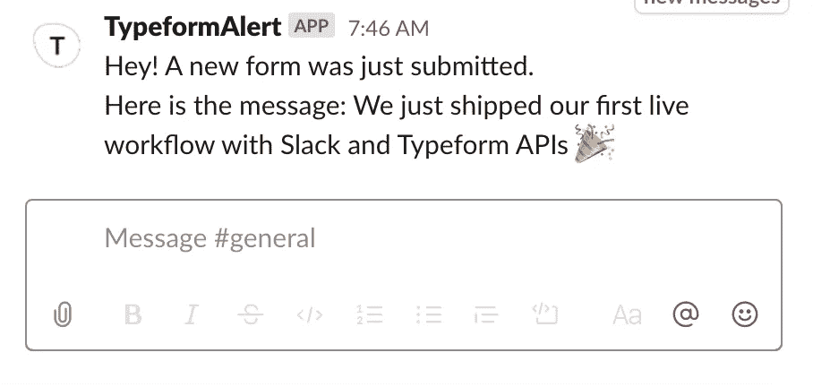

我们将使用 [Autocode](https://autocode.com) ，一个用于将 API 连接在一起的在线编辑器，直接从我们的网络浏览器工作——不需要其他工具。

# 你事先需要什么

*   [空闲账户](http://slack.com)
*   [自由标准库账户](https://stdlib.com/)
*   [自由类型账户](https://Typeform.com)

# 但是首先……什么是 API？

应用程序编程接口是所有应用程序到应用程序通信和数据传输的基础。为了实现这种通信，必须在 web 上交换请求和响应。

当我们与网络应用程序交互时，我们每天都会发出数百个看不见的 API 请求，以检索和更新数据，或者给出执行特定任务的指令，包括使用 [Stripe](https://stripe.com/) 处理信用卡支付，使用 [Twilio](https://www.twilio.com/) 发送短信，以及登录我们的 SaaS 账户。

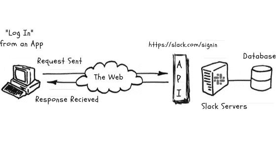

例如，每次我们“登录”到我们的 [Slack](https://slack.com/) 账户，我们就通过网络向 [Slack 的 API](https://slack.com/signin) 发送一个 HTTP GET 请求。这个 API 只是控制外部应用程序如何访问 Slack 的服务器以从 Slack 的数据库中检索存储的资源的代码。

当 Slack 的服务器接收到我们的应用程序的请求时，它们将解释代码并以请求数据的有效载荷响应。我们的应用程序获取有效载荷的数据，对其进行解释，并显示出来，以便我们访问所需的资源:workspace 的频道、对话、用户等。

当向 API 发出 HTTP 请求时，我们可以做的大部分事情都涉及到使用四个 HTTP 协议原则(GET、POST、PUT、DELETE)来创建、读取、更新或删除数据。

这些功能允许开发者和制造者构建有价值的网站、自动化工具和应用程序。

# 第 1 部分:导航自动代码以发出 API 请求

今天，您将学习通过利用 API 连接两个不同的软件服务来导航[自动编码](https://autocode.com):[Slack](https://slack.com)和 [Typeform](https://www.typeform.com/) 。

前往标准库上的 [Autocode](https://autocode.com) ，使用您的标准库凭证登录或创建一个帐户——这是免费的！

您将在标准库上使用 Slack APIs。使用[Slack API](https://stdlib.com/search/?q=slack)您可以快速构建 Slack 应用程序:

*   对外部和内部事件做出反应。
*   [发送、阅读、创建、存档和管理信息](https://stdlib.com/@slack/lib/messages/)。
*   [从松弛工作空间中查询信息](https://stdlib.com/@slack/lib/users/)并在松弛工作空间中制定变更。
*   将来自外部工具和服务的数据传输到一个松散的工作空间。
*   通过[模态](https://stdlib.com/@slack/lib/views/)收集信息。
*   自动化任务等。

在本演示中，您将创建一个对外部事件做出反应的 Slack 应用程序；每当在你的 Typeform 帐户上提交新表单时，你的 Slack 应用程序都会向频道发布一条消息。

登录 Autocode 后，选择“空白”模板来“原型化新代码”

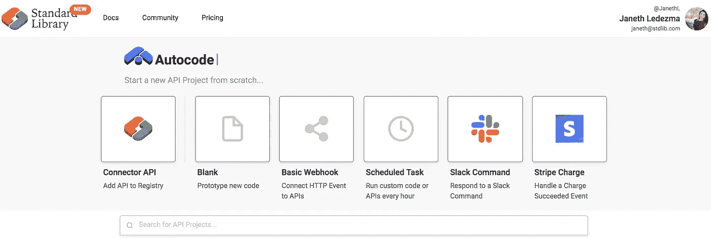

您将被重定向到如下所示的编码界面:

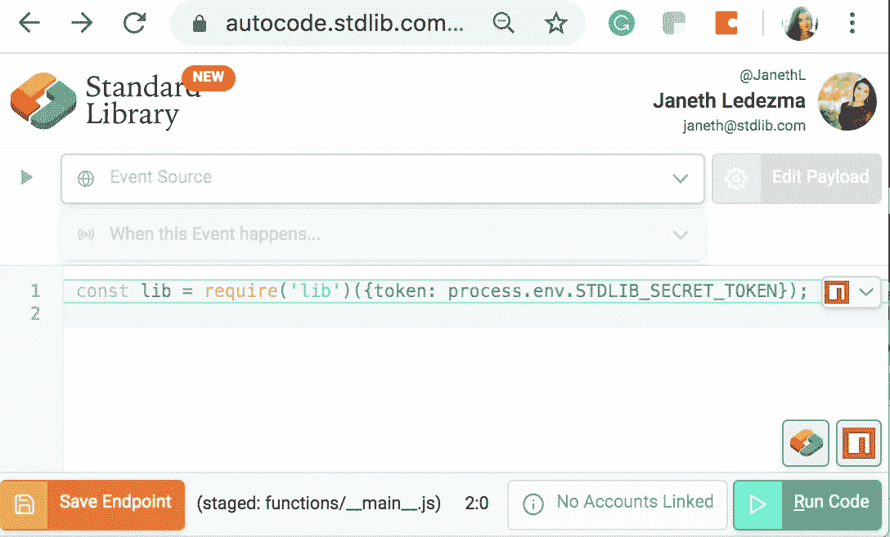

您不能删除第一行代码:

```
const lib = require(‘lib’)({token: process.env.STDLIB_SECRET_TOKEN});
```

它导入了一个名为“`lib`”的完整 npm 包，以允许我们与标准库之上的其他 API 进行通信。

屏幕右下角的两个较小的方形按钮允许我们轻松地搜索和导入 [npm 包](https://www.npmjs.com)和标准库 API。

选择右下角带有标准图书馆标志的按钮，这是一个彩色标志。您会注意到，单击该按钮会注入向标准库 API 发出请求所需的代码— `await lib.`


标准库注册表上可用的 API 提供者列表将会弹出。你可以滚动并选择`Slack`或者通过键入`sl`来过滤列表，然后按 tab 键自动完成。

滚动浏览所有可用的 Slack APIs 的完整列表，或者通过键入`send`进行过滤，并选择“从你的机器人向频道发送消息”。

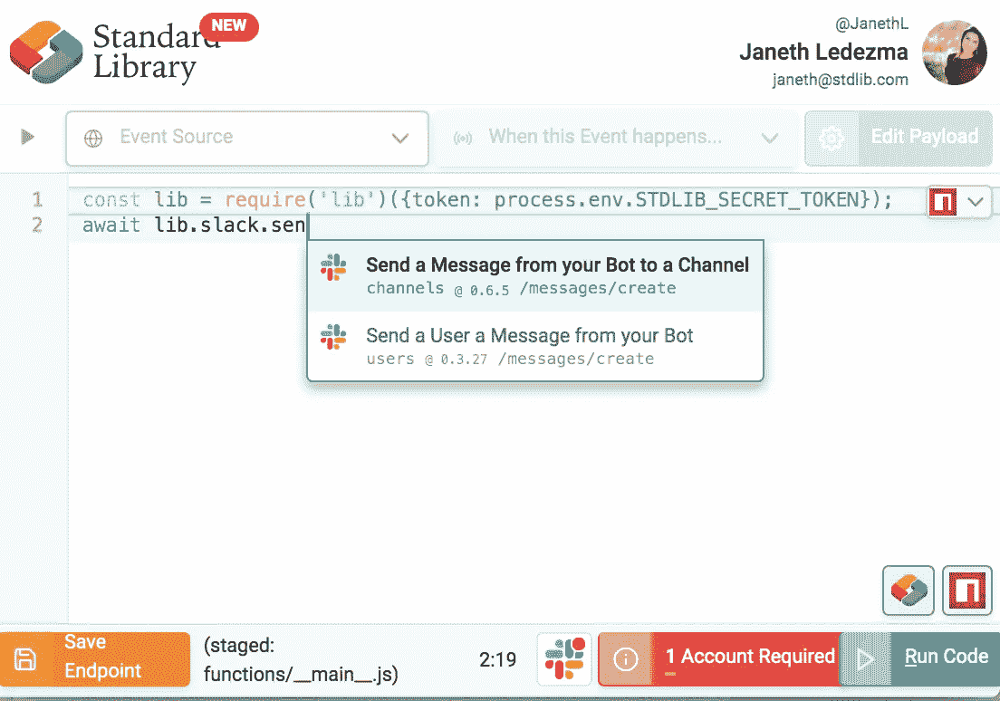

您将看到一个参数编辑器，向您展示当您输入参数时，自动生成的代码是如何变化的。


在*频道*参数框中，输入`**#**`，后跟您想要发送信息的频道名称。

在 *text* 参数内，键入您想要发送的任何消息。点击*完成* 配置，代码自动添加到代码编辑器中。

如果您试图在此时运行代码，您将会收到错误消息:“没有提供备用身份验证令牌”。这是因为您需要将一个[标准库身份令牌](https://docs.stdlib.com/identity-management-sso-for-apis/what-is-an-identity-token/)链接到您的 Slack 帐户。

# 第 2 部分:将标准库令牌链接到 Slack

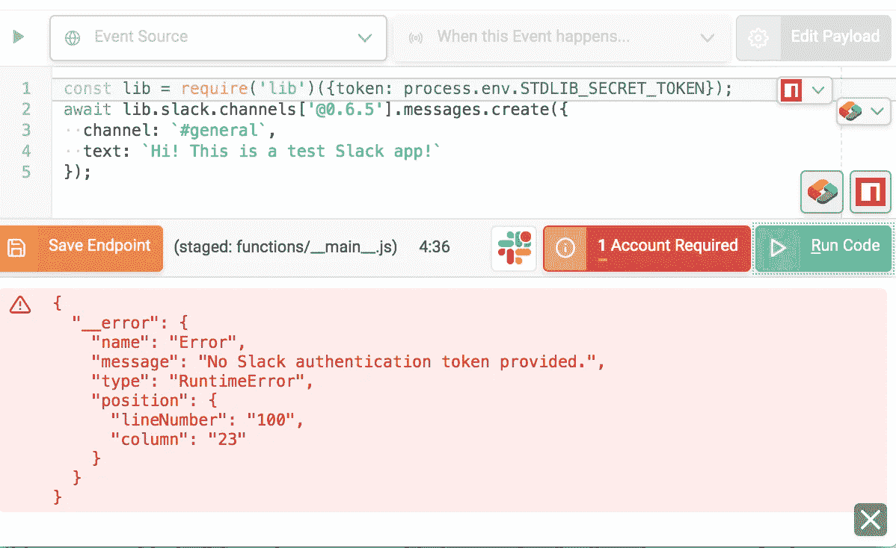

点击红色按钮“需要 1 个账户”,这将提示您链接一个备用账户。

从身份管理屏幕中选择“链接资源”。

如果您已经使用标准库构建了 Slack 应用程序，您将看到现有的 Slack 帐户，或者您可以单击“链接新资源”来链接新的 Slack 应用程序**。**

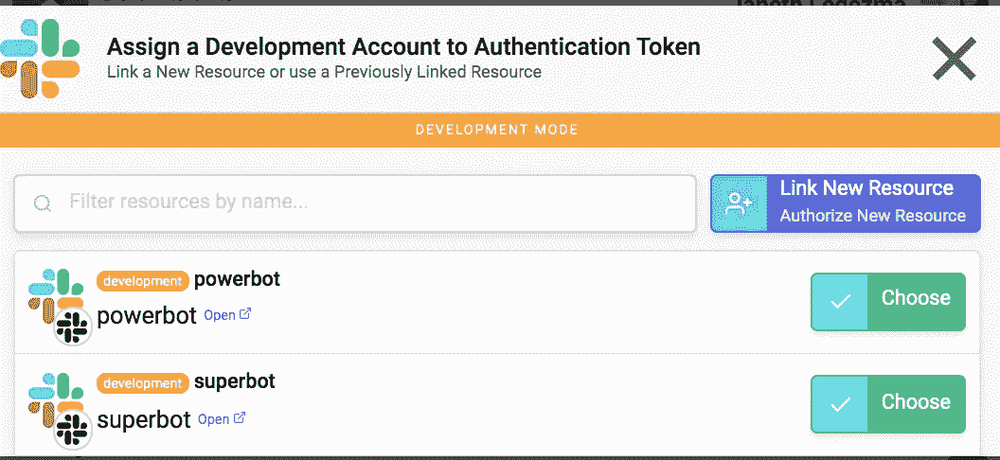

选择“安装标准资料库应用程序”


您应该会看到一个 OAuth 弹出窗口，如下所示:


选择*允许*。你可以选择用名字和图片定制你的 Slack 应用。

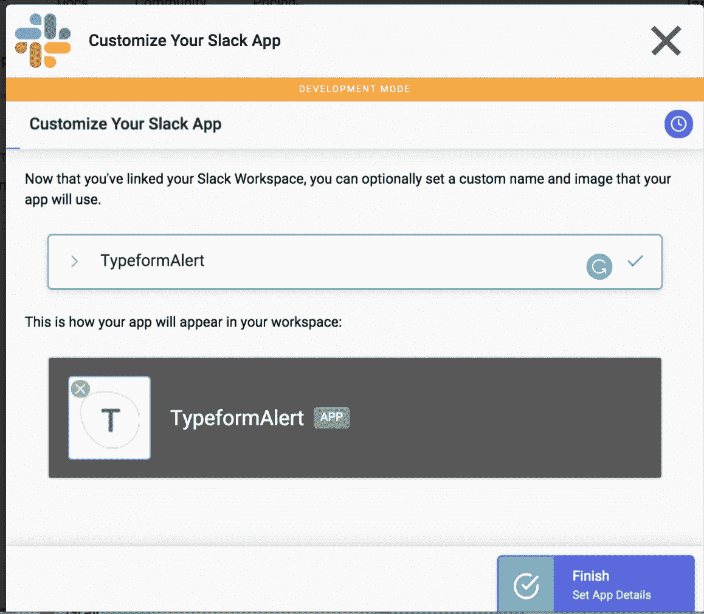

选择*完成*。绿色复选标记确认您已正确链接您的帐户。点击*完成*的链接。


链接了 Slack 帐户之后，您就可以通过单击绿色的“运行代码”按钮向 Slack 的 API 发送一个测试 HTTP Post 请求了。就这样，您的测试消息应该发布到您的 Slack 通道！

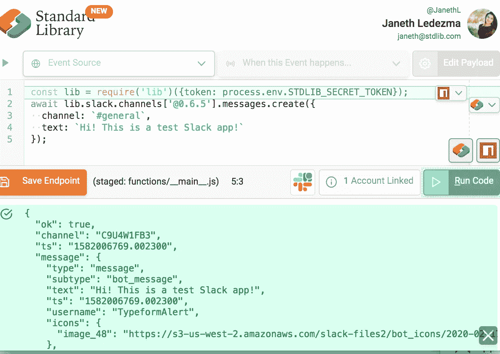

# 第 3 部分:将时差连接到字体

接下来，您需要启用 Slack 和 Typeform 帐户之间的通信，以便当在 Typeform 上提交表单时，该事件的数据将进入您的 Slack 通道。

你可以通过导出你的代码作为一个 webhook API 来处理 Typeform 上的`form.submitted` 事件。

但是首先，在[类型表单](https://typeform.com)上登录或创建一个帐户。创建并发布一个快速联系表单，该表单采用如下的`email`和`text`输入:

完成表单发布后，返回到 Autocode 将 Typeform 连接到 Slack。

从*事件源* 和`form.submitted` 中选择`Typeform`作为事件。每次提交表单时，它都会触发您的 webhook API，一个 HTTP POST 请求会被发送到您的 Slack 帐户，其中包含该事件的信息。

一旦做出选择，代码就会自动生成。这段自动生成的代码导出了第 14-17 行中的 JavaScript 函数——这个函数将处理 Typeform 上的`form.submitted`事件。


`module.exports`(第 8 行)中的`event`参数从 Typeform 上的完整事件有效负载传入信息。您可以通过点击屏幕右上角的灰色*编辑有效载荷*按钮来查看事件有效载荷的示例。

它应该是这样的:

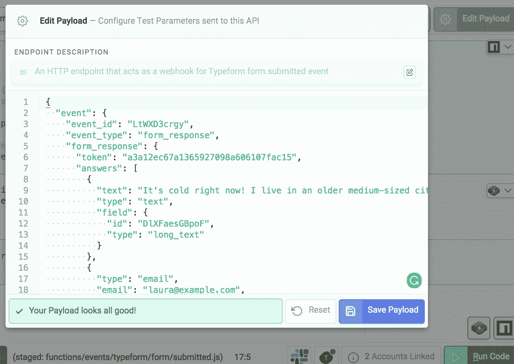

您可以尝试从这个示例信息负载中提取数据来配置您的 Slack 消息。

将我们之前编写的测试消息:`Hey! This is a test Slack app!`替换为类似于:`Hey! A new form was just submitted. \n Here is the message: ${event.form_response.answers[1].text}``的内容。


您已经准备好连接您的 Typeform 帐户。选择**【1 账号必填】红色按钮。**

****

**您将通过另一个身份验证流程将您的标准库令牌链接到您的 Typeform 帐户。**

********

**一旦您完成了流程并选择了示例类型表单，请单击“完成链接”。**

**选择橙色的【保存 API 端点】按钮。**

****

**太好了！您刚刚保存了您的第一个项目。请注意 Autocode 是如何自动建立一个项目支架来将您的项目保存为 API 端点的，但是它还没有被部署。**

**这意味着您的端点尚未激活，无法响应 HTTP 请求或事件。要将您的 API 部署到云中，单击文件管理器左下角的*部署 API* 。**

****

**恭喜你。您已经成功地引导 Autocode 将您的第一个 API 集成发布到产品中。**

**您可以通过将表单提交到 Typeform 来测试您的集成。如果您已经正确设置了一切，您的 Slack 通道应该会收到如下消息:**

****

# **日志**

**Autocode 附带日志来帮助我们迭代和调试我们的项目。例如，如果我们想要查看完整的事件有效负载，以从 Typeform 提取更多信息并将其传递给 Slack，我们可以添加以下代码行:**

```
console.log(JSON.stringify(event, null, 2))
```

**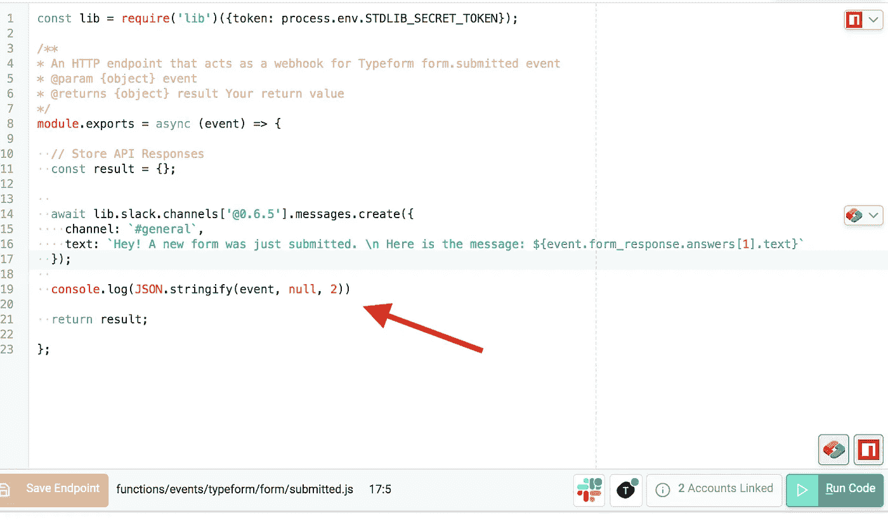**

**单击“保存 API 端点”并用“部署 API”重新部署您的代码。**

**现在返回到 Typeform 并提交第二个测试表单。**

**找到并单击部署和共享按钮上方的“日志”按钮。**

****

**您的项目日志将在新屏幕中打开。您将看到完整的事件负载，如下所示:**

**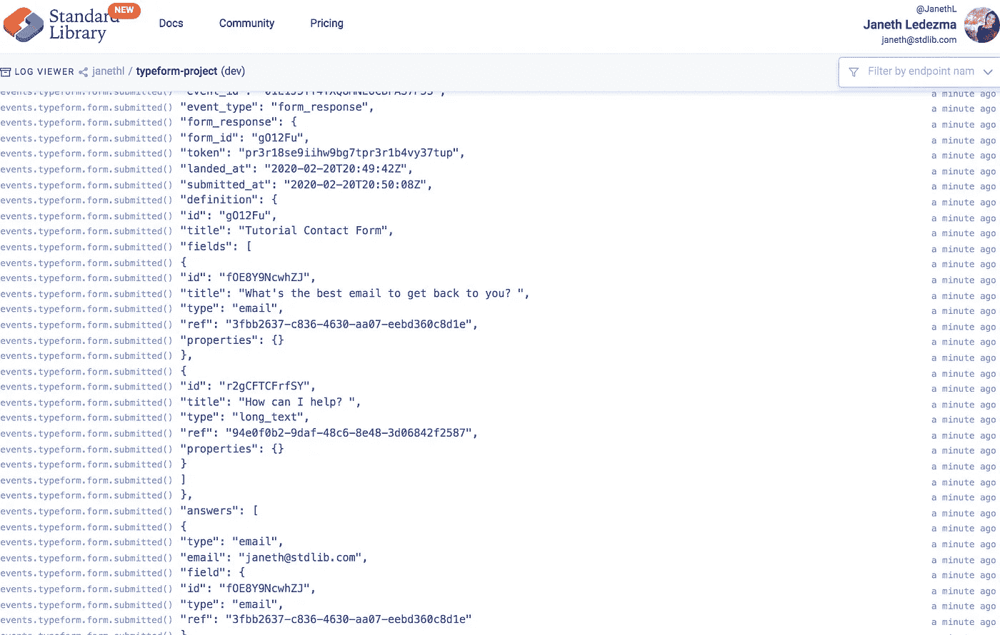**

# **就是这样！**

**感谢您花时间阅读和尝试这一点！**

**如果你觉得这篇文章有帮助，请告诉我！如果你有问题，或者你想学习连接其他 API 和设置 webhooks，请联系我们——我很乐意帮助你。**