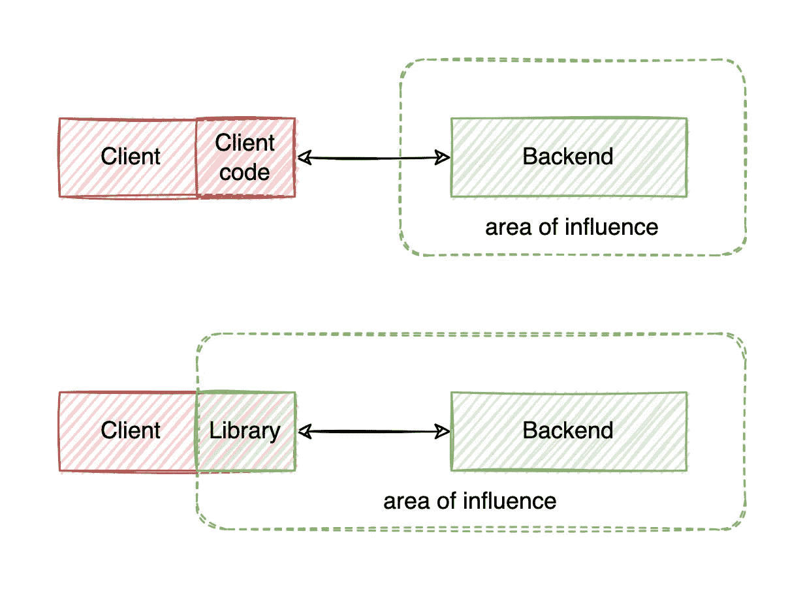
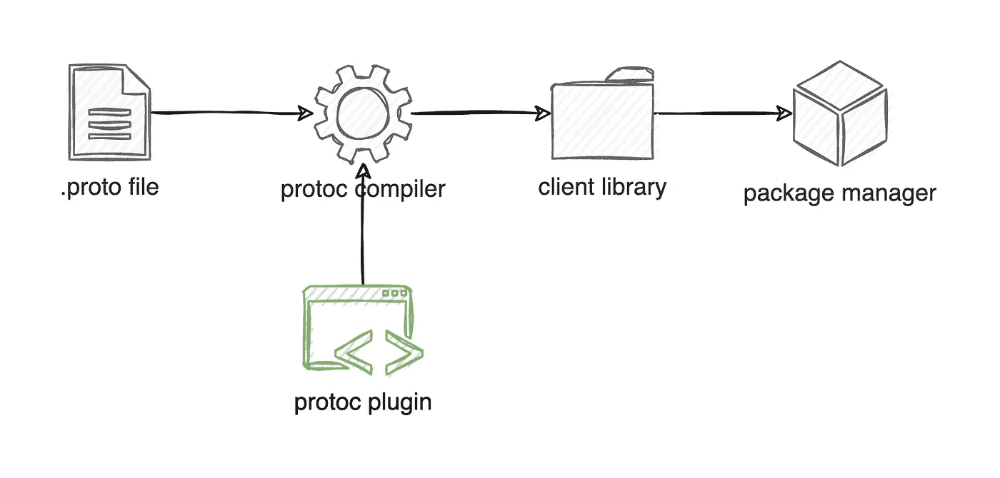
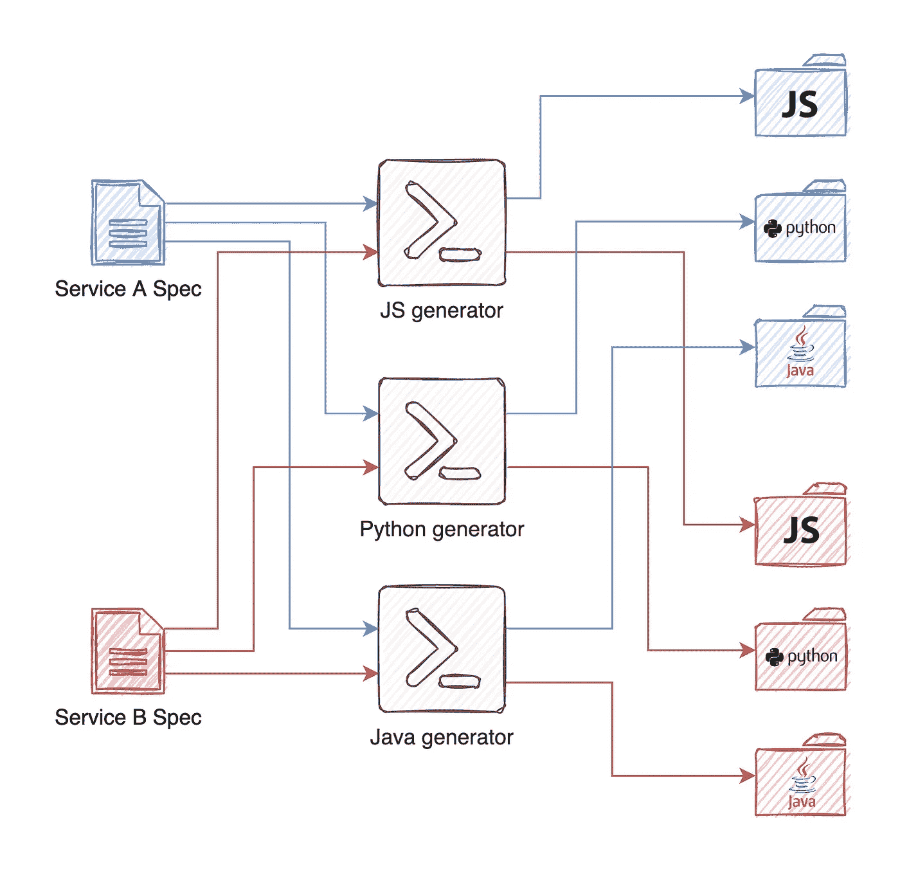

# 构建分布式系统:使用客户端库提高可用性

> 原文：<https://betterprogramming.pub/architecting-distributed-systems-increasing-availability-using-client-libraries-b4763d4d74c9>

## 通过在客户端应用程序中拥有一个库，我们可以一致地处理故障，增加系统的可用性


照片由 [Fotis Fotopoulos](https://unsplash.com/@ffstop?utm_source=medium&utm_medium=referral) 在 [Unsplash](https://unsplash.com?utm_source=medium&utm_medium=referral) 上拍摄

当开发我们公司内部或外部使用的 API 时，除了记录和公开端点之外，我们还可以选择交付客户端库。这种方法对用户来说有多种优势:更容易实现(有时甚至只有一行代码)，更容易迁移(通常只是添加一个依赖版本)，可能更容易设置安全性。

虽然开发和维护这样的客户端库需要花费精力，但是它们也可以给 API 开发人员带来一个重要的好处，其中之一就是系统增加的可感知的正常运行时间/可用性**。当出现瞬时故障时，重试操作通常可以解决问题。这种逻辑可以构建到客户端库中，并且有很大的效果。**



我们可以改善我们所能影响的。通过在客户端应用程序中拥有我们的一部分代码，我们可以用一致的方式处理错误，增加集成的可感知可用性。如果你想了解为什么会发生瞬时故障，这篇来自 Azure docs 的文章是一个瑰宝。

本文的目的是了解在什么情况下，在普通 API 定义上添加一个客户端库可以显著提高正常运行时间。首先，我们将回顾分布式系统架构中的一些最佳实践，这些实践是受益于借助客户端库实现的正常运行时间的必要前提。然后，我们将详细讨论如何开发一个客户端库来增加我们系统的正常运行时间，同时又不会花费太多的维护成本。在文章的结尾，我将提到客户端库如何让 API 开发人员的生活变得更好的一些其他方法。

在开始之前，让我们在本文的上下文中定义可用性/正常运行时间。它是“*从客户端的角度来看成功操作的百分比*”，这意味着，在普通 HTTP 实现的情况下，它是没有超时或返回 5xx 响应代码的请求的百分比。在库实现的情况下，它是没有导致异常或返回服务器错误的成功方法调用的百分比。

同样，我们试图通过重试来减少客户端感知到的错误**的数量，而不是失败的网络请求或服务重启的数量。让我们首先了解一些最重要的先决条件。**

# 🌎先决条件 1:高可用性和 DNS


客户端需要能够通过不同的基础架构重试失败的操作

为了获得高重试成功率，我们需要没有单点故障的基础架构。如果其中一个物理位置的应用程序停止响应，并且我们有理由相信该位置存在问题，那么高可用性设置将允许客户端开始将请求路由到另一个物理位置的负载平衡器。

如果应用程序完全托管在单个物理位置上，则在出现临时网络故障时，客户端重试仍然有所帮助，但是在物理位置出现故障时，整个应用程序将变得不可用。

要使用高可用性设置，请确保您的 DNS 解析为多个 IP 地址供客户端选择(例如，每个负载平衡器一个)。有趣的事实:大多数浏览器实际上都有内置的机制来尝试不同于 DNS 响应的 IP 地址，以防他们一直使用的那个没有响应。

# 🗺先决条件 2:负载平衡器配置

负载平衡器通过将请求路由到集群中的可用实例，在提高软件系统的可靠性方面起着至关重要的作用。它们通过运行状况检查来确定哪些实例可用，并维护一个运行状况良好且能够满足请求的实例的活动列表。

如果负载平衡器没有从被认为健康的实例接收到预期的响应(或任何响应),它应该将该实例标记为不健康，并确保在健康检查成功之前没有进一步的请求被路由到该实例。负载平衡器检测失败实例的速度越快，失败的请求就越少，后续重试被路由到另一个健康实例的机会就越大。

虽然负载平衡器经常可以检测到故障(L4 和 L7 负载平衡器在这里的工作方式略有不同，如果您不熟悉，我强烈推荐 Hussein Nasser 的[解释)，但它不会为我们对不同的实例重试相同的请求——这是客户端应用程序的职责。](https://youtu.be/ylkAc9wmKhc)

# ⌛️先决条件 3:超时

当向我们的客户机公开一个 API 时，我们指定最大服务响应时间，这是我们的客户机超时。这就是为什么在设计系统时让后端的总最大超时少于客户端超时是很重要的。

记住:我们使用客户端库通过重试失败的操作来提高系统的可用性。理想情况下，为了让客户端库能够在放弃并通知客户端应用程序失败之前“在幕后”重试一次，差值应该至少是 2 倍，这意味着后端超时必须小于“公布的”客户端超时的一半。换句话说，在承诺某些最大响应时间时，我们需要考虑至少一次重试的时间。


实际超时至少比官方客户端超时少两倍

在一个简单的用例中，请求只是在组件之间传播，每个级别的超时可能大致相同。然而，当一个组件有多个远程依赖时，这就变得更加棘手了。扩展上面的例子，如果我们需要在与数据库交互之前调用第三方 API，我们就不能在组件之间保持相同的超时值，因为总和不能超过客户端超时的一半，即 15 秒。


链的每个部分的超时必须保持在 15 秒以下，因此如果引入另一个对第三方 API 的调用，我们不能保持相同的数据库超时

通常，用例中涉及的顺序操作越多，每个单独的超时应该越短。我在我的关于 API 失败的[文章](https://medium.com/geekculture/bulletproof-distributed-systems-how-to-fail-at-http-calls-e7f0b3240d19)中从不同的角度提到了超时，并解释了为什么你应该在我的关于随机数的[文章](/architecting-distributed-systems-random-code-8db0cd9b87d1)中给超时增加一些抖动。

# 🔁先决条件 4:等幂

最后但同样重要的是，如果我们第一次没有得到预期的结果，我们希望能够在客户端安全地重试相同的操作。请求可能已超时，但操作可能实际上已经成功，在这种情况下，重试必须返回初始操作的结果，而不是再次执行它。换句话说，如果我们不知道我们的第一次尝试是否成功，我们希望能够安全地重试操作。

如果这个概念仍然令人困惑，查看我的关于幂等性的重要性的文章来回答任何剩余的问题。

# 📚客户端库实现

当谈到客户端库的实现时，首先理解需求是很重要的。我通常会问两个问题:

1.  我们的集成侧重于读还是写？
2.  在发送之前，我们能可靠地在客户端持久化记录吗？

如果客户端应用程序主要是向我们的系统写入数据，并且这些客户端可以访问非易失性存储器，我鼓励使用这些存储器来缓冲服务器还没有成功接收的数据。这是物联网用例中的一种常见模式，如果服务器暂时无法接收设备发送的数据，我们不希望丢失任何遥测数据。一旦服务器确认本地存储的记录被成功接收，就可以删除这些记录。

然后，我问第三个问题:*客户端需要先下线吗*？由于这不是一个常见的要求，而且众所周知很难做到，我假设我们的客户大部分时间都可以访问互联网。

因为，大多数时候，客户端工作是**而不是**写繁重的，它们**不**需要离线优先的支持，并且是**无状态的**，我将在进一步的解释中重点关注这个场景。

根据最新的行业标准，API 要么作为 **HTTP** 端点公开，要么使用 **gRPC** 框架公开。在 HTTP APIs 的情况下，事实的来源是一个 **OpenAPI** 规范文件，而如果您正在公开一个 gRPC API，那将是**。带有服务和消息定义的 proto** 文件。OpenAPI 和 gRPC 都带有代码生成器生态系统，这是我们客户端库的完美起点。事实上，我们可能想做的是使用 OpenAPI 和 gRPC 附带的久经考验的生成器，并用额外的重试逻辑编写我们自己的插件。



为了添加我们自己的重试逻辑，我们可以为现有的代码生成器开发一个插件。请记住，HTTP 和 gRPC 工具通常是不可互换的，所以从这两种技术中的一种开始通常更实用，只有在绝对必要时才实现这两种技术。

基本上，我们采用这样的东西，它将由默认编译器(伪代码)生成:

```
function getWeather(city) {
  return transport.callGetWeather(city); // throws Error
}
```

并将其包装在我们自己的错误处理逻辑中，例如:

```
function getWeather(city) {
  try {
    return transport.callGetWeather(city);
  } catch (error) {
    if error.code in (500, 502, 503, 504)
      // perhaps try a different load balancer
      return transport.callGetWeather(city, retry = true);
    else
      throw error;
  }
}
```

在幕后，客户端可以决定使用与之前执行的 DNS 解析不同的 IP 地址，以避免重试对同一物理位置的请求。

不幸的是，我们需要在插件中为客户端使用的每种受支持的编程语言复制这种代码生成逻辑。幸运的是，如果操作得当，只需要为所有服务执行一次。Google 倾向于用与结果库相同的语言编写这些插件，即 Java 生成器插件是用 Java 编写的，允许语言社区为项目做出贡献。[来源](https://youtu.be/Gqkh-eaQT-s)。



当您需要以可伸缩的方式为多种服务提供多种语言的客户端库时，请使用生成器

如果某些操作不能自动重试，例如，因为它们不是等幂的，它们可以在 API 规范文件中标记为等幂。然后，代码生成器插件可以考虑这些信息，并有条件地将代码包装在附加的重试逻辑中。因为我们可以控制规范文件和代码生成器，所以我们可以根据特定的用例获得期望的灵活性。

# 🎁奖金

除了屏蔽故障使应用程序感觉更可用之外，客户端库还有其他优点，我想在这里列出其中一些。如果你想让我在另一篇文章中详细阐述这些观点，请告诉我。

1.  **产品质量**。您可以提供有史以来最快、最可靠的服务，但是如果客户犯了一个集成错误，并且没有获得他们所宣传的 99.95%的可用性，从客户的角度来看，整体质量仍然会下降。用一个库代替普通的 API 文档减少了集成错误的机会，并使整个产品看起来更好。此外，代码执行的次数越多(想象一下成百上千的客户端在运行它)，就能越快地找到并修复错误。
2.  **故障排除**。如果客户接受数据共享，可以将错误日志从客户端库直接发送到您的系统，这样您就可以随时掌握客户端和服务器日志，全面了解发生的情况。
3.  **安全&移民**。我将这两者归为一类，因为它们对客户来说意味着同样的事情:简单。安全性的实现并不简单，一个库可以隐藏这种复杂性的很大一部分。当涉及到迁移时，对依赖关系的简单更新通常就足够了，并且在发生重大变更的情况下，不同的方法签名通常比文档更容易理解。
4.  **升级**。零停机升级或重启可能很难正确进行，开发人员往往倾向于在额外的复杂性上做出有利于小停机的权衡。通过在客户端屏蔽错误，您可能能够使升级感觉像零停机，而不需要实际的工程支持。

感谢阅读这些想法。你可能有兴趣看看我这个系列的其他部分，关于 [API 失败](https://medium.com/geekculture/bulletproof-distributed-systems-how-to-fail-at-http-calls-e7f0b3240d19)、[幂等](/architecting-distributed-systems-the-importance-of-idempotence-138722a6b88e)和[随机数](/architecting-distributed-systems-random-code-8db0cd9b87d1)。

```
**Want to Connect With the Author?**Check out [konarskis.com](https://konarskis.com/).
```