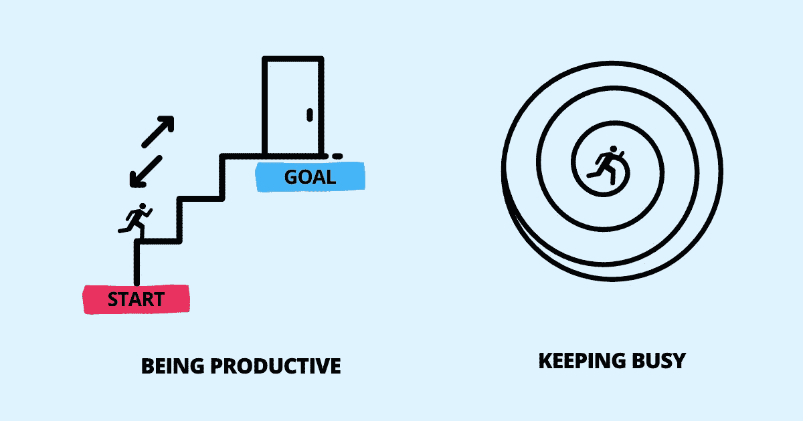

# 你一直很忙还是很有效率？

> 原文：<https://betterprogramming.pub/are-you-keeping-busy-or-being-productive-4571f40468a0>

## 生产力不是基于你投入的小时数；是创造价值所花费的时间

鸣谢:作者

每天结束时你感觉如何？

希望你有更多的时间，或者很高兴你能善用时间。

因为做太多事情而筋疲力尽，或者因为做好几件事情而精力充沛。

对自己创造的价值没有清晰的认识，也没有充分了解它的成就感。

因无法控制自己的时间表而恼怒和沮丧，或因对自己生活的掌控感而冷静和沉着。

忙碌制造了一种生产力的假象。陷入“忙碌陷阱”会让你更难认识到生产力不是基于你投入的小时数；而是创造价值所花费的时间。

忙碌也是会上瘾的。它让你从做困难的事情时的不适中解脱出来——这些事情会让你前进，但需要你走出你的舒适区。那么，忙碌就是避免做你害怕或觉得特别难做的工作的完美借口。

神经可塑性及其对强迫症的应用领域的精神病学家和研究员杰弗里·施瓦茨说:

> “你现在做什么，你如何集中注意力，都会影响你的大脑及其连线。每当你反复避免某种明显的疼痛感觉时，你的大脑就会知道这些行为是优先考虑的，并产生想法、冲动、冲动和欲望，以确保你一次又一次地坚持做下去。
> 
> 它不在乎这个行为最终对你有害……这意味着，如果你一遍又一遍地重复同样的行为——不管这个行为对你有积极还是消极的影响——你会让与这个行为相关的大脑回路变得更强、更有力。"

一旦你接受忙碌是一种生活方式，你大脑的无意识部分就会接管。它学习你的行为和态度，以及你如何应对工作中的困境。长时间工作，接受每一个会议邀请，从不拒绝不再是你有意识地做出的决定。你的大脑会自动为你做出这些决定。

这就像晚上下班开车回家，却不记得他们是如何到达的。当你的意识在努力计划生活中的其他重要事件时，你的潜意识把你安全地带回家了。

没有时间停下来思考的自动驾驶不仅会导致糟糕的决定，还会对你的心理健康和个人幸福产生非常真实的影响。有意识地实践去除忙碌元素并用建设性的选择取而代之的行为，会让生活更有趣、更有成效。

这里有四种方法可以在不忙碌的情况下提高工作效率。

# 如何在不忙碌的情况下高效工作

## 分清轻重缓急

当你不知道自己想要什么，或者没有明确的优先顺序时，你的注意力会被分散，而不是集中精力。做太多事情可能会让你忙个不停，但当这些活动与你的目标不一致时，它们既不会带来满足感，也不会带来成长。

短期来看，忙碌可以带走没有明确目标的痛苦。然而从长远来看，这种盲目的生活方式会伤害你的心理健康和个人幸福。你可能认为是太多的工作影响了你的健康和内心的平静，而没有意识到缺乏明确定义的优先事项是原因。

从忙碌到高效的转变需要意向性，而不是随波逐流，在事情出现时就去处理。知道你的优先事项会给你方向和决策权，让你知道什么时候说是，什么时候说不是。

> “开始时要有一个目标。心中有目标意味着从清楚地了解你的目的地开始。这意味着知道你要去哪里，这样你才能更好地了解你现在在哪里，这样你迈出的步伐才会始终朝着正确的方向。”—斯蒂芬·R·科维

他补充说，“当我们真正知道什么对我们来说非常重要时，我们的生活会变得多么不同，并且记住这个画面，我们每天都努力做真正重要的事情。如果梯子没有靠在正确的墙上，我们每走一步都会更快地到达错误的地方。”

忙碌是过着没有目标的生活。富有成效需要目标明确。培养对你的目标和前进方向的意识会让你轻松地停止忙碌，开始变得富有成效。

## 预闭塞时间

当你处于自动驾驶状态时，所有的良好意愿都会消失。从一个问题转到下一个问题，从一个会议转到另一个会议，从一个危机转到下一个危机，这样就没有时间处理重要的优先事项了。

根据帕金森定律，功的膨胀是为了填满完成它的时间。当你对自己的时间没有目标时，你一定会用无关紧要的活动来填满它，让你在一天结束时筋疲力尽(因此很忙)而没有增加价值。

富有成效需要赋予你的意图以生命。你需要采取行动。一个很好的策略是创建实现意图。

心理学家、目标和计划如何影响认知、情感和行为的研究者彼得·戈尔维茨(Peter Gollwitzer)将实施意图描述为预先制定一个计划，说明你打算在何时何地采取行动。

换句话说，当情况 x 出现时，我会做出反应 y。研究表明，只要简单地写下一个计划，具体说明你打算在何时何地采取行动，你就更有可能坚持到底。

实施意图=我将在[地点][时间]进行[行动]。

例如:

*   周一、周三和周五上午 9 点至 11 点，我会在会议室研究新产品策略。
*   周一至周五上午 11 点至下午 2 点，我会在办公桌前编写一个新功能。
*   我将在周一和周二下午 3 点到 6 点在自助餐厅准备技术演示。

一旦确定了实施意图，就要在日历上预先安排好时间。在日历上为重要的活动预先安排时间，这样就不需要匆忙做出决定——这在大多数情况下会导致糟糕的选择——而是在时间到了的时候再去做这些活动。

> “腾出时间是一个框架，让你选择想要关注的事情，积累精力去做，打破默认的循环，这样你就可以开始更有意识地对待你的生活方式。即使你不能完全控制自己的时间表——我们中很少有人能做到——你也绝对能控制自己的注意力。”—杰克·纳普

## 优化会议时间

如果你的日历上排满了[接连不断的会议](https://www.techtello.com/too-many-meetings-at-work/)，你肯定会很忙。你的角色可能实际上要求你参加很多会议，但是仔细看看，所有那些会议真的值得你花时间吗？

包装好的日历让你觉得自己很重要；他们让你感到被重视。你可能会对自己说:“我太忙了。我有重要的事情要说和做。我必须增加价值。”

但是 80/20 法则(也称为帕累托原则)在这里适用——只有 20%的会议产生了 80%的结果。理查德·科赫这样解释 80/20 原则—

> “80/20 原则认为，少数原因、投入或努力通常会导致大多数结果、产出或回报。从字面上看，这意味着，比如说，你在工作中取得的 80%的成就来自于花费的 20%的时间。因此，出于所有实际目的，五分之四的努力——它的主要部分——在很大程度上是不相关的。这与人们通常的预期相反。”

想象一下，如果你能减少那微不足道的 80 %,并加倍努力于那实际增加价值的 20%,你会有多大的生产力。

不要仅仅因为别人邀请你就参加会议，也不要安排可以通过电子邮件、聊天或电话讨论和解决的事情的会议。

更少的会议不仅减少了你日程上的负担，还给了你做高质量工作所需的精神空间。当你无时无刻不在工作时，你疲惫的大脑无法处理新信息；你不能做出好的决定。

要停止忙碌，开始高效工作，看看你的日历，按照以下步骤去做:

1.  代表:确定哪些会议值得参加。这些会议只有你能做吗？您可以[委托](https://techtello.com/how-to-delegate-work-effectively/)参加哪些会议？还有谁能取代你的位置？
2.  哪些会议是不需要的？把它们删掉。
3.  减少:你的哪些会议超过 30 分钟？为什么他们需要这么多时间？你是否有每周或每两周一次的会议，其频率可以减少？
4.  参加:突出那些绝对重要的，只有你能参加的。

最初几次做这项活动可能会令人畏缩。不要放弃。经过几天、几周、几个月的重复，你自然会变得擅长。这也将为你节省大量的时间。

## 做一个现实检查

最后，为了提高，你需要衡量你做得怎么样。

你对自己的认知可能不是现实。确定你需要改进的地方需要大量的工作。指出自己的缺点并不总是容易的。不要依赖你的直觉，用数据来衡量你的效率。

一个很好的策略是给你的日历标上颜色。用这些颜色把你的时间分成不同的类别(你也可以用不同的颜色):

1.  绿色:所有[重要，但不紧急的任务](https://www.techtello.com/eisenhower-productivity-matrix/)。花在与你的长期目标一致的任务上的时间。
2.  橙色:所有重要和紧急的任务。花费在危机管理上的时间。
3.  黄色:所有不重要但紧急的任务。花在按照他人定义的优先级行事或实现他人期望上的时间。
4.  红色:所有不重要也不紧急的任务。花在做根本不该做的工作上的时间。

通过对你如何度过时间进行颜色编码，你可以看一眼日历，确定你的大部分时间都花在了哪里——做让你前进或让你忙碌的工作。

忙碌变成了一种生活方式，除非你注意。通过遵循这四个实践——定义你的优先事项，预先安排时间，优化会议时间，进行现实检查——你的工作可以有意义和影响力，而不会对你的心理健康和个人福祉造成损害。

# 摘要

1.  忙碌制造了一种生产力的假象，它消耗了你的时间和精力，却没有让你前进或增加价值。
2.  当你不知道自己想要什么，或者没有明确的优先顺序时，你的努力会分散到太多的方向。分散在太多的地方会让你筋疲力尽，却无法创造价值。
3.  富有成效需要意向性。这需要有目的地为有用的工作腾出时间，减少无关紧要的活动。为此，在您的日历上设置实施意图和预封锁时间。
4.  优化你的会议时间，把它们分成四个部分——委派、整理、减少和参加。
5.  根据工作类型(紧急的和重要的)给你的日历标上颜色，用它来将感知与现实相匹配。衡量你做得如何是改正和提高的唯一方法。

在 Twitter 上关注我，了解更多故事。

*这个故事最初发表于*[*【https://www.techtello.com】*](https://www.techtello.com/are-you-keeping-busy-or-being-productive/)*。*