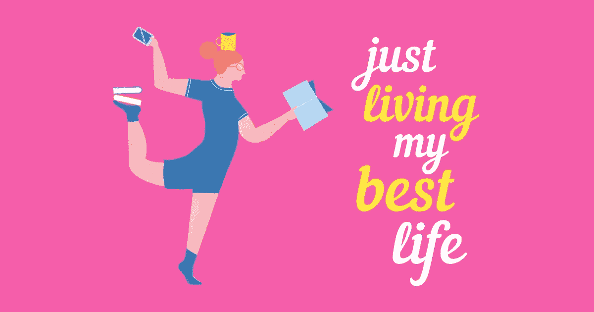

# 如何让你的工作和生活平衡为你服务

> 原文：<https://betterprogramming.pub/are-you-living-your-best-life-d74e812faddb>

## 6.使用反馈回路来适应

鸣谢:作者

在我们人生的每个阶段，工作与生活的平衡都是一场斗争。当我们刚刚起步的时候，我们把所有的精力和醒着的时间投入到事业中来证明自己，然后随着我们的成长和承担更多的责任，我们继续把越来越多的时间投入到工作中。

对未实现的个人承诺的思考让我们在工作中分心——当在家时，我们的思想仍然被工作占据。推进我们事业的渴望，以及没有追求其他给我们生活增添意义的目标的负罪感，让我们不断在工作和家庭之间发生冲突。这种冲突有多种形式:

*   当提前下班时，我们担心组织中的其他人工作更努力，而我们却没有
*   当我们不工作时，我们会感到焦虑
*   我们无时无刻不在回复邮件和信息，没有和家人共度美好时光，也没有做我们喜欢的事情
*   我们强调，当我们把所有的时间都花在工作上时，没有和孩子建立情感联系
*   离开工作的每一刻都感觉离我们的晋升只有一步之遥
*   在参加我们孩子的篮球比赛时，我们一直在想我们刚刚错过的会议
*   出差时，我们会对离家时间感到内疚
*   当我们和家人一起度假时，我们想念办公室里所有的活动

当我们每天都在努力将我们的思想从工作中分离出来，并在精神上和身体上为我们生活中的其他特殊时刻做准备时，我们觉得我们的生活正在以非常快的速度流逝，没有足够的时间来完成每一件事。我们需要做出选择——但这个选择并不容易。

工作真的永无止境。当我们回复一封邮件时，我们的收件箱里还有三封邮件在等着我们。当我们解决了工作中的一个危机，通常会有另一个危机潜伏着。在解决一个问题的同时，我们还发现了其他多个需要解决的问题。似乎每件事都需要我们的关注:不断涌出的松散信息，需要持续反馈的团队，不久的将来的某个截止日期，我们从未开始的项目，我们没有实现的结果，计划下一件大事，处理困难的对话，等等。

我们努力避免因做得不够而带来的压力和焦虑，很快“永远在线”的心态就会对我们的身体产生影响。我们的健康状况下降，我们感到筋疲力尽，甚至可能会精疲力竭。

雷曼兄弟前首席财务官艾琳·卡兰在 2013 年纽约时报[文章](https://www.nytimes.com/2013/03/10/opinion/sunday/is-there-life-after-work.html)中写道:

> “工作总是排在第一位，排在我的家庭、朋友和婚姻之前——婚姻在几年后就结束了。我不知道如何评价我是谁和我做了什么。我所做的就是我自己。我一开始并没有把自己的全部精力投入到工作中去。随着时间的推移，它慢慢地出现了。每过一年，轻微的修改就成了新常态。首先，我在周日花了半个小时整理我的电子邮件、待办事项和日历，让周一早上更轻松。然后我在周日工作几个小时，然后一整天。我的界限消失了，直到剩下的只有工作。”

回首往事，她意识到事情本不必如此:

> “从早上的第一分钟到晚上的最后一刻，我都不用守在黑莓手机上。我不必在办公桌上吃大部分的饭。我生日那天不用连夜飞去欧洲开会。我现在相信，我本可以去一个类似的地方，至少有更好的个人生活。”

# 工作与生活平衡的奥秘

许多人认为没有所谓的工作-生活平衡——只有生活平衡，因为工作只是我们生活中重要的一部分。其他人称之为工作生活融合或工作生活一体化。毕竟，我们的工作，以及我们生活的其他方面。定义了我们作为一个人是谁。

这篇文章的重点不是争论它应该叫什么。那不重要。重要的是你是否发现了对你来说什么是重要的，然后在对你真正重要的事情之间找到平衡。

工作和生活并不是想象中的两个对立面，你迫切希望达到五五开或六五开。工作与生活的平衡仅仅意味着能够做你真正关心的事情。这是对你的生活负责，而不是责怪你的组织或你的处境，感觉自己有能力过你想要的生活。

你是否看着别人，想知道他们是如何做到这一切的:他们是如何设法完成这么多工作，并努力实现他们所拥有的？但是，你们的生活不一样，你们也不想要同样的东西。生活本来就很复杂，什么都做不是解决办法:做正确的事情才是。它需要有目的地行动，而不是对你遇到的事情做出反应。它是很好地了解你的目标，定义你的优先事项，然后根据这些目标和优先事项调整你的行动。它在问你自己:“我想要什么样的生活，我需要做什么来为自己建立这样的生活？”

工作生活平衡的问题不在于更多的工作；这是关于在你所做的事情上保持高效。如果你在效率低下的时候还继续工作，你就没有真正增加价值，只是为了取悦他人或让自己忙碌而工作。

阿里安娜·赫芬顿是《赫芬顿邮报》的联合创始人，也是《T2》的创始人，她于 2007 年 4 月 6 日因睡眠不足和疲惫而倒下，摔断了颧骨，醒来时倒在血泊中，她在她的书《茁壮成长:重新定义成功和创造幸福、智慧和奇迹的第三个标准》中写道:

> “我们错误地认为，成功是我们投入工作时间的结果，而不是我们投入时间的质量。”

不要放弃你的生活，等待神奇的一天到来。现在就控制它。总会有一些障碍，为了最终获得你想要的生活，还需要做更多的事情，但是知道这些障碍也是你生活的一部分可以帮助你现在就开始，就在此时此刻。

# 工作-生活平衡战略

> “工作与生活的平衡、工作与生活的有效性、个人和职业的满足感——或者无论你选择怎么称呼它——都不是一种权利或福利。你的公司不能给你。你必须为自己创造。你个人有责任尽你所能过上最好的生活。”
> 
> ——失衡中的马修·凯利

想想你目前过的生活和你想要的生活。你的行为如何符合你想要的生活？承认生活的局限性，接受一切都不会尽善尽美，但通过不断的练习，你可以将生活中更大的部分与你的优先事项相匹配。

遵循以下六个策略来重塑你的生活:

## 1.学会应对自我施加的压力

你认为你需要一收到邮件就回复，参加最后一分钟的会议，即使你答应了你的女儿要参加她的学校演出，在和朋友和家人吃饭的时候不停地查看你的手机，在周末努力赶上工作进度，因为工作日没有足够的时间，并且为了赶上最后期限而工作到深夜？

是工作场所的要求造成了这种不平衡，还是你自己对自己应该如何表现的期望？想一想。是你自己给自己制造的内在压力吗？是别人真的期望你这样做，还是这都是你自己的想法？

> “进化塑造了我们的大脑，因此我们天生就会遭受心理上的痛苦:比较、评估和批评自己，关注我们所缺乏的，迅速对我们所拥有的感到不满，想象各种可怕的场景，其中大多数永远不会发生。难怪人类很难快乐起来。”
> 
> ——拉斯·哈里斯，《幸福陷阱》

**如何应对自我施加的压力**

观察你的行为，每当你发现自己正努力脱离工作，需要恢复工作与生活的平衡时，问问自己:

*   这是自己设定的最后期限吗
*   你这样做是因为这样做是对的还是别人要求你这样做
*   是你自己的期望在驱使你思考吗
*   你是否对自己过于挑剔和评判
*   如果你现在不这样做，会发生什么

对工作的奉献并不意味着一直都在，而是承诺无论何时你开始工作，都要做到最好。这是通过创造有意义的结果来增加你生活的价值，而不仅仅是生产。

现实地说，你可能是一个工作环境的一部分，在那里人们被期望像机器一样工作。如果你正好在其中，你需要问问自己这是不是适合你的地方。从长远来看，你真的想成为这个机器的一部分吗？知道这是一个选择。

## 2.定义界限，然后坚持它们

如果你在有竞争优先权需要你注意的时候匆忙做出决定，你最终会优先考虑你的工作。我们都做过。晚上多呆几分钟很快就会变成额外的一个小时，周末快速回复一封邮件会消耗掉你自己需要的时间。在你意识到之前，它已经成为你生活方式的一部分。你最终会取消每月一次的朋友聚餐，翘掉瑜伽课，错过家庭活动，甚至在生日那天也工作到很晚。

没有明确的界限，很容易陷入一直工作的陷阱。当你没有花时间去定义你真正想要的是什么时，你就没有努力去做正确的事情。每一步的[决策](https://www.techtello.com/decision-fatigue/)都是一个很大的障碍，帮助你区分什么需要优先处理。

最重要的是，当你从你真正重视的事情上溜走时，你会有把它们推到一边的持续的罪恶感，并且觉得你不能控制自己的时间。内疚影响你的工作，而工作影响你想要的生活。工作与生活的不平衡会对你的身心造成伤害。

**如何界定界限**

为了达到工作与生活的平衡，第一步是定义你的个人和职业目标。如果你只定义你在职业上需要什么，而把个人目标当成是需要额外照顾的事情，那就永远不会成功。相信我:如果你不花时间定义你的个人目标，很容易把它们推到一边，希望有一天你会实现它们。现在，需要你关注的是你的工作。但是，根据经验，我们都知道这一天永远不会到来。

接下来，花时间实际规划你需要如何分配时间来实现这两个目标。你应该什么时候开始工作？你什么时候需要结束它来投入时间做其他事情？你应该什么时候上床睡觉？你早上需要什么时候起床？如果锻炼是你的目标，那么一天中的最佳时间是什么——清晨还是傍晚下班后？如果健康饮食是你的目标，你应该什么时候储备合适的食物并做一些准备工作，以便在合适的时间为你提供健康的食物？如果没有计划，你会被工作填满，并陷入吃不健康食物或不锻炼的旧习惯。

> “当你第一次坐下来思考你的未来目标时，记得把你的核心价值观和生活重点放在手边作为参考点。只要你的价值观和优先事项仍然有效，它们就应该是指引你目标的指南针。否则，你的未来将充满挫折和不快。”
> 
> — S.J. Scott 在《整理你的思维:如何停止担忧，缓解焦虑，消除负面思维》中

认真对待自己的界限，但不要死板。生活是杂乱的，你需要处理生活抛给你的不规则性。你有时需要调整，但是要意识到这些调整。很快，例外就会成为常态。灵活应对工作中的紧急需求应该是一种例外，而不是惯例。一旦你有了一个做这些决定的框架，就很容易知道你什么时候破例，以及它是否是出于正确的原因。

定义边界的另一个重要方面是传播你的边界。如果工作中和你生活中的人不了解他们，他们不能帮助你坚持他们。与你的经理谈论它们，与你的团队讨论，与你的家人和朋友交谈。这将有助于他们理解你的优先顺序，以及你为什么对某些事情说不。不告诉他们会导致不必要的冲突。

## 3.保持注意力集中，控制注意力分散

大多数时候，消耗你时间的不是工作，而是你缺乏专注于手头任务的个人自律。不断查看通知、浏览互联网和回复电子邮件可能看起来像是工作。但是，它们真的会让人分心。如果你经常分心，你会花更长的时间来完成工作，然后归咎于没有时间做生活中的其他事情。

学会管理分心的事物是创造工作与生活平衡的最大辅助工具。当你远离干扰，专注于你的工作时，你能够在更短的时间内达到同样的产出，为其他事情留下更多的空间。这是恢复你渴望的平衡的重要一步。

> “分心不只是令人沮丧；它们会让人精疲力尽。当你回到原来的位置时，你保持专注的能力会进一步下降，因为你现在可用的葡萄糖更少了。每小时转换 10 次注意力(一项研究显示办公室里的人一小时转换 20 次)，你的有效思考时间只是可能的一小部分。更少的能量意味着更少的理解、决定、回忆、记忆和抑制的能力。结果可能是在重要任务上出错。或者分心会让你忘记好的想法，失去有价值的洞察力。有了好主意却记不住会让人沮丧，就像挠不到的痒，又是一个需要处理的干扰。”
> 
> —大卫·洛克在你的大脑中工作

**如何管理分心的事物**

我们已经讨论了目标和规划。没有明确的目标和实现目标的适当计划，你很容易分心去做没有附加值的工作。

下一步是整理你的工作环境，远离干扰。关闭通知，安排时间查看电子邮件或浏览社交媒体，在做需要你全神贯注的工作时远离手机，找一个安静的角落专注地工作，照顾好你的身体需求，比如吃好、睡好和锻炼。当你累了或饿了，抑制是困难的，更容易陷入分心。通过照顾你的健康，当你开始工作时，你可以把这些干扰留在门外。

一旦你学会保持专注，你将不再担心花太多时间在工作上，因为你会意识到你真的不需要那么多时间来实现你的目标。有意义的创作不需要更多的时间，它需要远离杂念的时间。

## 4.现实一点，正确安排事情的优先顺序

很多不平衡的情况发生是因为你试图把每件事都放在优先位置，然后努力把它做得完美。任何不完美的事情都意味着你没有把工作做好。

> “时间管理技巧、生活技巧、睡眠技巧、工作技巧。这些都反映了试图从一天中挤出更多时间的困扰，但重新安排你的日常模式以找到更多的工作时间并不是问题。问题是要做的事太多了。”—杰森·弗里德

试图在一天中挤出太多事情，为自己设定不切实际的高标准，会让你无法实现有意义的目标，让你纠结于工作中不相关的缺陷，让你无法继续其他任务。

**如何保持现实**

确定对你最有意义的优先事项。调整你的身心去做 3-5 件最重要的事情，避免做清单上的其他事情。选择质量胜于数量。在这篇文章中，詹姆斯·克利尔解释了沃伦·巴菲特的优先化策略。他提到了“不惜一切代价避免清单”,本质上，这是你优先清单上的事情，但不是你的五大目标。他建议:

> “无论如何，这些事情都不会引起你的注意，除非你成功地完成了前 5 项任务。无情淘汰。强迫自己专注。”

一旦你放弃了什么都要做的态度，学会了对那些对你来说不是最重要的事情说不，你就可以实现你想要的工作与生活的平衡——同时还能在个人和职业目标上取得成功。如果留下来完成一个项目对你来说很重要，那么不要因为错过朋友的聚会而自杀。如果你因为你儿子的考试而不能去公司，那么你一定要告诉自己这是你做出的选择。

另一个创造平衡的策略是学会授权。不要试图什么都亲力亲为。需要的时候寻求帮助。明确什么是你可以委派的，什么是必须由你完成的，可以帮助你保持现实。

与其追求完美，不如学会过得足够好。

## 5.照顾好你的身心

我再怎么强调这个因素的重要性也不为过。你睡得少，不吃饭，吃不健康的食物都是为了节省时间。你认为会帮助你实现更多的时间。虽然你可能在短期内看不到这些选择的负面影响，但从长远来看，你的身体会放弃，让你慢下来。

疲惫的身心无法应对日常工作和生活中的优先事项。如果不去关注它，你可能会花更多的时间去做那些会让你朝着目标前进的真正的工作。

**如何照顾自己的身心**

每天多节省一个小时，把睡眠时间从 6 个小时增加到 7 个小时，多花几分钟准备一顿健康的饭菜，每天花一小部分时间锻炼，这些好处会随着时间的推移而增加。有了一个充满活力的身心，你会发现用大量的精力去完成手头的任务是很容易实现你的目标的。

不要依赖你的意志力，提前做这些决定，不断提醒自己它们的重要性，确定有助于轻松完成任务的常规，并围绕你的优先事项制定时间表。

为了你自己好，不要让工作与生活的平衡变得额外复杂。只有当你停止找借口并开始实施正确的策略时，实现健康的身心才完全在你的掌控之中。

## 6.使用反馈回路来适应

工作与生活的平衡不是一件你可以从你的待办事项清单上划掉，然后就再也不用去想它的事情。这不是最终状态。这是一个旅程，你需要走自己的旅程。利用过去的反馈是做出改变的最简单的方法，这将帮助你在对你来说重要的事情上取得平衡。

如果你不努力反思你过去是如何做的，你就不能为你的未来实施更好的策略。

**如何使用反馈回路进行持续改进**

找出你做出错误决定的地方。想象那些时刻，想想你为什么做出那些决定。

问问你自己，你是否真的在花时间做对你来说重要的事情，或者优先事项清单只是为了帮助你自我感觉良好。

留出时间做这件事，否则它也会退居二线——就像你清单上的其他事情一样。你的优先事项会随着时间的推移而改变，对你在优先事项上的表现进行审核将有助于你更接近现实，而不是带着有一天能实现工作与生活平衡的错觉生活。

## **总结**

工作生活平衡不是你需要达到的一种状态；这是一个每一步都做出正确选择的旅程:

1.  学会应对自我施加的压力:知道什么时候是工作场所的需求造成了不平衡，什么时候是你自己给自己造成的内部压力。
2.  定义界限，然后坚持:当你没有花时间去定义你真正想要的是什么时，你就没有努力去做正确的事情。明确界限。不要陷入一直工作的陷阱。
3.  保持注意力集中，控制注意力分散:大多数时候，不是工作消耗了你的时间，而是你缺乏专注于手头任务的个人纪律。组织好你自己和你的工作环境，保持注意力集中。
4.  现实一点，正确安排事情的优先顺序:试图在一天内安排太多事情，给自己设定不切实际的高标准会阻碍你实现有意义的目标。放弃什么都做的态度，只做你最优先考虑的事情。
5.  照顾好你的身心:疲惫的身心无法应对日常工作和生活中的优先事项。与其依靠自己的意志力，不如设定套路，采用更好的习惯。
6.  使用反馈回路来适应:工作-生活平衡不是最终状态；这是一段旅程。反思你的过去，为未来实施更好的策略。

感谢您的阅读。