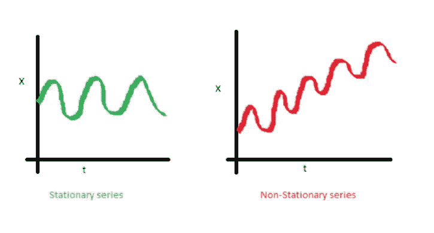
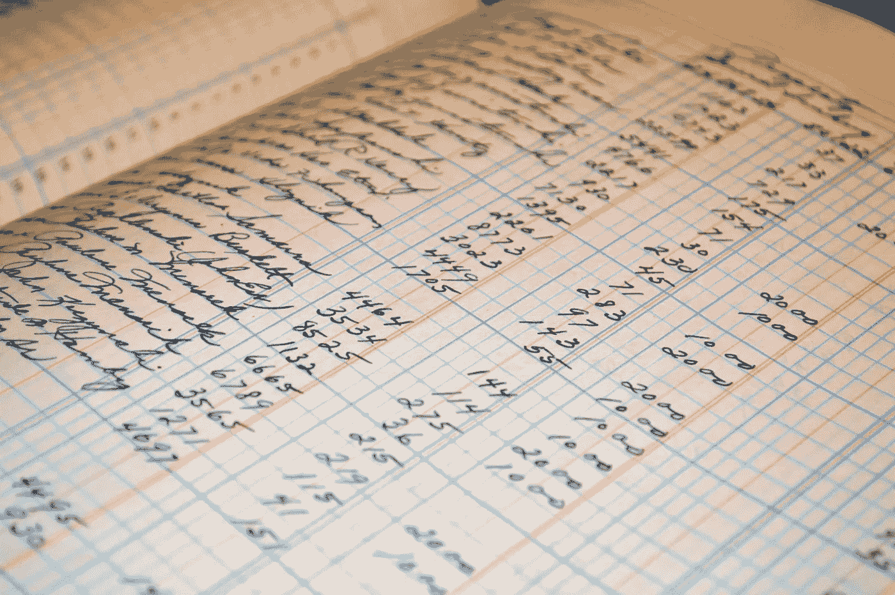

# 四个必须知道的预测模型词汇

> 原文：<https://betterprogramming.pub/arima-forecasting-vocabulary-ec9b09d55be7>

## 平稳性、自相关、随机和差分

Jelleke Vanooteghem 在 [Unsplash](https://unsplash.com/@ilumire?utm_source=unsplash&utm_medium=referral&utm_content=creditCopyText) 上拍摄的照片

准确预测成本、销售、用户增长、患者再入院等。是向董事提供可操作信息的重要一步。这可能很难手工或在 Excel 中建模。此外，使用传统方法，如移动平均线，可能无法提供对现实生活数据集中出现的各种趋势和季节性的足够了解。

使用像 [ARIMA 和 ETS](http://www.acheronanalytics.com/acheron-blog/arima-and-ets-forecasting-in-r) 这样的模型，通过考虑多种因素——如季节性和趋势——为分析师提供了更准确、更稳健的预测能力。

更好的是，像 R 和 Python 这样的语言使得分析师和数据团队可以更容易地避免他们通常必须手工完成的所有工作。这可以将开发模型的时间减少一半以上，并提高准确性。

然而，在任何编程语言中使用 ARIMA 模型之前，非常重要的一点是，数据科学家和分析师要专注于开发对统计概念的良好理解，以使 ARIMA 模型能够工作。

平稳性、自相关、随机和差异等概念只是数据团队为了更好地开发模型而需要理解的一些关键词汇。以下是其中的一些定义。

# 平稳性

使用 ARIMA 模型和许多其他时间序列模型时的一个重要概念是*平稳性。*

平稳时间序列是指具有一致的均值、方差和协方差的时间序列。简单地说，这意味着时间序列在某种程度上是可预测的。

然而，有一个主要问题。[这篇关于统计学的博文](http://www.statisticshowto.com/stationarity/)引用了 [Thomson (1994)](https://ieeexplore.ieee.org/document/389899/) 的一段话，很好地总结了这个问题:

> 然而，现实世界数据的经验很快使人相信，平稳性和高斯性都是虚构出来供大学生娱乐的童话

大多数时间序列都是非平稳的。这意味着随着时间的推移，时间序列的均值、方差和/或协方差会发生变化。非平稳时间序列很难预测，因为它们通常有其他变量，如白噪声，以及影响其输出的随机趋势。非平稳过程(时间序列)的一些例子是随机游走、有漂移的随机游走和确定性趋势。

*随机游走*指的是一个过程或时间序列，它等于上一个周期值加上某种形式的随机(白噪声)成分。这意味着这个组件是不一致和不系统的。

向随机游走添加漂移指的是添加一个常数分量，描述为 *α* 。从视觉上看，这可能导致正面或负面趋势的出现。股票有时被用作例子，因为它们的价格从前一天的最后价格开始，然后从那个位置移动。

虽然带有漂移的随机游走和确定性趋势看起来非常相似，但还是有区别的。随机游走是基于上一期的值回归的，而确定性趋势是基于时间的。

典型地，该增长随着时间是恒定的，并且包含某种形式的白噪声成分。这与平稳趋势不同。当趋势分量可以从时间序列中抽出，而留下的分量是静止的时，就出现了平稳趋势。

趋势会给基本预测带来问题，因为它们通常会导致模型低估模型。例如，如果正在使用的方法是移动平均法，那么平均值将经常低估下一个值——即使使用移动平均的季节性变化——因为不断增加。

这就是 ARIMA 模型组件的用武之地。

# 自相关

*时间序列预测中的自相关*是指一个观测值本身与时间序列中另一个观测值之间的相关性。时间序列中的这些不同观察值被称为*滞后，*并且自相关可以发生在当前滞后和先前滞后之间——或者甚至滞后于当前滞后几个月和/或几年。

举个例子，想象一下，如果有一年渔民在捕鱼季节过度捕捞鲑鱼。更有可能的是，下一年的鲑鱼季节会受到今年的影响。由于过度捕捞，捕获的鲑鱼总数可能会少得多。这是一个两个滞后的例子，可能相隔一年，但自相关，因为一个影响另一个的产出。

这是 ARIMA 建模中的一个重要概念，因为它会影响在最终的 [ARIMA(0，0，0)](https://machinelearningmastery.com/arima-for-time-series-forecasting-with-python/) 模型中考虑多少先前的观测值。这将开始更多地进入数学方面，因为它开始引用应该考虑多少个以前的滞后，以及每个以前的滞后将乘以什么系数。

# 随机的

*随机*是一个术语，如果你习惯于处理代数的整洁，它会非常令人困惑。通常，如果您将相同的参数集放入一个流程或函数中，您会得到相同的输出。

例如，如果你有一个 *x = 2* 并且有等式 *x+2=y，*，那么你知道输出将总是 *4* 。

对于随机过程，插入系统的参数可能是相同的。但是，输出多少有些随机。随机过程通常会有某种形式的输出正态分布，但它仍然是随机的。当涉及随机变量时，很难准确预测未来值。通常，这个[变量](https://en.wikipedia.org/wiki/Random_variable)作为一个常数被添加到最终的 ARIMA 方程中。

# 区别

当处理非静态数据时，尝试创建静态数据集的解决方案之一是使用*差分。*差异有助于稳定平均值并消除随机趋势。这和求导非常相似。现在模型不是关注实际产出，而是关注过程的变化。

差异包括获取当前值和先前值，并找出差异。因此，您现在不是在计算最终的美元金额或数量，而是在计算增量。这可以消除一些非恒定因素和白噪声。

这种差分过程可以多次进行(当然，有一些限制)，以帮助使数据稳定。这将在第二个 0 处具有 1 的 ARIMA(0，0，0)模型中进行符号化。

最终结果将类似于 ARIMA(0，1，0)。这意味着数据集曾经被差分。如果是两次，那么模型将描绘 ARIMA(0，2，0)。

差异只是可用于帮助将数据集转换成静态数据集的可能转换之一。这是最容易实现的。

# 结论

在开始学习 R 和 ARIMA 模型之前，理解这些工具所使用的统计概念是很重要的。

这将有助于开发模型，因为当您获得输出时，您将更容易调整模型参数和数据集。此外，它为分析师和数据科学家提供了更好地向他们的主管解释输出以及解释可能发生的任何差异的能力。

一旦一个团队开发了一个可靠的 ARIMA 模型，进入基于驱动因素的模型就容易多了，因为分析师可以开始关注通常由外部因素引起的随机噪音，如新产品、加班、新员工等。