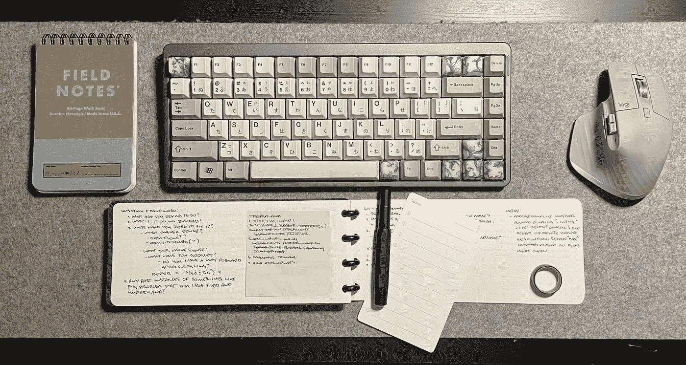
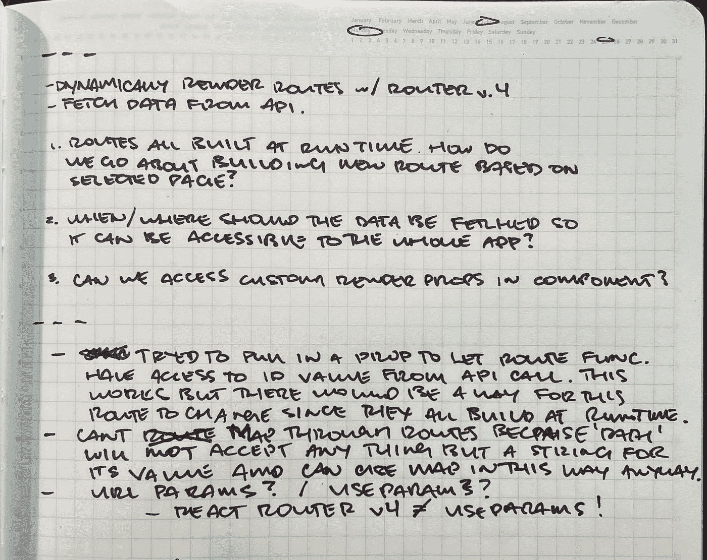
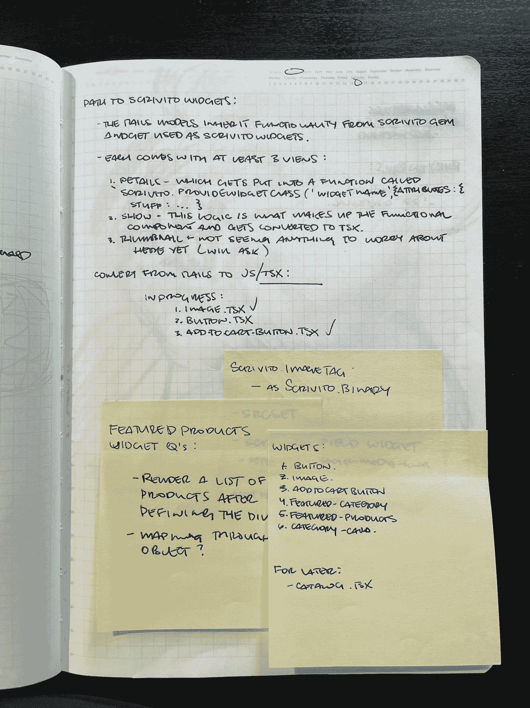

# 提问:拥有你的好的艺术

> 原文：<https://betterprogramming.pub/asking-questions-the-art-of-owning-your-okayness-775ab780e5e>

## 帮助您提出更好的问题并更快前进的提示

照片由 [Unsplash](https://unsplash.com?utm_source=medium&utm_medium=referral) 上的[哈迪贾·赛义迪](https://unsplash.com/@hadijasaidi?utm_source=medium&utm_medium=referral)拍摄

初出茅庐很可怕，尤其是在科技领域。我记得在我的第一个项目中，我的任务是协助交付一个设计系统。我已经很紧张了，因为我周围都是经验丰富的工程师，而我，另一方面，完全是新来的，是自学的。

很自然地，在最初的几次会议中，我花了大部分时间疯狂地写笔记，并编制了一份术语和概念的清单，供我以后研究。我需要学习和努力的东西太多了。Storybook.js 是什么？为什么我在设置本地环境时会出现这么多错误？我从未处理过这么大的代码库——我应该从哪里开始呢？！思考这些问题比实际提问要容易得多。

# 提问的困难

在深入研究如何提问之前，我认为重要的是要认识到为什么提问会如此困难。对我来说，很简单:我不想听起来很愚蠢。害怕问一个会得到类似“你真的不知道吗？”的回答的问题会让我停下脚步。当我们利用集体知识而不是仅仅依靠自己的经验时，我们会做得更好。

采纳我自己的建议，我联系了该项目的另一位工程师。但是当我开始问我的问题时，出现的是一个完全精神错乱的思路。它从杂乱无章的陈述变成了紧张的漫谈。在我的头脑中，我知道我的问题和我的方法不起作用的一些原因。用语言表达我的问题很难，所以我创造了一种方法来帮助我毫无压力地准备、提出和处理一个问题(及其解决方案)。

# 该方法

准备是问好问题的关键。它还帮助我面对不知道解决方案的焦虑。把事情写下来是这个方法的关键，所以拿本日记试试这个方法。它不仅可以帮助你避免再次问同样的问题，而且你可以获得知识，为将来更好的思考过程提供信息！

作者图片

定义问题。在试图完成一项任务时，你可能掉进了一个兔子洞，让你误入歧途。从定义问题开始。问问你自己你在努力做什么，然后写下你的答案。

列出你已经尝试过的解决方案。重要的是要知道你已经尝试过什么样的解决方案，以及为什么你认为这些方法可能有效。列出出现的问题，然后问问你自己你做了什么来试图解决它们。写下你对每个问题的答案。

作者图片

使用您的笔记来演示。当你有你的问题和你尝试过的解决方法时，把它们呈现给你寻求指导的人。用你的笔记简洁明了地追溯你的步骤。

提出澄清性问题。一旦你得到了答案，停下来把它写下来。确保你不仅明白解决方案是什么，而且明白它为什么有效。尝试向你的合作者解释解决方案和原因，以确保你已经掌握了它。你也可以利用这段时间提出任何可以让解决方案“更干净”的建议

说谢谢！现在你站在了另一边，变得更聪明，少了一个需要解决的问题。一定要感谢你的合作者的时间和理解。

作者图片

# 拥有你的好

如果做得好，提问更像是合作，而不像是单向的信息交流。例如，当我被问到一个问题时，解释我的思维过程有助于我更好地理解我的解决方案。

即使有了这个指南，和同事开始对话可能也很难，很容易让人觉得你在纠缠他们。当我团队中的人主动帮助我时，我经常提醒自己，他们是自愿伸出援手的。一定要接受他们的提议。随着时间和练习会变得更容易。

别误会，做个谷歌搜索高手超级有帮助，自给自足才是目标。无论如何，花时间自己探索解决方案。但是如果你发现自己很迷茫，需要方向，记住:不知道一切没关系，问问题也没关系。希望这种方法能让交流想法变得更容易。

*原载于 2022 年 8 月 3 日*[*【https://postlight.com】*](https://postlight.com/insights/asking-questions-the-art-of-owning-your-okayness)*。*