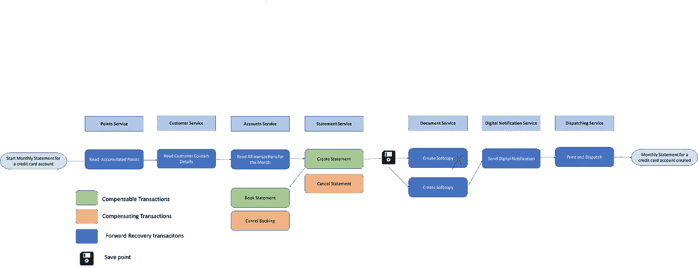
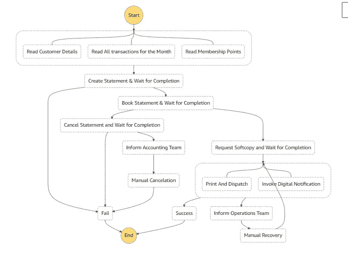

# 异步通信—创建原子工作流

> 原文：<https://betterprogramming.pub/asynchronous-communication-creating-atomic-workflows-4ce997e2ac6e>

## 如何在物理分布、时间分离的系统中构建原子工作流？

约翰·施诺布里奇在 [Unsplash](https://unsplash.com?utm_source=medium&utm_medium=referral) 上的照片

原子性——一个粗略的定义可能是“要么全部要么什么都没有”。

这意味着涉及多个步骤的业务操作/任务应该作为一个单元来执行。要么所有步骤都正确执行，要么在出现任何错误的情况下，让系统保持干净的状态，就像什么都没发生过一样。

而原子性很容易用更新数据库中的记录(在事务范围内)的单进程应用程序来实现，因为数据库引擎确保了事务的原子性。

随着我们的任务从单进程应用程序转移到多进程应用程序，确保原子性的复杂性开始显现。当我们处理分布式流程时，它会增加几倍，在这种情况下，流程和基础结构可能超出我们的控制。

我们所讨论的错误包括从业务错误(未配置的特定情况)和基础设施错误到应用程序错误。

处理这种可能性的方法是接受失败，并通过实现恢复机制为失败做好准备。

在分布式事务的上下文中,“两阶段提交”模式经常出现，为了排除它作为一种可能的解决方案，我想快速地讨论一下它。

原则上，它通过获取每个参与者的锁来工作，作为阶段 1。一旦所有参与者都获得了锁，那么阶段 2 就是实际的提交阶段。

两阶段提交—显示为反模式

在异步系统中，它变成了一个反模式，因为锁产生了耦合。在上图中，服务 A 获得了一组记录的锁&直到服务 C 参与事务的意愿得到确认(或者直到锁超时)，它才会释放锁。

即使服务响应足够快，随着请求数量、操作持续时间或参与服务的增加，这种方法也不能很好地扩展。它给系统带来了延迟，并增加了遇到服务间死锁的可能性。

此外，它不接受失败。如果我们开始考虑在分布式环境中什么可能出错&尝试用两阶段提交来减少所有这些可能性，留给我们的问题会比解决方案更多。

也许可以在一个简单、短暂的场景中明智地使用它，该场景只涉及几个服务，但是它不适合异步参与者&这当然是一个扩展的挑战。

如何在物理分布、时间分离的系统中构建原子工作流？

# **避免锁定、保存状态并实现恢复——传奇模式**

在 Saga 模式中，我们将工作流分解成可以自动执行的离散步骤。因此，我们不需要获得整个传奇的锁。

每个步骤都可以私下保存其状态，或者 Saga 可以实现保存点步骤。当故障确实发生时，这个保存的状态然后被用于执行恢复。

原来佐贺论文是[这里的](https://www.cs.cornell.edu/andru/cs711/2002fa/reading/sagas.pdf)。虽然它是围绕数据库操作编写的，但它讨论了向前恢复、向后恢复和混合恢复。因此，与现代微服务架构相关。

逻辑视图—回滚/向后恢复传奇显示为双链接命令列表。其中每个命令都具有执行动作和恢复动作的能力。

根据它如何影响系统的状态以及在失败的情况下可以做什么，一个传奇的每一步都可以被归类为以下之一。

1.  *可补偿交易*:这些可以通过启动补偿交易来撤销或取消。例如，客户支付的错误发票可以通过开具贷方票据来补偿。为了便于讨论，假设补偿交易本身失败了，在这种情况下，人工干预通常可以简化流程，比如发布人工贷方通知单。
2.  *幂等事务*:这些不会改变系统的状态。因此，可以多次执行。例如，读取数据、生成报告、转换给定的数据。
3.  枢纽交易:这些是故事的关键。当他们成功时，传奇中的任何后续交易都必须成功。在这样的事务之后有一个保存点是很有帮助的。

当创建一个关于微服务的传奇时，由参与的微服务来承诺其步骤的原子性。在服务支持补偿事务的情况下，补偿所需的数据可以由服务存储在其本地数据存储中，或者 Saga 可以存储该数据并在启动补偿事务时将其传递给服务。

saga 恢复的类型:根据步骤和业务的性质，我们可以通过构建以下恢复步骤来设计我们的 Saga

1.  向后/回滚恢复—当补偿事务是可能的，并且我们需要给出中止选项时(上面给出的逻辑视图)。
2.  前向恢复—当回滚事件不可行时，工作流必须完整。Saga 可以保存状态，以便从发生中断的步骤恢复，方法是重试或采用替代恢复块，或者期待手动干预。
3.  混合—在这种情况下，一些故障可能需要向后恢复，而其他故障可能需要向前恢复。

为一个帐户模拟一个假设的信用卡对帐单生成工作流。

实现 Saga:正如我们在讨论微服务之间的交互。一种可能性是实现与 Orchestrator 服务(如 AWS Step Function)的交互，其中每个建模的步骤都用失败路径显式实现(在源代码中)。

这非常有帮助，不仅可以很好地概述整个过程，还可以显示在任何给定时间正在执行的传奇的状态。

通过尽可能并行地运行任务，以及在继续之前等待基于事件的操作完成，来支持异步操作。

在 AWS 步骤函数中实现 Saga。

另一方面，如果有令人信服的理由选择更加分离的架构，比如在几个部门/团队之间分担责任，那么就有可能将传奇作为精心设计的传奇来实现。

在这种情况下，建模的传奇永远不会被显式地实现，相反，它是作为通过事件进行通信的服务的交互出现的。出于同样的原因，很难理解这个系统是如何运作的。

它也缺乏一个在任何给定时间的传奇故事在哪里的概述。通过开发/使用监控服务，可以在一定程度上缓解这种情况，该服务读取作为传奇的一部分发出的所有事件，并通过使用关联 id 形成一幅画面。

关于编排与编排的更多信息，我可以推荐这篇优秀的[文章](https://theburningmonk.com/2020/08/choreography-vs-orchestration-in-the-land-of-serverless/)，作者[崔琰](https://medium.com/u/d00f1e6b06a2?source=post_page-----4ce997e2ac6e--------------------------------)

我希望你觉得这篇文章很有用，如果你有任何反馈，请告诉我。

我为将来的文章保留的是传奇中可能出现的异常，以及如何对服务本身进行建模，以保证它们对传奇承诺的契约。