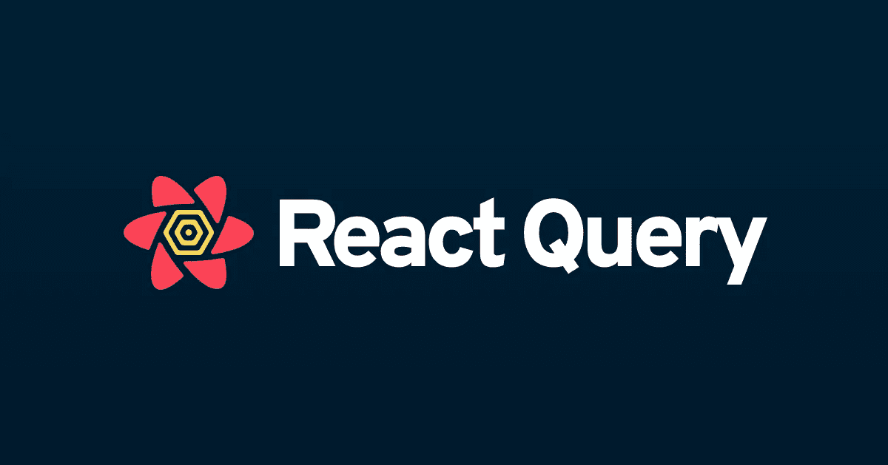

# 具有反应查询的异步状态管理

> 原文：<https://betterprogramming.pub/asynchronous-state-management-with-react-query-a9937457ed5e>

## 将我们的请求包装在`useQuery`中并使用缓存键意味着我们根本不需要考虑从网络请求中接收的数据的状态管理

花点时间想想您最新的 React 项目中的共享状态。对于大多数应用程序，这可能包括当前登录的用户。

博客应用可以包括所有可用的博客帖子或由特定作者撰写的所有博客帖子。

健身应用可以包括针对所选肌肉群的锻炼列表。

棒球应用可以包括特定运动员的击球统计。实际上，React 应用程序中的共享状态可以是任何东西！

但是所有这些国家有什么共同之处呢？我们通过网络请求访问它们(或者到我们自己的后端，或者到第三方 API)。

让我们看看如何使用定制钩子和 [react-query](https://react-query.tanstack.com/) 来管理这些来自异步网络请求的状态。

# 利用 useQuery 钩子

在我们的例子中，我们将大量使用 react-query 中的`useQuery()`钩子。这个钩子有三个参数—

1.  我们将发出的请求的缓存键
2.  查询功能
3.  一个选项对象。

对于我们所有的例子，让我们想象一个健身应用程序，它允许用户按肌肉群搜索锻炼。首先，让我们彻底了解如何使用`useQuery()`发出一个网络请求，从我们想象的 API 中获得所有的反馈练习。

首先，我们已经定义了查询函数`fetchBackExercises()`，它向我们假想的端点`/exercises?muscleGroup=back`发出请求。

我们可以想象这个端点将返回一个 JSON 形式的练习对象列表，可以在我们的 react 应用程序中使用它来创建一个列出练习的组件。

老实说，我觉得这有点乱。我希望我的组件尽可能地具有可读性，其中有大量的 JavaScript 代码，很难一看就知道发生了什么。让我们稍微重构一下，将所有的查询逻辑放入一个定制的钩子中。

这看起来更好！所有关于获取练习的网络请求的逻辑现在都封装在我们的定制`useExercises()`钩子中。

这个钩子接受一个参数`muscleGroup`，因此它可以在我们的应用程序中的任何地方轻松重用。

`muscleGroup` arg 既用在实际网络请求的查询参数中，也用在`useQuery`钩子的缓存键中，这将很快变得重要。

这允许我们简化我们的`<ExerciseList />`组件，这样我们所做的就是调用我们的钩子，并映射结果来创建我们的组件列表。

# 这对状态管理有什么帮助？

到目前为止，我们已经有了一个非常干净的、可重用的钩子和组件，但是这和状态管理有什么关系呢？答案就在 react-query 的缓存中。

记住`useQuery()`钩子的第一个参数是一个*缓存键*。通过`useQuery()`发出的每个网络请求的响应都用那个键保存在缓存中。

在发出请求之前，react-query 将检查缓存。如果缓存中已经存在相同的键，`useQuery()`将简单地获取缓存的响应并返回它，而不是浪费资源再次发出相同的请求。

从本质上说，这意味着 react-query 的缓存成为我们存储来自网络请求的任何状态的数据(对于大多数应用程序来说，这几乎就是一切！).

在我们的`useExercise()`钩子的例子中，许多不同的组件可以使用钩子来请求`muscleGroup: 'back'`的练习。实际的网络请求只会发出一次，随后每次调用`useExercises('back')`都会从 react-query 缓存中抓取响应。

我们要求的任何其他肌肉群也是如此(`useExercises('chest')`、`useExercises('biceps')`、`useExercises('legs')`等)。由于我们将`muscleGroup`参数传递到缓存键(`['exercises', muscleGroup]`)，每个新的`muscleGroup`将触发一个实际的网络请求，但是每个后续请求将使用缓存，就像它只是任何其他状态一样。

那么以这种方式管理我们的异步状态有什么好处呢？将我们的请求包装在`useQuery`中并使用缓存键意味着我们根本不需要考虑从网络请求中接收的数据的状态管理。

我们不需要担心上下文/提供者，我们*绝对*不需要担心任何第三方状态管理库。以这种方式管理异步状态允许我们保持干净、可维护、简单、可读的代码。