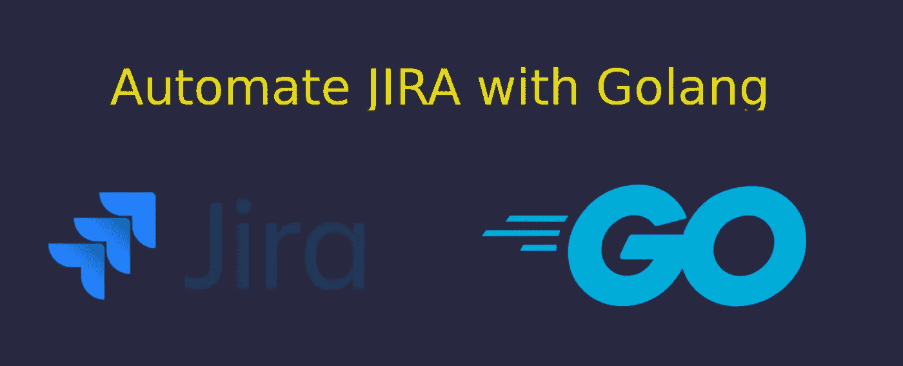

# 使用 Golang 自动化 JIRA 云工作流

> 原文：<https://betterprogramming.pub/automate-jira-cloud-workflow-with-golang-2de29828aad6>

## 通过自动化日常工作来改善 JIRA 的内部流程，从而减少开发人员的工作量

图片由[文档](https://medium.com/u/7fab1d3f6ce0#SprintService.GetIssuesForSprint)。

您也可以使用`client.Issue.Create`创建新的问题。文档中又有一个极好的例子，我不会在这里制造任何问题。但是你可以看看下面的列表，这是安迪·格伦瓦德做的一个例子。代码如下:

JIRA——制造新问题

# 过渡一个问题

大多数时候。我发现状态之间的转换问题是最常见的用例。因此，让我们尝试将问题从一种状态转移到另一种状态。

JIRA 在这里提供了关于什么是过渡以及它如何工作的很好的文档。

我们将创建一个函数`getIssueTransition`,它接受一个想要的状态，并返回适当的转换用于该状态。过渡很重要，因为我们确实需要识别过渡来解决问题。下面是实现这一点的代码:

JIRA —获取转换，现在只返回一个空转换

现在我们已经完成了所需的过渡，我们可以简单地提出一个问题。更新过滤，以便通过更新 JQL 或对问题进行排序来获得您需要的问题。我会做一个硬编码版本来搜索某个问题。

JIRA —将问题从搁置转为进展

我们应该先实现主应用的`transitionIssue`功能，然后才能触发它。这是一个围绕客户端的超级简单的包装函数。

JIRA —将问题从一种状态转移到下一种状态

将问题密钥切换到想要的问题后执行程序，您应该会看到它被移动。

# 结论

现在，您已经掌握了如何从后端服务集成 JIRA 的基本知识。JIRA API 提供了大量的功能，我们无法在这里一一介绍，但是您已经有了入门的基础。第三方库(go-吉拉)很棒，因为它也提供了使用未实现的 API 端点的能力。

我见过的一些自动化的想法都是进入某个状态的问题被来自 Git 存储库的信息填充，CI/CD 故障被自动更新，等等。

你自动化什么真的取决于你的想象力。有能力修改/改变附件等等。

我希望你能和我一样顺利。你可以在 [GitHub](https://github.com/percybolmer/demo-jira-with-golang) 上找到这篇文章的完整代码。

一如既往，如果有任何问题，请随时联系我们。