# 使用 Azure DevOps 和 Linux 自动进行内部性能测试

> 原文：<https://betterprogramming.pub/automate-on-premise-performance-testing-with-azure-devops-and-linux-59e5f777eb80>

## 如何在 CI 渠道中添加压力测试的分步指南


布拉登·科拉姆在 [Unsplash](https://unsplash.com?utm_source=medium&utm_medium=referral) 拍摄的照片

一个应用程序在被允许投入生产之前必须通过一系列测试。从单元测试到性能测试，每一个都和其他的一样重要。2020 年 3 月 31 日，Azure DevOps [正式退役其基于云的 Apache JMeter 负载测试工具](https://devblogs.microsoft.com/devops/cloud-based-load-testing-service-eol/#:~:text=Running%20load%20tests%20in%20Azure,run%20until%20March%2031st,%202020)。这被证明是一个困境，因为没有工具的替代品，用户必须自己托管机器来进行负载测试。

来自各地的开发人员开始拿出他们自己的解决方案，从[用于负载测试其他容器的 dockered JMeter](https://www.colinsalmcorner.com/executing-jmeter-tests-in-an-azure-pipeline/)到制作他们自己的专用服务器和手动实现负载测试。有些人甚至求助于第三方服务，比如 Loadium。

在本教程中，我们将制作一个自动化的管道来加载测试[。Centos 8 服务器上的 NET Core](https://dotnet.microsoft.com/download) 应用。为了测试该应用程序，它将作为服务运行，并通过使用 [Nginx](https://www.nginx.com/) 的反向代理提供服务。在这个设置中，我们将使用两个服务器，构建服务器和测试服务器。

# 安装自托管 Azure 构建代理

在 [Azure DevOps](https://azure.microsoft.com/en-ca/services/devops/) 中，我们可以安装一个自托管代理来运行 CI 管道。生成代理将安装在生成服务器和测试服务器上。安装代理很简单，只需遵循以下步骤:

## 1.设置自托管代理池

转到“组织设置”,然后单击侧栏中的“代理池”菜单。


作者图片

然后单击“添加池”按钮。

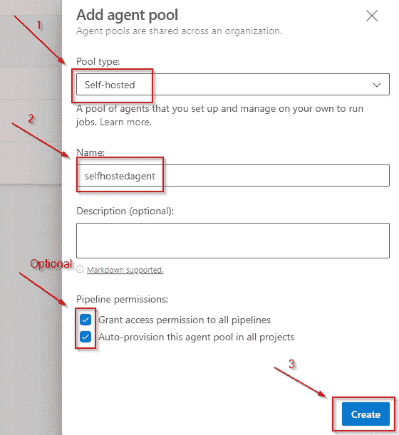

作者图片

将出现一个表单，用于填写您的座席代表池数据:

1.  首先，选择自托管池类型。
2.  为您的代理池命名。在我的例子中，它是“selfhostedagent”保存它，因为你以后会需要它。
3.  单击创建按钮。

您可以设置代理池的权限，但这是可选的。

## 2.下载自承载构建代理


作者图片

在代理池屏幕上，单击“新建代理”按钮。

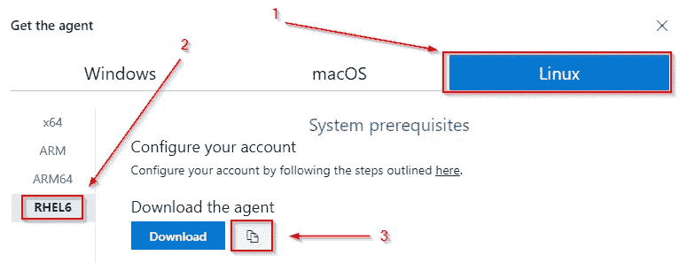

作者图片

将出现一个提示，其中包含如何为特定操作系统安装代理的说明。因为我们将在 Centos 8 上安装代理，所以请执行以下操作:

1.  单击 Linux 选项卡。
2.  单击边栏上的 RHEL6 选项卡。
3.  单击复制按钮获取代理链接，然后保存它。我们以后会需要它。

检索下载链接后，转到主目录:

```
cd ~
```

使用`wget`和前面步骤中的链接下载构建代理。

```
wget [https://vstsagentpackage.azureedge.net/agent/2.188.2/vsts-agent-rhel.6-x64-2.188.2.tar.gz](https://vstsagentpackage.azureedge.net/agent/2.188.2/vsts-agent-rhel.6-x64-2.188.2.tar.gz)
```

为构建代理创建一个新目录，并进入该目录。

```
mkdir myagent && cd myagent
```

解压缩代理。

```
tar zxvf ~/vsts-agent-rhel.6-x64-2.188.2.tar.gz
```

安装依赖项。

```
sudo ./bin/installdependencies.sh
```

如果安装依赖项时出现错误，比如缺少`libssl`包，运行:

```
sudo dnf install compat-openssl10
```

## 3.配置生成代理

在开始配置之前，您需要有一个个人访问令牌来使用您的 Azure DevOps 项目对构建代理进行身份验证。按照这些说明你可以得到一个个人访问令牌。

拥有个人访问令牌后，开始配置:

```
./config.sh
```

在此步骤中，您将需要个人访问令牌和代理池名称。当询问代理的名称时，因为这是构建服务器，所以输入名称“build server”

## 4.安装生成代理

安装构建代理将非常简单。您需要运行:

```
sudo ./svc.sh install
```

要启动代理，请运行:

```
sudo ./svc.sh start
```

完成所有工作后，检查代理池中的代理:

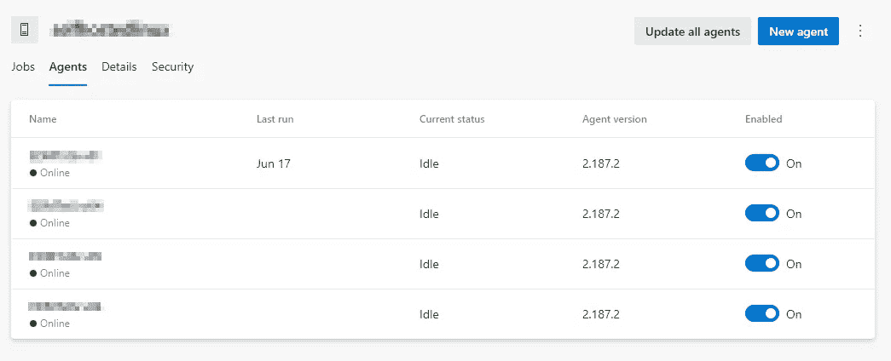

作者图片

如果一切顺利，应该会有一个新的在线代理。

## 5.在另一台服务器上重复所有步骤

安装完第一个构建代理后，在第二台服务器上重做整个过程。将第二台服务器命名为“TestServer”

# 在测试服务器上安装 JMeter

JMeter 是一个使用 Java 构建的负载测试工具。要安装 JMeter，我们需要安装一个兼容的 Java 版本。本教程将使用 Apache JMeter 5.4.1。

## 1.安装 Java

Java 的安装非常简单。运行:

```
sudo dnf install java-11-openjdk-devel
```

## 2.下载并安装 JMeter

转到主目录:

```
cd ~
```

然后使用`wget`和前面步骤中的链接下载 JMeter 二进制文件。

```
wget [https://vstsagentpackage.azureedge.net/agent/2.188.2/vsts-agent-rhel.6-x64-2.188.2.tar.gz](https://downloads.apache.org/jmeter/binaries/apache-jmeter-5.4.1.tgz)
```

解压缩二进制文件。

```
tar zxvf apache-jmeter-5.4.1.tgz
```

要运行 JMeter，请运行:

```
~/apache-jmeter-5.4.1/bin/jmeter
```

这个简短的安装指南是基于 UnixCop 的一篇文章。

# 为自动化配置构建服务器

现在剩下的就是配置 shell 脚本了。这里有两种类型的脚本:创建脚本和销毁脚本。这一节的部分内容摘自[我之前的文章](https://towardsdatascience.com/automate-your-linux-deployment-using-azure-devops-ffe4ba7c938b)。

## 1.制作一个脚本来自动化系统服务配置

为了添加新的系统服务配置，我们将创建一个 shell 脚本。在主目录中添加这个`make-service.sh`脚本:

自动化制作`systemd`服务的 shell 脚本。

在复制和粘贴代码之前，请注意脚本中的`<user>`和`<server environment>`标签。请事先将这些更改为您相应的用户和服务器环境。在这种情况下，服务器环境要么是开发环境，要么是生产环境。

该脚本将生成新的`systemd`服务文件。净核心项目。要为其他类型的应用程序生成脚本，您需要更改给定的模板。

shell 脚本接受两个参数:服务名和使用的项目名。

```
sudo ~/make-service.sh <service name> <project name>
```

示例:

```
sudo ~/make-service.sh CI-Build API-Project
```

在这个例子中，脚本将添加一个新的系统服务文件`CI-Build.service`，它运行一个名为`API-Project.dll`的 dll 文件。

## 2.制作一个脚本来自动化 Nginx 配置

为了添加新的 Nginx 配置，我们将创建一个 shell 脚本。在主目录中添加这个`add-nginx-conf.sh`脚本:

自动添加 Nginx 配置的 shell 脚本。

此脚本将使用关联的 DNS 创建对名为的配置文件的搜索。如果没有找到，它将创建一个新的。一旦找到，新的配置路由将被添加到那里。请注意，这个脚本中的配置路径是一个基本的代理传递，因此如果您想将它用于生产，您可能需要向脚本中添加更多的配置。

shell 脚本接受三个参数:DNS、代理路由和正在使用的端口。

```
sudo ~/add-nginx-conf.sh <DNS> <proxy route> <app port>
```

示例:

```
sudo ~/add-nginx-conf.sh yourdomain.com proxy 14321
```

在本例中，脚本将为 yourdomain.com 域添加配置，并在`proxy`中使用端口 14321 的反向代理。

## 3.创建一个脚本来移除系统服务配置并移除内部版本

为了删除新的系统服务配置，我们将创建一个 shell 脚本。在主目录中添加这个`remove-service.sh`脚本:

自动化移除`systemd`服务的 shell 脚本。

该脚本将删除`systemd`服务文件和。NET 核心构建。shell 脚本接受一个参数，即使用的服务名。

```
sudo ~/remove-service.sh <service name>
```

示例:

```
sudo ~/remove-service.sh CI-Build
```

在本例中，脚本将添加一个新的系统服务文件`CI-Build.service`。

## 4.创建一个脚本来删除 Nginx 配置

删除新的 Nginx 配置。我们将创建一个 shell 脚本。在主目录上添加这个`remove-nginx-conf.sh`脚本:

自动添加 Nginx 配置的 shell 脚本。

该脚本将使用`[grep](https://stackoverflow.com/questions/6958841/use-grep-to-report-back-only-line-numbers)`创建对代理路由行号的搜索。在检索到相关的行号后，它会将数字增加 2，然后使用`[sed](https://www.folkstalk.com/2013/03/sed-remove-lines-file-unix-examples.html)`删除中间的内容。

shell 脚本接受两个参数:DNS 和代理路由。

```
sudo ~/remove-nginx-conf.sh <DNS> <proxy route>
```

示例:

```
sudo ~/remove-nginx-conf.sh yourdomain.com myproxypath
```

在本例中，脚本将删除 yourdomain.com 域的配置，并反向代理到`myproxypath`。

## 5.设置用户运行 systemctl 和 Nginx 命令时不显示密码提示

出于自动化的目的，用来安装 Azure 代理的用户需要能够在没有密码提示的情况下运行`systemctl`和 Nginx 命令。要删除`sudo`上的密码提示，请运行:

```
sudo visudo
```

我们需要使用`sudo`运行脚本中的所有命令，而不需要提示密码，所以我们对这些命令和我们将要使用的相应脚本进行了例外处理。

然后将此添加到最后一行(预先更改`<user>`标签):

```
<user> ALL=(ALL) NOPASSWD:/usr/bin/cat, /usr/bin/systemctl, /usr/sbin/nginx, /usr/bin/chcon, /usr/bin/chown, /usr/bin/echo, /usr/bin/touch, /usr/bin/sed, /usr/bin/cp, /usr/bin/rm, /home/<user>/make-service.sh, /home/<user>/add-nginx-conf.sh,  /home/<user>/remove-service.sh, /home/<user>/remove-nginx-conf.sh
```

退出并保存配置文件，然后尝试使用`sudo`运行其中一个命令。不应该提示您输入密码。

关于如何在没有密码的情况下运行`sudo`命令的完整解释可以在这篇[文章](https://www.cyberciti.biz/faq/linux-unix-running-sudo-command-without-a-password/)中看到。

# 准备 CI 管道

CI 渠道将分为三项任务:

1.  运行服务
2.  运行性能测试
3.  出版

## 1.创建管道

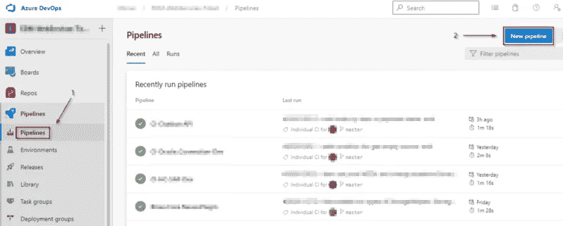

作者图片

在本教程中，我们将使用. NET 核心应用程序作为我们的例子。

1.  首先，转到“管道”选项卡。
2.  单击新建管道。

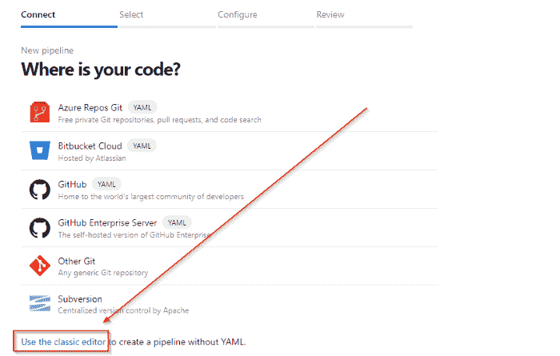

作者图片

使用经典编辑器。

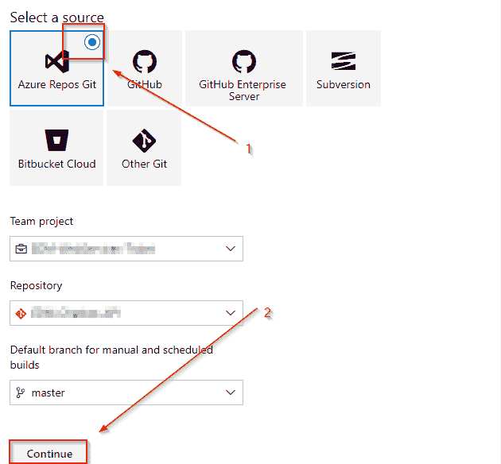

作者图片

选择一个存储库，然后点按“继续”。

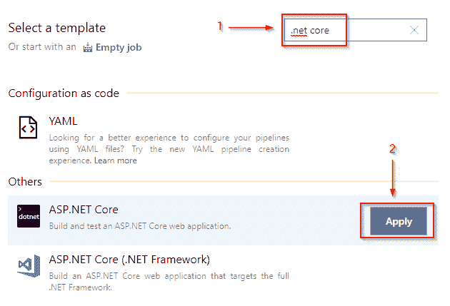

作者图片

应用。NET 核心模板。

1.  搜索”。网芯。”
2.  然后应用模板。

## 2.创建运行服务作业


作者图片

在模板上:

1.  单击“构建管道”选项卡。
2.  然后将“代理池”更改为您在前面步骤中创建的池。

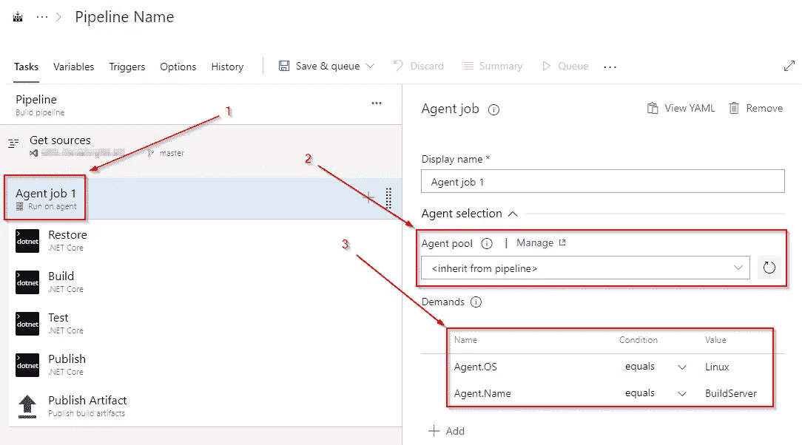

作者图片

要指定我们将使用的代理，请执行以下操作:

1.  点击“代理工作”
2.  将“代理池”设置为从管道继承。
3.  因为我们的代理使用的是 Linux，所以根据需要将目标 OS 设置为 Linux，将目标名称设置为“BuildServer”。

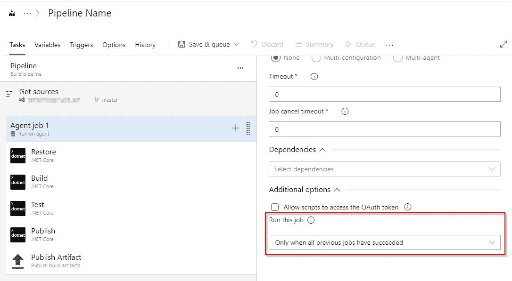

作者图片

向下滚动到“代理作业”配置的底部，并确保在“附加选项”中，该作业将仅在所有之前的作业成功后运行此作业。

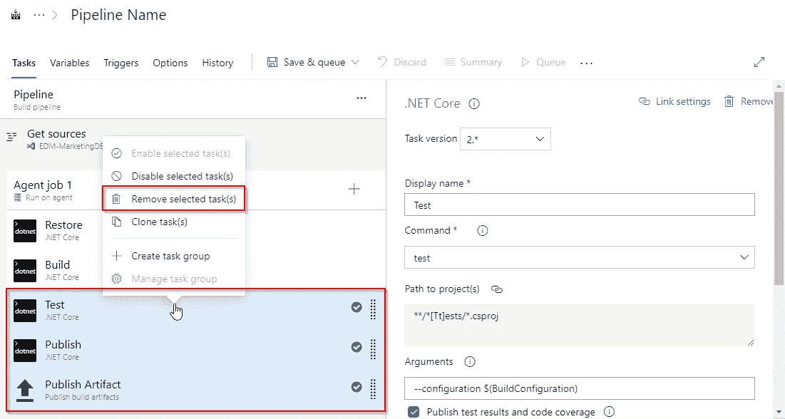

作者图片

选择后三个任务，并将其从作业中删除。

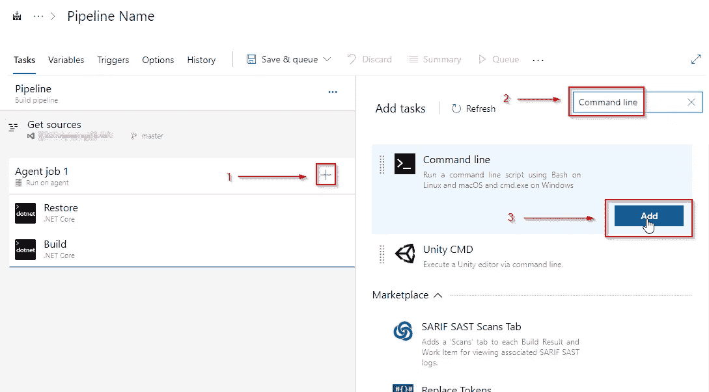

作者图片

添加新的命令行任务:

1.  点击 **+** 符号。
2.  在搜索栏上键入“命令行”。
3.  将任务添加到作业中。

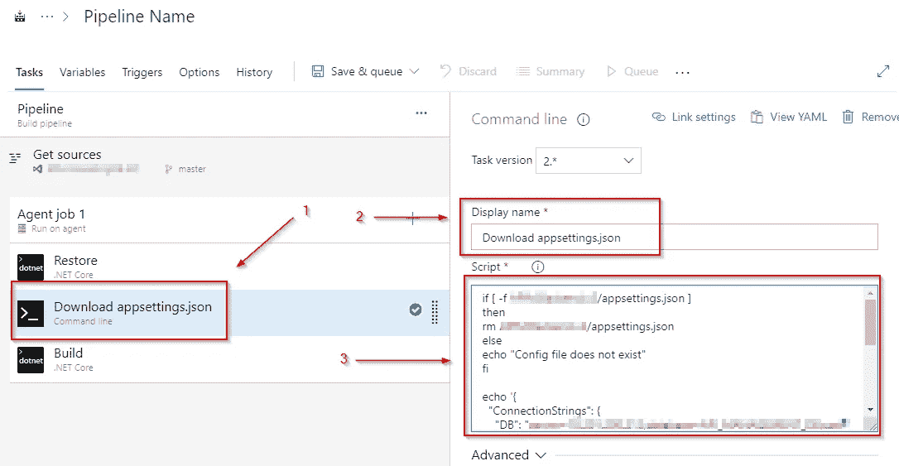

作者图片

创建任务后:

1.  在恢复和构建任务之间拖动任务。
2.  将显示名称更改为“Download appsettings.json”
3.  粘贴一个脚本，将`appsettings.json`下载到 app 文件夹。

下载 appsettings.json 脚本。

然后再添加两个命令行任务来创建服务，并在 Nginx 上添加配置。

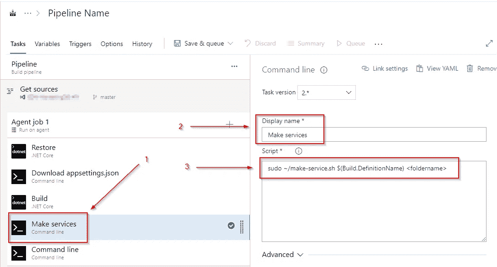

作者图片

这样做之后，将任务放在工作的末尾:

1.  单击其中一个新任务。
2.  将命令行任务显示名称更改为“生成服务”
3.  添加脚本`sudo ~/make-service.sh <service name> <project name>`。(有关如何使用该脚本的详细信息，请参考上一节。)

请不要忘记根据您环境的值来更改`<service name>`和`<project name>`占位符。


作者图片

现在添加 Nginx 配置:

1.  点击最后一个任务。
2.  将显示名称更改为“添加 NGINX 配置”
3.  添加剧本`sudo ~/add-nginx-conf.sh <DNS> <proxy pass> <port>`。(有关如何使用该脚本的详细信息，请参考上一节。)

请不要忘记使用您的环境值来更改`<DNS>`、`<proxy pass>`和`<port>`占位符。

## 3.创建运行性能测试作业


作者图片

要创建新作业:

1.  点击 pipeline 选项卡上的三个点。
2.  选取“添加代理作业”
3.  添加两个新的命令行任务。


作者图片

要指定我们将使用的代理，请执行以下操作:

1.  点击新的“代理作业”
2.  将设置为从管道中继承。
3.  因为我们的代理使用的是 Linux，所以根据需要将目标操作系统设置为 Linux，将目标名称设置为“TestServer”。

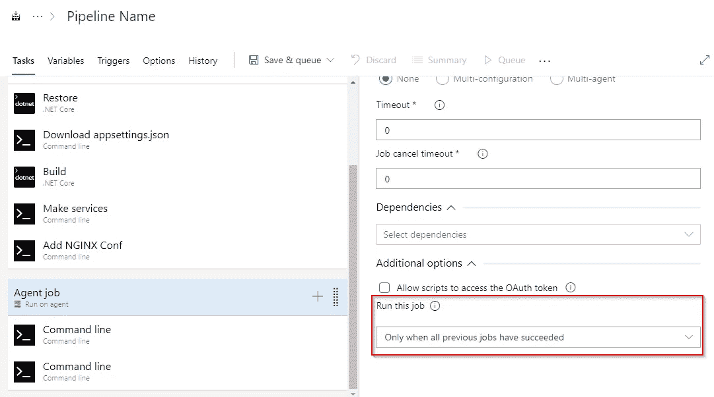

作者图片

向下滚动到“代理作业”配置的底部，并确保在“附加选项”中，该作业将仅在所有之前的作业成功后运行此作业。

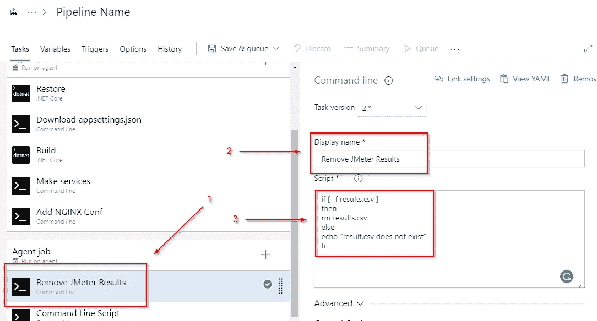

作者图片

JMeter 测试产生一个 CSV 文件作为输出，但是在我们运行测试之后，输出文件不会被自动删除。为了防止我们添加文件而不是覆盖它，我们必须事先删除所有现有的输出。

1.  单击第一个命令行任务。
2.  将任务显示名称更改为“删除 JMeter 结果”
3.  添加删除脚本。

删除 JMeter 结果脚本。

接下来，要从 CLI 运行 JMeter 脚本，您必须首先理解 JMeter 命令的基本结构。JMeter 有六个标志，你必须知道。

```
-n: Indicates that JMeter will run without GUI.
-t: Specifies the test path.
-l: Specifies the result filename.
-J: Supply variables if required (optional).
-j: Specifies log filename.
-e: Specifies if JMeter should post a report.
-o: Specifies the report location.
```

在这种情况下，下面的命令将运行一个位于主目录的 JMeter 实例，而不使用 GUI(即从 CLI)。

```
~/apache-jmeter-5.4.1/bin/jmeter -n -t tests/performancetest.jmx -l results.csv -Jprotocol=http -Jhost=myhost.com -j jmeter.log -e -o reports
```

JMeter 将运行 tests 文件夹中的文件`performancetest.jmx`，并输出文件`results.csv`。

JMeter 还接受两个用户定义的变量，协议和主机。JMeter 完成运行后，日志将被写入到`jmeter.log`文件中，输出将被保存在`reports`文件夹中。


作者图片

接下来，您需要:

1.  单击最后一个命令行任务。
2.  将显示名称更改为“运行 JMeter”
3.  添加 JMeter 脚本。

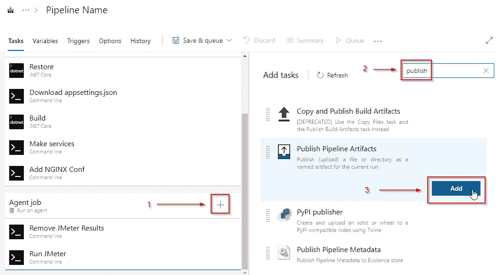

作者图片

若要发布测试结果，请添加一个新任务:

1.  点击 **+** 符号。
2.  将“发布”添加到搜索栏。
3.  在“发布管道项目”任务中，单击“添加”。

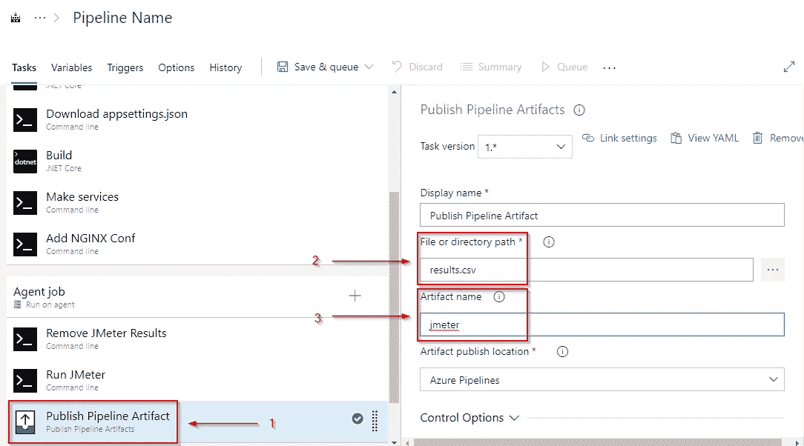

图片来自作者

指定发布目录"

1.  单击发布管道工件任务。
2.  将文件路径改为`results.csv`。
3.  将工件名称更改为“jmeter”

## 4.创建发布生成和清理代理作业


作者图片

创建新工作:

1.  点击 Pipeline 选项卡上的三个点。
2.  选取“添加代理作业”
3.  添加两个新的命令行任务。

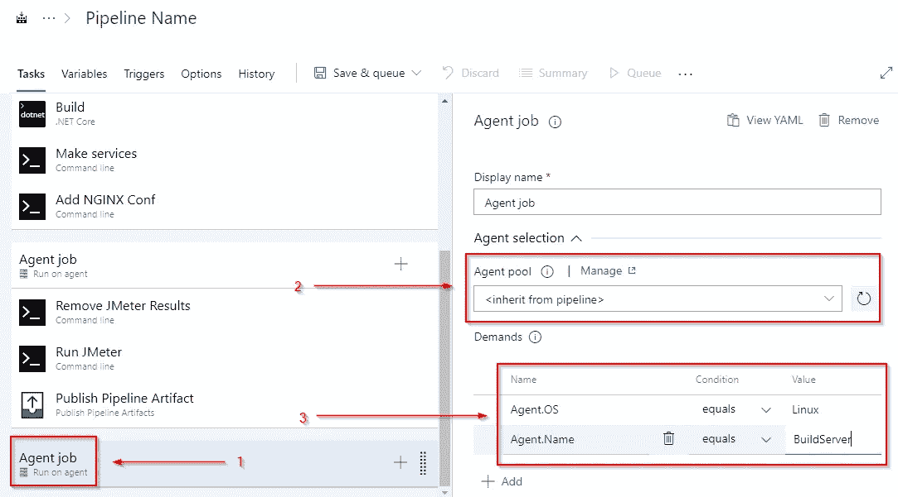

作者图片

要指定我们将使用的代理，请执行以下操作:

1.  点击新的“代理作业”
2.  将“代理池”设置为从管道继承。
3.  因为我们的代理使用 Linux，所以根据需要将目标操作系统设置为 Linux，将目标名称设置为“BuildServer”。

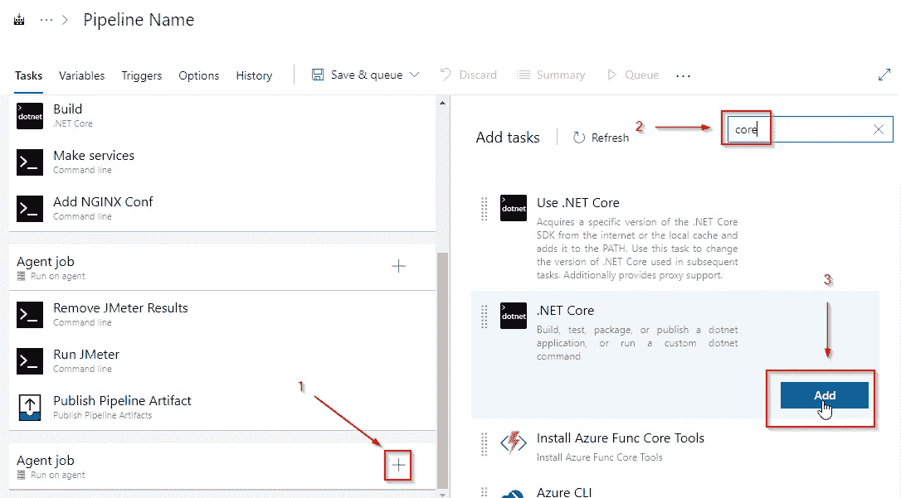

作者图片

若要发布构建结果，请添加一个新任务:

1.  点击 **+** 符号。
2.  将“核心”添加到搜索栏。
3.  单击上的添加。NET 核心任务。

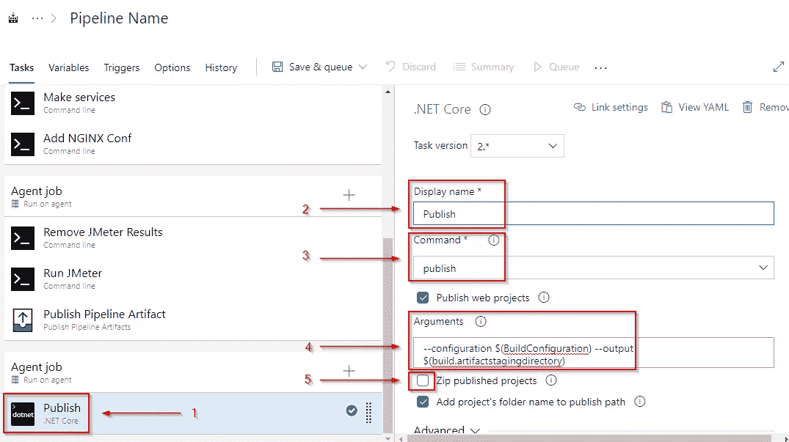

作者图片

创建任务后，您需要对其进行配置:

1.  首先，单击发布任务。
2.  将任务显示名称更改为“发布”
3.  将命令更改为“发布”
4.  对于参数，插入`— configuration $(BuildConfiguration) — output $(build.artifactstagingdirectory)`。
5.  取消选中 Zip 复选框。


作者图片

为了上传发布的工件，

1.  点击 **+** 符号。
2.  将“发布工件”添加到搜索栏。
3.  在“发布构建工件”任务上单击添加。

然后添加另外三个命令行任务。

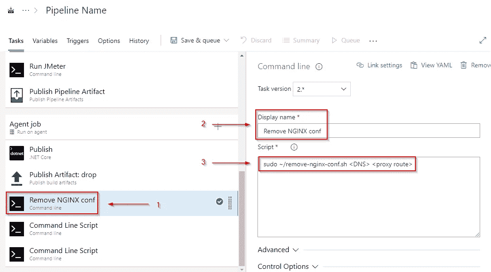

作者图片

测试完成后，您需要删除 Nginx 配置:

1.  单击第一个命令行任务。
2.  将显示名称更改为“删除 NGINX 配置”
3.  添加脚本`sudo ~/remove-nginx-conf.sh <DNS> <proxy route>`。(有关如何使用该脚本的详细信息，请参考上一节。)

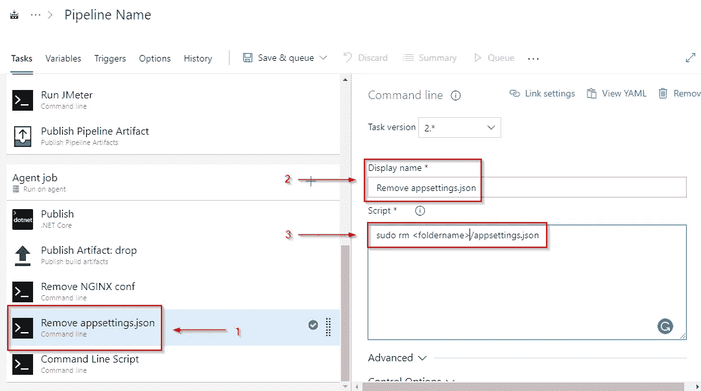

作者图片

接下来，取下`appsettings.json`:

1.  单击第二个命令行任务。
2.  将显示名称更改为“Remove appsettings.json”
3.  添加脚本`sudo rm <foldername>/appsettings.json`。(有关如何使用该脚本的详细信息，请参考上一节。)

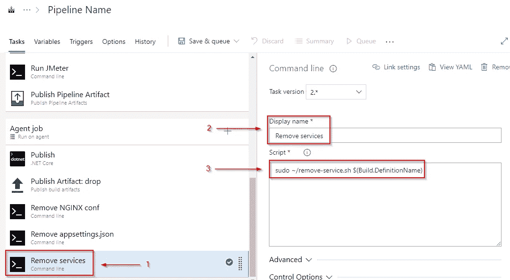

作者图片

要删除服务文件:

1.  单击第三个命令行任务。
2.  将显示名称更改为“删除服务”
3.  添加脚本`sudo ~/remove-service.sh $(Build.DefinitionName)`。(有关如何使用该脚本的详细信息，请参考上一节。)


作者图片

最后，这是你剩下的。下一步，我们将在我们的解决方案中实现持续开发。

1.  更改 CI 管道的名称。
2.  拯救管道。

# 测试管道

要测试管道，请转到管道部分，打开刚刚创建的管道，然后单击运行管道。


作者图片

# 摘要

在本教程中，您已经学习了如何使用 Azure DevOps 和 shell 脚本来自动化性能测试。我们使用. NET 核心项目对其进行了测试。使用的 Linux 服务器是 Centos 8。

总结一下我们所做的工作:

*   安装了自承载的 Azure 生成代理。
*   为自动化配置了生成服务器。
*   准备 CI 管道。

现在，当您想要自动化性能测试时，您有了一个开放的剧本可以使用。