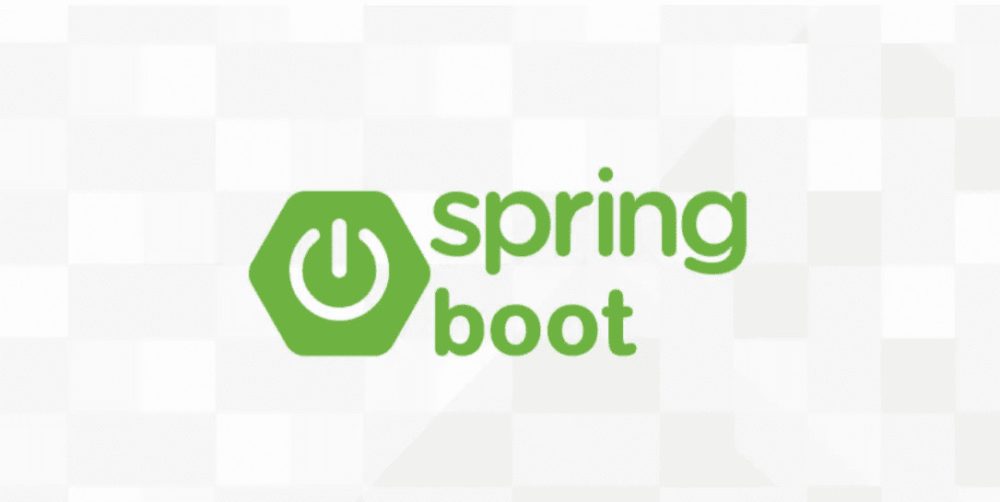

# 在 Spring Boot 使用@JsonView 避免安全漏洞

> 原文：<https://betterprogramming.pub/avoid-security-loopholes-using-jsonview-in-spring-boot-3b1230f1ae30>

## 不要暴露超过你认为需要暴露的部分



Spring Boot 标志

如果一个对象的某个属性是你公司内部的，对消费者没有用，那么就不要归还它。

假设我们使用控制器来查询信息，并以 JSON 数据格式返回给前端。通常，JSON 数据中会涉及到一些用户名和密码查询，但是出于安全原因，我们可能不需要将所有的`User`对象用户信息(例如，`username`和`password`)返回到前端。

但是当我们使用`[@RestController](http://twitter.com/RestController)`注释时，返回的`User`对象会自动转换成对应的 JSON 数组，并传输到前端。我们不能去掉不必要的 JSON 信息，比如`username`和`password`，然后返回。为了解决这个 JSON 数据控制问题，我们可以使用`JsonView`注释进行开发。

# 让我们用一个例子来学习

有时您可能想要重用同一个`form`类来接收多个处理器/控制器中的请求数据。

例如，假设您有这个`UserForm`用于用户注册:

```
public class UserForm {

  private String username;

  private String name;

  private String password;

  // Getters and Setters ...
}
```

用户注册处理程序如下所示:

```
@PostMapping("/users")
@ResponseStatus(HttpStatus.CREATED)
public UserDto signup(@RequestBody UserForm userForm){
    return userService.signup(userForm);
}
```

现在，假设您有另一个用于更新用户的处理程序，如下所示:

```
@PutMapping("/users/{id}")
public UserDto updateUser(@pathVariable long id, @RequestBody UserForm userForm) {

  return userService.update(id, userForm);
}
```

注意上面同样的`userForm` ？

因此，有人可以使用不需要的字段(例如，`username`和`password`)调用端点，从而将这些字段注入到表单中。

这就是`@JsonView`注释真正有用的地方。您可以在需要包含在 API 响应中的字段上定义`@JsonView`。

但问题是:我们如何通知 Jackson 处理器只考虑基于 API 的某些字段？

# 如何使用@JsonView

我们可以使用`@JsonView`来限制或控制不同用户的字段显示。您可以根据`JsonView`注释中提供的`View`类来决定序列化哪些属性。听起来很有趣，对吧？

为了防止上述类型的注入，首先定义一个标记接口，如下所示:

```
public interface UpdateUser {}
```

然后在`userForm`、**、**中用`@JsonView(UpdateUser.class)`标注更新时要接收的字段:

```
public class UserForm {

  private String username;

  @JsonView(UpdateUser.class)
  private String name;

  private String password;

  // Getters and Setters ...
}
```

现在我们的模型已经准备好了，但是这还不够。我们应该确保我们的 REST API 方法用`@JsonView`进行了注释，如下所示。最后，在处理程序中使用相同的注释，如下所示:

```
@PutMapping("/users/{id}")
public UserDto updateUser(@pathVariable long id,
  @RequestBody @JsonView(UpdateUser.class) UserForm userForm) {

   return userService.update(id, userForm);
}
```

这就是你防止注射所需的一切。

# 结论

这非常有用，特别是当您将域类作为表单重用时。例如，如果您重用一个`User`域类作为表单，然后将它直接保存到数据库，那么您可能会被黑客攻击，这就是真正的麻烦所在。

注册时，如果恶意用户添加了一个`id`或`createdDate`字段，那么这个字段将被注入而不是自动生成，该怎么办？

在你下结论之前，花几分钟时间仔细考虑一下这个问题。

我希望你能从这篇文章中学到一些东西。也请分享，如果有更好的替代方案。不久在另一篇文章中再见。