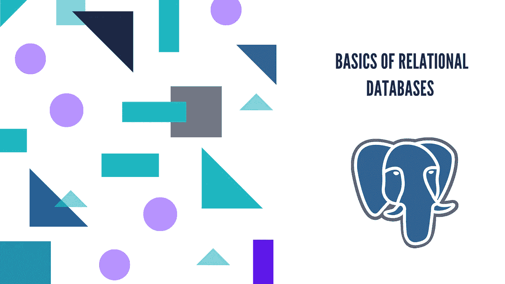

# 关系数据库的基础

> 原文：<https://betterprogramming.pub/basics-of-relational-databases-59a1779608f0>

## 了解 MySQL、PostgreSQL 和其他关系数据库背后发生的事情



乍一看，这似乎是一个毫无意义的阅读。为什么要为这么初级的话题而烦恼呢？此外，在越来越多很酷的托管数据库服务中，了解数据库如何工作的具体细节还有价值吗？

我认为是的。的确，这个帖子可能不直接适用于你，也没关系。然而，数据是许多现代应用程序不可或缺的一部分，您想知道如何最好地存储、管理和查询数据。

即使您选择了托管数据库服务，您也希望根据您的应用程序的需求和您正在处理的数据类型来确定您使用的是正确的服务。

至少，对于希望更好地理解关系数据库的入门级开发人员来说，这可能是一个不错的复习或很好的参考。我希望这将是关于关系和非关系数据库主题的许多帖子的第一篇。

让我们从一些基本的关键短语开始:

*   数据—用于给定目的的值或信息的集合。
*   数据库—这些数据的有组织的集合，通常以电子格式存储。
*   数据库管理系统(DBMS) —允许我们高效检索和管理这些数据的应用程序，例如 MS SQL、MySQL、Oracle、Postgres 等。


通常，数据库有多个数据库表。

数据库表是具有行和列的结构，用于以有意义的方式组织数据，以便在需要时可以检索它们。

# 什么是关系数据库？

它们是包含一个或多个表的数据库，这些表以某种方式相互关联。因此，我们不是将所有数据放在一个有无数列的表中，而是利用多个表来满足必要的需求。

为什么这么做？拆分表使我们能够更有效地管理数据，定义这些表之间的关系使我们能够根据需要检索数据。

为了定义这些关系，我们需要这些表能够进行通信。这就引入了*主键的概念。*

主键用于唯一标识表中的每一行，它可以由一列或多列组成。


就拿以前的学生举例吧。我们有一个表，其中包含学生的各种属性，如学号、名、姓、出生日期、电子邮件和年级代码。每行代表一个学生记录。

为了唯一地标识每个学生，我们可以利用他们的学生证或电子邮件列作为主键。这些潜在的主键被称为*候选键*。

因此，我们可以将这些候选键中的一个指定为主键。

您也可以用多个列组成主键，在这种情况下，它被称为组合键。主键允许我们快速地从这些表中查询数据，而不会产生歧义。

它们还允许我们定义与其他表的关系。因此，一个表的主键可以与另一个表中的列相关，这种关系被称为*外键*。

外键允许我们根据定义的关系引用存储在其他表中的数据。

例如，使用学生表的相同场景，行(或记录)中的年级代码列的值可以是另一个表的主键，该表包含更多关于不同年级的数据。

在这种情况下，等级代码是一个外键，它引用等级表中相应的等级数据。外键不需要在外键所在的表中是唯一的。同一个外键可以在一个表的不同行中重复出现几次。

RDBM 给了我们一种获取和管理存储在其中的数据的方法。这可以通过使用 SQL(结构化查询语言)来实现，这是我们用来与关系数据库交互的语言。

```
SELECT * FROM students WHERE email='someone@mail.com';
```

上面的查询将获取表中匹配“WHERE”条件的任何现有学生。在这封邮件中，一名学生的电子邮件地址为“【someone@mail.com】T2”。

类似地，我们可以使用适当的 SQL 语法插入、更新和删除记录。

## **一对多关系**

一个表的主键可以通过外键关系引用其他表中的一行或多行。因此，一个年级可以与学校中该年级的多个学生相关联。

## **多对多关系**

当一个表中的多条记录与另一个表中的多条记录相关联时，就会出现多对多关系。

例如，客户和产品之间存在多对多的关系:客户可以购买各种产品，产品可以由许多客户购买。

## **数据标准化**

什么是正常化？它是将数据有效地组织到表中，建立它们之间的关系，并消除冗余数据的过程。

通常，规范化以规范化形式表示，也称为 NFs:

*   1NF —用于消除重复组。
*   2NF —用于消除冗余数据。
*   3NF 用于消除不依赖于表的键的列。

通常有三到五个 NFs，但我们将坚持使用三个。

**1NF**

假设我们有一个学生表，表中有 subject 1、subject 2 等列。我们可以将这些主题列合并成一个名为*主题*的列。这个过程被称为 1NF——第一范式。

**2NF**

这产生了另一个问题，我们最终会在其他列中得到大量冗余数据，因为我们是基于学生所学的每一门课程来获取学生记录的。

为了解决这个问题，我们将学生表分为学生和主题。这就是 2NF——第二范式。

**3NF**

我们不必就此止步，我们可以让事情变得更有效率，将表转换成 3NF。

为了实现这一点，我们必须寻找不直接依赖于表的键的列。那么我们该如何处理这些柱子呢？你猜对了，我们把它们移到它们自己的桌子上。

在上面的例子中，列 grade ID 可以移动到它自己的一个名为 grades 的新表中，该表将 grade ID 作为主键。

重要的是要记住，在 3NF 中，表的所有列都直接依赖于表键。

那么，这是一个不必要的，费力的任务吗？不完全是。

像这样花时间对表关系建模有助于在数据库中高效地存储和组织数据，还可以消除数据的重复，并确保更好的数据完整性或一致性。

数据冗余度越低，存储成本就越低，还能提高速度。

然而，这也有不好的一面。规范化会产生几个表，这些表之间有许多关系。

这怎么会是坏事呢？这意味着处理需要更多的计算能力，这反过来意味着更好的服务器基础设施。此外，SQL 查询开始变得更加复杂，因为需要引用更多的表来检索数据。

## **酸行为**

关系数据库支持以下一组属性:

*   原子性——这意味着事务要么完全执行，要么根本不执行。
*   一致性—一旦提交了事务，数据必须符合给定的模式。
*   隔离—并发事务彼此独立执行。
*   耐用性—数据库从意外系统故障或停机中恢复的能力。因此，事务通常会被记录下来，如果出现中断或系统故障，一旦数据库备份并运行，就可以重放这些事务。

这些 ACID 属性定义了关系数据库如何处理读/写操作。

此外，它们一起工作以确保数据库事务的一致和期望的行为。然而，这导致灵活性的损失，并且极大地阻碍了性能及其水平扩展的能力。

# 结论

当你想得到一个更实际的方法时，理论可能有点无聊，但是你必须从某个地方开始。如果没有很好地理解上述内容，你所学的只是语法。

您希望将基础知识转化为您实现的数据库解决方案。请关注关系数据库方面更高级的理论主题以及实践示例。

如果你喜欢这篇文章，请在这里给我买杯咖啡 ☕️😃。