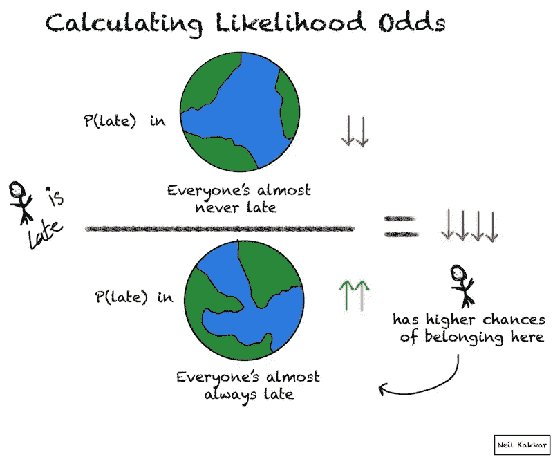
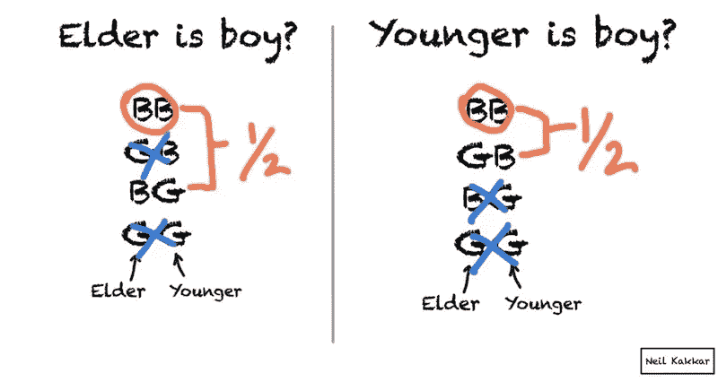
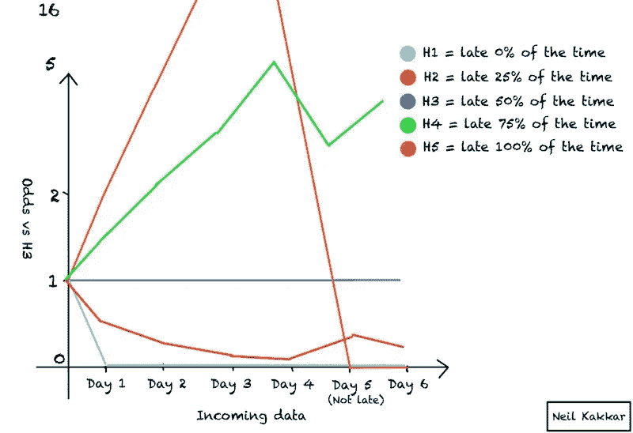
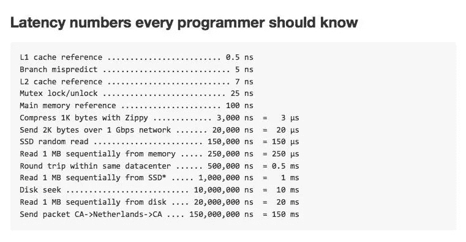
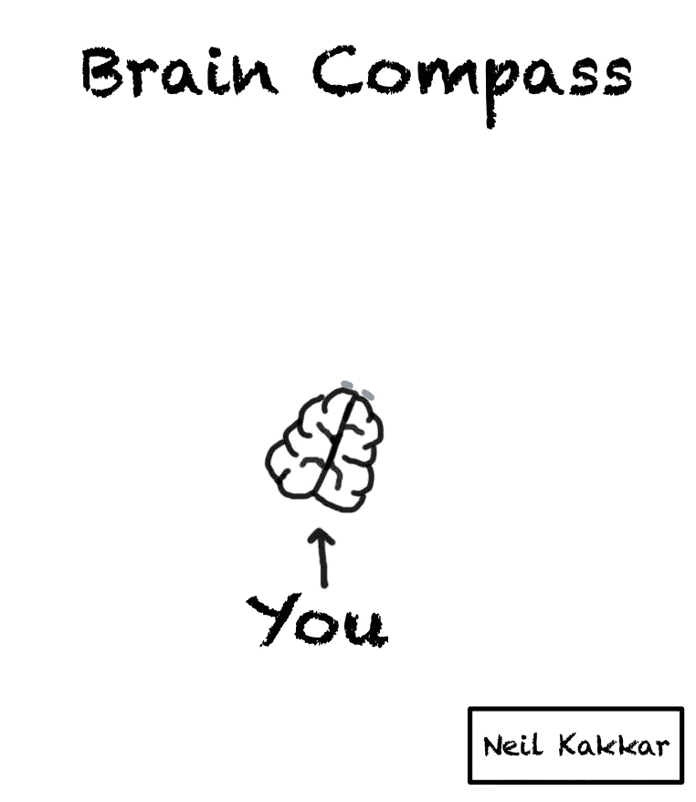
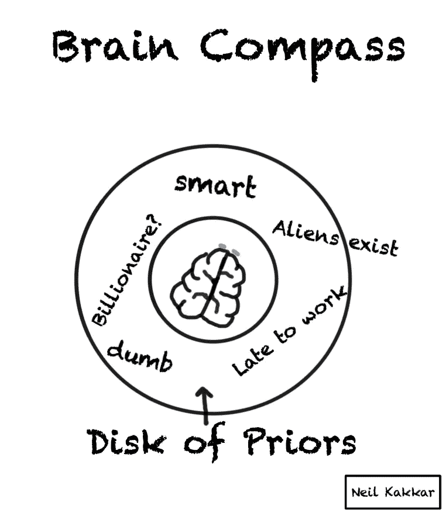
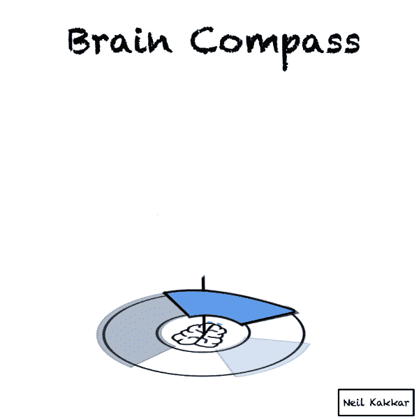
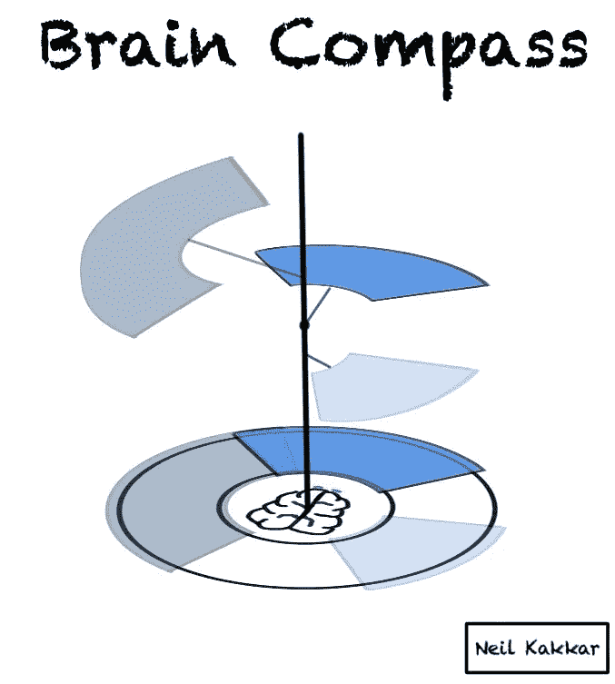
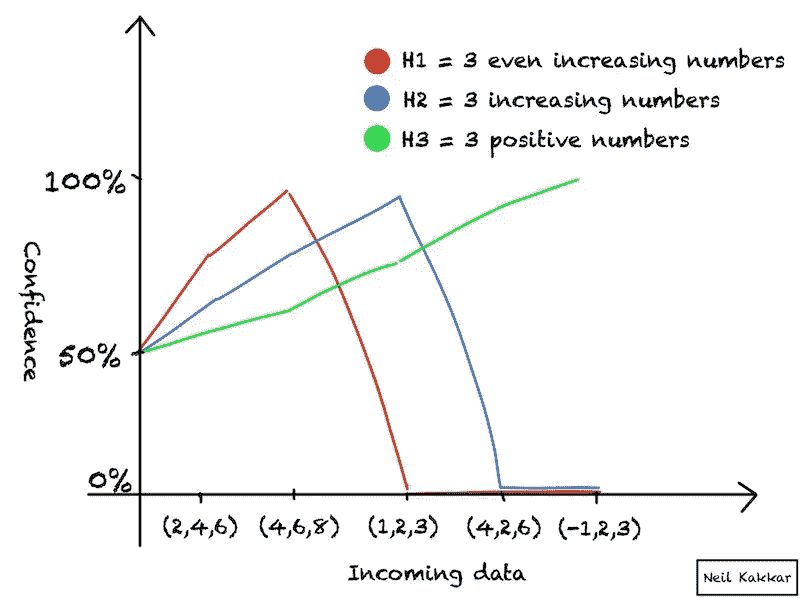

# 贝叶斯定理:批判性思维的框架

> 原文：<https://betterprogramming.pub/bayes-theorem-a-framework-for-critical-thinking-1ba54f96dc6a>

## 学习如何做出更好的决定，挑战你的信念，理解为什么有些人相信不明飞行物


本杰明·戴维斯在 [Unsplash](https://unsplash.com?utm_source=medium&utm_medium=referral) 上拍摄的照片

你有没有注意到你是如何前一秒还怒气冲冲，下一秒又完全冷静下来的？

一个糟糕的司机在高速公路上拦住你，你很生气。过了一会儿，你注意到他驶进了医院，你的怒气消失了。“是啊，也许他车里有个病人。或者，可能是某个亲近的人快死了。[我想他也没那么坏](https://neilkakkar.com/Psychology-of-Human-Misjudgment.html)

概率论中一个晦涩的规则叫做贝叶斯定理很好地解释了这一点。这篇 9000 字的博文完整介绍了贝叶斯定理以及如何将其付诸实践。简而言之，贝叶斯定理是批判性思维的框架。在这篇文章的结尾，你将会做出更好的决定，意识到你什么时候变得不可理喻，并且理解为什么有些人相信 UFO。

这是一个重大的承诺，而且很有可能失败。实现这些想法需要付出情感上的努力，但这是值得的。

觉得司机不好很正常。贝叶斯定理期望相同。贝叶斯和我们的区别在于我们相信事物的强度。大多数时候，沸腾的愤怒是没有根据的。这可能就是为什么我们对那些愤怒感到愚蠢。它融化得太快了！这就是校准——让我们的情绪与情境的强度相一致——我们也会谈到这一点。

本指南中没有复杂的数学。我们使用概率论，但不进行推导，也不解决学校课本上的概率问题。不了解*为什么*这些事情就很繁琐。相反，我们将理解为什么贝叶斯定理很重要以及如何应用它。

首先，让我们玩一个游戏。在整个游戏中，*注意*你对自己的决定的感受。注意你在做什么决定，注意你是如何找到答案的。

```
[**The 2, 4, 6 Game**](#38f7)[**Bayes Explanation**](#b384)[**Bayes Theorem**](#55f1)[**Example: Being Late**](#ebd4)[**Grinding the Gears**](#dbb3)[**The Four Rules for Being a Good Bayesian**](#8a4c)[Probability is a map of your understanding of the world](#080a)
[Update incrementally](#8f6b)
[Seek disconfirming evidence](#ba65)
[Remember your priors](#afb6)[**Destroying Cognitive Biases**](#9b1d)[**Seeking Disconfirming Evidence for Bayes**](#a058)[**The 2, 4, 6 Game Revisited**](#174f)[**The Being Late Example Revisited**](#e277)[**Getting Stronger**](#78ec)[**Improve Your Priors**](#1753)[**Become a Master Hypothesis Builder**](#cf01)[**Learn the Math**](#2c3a)[**Putting It All Together in Practice**](#e396)[Hypotheses with frequencies](#019f)
[Growing the disk](#2bd2)
[Switching hypotheses](#2981)[**Strong Opinions, Weakly Held?**](#b1b9)[**This Seems Very Different to What I Learned in School**](#c455)[**Epilogue: The End is the Beginning**](#42cf)[**Endnotes**](#fb9c)
```

# 2，4，6 游戏

有一个黑盒子，里面有一个生成三个数字的公式。你的工作是试着猜测这个公式。下面的输入框连接到黑盒。如果你给它三个数字，它会告诉你它们是否遵循公式。用逗号分隔每个数字。

首先，(2，4，6)遵循这个模式。试试吧！

或者，[在这里玩](https://neilkakkar.com/Bayes-Theorem-Framework-for-Critical-Thinking.html#the-246-game)。想通了就写下你的答案。

# 贝叶斯解释

大多数人尝试一些(4，6，8)，(1，2，3)…的序列，最后得到的不是递增的数字就是偶数。注意当你写下你的答案时，你是多么的自信。你已经尝试了几个例子，所有的例子都有意义！

但是也许你没有想到去尝试(-1，2，10)或者(4，2，6)。

如果我的评论让你的信心动摇了，那就再试试输入框吧。看看你是否能找到一种有效的模式。答案在这一部分的底部，但不要跳过。在那之前的每一句话都在树立一个重要的思想。

# 贝叶斯定理

如果你以前听说过贝叶斯定理，你知道这个公式:


事实上，这就是全部。我打赌你也听过那个著名的公式:E = mc。这就是质能等效的全部内容。然而，弄清楚如何利用核能仍然是一个难题。该公式使之成为可能，但实施它仍然花了 40 年。

贝叶斯定理也是一样。这个公式令人兴奋，因为它意味着什么。我们发现了核能版的贝叶斯定理。

翻译成英语，公式是这样的:

> 要形成准确的信念，你总是从你已经拥有的信息出发。你更新信念。你不会抛弃你所知道的一切。

第一个关键部分是假设(H)——我们正在谈论的信念。

第二个关键部分是证据(E)——我们有什么数据来支持/拒绝假设？

第三个关键成分是上述两者的概率(P)。这个概率就是我们对信念的信心。

如果你熟悉概率论，你应该在学校学过。如果没有，不用担心，还有[优秀数学入门](https://arbital.com/p/bayes_rule/?l=1zq)为你讲解。我们将跳过数学，专注于如何使用它。

我们的兴趣点，也是贝叶斯真正闪光的地方，是我们比较两个假设的地方。这不是揭示绝对概率(这很难)，而是关注一个假设与另一个假设相比的可能性有多大。在我们看来，大多数推理都是这种形式。

在这种情况下，公式如下所示:


后验概率衡量一个假设与另一个假设相比的可能性。

先验概率衡量的是在我们有任何新的证据之前有多大的可能性。

可能性比率衡量的是与另一个假设相比，证据对当前假设的解释有多好。我们将借助例子来探究这意味着什么。


我们将从 2，4，6 游戏开始，展示数学和直觉在定性上是如何一致的。然后，我们将进入一个更简单的例子，我们被误校准，做数学。

我将通过 2，4，6 游戏选择我的道路，但我希望你的足够相似。如果没有，尝试自己做这件事！

我有一个假设想测试一下， *H-3even* = 3 个偶数按升序排列。这里是隐含的，但我测试的假设是*H-不是-3 偶数*，或者公式**不是按升序排列的** 3 偶数。

我输入(4，6，8)，黑框显示“是”我对 3 个偶数的信心上升。用贝叶斯的话来说，我的后验概率增加了，因为可能性概率增加了。而且可能性几率增加了，因为当公式为 *H-3even* 时,( 4，6，8)说“是”的概率更高。

你会注意到你的感受，每一个符合你假设的新数字都会让你的信念更加坚定。

接下来我试试(1，2，3)。“是的。”什么？我以为会有“不！”。

当你发现一些不符合模式的东西时，一切都会变得混乱。在 *H-not-3even* 的情况下,( 1，2，3)说“是”的概率更高，因为(1，2，3)并不都是偶数。现在的可能性赔率有利于 *H-not-3even* ，这意味着我们放弃 *H-3even* 。在这种情况下，一个小小的证据就足以完全扭转局势。

那么，你应该尝试哪个新的假设呢？线索通常在于你如何反驳先前的假设。

我试了(1，2，3)，当我预计它会说“不”时，它会说“是”。因此，我的新假设变成了“3 个递增的数字”。

就像上一个案例，(4，2，6)说“是”扼杀了这个假设。我的新假设因此变成了“3 个正数”。

我试了(-1，2，3)，上面写着“不”！这就是我对“3 个正数”变得相当自信所需要的一切。我尝试的负数越多，我就越自信。

3 正数确实是正确的。

从图表上看，这是三个假设的情况:


未校准的置信度

> ***插曲:我们可以用贝叶斯证明某事为真吗？*** *不管你有多少数据，你永远不能说某件事是真的。这就是归纳的问题。*
> 
> 对白天鹅的观察再多也不能得出所有的天鹅都是白色的结论，但是对一只黑天鹅的观察足以推翻这个结论
> 
> 然而，在一定程度的自信之后，你会相信这是真的。一旦你开始相信，就是你必须密切注意不符合的证据的时候了。

校准是关键。我们刚刚展示的是我们的思考过程，以及当我们思考得很好的时候，贝叶斯定理是如何与之保持一致的。贝叶斯定理更新信念的方向与我们大脑更新信念的方向相同，但改变的是每一条证据对我们的影响程度！

下一个例子，让我们进入基础数学。我们一会儿会重新讨论 2，4，6 博弈。

# 例子:迟到

你的同事有时上班迟到。在过去的一周里，他们四次准时，三次迟到。你还需要多少次才能开始相信他们“总是”迟到？

以我的经验来看，多几次就够了。但是让我们用贝叶斯来校准。

因为没有充分的理由认为迟到比准时更重要，所以我们假设先前的几率是 1:1。另一个假设，也就是我们正在测试的假设，是“不总是迟到”为了更具体地说明这一点，我们假设这意味着他们只在 10%的情况下迟到。

我们将利用现有的数据来计算迟到的可能性。我们希望将数据与我们认为几乎总是准时或几乎总是迟到的数据进行对比。记住，为了解决这个问题，我们假设相信第一个假设，然后判断数据的可能性有多大。然后，我们想象相信第二个假设，判断数据的可能性有多大。



从二项式函数到贝塔分布，有几种方法可以用数学方法表示这些数据。然而，我们还没有进入那个阶段。今天更多的是一个直观的解释，一个你每天都可能用到的解释。因此，试着想象一下这些数据的支持和反对的可能性。⁴

让我有点惊讶的是，对于一个应该总是迟到的人来说，他们往往是准时的。因此，这个证据不太可能符合我们的假设，而当他们不总是迟到时，就更有可能了。我觉得可能性是 1:10。⁵

现在，后验概率是 1:10 * 1:1 = 1:10。所以，他们迟到的可能性比不迟到低 10 倍。⁶

哈，这很令人惊讶，不是吗？比我想象的低很多。

让我们进一步举这个例子。假设我们想知道他们还要迟到多少次才能使赔率达到 100:1？

我们将再次进行相同的更新过程。

迟到的先验概率=旧的后验概率= 1:10。

似然比=？？

后验概率= 100:1

因此，似然比= 100:1 / 1:10 = 1000:1。这意味着他们必须在 20 天中迟到 12 天才能得到这样的机会。⁷

这些数字可能会让人觉得奇怪。他们是。我们不习惯校准，在这个特定的例子中，我们比较两个极端的假设，这让事情变得更奇怪。通常，这是一种“我不知道这些数字是什么意思”的情况我们稍后会探讨这种不安的感觉。

这两种假设都与我们的预期相去甚远。毕竟，这位同事在 20 天中只迟到了 12 天！？为什么我们不考虑另一个假设——比如说，他们 60%的时候会迟到？试试这个假设——它应该会让其他两个大吃一惊。你可以用我做的这个计算器。

现在，请注意，一点数学知识可以帮助我们更好地校准我们所拥有的假设。它让我们的情感和思想变得清晰。

此外，请注意我们是如何将问题转化为更容易理解的。而不是套用需要纸笔的复杂版本(概率是多少，公式是什么，我怎么找？)，我们遵循这个“旧赔率乘以当前可能性等于新赔率”。


当你有了这个解释“理想的你”如何思考的模型，你就有了[齿轮级的理解](https://www.lesswrong.com/posts/B7P97C27rvHPz3s9B/gears-in-understanding)！这是史诗般的，因为你可以摆弄齿轮，看看你的思维是如何变化的。你可以找出最佳实践，成为一个更强的思考者。这正是我们接下来要做的。

> **注:**
> 大脑并不总是像贝叶斯定理规定的那样工作。有很多事情贝叶斯无法解释。不要试图让你看到的一切都符合贝叶斯法则。但是无论在哪里，只要涉及到信仰，这都是一个很好的模型。找到最好的信念并校准它们！

# 研磨齿轮

让我们开始磨这些齿轮。这一部分的一个元目标是让齿轮对你可见。我们离核能版的贝叶斯定理越来越近了，但是到目前为止，我们只是看到了它是如何可能的。下一步就是自己学习怎么做了。

利用贝叶斯定理，试着回答这个问题:

**两个人看到同样的东西，怎么会得出不同的结论？**

让我们首先假设他们是贝叶斯，并遵循规则。他们能得出不同的结论吗？

是啊！目前的数据只给了我们可能性。还有第二个要素，先验知识，还没有被使用！在“迟到”的例子中，我们利用我们的背景知识想出了这些问题。这就是它们被称为先验的原因:它是我们已经拥有的信息。

两个不同的人有不同的经历和不同的信息，这似乎是合理的，这意味着他们可能有不同的前科。有时候，这些前科会变得很严重。你看到他们的同事在 7 天中迟到了 3 天，与 Bob 看到他们的同事在 10 天中迟到了 6 天相比，你将有不同的前科。鲍勃见过你的同事迟到两倍！

看到你的同事第二天准时会比鲍勃更能改变你的信心。你能算出多少吗？

For you = 1:20(之前，7 天中有 3 天迟到)* (1:20) = 1:400 = 400x 可能认为他们的同事是**而不是**“总是”迟到。

对于 Bob = 300:1(之前，10 天中有 6 天迟到)*(1:20)= 15:1 = 15 可能认为他们的同事“总是”迟到。

但是，如果两个人都遵循贝叶斯法则，他们将会以相同的方向和相同的%数量更新——由似然比给出。也就是(1:20)，在这种情况下。请再次注意这些数字感觉很奇怪，就像，这不应该是正确的。

第二种情况是人们根本不遵循贝叶斯法则。记住，贝叶斯是处方，不是描述！这意味着事情应该是这样的，而不是它们是怎样的。这就是事情变得模糊不清的地方。很容易将反对某个信念的证据转变为支持某个信念的证据，尤其是假设不明确的时候。我们将很快讨论这个问题——只是先讨论一些想法。

# 成为优秀贝叶斯的四条规则

贝叶斯定理已经存在了 200 年，在这段时间里，人们已经尝试了各种方法来得出最佳实践。感谢这些人，我们将探索贝叶斯定理的四个观点。掌握这些是成为更好的思考者的关键。

## 概率是你理解世界的地图

> "无知*存在于地图上，而不在领土上."*

在这个镜头里，世界是概率性的。基于*你对世界的*了解，一切都有发生的可能性。概率是你固有的，而不是物体或情况。

例如，在枪战中攻击对你来说似乎不可思议，但黑手党暴徒不会同意。你对世界的了解决定了你的概率。这些概率是你对一个信念的信心。

考虑这个看似奇怪的例子:

你遇到一位数学家，她告诉你她有两个孩子。你问他们中是否至少有**一个**是男孩。她同意了。然后你决定他们两个都是男孩的概率**一定是 1/3** 。

你遇到了另一位数学家。她告诉你她有两个孩子。你问那个**长辈**是不是男生。她同意了。然后你决定他们两个都是男孩的概率**一定是 1/2** 。

你遇到了另一位数学家。她告诉你她有两个孩子。你问小的那个是不是男孩。她同意了。然后你决定他们两个都是男孩的概率**一定是 1/2** 。

如果他们中至少有一个是男孩，那么大的或者小的都是男孩。那么是什么原因呢？为什么概率不一样？如果孩子们天生就是男孩，答案应该总是一样的。

概率是不同的，因为每个问题告诉你关于世界的一些不同的东西。每个问题包含不同的信息量。

要解决这个悖论，我们可以把它抽出来。在第一种情况下，


注意这个问题对可能性的划分与下面的不同。第一个问题只排除一种可能性 GG，其他两个问题各排除两种可能性。⁸



同样的想法也适用于找出你的前科。不同的人得出不同的概率是可以的，因为概率是观察者的函数，而不是物体的属性！概率代表你的信念和信息。太阳没有概率；是你相信每天都会涨。你相信多少会随着你已经活了多少天，或者人类已经存活了多少天并记录了太阳，或者，如果你相信科学家和他们的方法——几十亿年。当然，如果你住在北极或南极附近，你的前科肯定会有所不同。太阳的存在并不意味着它每天都在升起。

情人眼里出西施。

## 增量更新

每一个额外的证据都会改变你的信念。

在 2，4，6 游戏中，当你发现更多支持你的假设的证据时，你的信念变得更加坚定。这个游戏很残酷:一次失败，这个假设就玩完了。这是假设的一个性质。

现实生活中的假设通常不是那样的。事情变得更加模糊。因此，根据你找到的证据，你的增量可能上下波动。实际上，这意味着不要轻信最新的证据。总是把它放在你已经知道的上下文中。

就像在迟到的例子中，没有增量更新看起来像这样:他们今天迟到了，所以我相信“他们总是迟到。”注意你这样做的频率。

当然，我们也不擅长做错事。如果他们准时，我会相信*每个人都应该准时，没什么大不了的，*而不是，比如说，*他们总是准时*。这叫做动机推理。

> “证据不应该决定信念，而是更新信念”

在我们示例的上下文中，这看起来非常清楚。当然，我们会逐步更新。放弃我们已经获得的所有信息是愚蠢的。

这里有一个更现实的例子。

当我 14 岁的时候，我听说负重锻炼会阻碍你的成长。我相信:“健身是邪恶的，每个大个子都服用类固醇。”

当我 15 岁的时候，我听说你可以只用你的体重来锻炼。这不会阻碍生长。我相信:“体重训练能让人变得强壮。”

几个星期后，毫无收获，我很沮丧。我相信:“这些都没用。企业赚钱都是骗人的。”我不知道到底是谁从我的体重训练中赚钱，但话说回来，我不是一个批判性的思考者。

从那以后，我开始做自己的研究。我知道这是一个复杂的问题，不仅仅取决于锻炼，不仅仅取决于你锻炼了多长时间，还取决于你吃了什么。

我开始增量更新。我把每一件证据与我目前所看到的一切联系起来。不是每个人都服用类固醇。力量训练至少对一些人有效。间歇性禁食和跑步对其他人有效。鉴于各种各样相互矛盾的证据，我不可能对任何关于健身的信念有接近 90%的信心。

不增量更新的一个标志是在信念之间摇摆不定。你把你今天看到的证据当成了完全的事实。

另一种失败模式是[排练你的论点](https://www.lesswrong.com/posts/WN73eiLQkuDtSC8Ag/one-argument-against-an-army)。当一个论点一次又一次地出现在你的脑海中时，这就是一个未能增量更新的例子。你在利用你已经用过的同样的证据来增强自信。

一个简单的例子是，当面对一个新的危险情况时，对自己重复“一切都会好的，一切都会好的”。有时候，平静你的神经是必要的。其他时候，就像股市泡沫一样，当证据指向相反的时候，是你在强化一个错误的信念。

## 寻找不可信的证据

*在一个你钟爱的理论不正确的世界里，你会期待看到一些不同的东西吗？*

在 2，4，6 游戏中，如果你不测试任何你认为是假的东西，你只能找到支持你假设的证据。你只会对自己的想法更加自信。

不确定的证据是任何你认为不符合你的假设的东西。在 2，4，6 游戏中，这些是你期望黑盒说“不”的情况。所以，对于假设“3 个偶数递增”，(1，2，3)和(1，-1，2)都是可能的不成立证据。

(1，-1，2)表明你的假设，3 个偶数可能仍然是正确的，而(1，2，3)表明它确实是错误的。你期望(1，2，3)的答案是否定的，但得到的是肯定的。⁹

在迟到的例子中，“总是迟到”假设的不确定证据是寻找你的同事准时到达的时间。我们往往会忘记这一点，只关注他们迟到的时间。这导致了新的问题。

在你找到令人不安的证据并检验你的假设之前，你的信念是一座玻璃城堡。玻璃城堡是脆弱的。事实上，推翻证据的作用是摧毁城堡，或者在这个过程中使城堡更坚固。

大脑的自然反应是保护这座玻璃城堡。大脑将不确定的证据视为攻击，我们倾向于拒绝新的证据，而不是心存感激。如果你把令人不确定的证据当成垃圾，那么*当然*你永远不会改变你的想法。你总是喜欢更新。

你可以在 2，4，6 游戏中输入一百万个遵循你的模式的数字，事情看起来会很好，但你永远不会意识到你的假设是另一个假设的子集(都是正数)——直到有一天你的假设让你失望。贝叶斯对此无能为力。⁰

因此，总是寻找不确定的证据。要做到这一点，你可以寻找不符合你的假设的数据，就像我们上面做的那样。另一种方法是寻找可以更好地解释你已经拥有的数据的假设。用贝叶斯的话来说，你在寻找具有更好先验概率的假设。并非所有的假设都是平等的。有些人能比其他人更好地解释数据。

Julia Galef 有一个很好的例子，追踪朋友之间的嫉妒。凯伦抱怨并不意味着她嫉妒。或许任何一个理智的人都会这么做。

## 记住你的前科

*你经历的每一刻都是你可以用来思考下一步的信息。*

上周，我醒来时左眼疼痛。连眨眼都疼。它肿了，经过更仔细的检查，我发现我的眼睑里有一个像疙瘩一样的东西。我吓坏了。“天哪，我现在需要手术吗？我的视力会好吗？!"

但是，如果只是个痘痘呢？它看起来确实像一个，但是它是第一个疼的。也许没那么危险。

我在浴室里很恐慌，然后我发现我很恐慌。这是[给我的一个提示，让我去探究原因。我做了一个快速的心理校准。](https://www.lesswrong.com/posts/v4nNuJBZWPkMkgQRb/making-intentions-concrete-trigger-action-planning)

“我认为眼部手术比不做眼部手术的可能性低 100 倍”。我认识的大部分人都没做过眼部手术，除了 LASIK，不算。事实上，即使我小时候抓伤了眼睛，也不用手术就能恢复。

“粉刺比没有粉刺的几率高 5 倍”。我不是医生，但这听起来很合理。

因此，实际上，接受手术的几率是(1:100) * (5:1) = 1:20。我不做眼部手术的可能性是 20 倍。哼。不算太坏。

这发生得很快。我算出来的这些赔率就是后验赔率！之前的赔率是(1:100)，可能性赔率是(5:1)。如果我抛弃了我的前科，只考虑那天我得到的新信息，我会对手术的赔率(5:1)感到恐慌。

我下了厕所后，在谷歌上搜索了几下，证实了我的估计。我仍然高估了危险。麦粒肿很常见，并不危险。

这些后验概率现在成了我的新先验。下一次，我会生气，而不是恐慌。

这个故事有一个有趣的见解:当我们面对新的事物时，我们的先验知识通常是错误的。花点时间想清楚有助于正确看待事情。记住你的前科。

在某些圈子里，这也被称为基本利率忽视。你想创业，你认为你会成功，因为你很棒，你很聪明，你很努力。大多数人没有意识到的是，大多数其他初创公司的创始人也是如此！然而，90%的创业公司都失败了。记住你的前科。

另一方面，不要太纠结于你的前科。当新数据进来时，记得增量更新。“按你的方式行事”是一种批评，而不是称赞。

这四个想法共同构成了良好贝叶斯思维的基础。公式本身不能替你思考。你为它搜寻的所有输入，它都能做到最好。

即便如此，我们的大脑还是会被许多诡计所迷惑，著名的说法是“认知偏差”。几乎所有这些都是关于错误地应用贝叶斯规则，捏造输入，或者误解输出。

# 摧毁认知偏见

由于贝叶斯定理是批判性思维的基本框架，你可以用它来对抗一些众所周知的认知偏见。这是我们无法好好思考的时候。这个框架的强度取决于它能在多大程度上解释这些偏见。

1.  [可用性偏差](https://en.wikipedia.org/wiki/Availability_heuristic):倾向于高估记忆中“可用性”更大的事件的可能性
    =使用你最容易获得的证据
    =放弃你的前科
    =不增量更新
2.  [光环效应](https://en.wikipedia.org/wiki/Halo_effect):一个人的积极或消极特质在他人对他们的看法中从一个人格领域“溢出”到另一个人格领域的趋势
    =用不同假设的证据替代另一个
    =更新错误的假设
    =回答更简单的问题
3.  [邓宁·克鲁格效应](https://neilkakkar.com/dunning-kruger.html):不熟练的个人倾向于高估自己的能力，而专家倾向于低估自己的能力
    =不寻求不确定的证据
4.  [确认偏差](https://en.wikipedia.org/wiki/Confirmation_bias):以确认个人先入之见的方式搜索、解释、关注和记忆信息的倾向
    =不寻找不确定的证据
5.  [基本比率忽视](https://en.wikipedia.org/wiki/Base_rate_fallacy):倾向于忽视一般信息，只关注与特定案件相关的信息，即使一般信息更重要
    =忘记自己的前科

这很酷，但都是事后的。我知道偏见，所以现在我知道我错用了哪一部分。我能先验地解决这个问题吗？在我犯错之前？这将是巨大的。事实上，这是我们将在下面几节用大脑罗盘解决的问题。

当然，有一些我们不知道如何解释:

1.  自私偏见:倾向于为成功而不是失败承担更多责任
2.  [群体外同质性](https://en.wikipedia.org/wiki/Out-group_homogeneity):个体认为自己群体的成员比其他群体的成员更加多样化。
3.  [啦啦队效应](https://en.wikipedia.org/wiki/Cheerleader_effect):人们在群体中比孤立时更有吸引力的趋势。

总之，几乎所有的社会偏见。你可以从维基百科上的[列表中尝试更多。](https://en.wikipedia.org/wiki/List_of_cognitive_biases)

# 为贝叶斯寻找不确定的证据

将同样的思想应用于贝叶斯定理，它不能解释什么？我们期望贝叶斯在哪里不起作用？这是一个更好的模型取而代之的机会。

我们在认知偏见部分探讨了这一点。贝叶斯不能解释每一个偏差，这意味着，至少，贝叶斯定理不是一个关于如何思考的完整模型。

对贝叶斯最大的不满来自科学研究。常客声称先验是主观的——过于个人化，无法驱动任何客观的真相。你需要看到事情发生，并根据发生的频率来分配概率。概率是物体的属性，而不是你的信念。

这场争论与我们正在谈论的话题无关。我今天不关心客观真理；我想集中讨论为什么我们相信我们所相信的，以及我们如何改变我们的信仰。改变整个世界的信仰是下一步——太遥远，太难，当我还没有把握住自己的信仰时。无论如何，我提到这个论点是为了让我们脚踏实地。

就个人信念而言，我似乎(在接下来的章节中也会)把数字从我的屁股里拿出来，称之为可能性赔率。这是一个公平的问题。然而，争论可能性和先前的赔率比争论英语语句更容易。你可以讨论哪些因素增加和减少了可能性，并就人们为什么相信他们所相信的进行富有成效的讨论。与“你错了！不，你错了！因为 X，Y，z .哈！那也不对！”

对我们来说，更大的抱怨是很难搞清楚所有的假设——这意味着很难确切知道你的信念是对还是错。反正这是个问题。重要的是要注意这里错误的[相对性——有些事情比其他事情更正确，也更错误。](https://chem.tufts.edu/AnswersInScience/RelativityofWrong.htm)

> “当人们认为地球是平的时，他们错了。当人们认为地球是球形的时候，他们错了。但是如果你认为认为地球是球形的和认为地球是平的是一样错误的，那么你的观点比两者加起来还要错误”
> 
> —艾萨克·阿西莫夫，[错误的相对性](https://amzn.to/3hVtRWH)

不能弄清楚绝对的真相并不是不朝着正确的方向前进的理由。

对我们来说，我们应该利用我们能学到的任何东西，不管它是来自贝叶斯主义还是频率主义。当你能数出一个事件发生了多少次来校准你的先验时，就去做。“我们对他们”在贝叶斯思维中没有位置。

# 重温 2，4，6 游戏

> **提示:**这一节，以及接下来的一节，探索了许多细微差别。如果它变得太重，跳到变得更强壮或学会把它付诸实践部分！

在 2，4，6 游戏分析中，我遗漏了一件事:数学。

这与迟到的例子有质的不同，因为仅仅一个证据就足以完全摧毁假设。你能猜到为什么会这样吗？

这是假设的一个性质。一些假设比其他的更具体和确定，因此证据增加和减少成比例的数量。

假设你正在测试一个假设:“地球是平的”。你每天看到的东西会提高你对这个假设的信心。就你所见，地球是平的。天空向上，地面向下，太阳从一个边缘移动到另一个边缘。但是，一旦你从太空看到地球自转的视频，这个假设就不成立了。

这就是我们尝试(2，4，6)，(4，6，8)，(8，10，12)并获得自信，而与(1，2，3)碰撞燃烧的代名词。

我们处于概率推理的极限，我们的假设不是不确定的，而是 100%确定的。没有犯错的余地。如果我们不能容忍错误和不确定性，我们又回到了逻辑的世界。从 0 到 1 的光谱分解成两个二元选项:0 或 1。

这个“不容出错”的假设是固有的。

“地球是平的”，“公式是 3 个偶数递增的数字”，“他总是迟到”。

有时候，我们的语言隐藏了我们隐含的假设。揭开这些，我可以重写上面的三个像:

"地球 100%的时间都是平的。"

"公式是 100%的时间里 3 个偶数递增的数字."

"他 95%以上的时间都迟到。"这个特定的假设有点棘手。当我们说“总是”迟到时，我们并不是指总是。从字面上看，准时一次会粉碎这个假设。当我们用语言而不是数学交谈时，我们必须小心这种模糊性。

所以，我们发现了这些假设的一个特点:它们有一个频率。但是，像“我将成为亿万富翁”、“特朗普将在下次选举中成为总统”或“我需要做眼睛手术”这样的假设呢？

这里没有频率。说我会 100%成为亿万富翁是没有意义的。你没有多余的生命或平行宇宙来检验这个假设。它发生一次，然后你就完了。我们所拥有的只是对假设的信心，根据贝叶斯法则，当我们发现新数据时，我们会更新这种信心。

总之，有两种假设:一种是基于某件事发生的频率，另一种是没有。当你可以重复一个实验时，频率是有意义的。两种都有置信水平，我们使用贝叶斯规则更新。

回到 2，4，6 游戏，现在让我们演示一下更新中涉及的所有细节。我们的假设是:这个公式在 100%的时间里是 3 个偶数。我们正在与“公式不是 3 个偶数递增的数字(100%的时间)”进行比较

对于(4，6，8)，我认为 3 个偶数递增的概率是 2:1。我的后验概率是 2:1。

与(10，12，14)，同样的故事。后验概率现在变成了 4:1。我对这座玻璃城堡越来越有信心了。

再来几条确认证据，比如(12，14，16)，(6，8，10)现在我到 16:1 了。

对于(1，2，3)，可能性赔率为 0，因为它不是 3 个偶数递增的数字。后验概率也变成 0。

每当假设有 100%的频率，一个反例就足以摧毁所有的信心。这是一片没有不确定性的土地。贝叶斯定理的极端情况。

或许永远不应该有一个假设让你有 100%的信心。

注意我是如何通过添加“可能”来使这个假设变得不确定的。

# 重温迟到的例子

我们还有最后一项财产有待发现。这就是我们在计算时所面临的怪异之处。但在此之前，让我们探索一下我们刚刚学到的新的频率属性。

这个很酷的图表应该有助于你的直觉。共有五行，每一行都是不同的假设:从 0%的时间后期到 100%的时间后期。在每一个案例中，我们得到的数据是这个人连续四天迟到，然后第五天准时。前科每天更新。我使用精确的数学计算来绘制这张图表，以显示在特定假设下校准是如何准确工作的。



比较这个迟到的例子和我眼中的麦粒肿例子。我眼中的麦粒肿有哪些可能的假设？我要么需要手术，要么不需要。这是一个没有频率的假设。另一方面，⁴迟到有成千上万种不同频率的假设:我的同事迟到 5%，或者 10%，或者 50%，或者 80%，或者 95%。

你不仅仅是在比较两个假设——95%的后期和 5%的后期，而是整个假设世界。(2，4，6)博弈也有很多可能的假设，但是我们没有遇到这个问题，有两个原因。首先，没有简单的方法来参数化假设。我们不能只是增加或减少一个数字来创造一个新的假设。第二，所有的假设都有 100%的频率，而且会很快消亡，只有一个反例。由于证据不足，新的假设将会浮出水面。

这里，假设是在一个光谱上。在这种情况下，有时您更感兴趣的是找出置信度最高的频率是多少。对于数学爱好者，以及那些将继续学习数学的人来说:这个问题叫做参数估计。实际上，通过将所有假设放在一起进行比较，并选择可信度最高的一个假设，你可以简化两个假设的比较。

这里一个很好的经验法则是选择平均值。如果你看到某人在 20 天中迟到了 12 天，那么具有最高可信度的假设将会是具有相同频率的假设:12/20 或 60%的时间。这就是为什么我之前声称 60%的假设会把 95%的假设打得落花流水。多亏了这些数据，这是一个新的假设。

事实上，如果你[使用计算器](https://neilkakkar.com/bayes-theorem-calculator.html)或者自己动手，60%的情况下迟到的可能性是 67585 比 1。类似地，迟到 5%的时间，60%的时间的可能性赔率是 8，807，771，533 比 1。请记住，95%的时间有 130，000:1 的赔率，而只有 5%的时间。如果你把上面两个分开，你会得到相同的赔率。

这也回答了我们之前的数字看起来很奇怪的感觉。我们比较了 95%和 5%的假设，95%以巨大优势胜出。但与此同时，一个我们不知道的假设，那 60%把他们两个都轰出了公园。这感觉很奇怪，因为 95%似乎是最好的，而数据显然指向不同的方向。

这应该会让你明白学习数学是值得的。一旦你养成了像贝叶斯一样思考的习惯，下一步就是用数学更好地校准。但在那之前你还可以做两件事，接下来就是。

# 变得更强

遵循贝叶斯思维很难。对你已经习惯了的事情进行推理是违反直觉的。在大多数日常低风险情况下，你可能甚至不需要它。但是，你为一天中你确实需要的几次做准备的方法是在低风险的情况下练习。

这一部分着眼于你能做什么，下一部分着重于实践。

# 改善你的前科

经验是改善你过去的一种练习。

博览群书；了解你不知道存在的东西。如果你想在某个特定领域提高你的思维，那就在那个领域拓宽视野。找出所有可能发生的事情，以及发生的频率。

有时候，数字能帮上大忙。例如，这份面向工程师的备忘单非常有名，我经常访问它——每当我构建新系统或推理计时错误时。这让我对事情的快慢有了更现实的认识，正是因为我的前科是狗屎！一个非常有经验的工程师不用看就能知道，正是因为他们有更好的经验。



有人[听到了同样的提示](https://news.ycombinator.com/item?id=17918790)并继续创造更好的系统。用贝叶斯的话来说，他们改善了他们的前科。我会更进一步:经验是一种改善你过去的练习。

# 成为一个假设构建大师

*如果你一开始就没有想法，你就无法测试这个想法。*

使用贝叶斯定理在很大程度上取决于你要测试的假设。如果你曾经注意到自己一次又一次地尝试同样的事情，却毫无进展，那么你的假设生成机器已经停止了。你想不出一个替代的解释，所以你最终会再次尝试同样的事情。

这可能会很痛苦。

另一种选择是成为一名假说构建大师。一台创意机器。训练自己思考不同的观点，用不同的方式来解释同一件事，用不同的方式来解决它们。

我们的信念只能和你的最佳假设一样准确。

你能提出的想法越多，你能尝试的想法就越多，你获胜的机会就越大！就像我们在迟到的例子中看到的，60%的假设可能永远不会出现在你面前，如果你只坚持 95%和 5%的假设，你肯定是错的。

然而，这还不是全部。一些假设比另一些更好。正如我们之前看到的，并不是所有的假设都是平等的。至少，你的假设需要是可证伪的。它需要被清楚地切割。需要足够具体。“任何事情都可能发生”的假设是正确的，但它不是很有用。输入决定了输出的质量。

检验假设质量的一个好方法是事先决定什么能让你相信你的假设是错误的。如果答案是什么都没有，这是一个不好的迹象。记住，我们所有的信仰和信念都是假设——挑战我们的信仰是一个很好的尝试。什么能让你相信[气候变化是真实的](https://neilkakkar.com/climate-change.html)？

> “小孩子最了不起的一点是，你可以告诉他们最荒谬的事情，他们会睁大眼睛，张大嘴巴接受这一切，他们从来没有想过要质疑你。他们会相信你告诉他们的任何事情。当被告知难以置信的事情时，成年人学会在心理上考虑消息来源的可靠性。
> 
> ——E . T .杰恩斯在[概率论](https://amzn.to/2XkDuqg)中，第 99 页。

成长的一部分是学习如何提出假设。孩子们从错误中学习。他们很快了解到圣诞老人、邻居怪物和牙仙的真相。他们知道其他人并不总是最可靠的消息来源。这是成为假设大师的第一步。

这里再举一个例子:在 2，4，6 的博弈中，为什么没有想到一个类似于“要么是(-2，-2，-2)，要么是 3 个正数”的假设？

# 学习数学

数学帮助你更好地校准。由于我们的直觉通常会让我们兴奋不已，所以在数学上脚踏实地是有好处的。我喜欢将这一步推迟到最后，在你将贝叶斯思维付诸实践之后。

# 在实践中把它们结合在一起

我给你最后一个类比，把我们学到的所有东西联系在一起。这就是你花了这么长时间阅读这篇怪物博客的原因。

像迄今为止的传统一样，这里有一个故事来证明这个想法。这是理查德·费曼在研究看似违反直觉的定理:

> *我有一个方案，当有人解释我试图理解的事情时，我一直沿用至今:我不断地编造例子。例如，数学家们会带着一个很棒的定理进来，他们都很兴奋。当他们告诉我定理的条件时，我构造了一个符合所有条件的东西。你知道，你有一个集合(一个球)——不相交的(两个球)。然后这些球会变色，长出毛发，或者其他什么，在我的脑海里，当它们加入更多的条件时。最后他们陈述了这个定理，这是关于球的一些愚蠢的东西，对于我的绿色毛球来说不是真的，所以我说，“假！”。*
> 
> 如果是真的，他们会很兴奋，我会让他们继续一段时间。然后我指出我的反例。
> 
> *“哦。我们忘了告诉你，它是 2 类 Hausdorff 同态。”*
> 
> “好吧，那么，”我说，“这是微不足道的！太猥琐了！”
> 
> 大多数时候我都猜对了，因为尽管数学家们认为他们的拓扑定理违反直觉，但它们并不像看起来那么难。你可以习惯这种有趣的特性..]并且很好地猜测结果会如何。

我们可以为我们的推理建立一个类似的模型！

我们讨论的一切都可以归结为贝叶斯定理的两个令人兴奋的用例:计算出迄今为止置信度最高的假设，然后很好地进行校准。

想象你是一个指南针。大脑罗盘。

你在中心。



你周围是所有可能的数据——你知道的、期望的，以及你知道你不知道的。这是先验的磁盘。



一个假设把这个先验的圆盘分成两部分——你期望发生什么，和你不期望发生什么。假设越具体，圆盘的“真实”部分就越小。

颜色的强度是你对假设的信心水平。颜色越亮，信心越高。

但是等等——你通常有几个假设。我喜欢认为这个假设覆盖了部分领域。因此，我称假设*为假设套*。有几个假设封面，每个都有自己的强度，都放在磁盘周围。


接下来是我们的证据。输入的数据是落在大脑罗盘上的球。想象你通过你的感官接受这些数据。你的感官将你所知道和看到的打包成这些数据球。

每个球都成为了先验盘的一部分。这是真实世界的数据与我们认为可能的东西的融合。

如果它通过一个假设覆盖到达该区域，则假设覆盖的强度会增加。这是我们的增量更新。


如果我们看到所有的球都掉进了假设的盖子，那就该寻找不确定的证据了。确保有些球有机会落在假设套之外！



如果每一个数据球都落在你的假设范围内，也许你的假设太笼统而没有用。“一切皆有可能”会接受所有的球，但不是很有用。如果你想象大脑罗盘在这里，你会看到假设覆盖了整个领域！

这个脑海中的画面帮助我记住了如何很好地使用贝叶斯。它直观地向我展示了我的前科之间的差异，以及这个假设能解释多少。这是一个思考的工具，我越擅长想象，就越擅长运用贝叶斯定理。

为了让事情更具体，让我们用大脑罗盘来完成一个例子。假设是“我会成为百万富翁”。

脑海里立刻浮现出一个假设封面，上面写着“尼尔=百万富翁”。然后*触发*对前科的搜索。我们通常认为假设覆盖面是整个圆盘。不要就此打住。算出整个磁盘。不要抛弃你的前科！


假设封面是“尼尔=百万富翁”，剩下的磁盘是“尼尔！=百万富翁”。然后，我意识到传入的数据无法真正符合这一点。我不能仅仅用这个来测试我将来是不是百万富翁，因为我没有数据。⁵

所以，我改变了领域。我开始寻找今天可以使用的可靠预测百万富翁的数据。首先，有前科的人变成了百万富翁和非百万富翁的人数。假设掩护落到了百万富翁身上。

传入的数据是这些人的属性。谁勤劳，谁幸运等。球落在假设内和假设外。落在里面的比率是似然比，如果里面的比率更高，假设颜色会变暗。


你会注意到现在很难对此进行推理，而如果没有大脑罗盘，你可以使用任何模糊的标准:“我聪明、勤奋、幸运，所以我很有可能成为百万富翁。”现在，你可以*看到*所有其他聪明、勤奋、幸运但不是百万富翁的人。

大脑罗盘阻止你[回答一个更简单的问题](https://www.lesswrong.com/posts/LHtMNz7ua8zu4rSZr/the-substitution-principle)。此外，构建先验盘迫使你不仅要考虑假设，还要考虑它之外的东西。这也迫使你思考封面应该有多大。它覆盖了多少地区？

意识到自己搞砸了的一个好方法是，当你无法想象你的假设的完整的大脑罗盘时。

不过，也有权衡。这种大脑罗盘的视觉化不像数学那样精确。但它对数学之前的一切都是极好的。我使用它的次数比使用数学的次数多得多，因为对于大多数决策，我可以不需要完美的校准。

更多的是建立一个思考的工具，在你陷入讨厌的认知偏见之前警告你*。当你发现新的偏见时，你可以把它们纳入你的大脑罗盘。*

例如，你可以把确认偏差想象成寻找只落在假设套内的球，你的大脑扔掉落在先验圆盘其余部分的球。也许在这种情况下，你甚至看不到先验知识的圆盘。

慢慢地，你会开始看到你大脑中偏见的*形状*。

## 有频率的假设

这有点难以证明，但是当处理有频率的假设时，事情变得有点奇怪。假设我的同事 75%的时间都迟到。

当观想这一点时，一些超出你的假设范围的数据点会增加你的信心！我发现在这种情况下，最好不要尝试使用大脑罗盘来校准。我仍然用它来达到我已经收集了一些数据，弄清楚了我的假设，现在需要找到置信水平。

## 增大磁盘

输入的数据起着第二个重要的作用:扩大你的前科记录。

增加磁盘的大小增长你的思维。如果你所看到的一切让地球上的外星人有 100:1 的机会存在，也许会注意到球落在你的圆盘外面。扩大尺寸以包含模型之外的内容。

惊喜是你没有预料到的，或者你甚至不知道它的存在！从数学上来说，它们是一样的，但从质量上来说，一个是在修正你的假设，另一个是在拓宽你的先验知识，让你知道其他的可能性。

## 转换假设

把假设封面想象成一个滑块可能很有诱惑力——你把它移动到大多数球落下的地方。但事实并非如此。从上往下看大脑罗盘隐藏了假设封面是如何定位的。

这是侧视图:



当数据超出你的假设范围时，你的假设开始消失。与此同时，无论这个数据在哪里下降，它都照亮了那个领域的一个假设封面。你会注意到每一个足够清晰的假设。这类似于在 2，4，6 游戏中，无论什么数据破坏了我们的假设，都给了我们下一个假设一个提示。

同时，我们的信念永远是最有信心的。综合起来，这就是 2，4，6 游戏中所有 3 个假设的样子:



# 观点强，持有弱？

就像每一个成为流行文化的想法一样，它被简化和重新解释成论述者所说的意思。我想通过大脑罗盘的镜头来重新定义这句话。

意见是一种假设。强烈的意见是狭隘的掩饰。领域越窄，假设越强。

弱持有意味着面对反证时增量更新。嗯，听起来很像我们知道的事情，不是吗？

一个适当的重构应该是“坚定的观点，Bayesianly 式的”。但我想这还不够吸引人。

我们可以用大脑罗盘重构更多的例子，但我就说到这里。

# 这似乎与我在学校学到的非常不同

去任何一个在线的贝叶斯定理介绍网站，你会看到:

“你认为上班迟到有 50%的可能性发生。你知道这取决于你的闹钟早上不响。你的闹钟没有响。现在上班迟到的几率有多大？”

只不过，我们不是这么想的。⁶有趣的是，当我两个月前第一次开始写这篇文章时，这确实是一个介绍。这种框架对于科学假设测试非常有用，但如果你想快速直观地理解日常生活，就没用了。你没有时间在每次想用贝叶斯的时候拿出你的科学家笔记本来计算。

你获得直觉领悟的方法是通过重构。你把问题转化了，这样你的大脑就能很快理解它。例如，CPU 可以很好地逐个进行大量计算。但是当涉及到图形时，我们不仅需要进行大量的计算，我们还需要并行地进行计算，这样我们就可以同时看到整个屏幕的渲染。⁷因此，我们将问题分解，并以一种易于处理的方式提供给 GPU。并行处理算法遵循同样的思路！

我们分解了贝叶斯定理、假设、证据和先验的部分——并按照我们直觉思维的方式重新排序。更多细节见上面的脚注。⁶

# 结语:结束是开始

总而言之，我们处理了许多微妙的想法。我们从(2，4，6)游戏开始，意识到我们的思维过程是如何大致贝叶斯的，以及我们是如何被错误校准的。然后我们发现有两种假设:有频率的假设和没有频率的假设。

每个假设都有一个置信水平，我们使用贝叶斯定理来更新它。任何有 100%频率或置信度的假设都面临一击即中的 KOs。当一种假设消亡时，另一种假设就会取而代之。我们总是相信一些事情，根据我们目前所看到的数据和我们的前科，我们最好相信最有可能的事情！

我们如何证明我们的假设是对下一个假设的暗示。这是通过总是寻找不确定的证据而系统化的。记住，我们永远无法证明什么，只能反驳。我们的信仰总是有些不确定性。但是当然，这并不意味着我们会去相信可能性低 1000 倍的假设。有些事情比其他事情更错。

贝叶斯定理，延伸到批判性思维，是关于寻找最可能的信念，然后校准。

下一阶段是找出更好的工具来更精确地绘制版图。

1.  学习数学。[贝叶斯统计有趣的方式](https://amzn.to/39N3oI6)是一本优秀的书，我怎么推荐都不为过！更好的工具有助于更好地模拟现实。这本书的一个很好的下一步是 Beta 分布，这有助于为迟到的例子建模整个频率空间。
2.  了解为什么任何一致的、定性的符合常识的思维模型，最后都必须是贝叶斯定理。[这是 ET Jaynes](https://bayes.wustl.edu/etj/science.and.engineering/lect.03.pdf) 的演讲，关于建立一个似是而非的推理系统。你也可以看到其他所有的讲座。
3.  注意你为什么相信你所相信的。注意你是如何得出结论的。注意当你*跳到*结论的时候。请注意这些错误是如何发生的。培养[注意的艺术](http://agentyduck.blogspot.com/2015/06/the-art-of-noticing.html)。
4.  贝叶斯定理如果在最需要的时候忘了应用，就没用了。毫不奇怪，当你最需要它的时候，它也最有可能从你的脑海中溜走。
5.  看看贝叶斯定理的一些很酷的应用也是值得的——它已经被广泛应用，从检测癌症、[垃圾邮件](https://en.wikipedia.org/wiki/Naive_Bayes_spam_filtering)，到[环境破坏](https://www.accessscience.com/content/applications-of-bayes-theorem-for-predicting-environmental-damage/YB100249)。查看关于环境破坏的链接——每篇论文的顶部都有公式，但你感兴趣的部分是图表。这是一个关于频率的假设，我们正在使用 beta 分布来模拟损坏，这也导致了“最近重新访问”示例中的经验法则。
6.  在[冲浪不确定性](https://amzn.to/33kakvg)中了解大脑的贝叶斯模型(又名预测编码)。斯科特·亚历山大也有优秀的[书评。](https://slatestarcodex.com/2017/09/05/book-review-surfing-uncertainty/)

哦，最后，对于 2，4，6 游戏，我知道我说三个正数是正确的，但它不是。尽管我们尽了最大努力，有时我们还是无法找到正确的答案。但是当然，正如艾萨克·阿西莫夫所说，三个正数比三个偶数增加的数字误差要小。

最后，这就是批判性思维:减少错误。

# 尾注

1.  正确，因为我已经知道了公式。在现实生活不确定的情况下，你永远不会确定！你的信心水平会慢慢接近 100%，但永远不会达到 100%。
2.  稍后我们会看到 1:1 的来源，以及如何改变它。
3.  我们将在下一节探讨这些词的含义。这也是为什么我把“总是”放在引号里。
4.  当然，数学更精确！当你有很多事情要做的时候，花额外的时间想想你能做什么是有意义的。这种直观的计算是培养习惯的第一步。
5.  从数学上来说，1:10 接近迟到 90%，1:20 接近迟到 95%。
6.  如果你熟悉贝叶斯定理的概率形式，这可能看起来很奇怪。查看[此解释](https://math.stackexchange.com/questions/814482/multiplication-of-odds-vs-multiplication-of-probabilities)了解赔率和概率乘法的区别。
7.  这里的计算基于二项式分布。我知道，我说过不要数学。[这里有一个我自己做的](https://neilkakkar.com/bayes-theorem-calculator.html)计算器。我假设主假设迟了 90%，备假设迟了 10%，12 次成功，8 次失败。赔率应该是 6000:1——我把它四舍五入到 1000:1。
8.  这里有一个[的深入解释](https://www.lesswrong.com/s/p3TndjYbdYaiWwm9x/p/f6ZLxEWaankRZ2Crv)。
9.  (1，-1，2)也是不确定的证据！只是在这种情况下，它无法推翻你的假设。(你期望没有，结果得到了没有)。
10.  在这种情况下，当大脑无法拒绝结果时，自然的一步就是责怪别人。至少城堡没有因为你而倒塌。
11.  这是我试图校准我的危险感。
12.  这是我在计算可能性。
13.  附属链接。
14.  有一种方法可以将这个问题表述为一个关于频率的假设，但这变成了一个不同的问题——一个不同的假设。
15.  这就是有频率的假设和没有频率的假设的区别！
16.  你发现这个公式和我们通常的思维方式有什么不同了吗？这是从前科开始的。另一方面，我们从传入的数据开始(闹钟没有响)，这提出了假设——“我今天会迟到吗？”，然后根据我们的先验(迟到几率 50%)调整信心。
17.  如果你曾经见过一张照片加载缓慢，一部分一部分，那是 CPU 一层一层地处理它。或者缓慢的互联网连接降低了 CPU 的速度。