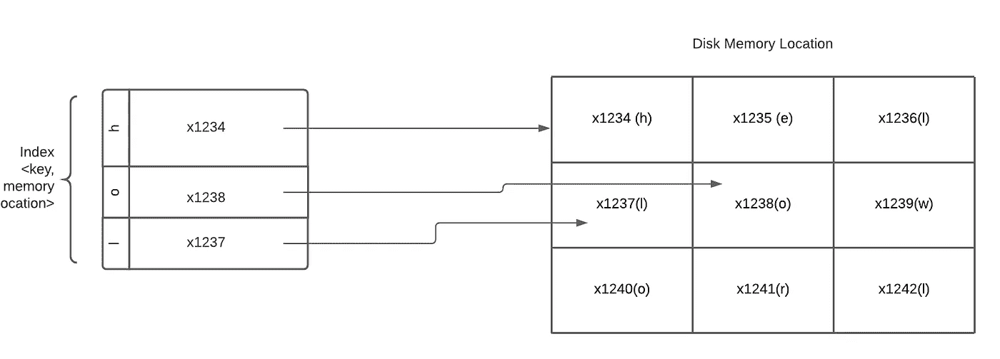
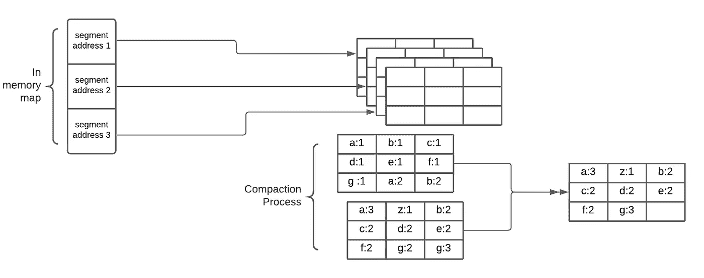
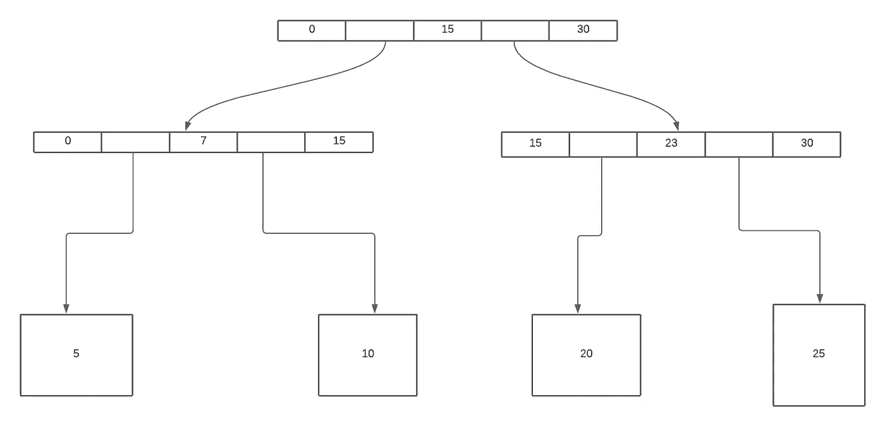

# 了解 LSM 树和 B 树引擎的优缺点，成为数据库专家

> 原文：<https://betterprogramming.pub/become-a-database-expert-by-knowing-the-pros-and-cons-of-lsm-tree-and-b-tree-engines-bbc7e24f040c>

## 了解驱动现代数据库的两大存储引擎系列

照片由 [JJ 英](https://unsplash.com/@jjying?utm_source=unsplash&utm_medium=referral&utm_content=creditCopyText)在 [Unsplash](https://unsplash.com/s/photos/array?utm_source=unsplash&utm_medium=referral&utm_content=creditCopyText)

在评估数据库时，我们通常认为每个数据库都有自己的身份。例如，如果我们想要进行事务性操作，SQL 是一个可以考虑的好数据库。在模型灵活性方面，如果模型经常变化，NoSQL 可能会胜过 SQL。然后我们有了现代的分布式 SQL 数据库，如 Google Spanner，它可以提供全局事务和强一致性读取。

然而，理解这些数据库中的底层存储引擎以解释数据库如何实现这些承诺是至关重要的。例如，为什么关系数据库对于执行事务操作非常有用？SQL 底层的存储引擎是什么使得事务操作非常适合？

针对事务性工作负载优化的存储引擎与针对分析优化的存储引擎之间存在巨大差异。在本文中，我们将讨论两个存储引擎家族，它们为大多数应用程序中广泛使用的数据库提供动力: [SQL](https://en.wikipedia.org/wiki/SQL) 和 [NoSQL](https://en.wikipedia.org/wiki/NoSQL) 。

# 你为什么要在乎？

您可能会想，“我为什么要关心内部数据库存储引擎的运行方式呢？在我的软件工程师生涯中，我很可能不会从头开始实现自己的存储引擎。”

但是，您可能需要了解内部数据库存储引擎的工作原理，以便为您的应用程序做出适当的设计选择。

了解这两种类型的存储引擎会让你明白报纸上所有的宣传和营销是怎么回事。

此外，了解这两种类型的存储引擎有助于您决定为什么要使用 MongoDB 而不是 Cassandra。

这两种类型的存储引擎可以帮助您调整存储引擎，使其在您的工作负载上表现良好。

因此，如果您感兴趣，不再赘述，本文将解释两类存储引擎——日志结构存储引擎和面向页面的存储引擎(B 树)——并分析每种引擎的优缺点。

# 日志结构段存储引擎(LSM 树引擎)

日志结构存储引擎是最简单的数据库形式。它将数据库分成几个段，通常有几兆字节或更大，并且总是按顺序写入它们。

日志结构存储引擎的思想是将数据库视为只附加的日志文件，并且总是将我们的数据附加到它的末尾。一旦写入磁盘，它就是不可变的。

数据打包在数据段中，其中最近的写入总是在最近的数据段中。如果你想从一个磁盘中读取数据，你需要从最近的数据段开始向后遍历。因此，读取将处于线性时间。为了加快读取速度，你需要某种索引。

有几种方法可以创建索引。您可以创建一个内存中的哈希映射来存储您想要查询的所有键以及指向该绝对值的内存块的值。例如，假设你在磁盘上存储了一个大的文本文件——假设每个字符占用一个存储块。像“Hello World”这样的文本文件会占用 11 个块。在这种情况下，关键字可以是字符，值将是该块的位置。这就是如何用键值 NoSQL 数据库实现[Bitcask](https://docs.riak.com/riak/kv/2.2.3/setup/planning/backend/bitcask/index.html)(Riak 中的默认存储)的。

图片由作者提供

储物空间怎么样？由于我们总是在写入磁盘时追加数据，因此我们有可能会用尽磁盘中的大量空间。我们如何避免最终耗尽磁盘空间？

一个好的解决方案是将日志分成一定大小的段。当该段已满时，我们可以将下一个数据写入新的段文件。此外，我们还可以对这些段执行压缩，将这两个段合并在一起，丢弃日志中任何重复的键，只保留每个键的最新更新。

简而言之，当执行写操作时，算法将只在数据段追加数据，并在该数据上创建一个指向该位置的键。如果数据达到最大数据段大小，算法会将新数据写入新数据段。最近的段代表较新的数据，较旧的段代表较旧的数据。当执行读取时，该算法将首先遍历最近的段，遍历每个键并搜索与该搜索相关联的键。如果找不到与最新数据段相关联的密钥，它将扫描下一个较旧数据段上的密钥。在所有这些操作中，该算法将对这些片段执行压缩，以将两个片段合并在一起，从而节省空间。

图片由作者提供

有几种方法可以优化日志结构存储。例如，日志结构存储段是一系列键值对。这些对按时间顺序出现，意味着后面追加的值将出现在键的位置上。从技术上讲，这并不一定要发生，我们可以通过压缩过程对键进行排序。日志结构存储中的这种格式称为*排序字符串表* (SSTable)。我们可以在内存哈希表中有一个[稀疏索引](https://en.wikipedia.org/wiki/Database_index#:~:text=A%20sparse%20index%20in%20databases,search%20key%20in%20each%20block.)来使用这种结构节省空间。LSM 树使用 SSTable 格式将数据保存到磁盘。

## 优势

日志结构存储引擎的优势之一是值是仅附加的。最初，仅追加的设计模式可能看起来效率很低。然而，有几个原因可以解释为什么这种设计模式是有利的。首先，对磁盘进行顺序写入操作通常比随机写入磁盘快得多。正如我经常宣扬的不变性，如果段是不可变的，那么处理并发读写就简单多了。

由于顺序写入操作和稳定格式，每个数据段都可以更好地压缩，因为每个数据段都是封闭的。此外，日志结构存储引擎不需要因为碎片而增加额外的空间开销。

## 不足之处

如果在更新 B-tree 中的值的过程中，服务器崩溃，这可能会导致损坏的索引—一个孤儿的孩子。因此，大多数 B 树设计将在执行任何进一步操作之前写入预写日志文件，以提供存储系统的可靠性。因此，与 LSM 树相比，写入 B 树通常会写入多个源，从而降低操作速度。

B 树中总会有空间开销，因为我们要留一些空间来处理碎片。

## 真实世界的用法

[LevelDB](https://github.com/google/leveldb) 、 [RocksDB](https://rocksdb.org/) 、Bitcask、 [Google Bigtable](https://cloud.google.com/bigtable/docs/overview) 使用日志结构的存储引擎。 [Cassandra](https://cassandra.apache.org/doc/latest/) 支持日志结构和 B 树。但是，本文只提到了您需要了解的这些存储引擎特征的基本算法。这些存储引擎中的每一个都有针对可靠性和弹性的其他优化，我不会在这里谈论它们。

# 面向页面的存储引擎(B 树)

面向页面的存储引擎比日志结构的存储引擎更常见。面向页面的存储引擎中的索引结构之一是 B 树。

b 树与 SStable 的相似之处在于，它有一个按键排序的键值对。但是，B 树遵循基于 4KB 大小的页面或块放置数据的结构。这种结构模仿了底层硬件:磁盘也是按照块来排列的。

像树数据结构一样，其中分支可以作为指向树中下一个节点的指针，每个块都有几个地址来标识另一个块在 B 树中的位置。

图片由作者提供

通常，B 树中的根和每个中间节点是一个指针，B 树的叶子将是该位置的值。每个子页面负责一系列连续的键。

执行读取时，从根页面开始，检查项目是否在键值范围内。如果项目在范围内，则向下遍历到该引用的子页面，递归地向下直到到达叶页面。

当执行写/更新时，B-tree 采用就地更新和写入值的方法:搜索叶键，然后在该页上更改该值并将其写回磁盘。如果没有足够的空间容纳新键，它会创建一个新页面，并更新父页面的指针以指向该新页面。

## 优势

因为 B 树是以树形结构组织的，并且算法确保树保持平衡，所以我们可以假设读者只需要深入到树的深处。

读取数据可能是有利的，因为它只需要 O(logN)时间。大多数数据可以放入具有四或五层深度的 B 树中。

B 树有许多创新，因为它是一个比日志结构存储引擎更成熟的存储引擎。

最后，因为键在 B 树中只存在一次，所以创建提供强事务语义的数据库是非常有吸引力的。因此许多关系数据库内部存储引擎都在使用 B 树。

## 不足之处

如果在更新 B-tree 中的值的过程中，服务器崩溃，这可能会导致损坏的索引，即孤儿。因此，大多数 B 树设计将在执行任何进一步操作之前写入预写日志文件，以提供存储系统的可靠性。因此，与 LSM 树相比，在 B 树中写入通常会写入多个源，从而降低操作速度。

B 树中总会有空间开销，因为我们要留一些空间来处理碎片。

在 B 树的并发环境中更新值是相当复杂的。您需要小心地进行并发控制，以避免树中出现任何不一致的状态。通常我们在更新或访问 B-tree 时，会用闩锁(轻量级锁)来保护树数据结构。

## 真实世界的用法

关系数据库的默认存储引擎遵循 B 树架构。一些 NoSQL 数据库使用 B 树引擎，例如最新的存储引擎在 [MongoDB](https://www.mongodb.com/) 和 [WiredTiger](https://www.mongodb.com/presentations/a-technical-introduction-to-wiredtiger) ，它支持 LSM 树和 B 树引擎。

# 何时使用日志结构的段存储引擎与面向页面的存储引擎

日志结构存储引擎通常适用于大量写入的应用程序。如上所述，顺序写入操作的优势和无空间开销使得将值写入磁盘的速度更快。

LSM 树上的读取通常较慢，因为它们必须在不同的压缩阶段检查几种不同的数据结构和表。

面向页面的存储引擎通常适用于读取量大的应用程序，因为该算法可以确保读取在对数时间内进行。

在核心部分，现代数据库存储引擎使用了针对读写性能进行优化的索引管理算法。数据库 API 层，如 SQL 或 NoSQL，独立于其存储引擎，因为 LSM 和 B 树是在 SQL 和 NoSQL 中实现的。

但是，最终，您的团队需要根据您的特定工作负载对两种存储引擎的性能进行基准测试，以了解哪种存储引擎适合您的应用程序。

# 关闭

在经历了现代数据库存储背后的两大存储引擎家族之后，你就知道为什么没有完美的数据库可以适合所有的应用了。这些架构旨在解决我们应用中的某些问题。这些存储引擎的一般经验法则可以归类为 RUM 猜想。如果你想了解更多，你可以看看我以前的[文章](https://edward-huang.com/distributed-system/2021/01/24/the-trade-offs-behind-modern-storage-systems/)。然而，RUM 猜想类似于流行的 CAP 理论，你只能拥有三个中的两个，而不能拥有所有三个。

现在您知道了为什么 Cassandra 适合于大量写入的应用程序，以及为什么 SQL 可以在事务性操作上表现良好。您知道这些数据库属于哪一类存储引擎。此外，您可以阅读关于这些数据库提供的其他属性的更多信息，并确定您的团队是否应该采用它们。

*原载于*[*https://edward-huang.com*](https://edward-huang.com/distributed-system/database/2021/03/30/two-families-of-storage-engine-that-powers-modern-day-database/)*。*