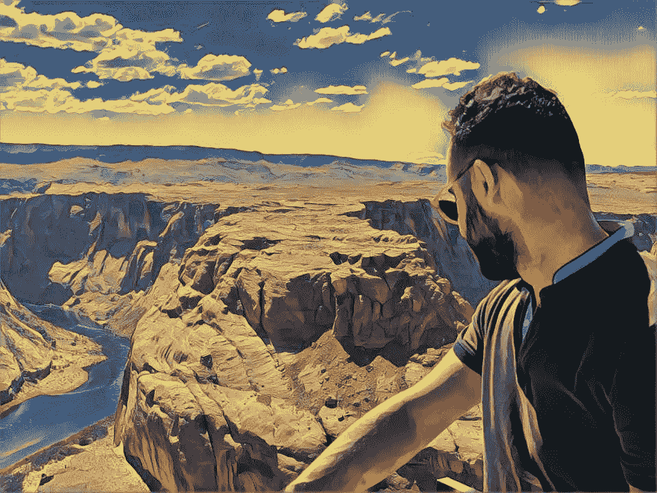

# 成为一名现场可靠性工程师(SRE)

> 原文：<https://betterprogramming.pub/becoming-a-site-reliability-engineer-sre-bbf1ea7ffe8f>

## 我从产品工程师转变为现场可靠性工程师的故事(SRE)

# 介绍

他们说写作是一种调解方式。嗯，我总是这么说，而且我认为这是真的。反思你的过去并写下你的想法是一种冥想活动，因为它有助于你思考你的决定并变得更加自我意识。

这篇文章是我对自己最近的一次职业变动的反思。这也是对我过去四年在 Buffer 的思考。

我最近转行了，从一名产品工程师变成了一名[现场可靠性工程师](https://en.wikipedia.org/wiki/Site_Reliability_Engineering) (SRE)。今年我成为了 Buffer 的第一个 SRE，从我的经历中学到了很多。

我想分享我一路走来学到的一切，以及我面临的挑战。如果你是一个正在考虑进入 SRE 的开发者，我相信你会发现这篇文章非常有用。

这是我在一个周六的早上坐下来，一口气完成初稿的罕见例子之一。涉及的内容很多，我尽量保持简短但有见地。

我们开始吧，好吗？

# 我是谁？

我叫 Tigran，是 Buffer 的高级软件工程师。Buffer 是一家完全偏远的公司，没有办公室。我主要在家或纽约的一个合作空间工作。

我大约四年前加入 Buffer。我作为一名后端工程师加入了一个名为“业务缓冲区”的团队。在我开始工作后，我们进行了大量的团队组建工作。我的团队由一名项目经理、产品工程师、一名设计师和一名数据工程师组成。

在 Buffer 之前，我在纽约的一家金融科技初创公司工作了一年，在此之前，我在学校攻读计算机科学硕士学位。我上学的时候做过两次实习，其中一次是在 Twitter。我喜欢在学校的时光，因为我接触到了一个很棒的环境，和一群聪明的人在一起。

在加入 Buffer 后，我开始从事后端服务，为我们的客户提取和存储社交媒体分析数据。我们是 T2 AWS T3 的忠实用户，由于我是 AWS 的新手，我了解了很多关于在云中运行的服务。

我们在所有的环境中都使用了[弹性豆茎](https://aws.amazon.com/elasticbeanstalk/)，我在第一天就部署了我的第一个[拉请求](https://help.github.com/en/github/collaborating-with-issues-and-pull-requests/about-pull-requests)。运行一个 Slack 命令，将我的 GitHub PR 部署到我们的生产服务器上，感觉很棒。

作为一名后端工程师，我主要使用 PHP 和 JavaScript。我想尽可能多地了解我们的基础设施。

在 [Jenkins](https://jenkins.io/) 上 build 系统是如何搭建的，是谁编写了可以为工程师做事的 Slack bot？我如何在我们的基础设施中启动一个新的 EC2 实例？我有如此多的问题，让我对我的工作感到兴奋。

然后，随着时间的推移，我过渡到了一个使用 React/Redux 和我们的 PHP API 的全栈工程角色。我必须自学 React，这样我才能帮助我的同事构建[缓冲区分析](http://buffer.com/analyze)。

这是一个全新的产品，我们计划作为我们多产品愿景的一部分推出。感觉就像我在一个快速周转和决策的创业公司。

成为一名全栈工程师也帮助我在我的副业项目上取得了进步。我终于可以从零开始构建产品，而不用纠结于状态管理或 JavaScript 代码。

当我开始我的职业生涯时，我认为我想成为一名专家。随着时间的推移，我的观点已经发生了变化，我开始理解作为多面手的力量，以及我能对公司产生多大的影响。

有一天，我可以用 React 构建交互式图表，另一天部署后端 [SQS](https://aws.amazon.com/sqs/) 工作器，或者查找 [Cron 时间表](https://crontab.cronhub.io/)的正确格式。

# 打破巨石

在 2016 年初至年中，我们决定将我们的单片应用程序分解为多个服务，并采用 [Kubernetes](https://kubernetes.io/) 。我们相信，这将使我们能够更快地前进，并使我们的工程工作与我们公司的多产品愿景保持一致。

那时候我们已经和 Docker 一起工作过，有过很好的体验。 [Docker](http://docker.com) 完全支持我们的本地开发环境，我们也从[流浪者](https://www.vagrantup.com/)中走了出来。

因为这是在 2016 年，Kubernetes 不像现在这样受欢迎和主流。我们知道我们正把自己投入一个全新的世界，这个世界充满了不确定性和开放性的问题。

我们知道我们将面临前所未有的技术挑战。我记得我们的 CTO Dan 和我会参加当地的 k8s 会议，看看其他工程团队是如何解决我们急于寻找答案的问题的。

当然，整个微服务器的过渡部分是渐进的，包含了大量的实验和错误。

即使有错误，现在回想起来，原来是正确的决定。我认为，最重要的是，我们从未停止对我们的基础设施进行迭代，使其更加可靠和安全。

当我们决定从 AWS 过渡到 Kubernetes 时，我是倡导这种变化的早期先锋之一。作为一名产品工程师，我看到了如果我们能够将分析基础设施分解为微服务，我们将获得的价值。

我们可以使用 Kubernetes 来协调和管理我们的整个云基础设施。

*   我想把我们的分析 API 从主缓冲 API 中分离出来，这样我们可以更快地行动，做出我们自己的技术决策。
*   我想为我们的团队建立一个单独的构建和 CI/CD 管道，这样我们可以更快地前进。我们的部署平均需要 4 到 5 分钟，这通常会降低我们的速度。作为一个小团队，我们需要更快地行动。
*   我希望有一个快速回滚机制，以便在出现问题时，我可以快速恢复我的更改。这个过程会给工程师更多的信心，提高我们的速度。即使我们打破了一些东西，也不会影响 Buffer 的其他产品。事故的影响很小，因为我们正在开发一种付费客户数量很少的新产品。
*   我不想担心可伸缩性，即使我不得不担心，也只是从我的花哨的主题终端快速运行命令。Kubernetes 让您轻松扩展和缩减服务。它还支持基于本地和外部指标的自动缩放。

我在这里还可以提到许多其他的好处，但是我不希望这个列表持续太久。相反，我现在想把重点放在为 Buffer 的全新角色创造机会的挑战上。

# 为什么要做角色转换？

直到 2019 年初，我一直是 Buffer Analyze 团队的一员。我帮助我的团队将我们的分析数据基础设施从 AWS 迁移到 Kubernetes。

我们开始在新的云基础设施上构建我们的新功能，并向公众发布产品。这是一个令人兴奋的时间，看到新用户好评缓冲分析。

当然，这离不开我们作为一个团队开始面对的新挑战。从整体架构到微服务架构的转变将我们的基础设施复杂性提高了几个数量级。

这种转变带来了人们在使用分布式系统时将会面临的主要复杂问题。我们需要考虑网络、可观察性、部署和安全性。

有时，这意味着产品工程团队不得不解决一些常见的问题，而不是专注于为我们的客户构建优秀的产品。这种复杂性降低了产品工程生产率和团队速度。

我认为这创造了一种对新型工程师的需求，他们可以嵌入到产品团队中。该角色将帮助工程师实现面向可靠性的功能，并就操作最佳实践、自动化、监控和可观察性对他们进行培训。

这些工程师通常被称为 SREs(现场可靠性工程师)。

我知道我喜欢和开发人员一起工作。我去年开始了我的兼职项目,帮助开发人员进行 Cron-job 监控。我在 Buffer 的工作和我的个人项目帮助我发现了我对开发人员生产力和工具的热情。

我也知道我喜欢做一名后端多面手，更多地从事基础设施类项目。我喜欢写代码，但也喜欢理解复杂的分布式系统是如何工作的。

我在 RIT 主修数据库和分布式系统课程，专攻数据库，这不是巧合。

考虑到我的专业兴趣和公司的需要，我决定写一份推介文件。我将这份文件命名为“Tigran 的角色转变动机”，并与我们的工程领导分享。

当然，没那么突然。我事先与我的经理和同事通了电话，公开分享了我角色转变背后的动机。我非常感激 Buffer 拥有非常开放的文化，在我整个角色转换过程中，我都感到非常受支持。

经过几周的讨论和与经理的密切合作，我们为我制定了一个角色转换计划。这是一个一到三个月的计划，在此期间我会把我的职责交给一个新雇佣的工程师。

我们还一起定义了我在基础设施团队中的新角色。我们以前从未有过 SRE，所以作为 Buffer 的第一个 SRE，我必须深入思考我的路线图和未来的项目。

经过两个月的准备和努力，我逐渐把所有的产品工程职责交给了在我的老团队里代替我的产品工程师。我很幸运，他学东西很快。

2019 年 8 月，我是 Buffer 的全职站点可靠性工程师，是基础设施团队的一员。我们的团队由四名工程师和一名工程经理组成。

已经三个月了，充满了各种情绪和学习。我开始着手我的项目，在我们的产品工程峰会上亲自会见了我的新团队，并开始承担更多 SRE 的责任。

# 作为一名 SRE 人，我在做什么

我经常看到人们对 SRE 在组织中的角色感到疑惑并提出问题。我不认为有一个明确的答案，因为在不同的公司里这个角色是不同的。

然而，我相信有一些共同的项目是大多数 sre 工作的一部分。至少，这是我通过与我们行业中的其他 sre 交谈和参加技术会议而了解到的。

因为我喜欢成为多面手，所以我负责整个基础架构。我喜欢同时处理多个项目；这让我的工作更加有趣和令人兴奋。

解决大量的技术问题帮助我创建了思维模型，在考虑大型系统时，这些模型会派上用场。我喜欢参与各种项目，因为我可以通过这种实践来看到我试图解决的问题的全貌。

我通常决定我应该做什么，但是我总是和我的经理商量。我认为，随着一个人成长为更高级的角色，这变得不可避免。一个人做更多的思考，更少的编码。

我总是努力做有影响力的项目，这也是我想转换角色的部分原因。这样，我可以扩大我在公司的影响范围。我处理的每个问题都最有可能影响到多个团队的所有工程师。

我们团队的愿景是让产品团队更加成功。我们将产品团队视为我们的客户。这种心态有助于衡量项目的影响。

当然也有偶尔进来的紧急任务。尽管如此，我们的目标是建立一个可靠的基础设施，为我们提供一个空间来处理不紧急但重要的项目。

那么，这些天我在忙什么呢？

目前，我的主要焦点是用开发人员工具解决常见的工程操作挑战。我正试图让 [Datadog](http://www.datadog.com) 和 [Bugsnag](http://bugsnag.com) 尽可能对工程师有用。

我们在 Buffer 广泛使用这些工具。然而，为了从开发者工具中获得最大的价值，人们应该投资于构建正确的过程，并教育工程师关于这些工具可以派上用场的工作流。

改进这些工作流程的影响是巨大的。想象一下，如果您可以构建一个伟大的系统，帮助工程师更快地调试请求。如果你对这个过程改进了 10%，那就是你组织中工程师数量的 10%倍。现在它变得令人印象深刻。

作为一名现场可靠性工程师，我也一直在思考我们的事故管理以及我们如何改进现有流程。我们有一个健全的待命时间表，但我们还没有合适的操作手册。

我们做事故报道。我认为这些文章对工程师的学习和知识共享非常有用。我非常乐观地认为，我们可以利用这些报道来创建我们的运营手册。

我现在正在做的另一个有趣的项目是为我们的工程师建立一个 [Redis](https://redis.io/) Web UI 代理。我们在 Buffer 中使用 Redis 做很多事情，我认为我们应该让工程师可以观察到它。我的想法是在 Docker 容器上运行 [Redis Commander](https://github.com/joeferner/redis-commander) ，并将其作为内部工具公开。

我的路线图上有很多未来令人兴奋的项目。其中之一是为我们的核心服务实施 [SLOs](https://en.wikipedia.org/wiki/Service-level_objective) (服务水平目标)。SLO 对我们至关重要，因为它们可以支持我们基于数据的可靠性决策。它们是 SRE 实践的核心。

有人觉得 SREs 是随叫随到的，一般不睡觉。尽管在事故发生时，他们在场会有所帮助，但并不要求他们在场。

我们的目标是找出最佳实践，帮助工程师在事故中采取正确的行动。我们为事件处理提供必要的工具、文档和环境。对于任何工程师来说，事件管理都是有压力的，正确处理它是至关重要的。

作为我新角色的一部分，我开始更广泛地与 Kubernetes 合作。Kubernetes 是一项让我特别兴奋的云技术，因为我相信它为我们在其上构建伟大的东西开辟了新的机会。

我认为我们应该做的是在 Kubernetes 之上构建高层抽象，以隐藏系统中所有隐藏的复杂性。它可以让开发者的生活更轻松。

我看到的未来是，我们在 Kubernetes 的基础上构建了大量面向公众的内部工具。

我所有的项目都涉及到与其他工程师的广泛交流和合作。与工程师一起工作，了解他们的日常挑战，并为他们找到正确的解决方案是非常有益的。

和任何一个新角色一样，有很多东西我不知道。这是一件好事，因为我喜欢学习，填补我的知识空白。我认为写下我渴望获得的技能是有用的，这也是我作为 SRE 角色的一部分。

# 我不知道的 SRE

我们运行一个大型分布式系统，它带来了我们从未面临过的挑战。

我喜欢成为 SRE 的一个原因是它让我接触到广泛的问题。现在，我在学校的分布式系统课上学到的所有理论都开始有意义了。

了解理论以及如何在实际工作中应用是一项重要的技能。挑战在于找出问题并找到问题背后的正确理论，这样你才能提出解决方案。

我读了很多关于如何进入 SRE 的书。当谈到我需要获得的技术技能时，我想知道作为我的新角色的一部分，我会期待什么。

我发现 SRE 领域涵盖了多个技能领域:

*   数据库
*   安全性
*   建立工作关系网
*   可靠性最佳实践
*   操作系统
*   软件工程
*   监视

我同意这是很多。尽管成为一名 SRE 意味着成为一名广泛的问题解决者，但大多数系统工程师倾向于专攻其中的一两项技能。

当您在一家公司有多个 sre 时，您可以根据工程师的兴趣和专业知识将这些技能分配到多个领域。

当涉及到学习这些技能时，我会尝试广度优先，直到它变得势不可挡。如果我必须专攻某个领域，那可能是数据库、软件工程和操作系统。

如果你想成为 SRE，那么我强烈推荐你阅读[爱丽丝·戈德福斯的](https://blog.alicegoldfuss.com/) [如何进入 SRE](https://blog.alicegoldfuss.com/how-to-get-into-sre/) 的博文。这是一大堆你可能会觉得有用的资源。

我发现这是除了著名的[谷歌 SRE 书籍](https://landing.google.com/sre/books/)之外最有用的资源。我更多地把这本书作为参考，这取决于我目前正在解决的问题。

我是一名可靠性工程师，这意味着我应该是可靠性方面的专家。然而，我不是，这让我有点害怕。

如果你问我现在定义什么是可靠的和生产就绪的服务，我也许能回忆起模糊的句子。我想学习和了解可靠的、可扩展的分布式系统背后的所有重要思想。听起来很吸引人。

可靠性是一个宽泛的术语，它可以指任何东西，真的。然而，有一个我非常喜欢的定义，我想在这里引用一下。这是我读过的最好的技术书籍之一，Martin Kleppmann 的《设计数据密集型应用程序》 。它对可靠性的定义如下:

> 如果所有这些都意味着“正常工作”，那么我们可以将可靠性理解为“即使出现问题，也能继续正常工作”。" "

可能出错的是硬件故障、软件故障或人为错误。我们的目标应该是与工程师合作，建立能够预测这些错误并处理它们的系统。作者称之为容错和弹性系统。

尽管我认为自己是一个以产品为中心的人，但我总是与产品经理(PM)一起定义技术项目的范围和故事。

我们在基础设施团队中没有项目经理，所以我正在学习成为我自己的项目经理，并在开始工作之前仔细考虑每一个想法。我也开始想知道在基础设施团队中没有项目经理是否普遍。我这里没有明确的答案，但是我觉得在某些方面可能会有用。

我做的大部分工作都是操作性的，包括在多个团队中推动工程变更。尽管我喜欢与各种各样的工程师一起工作，但作为新工程流程的先驱并说服工程师采用新流程是相当具有挑战性的。

我认为，除了技术技能，还需要领导力、清晰的沟通和销售能力。在某些情况下，如果你认为你引入的过程有明确的价值，你应该非常坚持。我正在努力提高这些技能，这样我就能更好地倡导良好实践。

最重要的是，我想我在试着接受不知道一切。我每天都在工作中提问、阅读、努力变得更好。

我也确保自己不会被互联网上的广博知识淹没。保持自由的思维能力是很重要的，这样你才能消化你所学的一切。

# 结论

如果你是一名软件工程师，正在考虑进入 SRE，那么我为你感到兴奋。SRE 是一门新兴学科，仍在积极发展。

有些人对 SRE 与传统的 DevOps 工程师有何不同感到困惑。我对这个问题有同感，但也许这是另一篇博文的主题。

总的来说，如果你喜欢使用分布式系统，喜欢为工程师的创新建立可靠的平台，那么 SRE 可能是一个很好的选择。

大多数 SRE 问题是开放式的，需要朝着目标不断前进。有几天，甚至几周，你可能最终一行代码也没写。你应该没问题。

我成为 SRE 的旅程很短，还有很多我不知道的。然而，我迫不及待地想看看未来会发生什么。

感谢阅读！