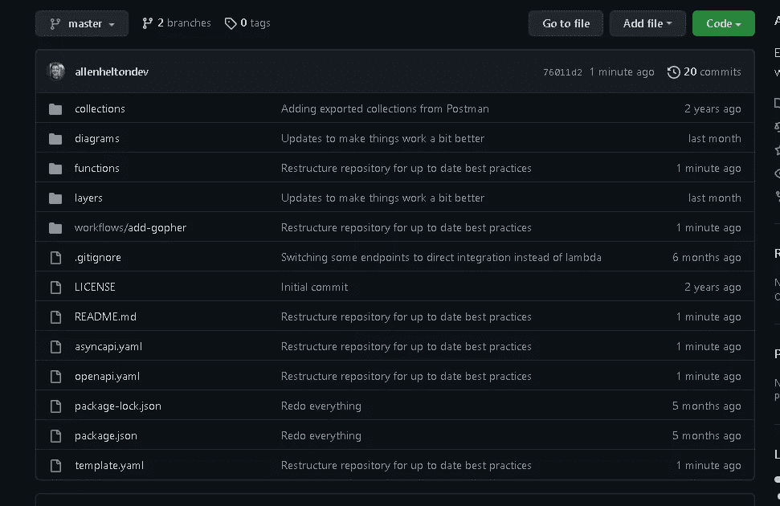

# 构建无服务器微服务的最佳实践

> 原文：<https://betterprogramming.pub/best-practices-for-building-serverless-microservices-a30d5108900a>

## 构建微服务的标准化标准提供了任何人都可以使用和维护的强大、一致的软件

由 [pch.vector](/www.freepik.com) 创建的训练向量

微服务是个搞笑的词。

不是说它听起来有趣或者拼写有趣。但是从某种意义上说，大多数开发者知道它的意思，然而他们不知道它的意思。

即使你从未听说过这个短语，上下文线索也是相当容易的。这是一项小型服务。但是小是什么意思呢？

尺寸小？要多大才算中等服务？

微服务不仅仅是规模。您有部署、存储库结构、领域、维护者、编码约定等等。在决定采用微服务架构时，您需要做出大量决策。

# 什么是微服务？

简单地说，微服务是一个可独立迭代的软件。

它们通常是大型应用程序的一部分。它不应该有需要同时部署其他微服务的硬性依赖关系。它需要能够独立部署。

也就是说，微服务具有依赖性是可以接受的。如果一个微服务触发了另一个微服务事件的工作流，这就是一个松散耦合的依赖关系。部署依赖和功能依赖之间有很大的区别。

功能依赖要求存在其他服务来满足业务问题，而不是进行部署。

如何决定哪个微服务产生事件，哪个消费事件？

微服务应该是[域驱动的](https://www.geeksforgeeks.org/domain-driven-design-ddd/)，这意味着它们负责一种类型的事情。换句话说，这种类型的架构为您的业务逻辑创建了一个关注点分离。

在经典的“购物车”示例中，您有几个微服务，每个微服务都有自己的职责。

*组成购物车 app 的四个微服务*

当谈到增强时，上面的微服务每个都是独立可迭代的，并且具有松散耦合来处理 [saga 工作流](https://microservices.io/patterns/data/saga.html)。但这里要注意的一点是，每个微服务负责一件事。Micro 代表少量的责任，而不是少量的代码。

# 无服务器最佳实践

当考虑无服务器时，微服务架构非常适合。无服务器非常适合单一责任、专注的工作——这就是微服务的全部。

以下最佳实践旨在用作指南。这些对我所在的团队来说效果很好，但是当你把它们应用到你的项目中时，可能需要一些小的调整。

## 仓库

在为应用程序构建存储库时，有两种思路:单一回购与多重回购。

是一个单独的存储库，为不同的服务提供逻辑隔离。换句话说，所有的微服务将存在于同一个 repo 中，但是被不同的文件夹分开。

单一回购的好处包括更容易被发现和治理。缺点包括应用程序扩展时存储库的大小、主分支中断时的大爆炸半径，以及所有权的模糊性。

另一方面，每个微服务拥有一个存储库有其利弊。

多重回购的好处包括不同的领域边界、清晰的代码所有权以及简洁和最小的回购规模。缺点包括创建和维护多个存储库以及对所有存储库应用[一致的治理规则](/going-serverless-governance-is-everything-c70589c9cee9)的开销。

在无服务器的情况下，我选择每个微服务一个存储库。它为微服务的职责划分了清晰的界限，并保持代码的轻量级和集中性。AWS 无服务器设计原则之一是不共享任何东西，将你的微服务分成单独的存储库可以很容易地避免你不应该意外做的事情。

## 文件夹结构

回购中的文件夹结构对于正确组织至关重要。确保你的代码是以一种易于发现和维护的方式构建的。

借助无服务器微服务，按资源类型构建根级文件夹。以 [Gopher Holes Unlimited](https://github.com/allenheltondev/gopher-holes-unlimited) 参考架构项目为例。

*无服务器微服务布局*

所有的 Lambda 函数都包含在`functions`文件夹中。类似地，步骤功能工作流程包含在`workflows`文件夹中。Lambda 图层包含在`layers`文件夹中，依此类推。

按资源类型组织代码有助于开发人员快速跳转到特定的代码。

在这些顶级文件夹中是包含单个资源所需的所有内容的子文件夹。

*包含 Lambda 函数所需的所有文件的子文件夹*

以上面的`get-gopher` Lambda 函数的文件夹为例。它包含一个`index.js`、`package.json`和`package-lock.json`。这意味着每个函数可以有完全隔离的依赖关系，允许您减少 Lambda 包的大小，这最终会减少[冷启动时间](https://aws.amazon.com/blogs/compute/operating-lambda-performance-optimization-part-1/)。

分别处理每个函数的依赖关系。如果你的大多数函数使用相同的包，把它们放在一个[依赖 Lambda 层](/how-to-build-both-kinds-of-aws-lambda-layers-yes-there-are-two-edb945979f17)中，并在你的函数中使用这个层。

## 云资源

理论上，微服务不应该有任何硬依赖。这意味着它应该在没有先决条件的情况下进行初始部署。

考虑到这一点，无服务器微服务应该是完全独立的。它包含所有 Lambda 函数、DynamoDB 表、KMS 键、API 等的资源。记住，不要分享任何东西。

当我第一次开始时，我认为在 AWS 帐户中部署的所有微服务之间共享 KMS 密钥是一个好主意。我创建了一个`shared-resources`微服务，并从堆栈中导出我将在其他微服务中使用的值。

这很快导致了一些不良行为。我想既然我做过一次，而且没问题，我可以再做一次。在我意识到之前，我已经有了部署依赖地狱、循环引用和需要部署的极其具体的订单服务。

不要那样做。

每月额外支付 1 美元，在您的微服务中拥有一个唯一的 KMS 密钥。安全总是值得的。

在定义您的资源时，一切都应被视为代码(IaC)[基础设施。这使您能够一致地将相同的资源部署到任何客户的任何地区。](https://docs.aws.amazon.com/whitepapers/latest/introduction-devops-aws/infrastructure-as-code.html)

无论您使用的是 SAM、CDK、Terraform、无服务器框架还是 Pulumi，都没有关于 IaC 类型的最佳实践。只要你以某种对你有意义的方式定义它，那就是最好的方式。在未来，我们甚至可能不需要 IaC！

# 结论

微服务和无服务器齐头并进。它们缩小了职责范围，提供了分离关注点的方法，并提供了保持敏捷和快速部署到生产的简单方法。

对于软件中的一切，您在微服务实施方面做出的决策都需要权衡。每个微服务都有一个存储库，这提供了对部署的细粒度控制、清晰的领域定义和代码所有权，以及具有低意外“意大利面条代码”风险的简明代码库但是如果使用 monorepo，您会失去一些服务可发现性。

保持组织性是任何项目长期成功的关键之一。在最初的开发团队离开项目，长期的维护人员加入之后，他们会知道你做了什么以及如何找到代码吗？随着时间的推移，定义良好的文件夹结构可以提高应用程序的可维护性。根据资源类型构建您的微服务，以便维护开发人员在出现问题时准确地知道去哪里找。

构建自包含服务。不要构建需要来自其他服务的资源来部署的[栈](https://docs.aws.amazon.com/AWSCloudFormation/latest/UserGuide/stacks.html)。但是，你可以(也应该！)构建依赖他人的微服务，通过 API 调用或事件的松散耦合来满足业务流程。

如果你想启动微服务，别忘了它们是由领域驱动的。当希望“打破整体结构”时，首先要识别应用程序的离散部分。找到应用程序中具有足够的业务逻辑的区域，这些逻辑独立于其他区域并独立迭代。

如果你用了几年时间，意识到两个微服务应该合二为一，或者一个服务变得太大，需要拆分，*去做*。软件的美妙之处在于，每次你重访 T4，它都会变得更好。

用我上面概述的作为指导。对我的团队有效的可能对你和你的团队无效。但是把它作为一个参照点会让你离开地面，开始积累经验。

编码快乐！