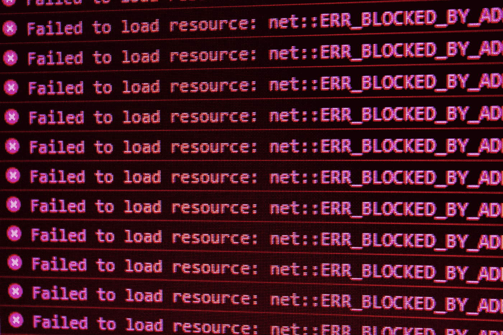

# 你能用操作系统构建更好的软件架构吗？

> 原文：<https://betterprogramming.pub/better-software-architectures-using-the-operating-system-do-you-need-a-database-d667443cbccb>

## 需要数据库和 API 吗？

[兰斯·安德森](https://unsplash.com/es/@lanceanderson?utm_source=medium&utm_medium=referral)在 [Unsplash](https://unsplash.com?utm_source=medium&utm_medium=referral) 上拍照

我想提交一份免责声明，因为我即将发起的这种谈话会让人们愤怒地离开。我不想颠覆软件架构。今天的项目不仅复杂，而且通常受到不合适的工具、不合理的期限和误解的需求的约束。我在这里试图指出的可能只是一个理论上的练习。你拿走你觉得有价值的东西，其余的放在理论练习箱里。

讨论很快就变成了理论。你用你最喜欢的平台和开发语言工作，你用客户需求工作，你用公司决定投资的东西工作。你有一套给定的库，允许你做各种各样的任务。你可能使用一个数据库和一些服务，你做的每件事，你工作的每项任务都依赖于这些依赖和约束。如果是 C#也可能是实体框架、SQL Server、Azure。NET API 等等，你可以在这个沙箱中完成每一项任务。软件开发人员的生活是美好的，可预测的:它是可行的。

但是在这个小沙盒后面有一个你很久以前就忘记的怪物。也许在你早年的时候，你曾经驯服过它，但是这门艺术被遗忘了，它的路径被隐藏了。现在你依赖于平台、服务、云，当然还有数据库、lambda 函数:一切都是可扩展的，就像你的客户说的那样，一切都是可测试的，就像架构师说的那样，一切都在使用数据库，就像管理员说的那样。但有时，*一个文件*绕过所有框架、所有 API、所有云基础设施，解决了整个问题。在你的应用层之外，还有操作系统。

# 使用文件作为标志，而不是数据库行

扬·安东宁·科拉尔在 [Unsplash](https://unsplash.com?utm_source=medium&utm_medium=referral) 上拍摄的照片

我开始了解操作系统是在一段时间以前，在我以前的工作中。我们需要知道应用程序在部署后何时可以使用。我不记得上下文了:一些跨团队的需求。架构师很快决定在数据库中用日志标记成功的部署，然后在 API 中创建一个端点来查询它。简单，如果不是因为难看的后端。我从来不喜欢往里面添加东西。数据库也是如此。

我想了一下，提供了一个更简单的解决方案:如果部署很好，应用程序已经准备好工作，那么让构建过程在部署文件夹中添加另一个文件作为成功的标志。API 可以检查文件是否存在，并回答它是否存在。架构师稍微思考了一下，提供了一个改进:不需要新文件，构建过程已经在部署文件夹中创建了一些东西，可以用作随时可用的标记。他很高兴，因为这个解决方案不太复杂，我也很高兴:它更容易实现。

这个解决方案也更加稳固。创建文件是低级操作系统操作。如果失败了，您肯定知道发生了可怕的错误，如果您将此操作与应用程序部署联系起来，很明显部署失败了。在数据库中将部署设置为已完成的工作方式略有不同。部署可能已成功，但无法访问数据库。部署可能出错，但数据库没有正确更新。应用程序服务器和数据库服务器之间的通信可能已失败。很多事情都会出错。

检查文件夹中的文件是任何操作系统的基本操作。它处理文件系统元数据的速度也非常快:它甚至不需要实际的文件读取。对于数据库来说并非如此。更不用说数据库可能需要为快速扫描建立索引，这又会占用额外的资源。

# 将文件用作可编辑的数据存储

Nguyen Dang Hoang Nhu 在 [Unsplash](https://unsplash.com?utm_source=medium&utm_medium=referral) 上拍摄的照片

一个朋友正在开发一个测验应用程序。他有复杂的测验，有等级问题和依赖性。最初的体系结构没有受到挑战:问题都是针对数据库的。我再次建议他使用文本文件作为替代:任何人都可以轻松编辑，不需要 API，部署和构建更快。他的最终解决方案甚至更好:降价文件。

但是让我们考虑一下管理 UI。问题在*文本文件*中。每个操作系统都有文本编辑器。您真的需要构建 API 和额外的 UI 来添加和删除问题吗？您是否需要自定义 UI 来根据现有问题创建新的测验？是也不是，当然，这取决于编辑器和您需要的特性，但最好的情况是您可能什么都不需要:一个文本编辑器可能就足够了。由操作系统提供。更不用说对于 markdown，你有更好的编辑器。

让我们也考虑一下架构:依赖于其他问题的问题可能会放在一个子文件夹中。当用户选择一个问题时，依赖文件夹也被调用并要求完成。对于验证，你可以有代码，也可以使用像脚注或注释这样的标记技术。

为了拥有这一切，值得移除数据库吗？我很乐意移除一个应用层来简化架构。这会使开发变得复杂吗？这肯定会让你思考和计划得更多，但是如果你找到了所有需要的应用程序特性的解决方案，开发应该更容易而不是更难，应用程序应该与操作系统分担责任。

# 使用系统日志而不是日志数据库表

[大卫·普帕扎](https://unsplash.com/@dav420?utm_source=medium&utm_medium=referral)在 [Unsplash](https://unsplash.com?utm_source=medium&utm_medium=referral) 上的照片

我正在开发一个需要关键日志记录的应用程序。我想您现在可以预测模式了:架构师毫不犹豫地决定使用表格来记录日志。我开始问问题:桌子忙怎么办？数据库无法访问怎么办？如果通讯被切断了怎么办？当然，架构师捍卫了他们的立场:数据库是 ACID 兼容的，写就是写，我们可以使用事务等等。事实是，尽管说的都是真的，我们没有办法确保日志甚至到达数据库，更不用说它们被安全地存储了。

实现的解决方案是使用 Linux 系统日志。我们必须在项目中添加一个小的库来处理系统日志，配置它，就这样。日志解决方案非常有效，我们决定完全放弃数据库日志，将所有内容记录到系统日志中。这不仅提高了应用程序的速度，因为登录数据库需要许多上下文、请求和等待，我们现在可以使用几个专门用于日志浏览的 Linux 工具来浏览日志，这些工具的构建和功能都非常好。比如`lnav`比如我之前[写过](https://raduzaharia.medium.com/making-sense-of-the-linux-logs-e3898093d7f5)的。

同样，我们利用了操作系统提供的服务。我们还使用了一个专用的日志浏览工具，而不是构建另一个 UI 来检查日志。应用程序变得更简单，失去了整个日志管理 UI，我们开始学习 Linux 系统日志和`lnav`。让我告诉你，两者在处理日志方面都比我们用所有的框架和库做得好得多。

# 我们为什么要挑战已经尝试过的解决方案？

图为[美元吉尔](https://unsplash.com/@dollargill?utm_source=medium&utm_medium=referral)在 [Unsplash](https://unsplash.com?utm_source=medium&utm_medium=referral)

我有更多的例子，也许有一天我会继续这篇文章的第二部分，但现在我应该停止，因为这一点有些不同。我不想被误解为我们应该停止使用我们选择的编程生态系统提供的库或服务。或者尝试对所有事情都使用文件。对于软件平台来说，文件有一个时间和位置。

我想要的是让你质疑平台、API、云解决方案、生态系统、数据库以及许多我们每天都认为理所当然的更可信和不受挑战的架构决策的使用。当然，我也想提醒你关于你的朋友，操作系统。

操作系统有一个 API，即允许你使用文件、线程、资源、套接字、消息队列等的系统命令。它还有一个数据库，一个带有文件锁的文件系统，允许你锁定文件的一部分:一些用于读取，一些用于写入。作为一名开发人员，你需要知道在每种情况下什么能更好地帮助你:是编程语言，是库，还是操作系统？应该在表中写一行吗？一份文件就够了吗？

我希望我不会像那些老抱怨者一样，无法放下他们的汇编语言。当然不是这样。事实上，我已经决定了我的下一篇文章要写什么，是的，它将会是更多有缺陷的软件架构的例子。

所以，如果你觉得这篇文章空洞或肤浅，也许可以跳过下一篇。但是，如果它让你想到如果软件利用更好的工具，而不是妥协的架构，仅仅因为这是它的工作方式，软件会是什么样子，我希望下次再见到你！