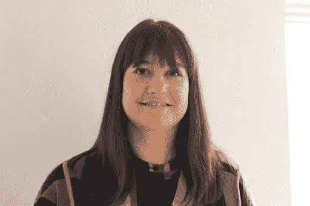

# 心胸宽广的领导以及它给你的组织带来的变化

> 原文：<https://betterprogramming.pub/big-hearted-leadership-and-the-difference-it-makes-to-your-organisation-383de700a174>

## 谢菲尔德大学信息技术主任 Bella Abrams 的问答

图片提供:我:)

这篇文章介绍了我和我的客户贝拉·艾布拉姆斯的一次问答。贝拉是谢菲尔德大学信息技术主任。我们讨论了用心领导，以及在新冠肺炎时代这给她的团队带来的变化。

## **三月份，你和你的团队在三天内将 30，000 名学习者和 8，000 名讲师转移到了网上。这是如何实现的？**

谢菲尔德大学是英国一所大型的罗素大学。我们有 3 万名学生，8，000 名员工分布在五个学院。我们有 44 个学术部门，从艺术和人文学科到工程学，我们无所不包。我们还与波音、迈凯轮和劳斯莱斯等公司建立了世界领先的先进制造研究和工程合作伙伴关系。

虽然我们在疫情之前就开始计划，但事实是我们在很短的时间内做了许多超人的事情，同时还担心我们的健康和生病的风险。

许多服务已经开始运行。我们有一个视频会议平台，一个在线虚拟学习环境，我们可以现场直播讲座。但是我们突然从低水平的使用变成了被所有人使用。例如，我们从每周 200 次谷歌闲逛到 18000 次。最重要的是，我们将我们的 VPN 从同时处理 400 个用户的能力一夜之间提升到了 4，800 个。实现这一点是一个神话般的努力。

我们成功的关键不是供应技术和提供工具，而是培养人们知道如何访问和使用所提供技术的信心。这是一个巨大的转变。

交流非常重要。我们讨论了学校在封锁期间可能面临的挑战，并开始尽我们所能帮助学校应对。我最引以为豪的是我们对客户及其需求的关注。

例如，我认为许多讲师发现向在线教学的转变令人生畏，所以我们以软件开发的形式引入了一种最基本的可行产品，以减轻员工的压力，并确保他们可以使用一些让学生感到舒适的东西，并且可以随着时间的推移而改进。

## **与为数不多的用户相比，必须规模化运营有什么独特之处？**

我的团队中的丹和汤姆发现了问题的关键，这实质上是在一夜之间重写我们的通信。他们把焦点从“这里有一些技术，这是你如何使用它”转移到“你在哪里？你在做什么?您可能需要哪些工具来帮助您完成想要完成的任务？”它让我们不再是一个只提供工具帮助的服务团队，而是理解客户的问题，并给予人们使用工具的信心。这是一个非常重要的变化。

还有，光靠广播邮件是无法和 38000 人沟通的。在网站上放点东西是做不到的。你必须利用所有可用的不同沟通渠道:写常见问题，参加委员会会议，通过部门领导层层传递。有时候，信息根本不落地，你必须承认这一点，并改变它们。

持续创新是我一直在我的团队中鼓励的文化变革的核心。我在很多地方工作过，有失败的项目也有成功的项目。我做过好事，也做过坏事。我在尝试做巨大的事情时学到的一件事是，我们不能一口气吃掉一头大象，所以你开始啃象鼻。

它必须是迭代的和灵活的。我们精炼了我们的信息。我们关注运作良好的事物，并鼓励其他人也以不同的方式工作。

## 在一个远程团队工作的世界里，一个人如何用心领导？

我经常想到用心去领导。最重要的是理解我的感受，因为每个人都和我处境相似。我在家工作，我和我的伙伴一起工作，因为需要有人照看孩子。我团队中的许多其他人目前也在这样工作，或者他们有其他责任，所以这是关于理解人们的情况，真正关心我的团队做得如何，并在我的期望中实现这一点。

我也试图明确表示，这与你一天打多少视频电话、回复多少邮件或者工作到晚上来弥补时间无关。这是关于关注产出和允许人们根据他们自己的个人情况来计划他们的工作。

我很担心人们花在视频通话上的时间，所以我一直鼓励人们在打电话的同时去公园散步。

## **你所说的很多都抓住了人们的核心。你能和我们谈谈你的领导哲学吗？**

我已经意识到，当我看到缺乏诚信时，我会感到愤怒，所以这可能是我的关键价值观之一。我努力保持自己的正直，诚实坦率地说话。这一点和真实性对我来说真的很重要。

我希望我的团队快乐，享受他们的工作，并觉得他们所做的是值得的。我经历过站在另一边，为和我没有相同风气的人工作，这不是很好。挑战在于，当你想变得真实时，你不可能总是让每个人都开心。有时人们不会接受我的信息和想法，这没关系。

## 你如何应对别人的冷嘲热讽和抵触情绪？

我认为防御性和愤世嫉俗可能显示了一个人对自己的感觉。我认为，一些(公司)文化可能围绕着某种防御性和犬儒主义成长，而不是以客户为中心。这种犬儒主义可以通过创造一种将客户放在第一位的文化来打破，并在技术团队可以带给客户的东西和客户可以在对话中带来的东西之间实现思想的协同。

犬儒主义也可以从人们说他们会做一些事情，然后不兑现，所以保持一致也很重要。如果我承诺团队会做一些事情，我会确保跟进，这是建立对团队和我的信心的一个重要部分。

## **展望后新冠肺炎时代，领导者需要哪些技能才能在未来的世界中真正脱颖而出？**

人们必须关注的技能通常被称为软技能，但它们并不软。我们很可能会发现自己处于这样一种情况，许多人仍将远程工作，而其他人将在社交距离较远的工作场所工作，这将是一件非常难以平衡的事情。这意味着它不是关于技术技能，而是关于理解个人在哪里，他们可能面临什么障碍，他们的情况可能如何影响他们，以及如何解决这个问题的能力。所以这又回到了换位思考和考虑人们可能如何工作的问题上。

我担心的是松紧带有弹回的趋势。人们不能仅仅回到过去，因为仍然在家工作的人可能会觉得他们得到了不同或更糟糕的体验。

我担心我的团队花费大量时间进行视频通话，因为我们都知道这有多累。但我不想说你花在视频通话上的时间是有限的。我想要一些指导方针，让人们思考他们是如何工作的，并关注生产率，而不是完成的时间。我希望我们开始建立一个“团队框架”，因为当我们开始改变我们的工作方式和地点时，我们将记住我们在偏远地区需要什么，我们将把我们最好的思维和工作实践带到我们的未来。处于禁闭状态本身就是一种巨大的集体体验，但对每个人来说并不相同。

## **在一个充满不确定性的世界里，你如何为数千人制定战略？**

我擅长战略的原因是我认识到人是战略的中心。战略就是改变事物。它是关于有一个计划，并且能够把它传达给人们——描绘一幅未来的图画，以及它会有多美好。但是，如果人们不相信这一点，认为这是不可实现的，那么它就不会发生。

## 团队绩效的最大阻力是什么？是什么让团队超越他人？

最大的阻力是缺乏心理安全感。如果人们害怕某样东西不工作，并因为某样东西出了问题而受到指责，这会阻碍表现。我工作过的一些最好的团队被允许以不同的方式做事，我们可以挑战现状。而我工作过的最差的团队有很多指责和指责。

当你进行回顾并考虑为什么事情出错时，作为一名领导者，你需要证明这不是一次指责练习——这是关于学习的。

你无法快速重建信任。建立心理安全，让人们觉得可以信任他人，这是一个漫长的过程。这不会在一夜之间发生。这就是为什么一致性、真实性和完整性会带来回报。

**想要以更宏大的方式领导的人们明天可以开始做什么？**

听听人们在说什么。如果有人在会议中没有发言，想想他们为什么没有发言。如果有人没有创造出他们应该创造的产出，想想为什么会这样。这一切都是为了理解人们，以及是什么在驱动他们的行为。

在我们的领导会议开始时，我使用“情绪天气报告”:每个人都走来走去，说出他们的感受。我开始——如果我过了糟糕的一周，我会这样说，如果我过了好的一周，我也会这样说。我真正喜欢的是安排会面的诚实。有时候人们会说一些很难听的话，有时候人们会说一些可能不是他们真实想法的话。当他们说这些事情的时候，你可以使用很多线索来了解他们在哪里，以及他们是否需要任何帮助。

你可以通过以身作则并展示其效果，鼓励他人以更加以人为本的方式进行领导。在看到回报之前，很难说服那些看不到事情价值的人去做。另一件事是寻找其他例子，在这些例子中，同情心泛滥的领导在其他组织中获得了回报。

你可以伸出援助之手，变得更加包容，利用你的关系网去帮助那些不一定已经是你关系网一部分的人。和那些你通常不会在日常生活中与之交谈的人交谈，提供一些指导，并把人们介绍给其他网络。给人提供帮助，不要等着被请求，因为请求很难。

贝拉·艾布拉姆斯正在与[北部价值创造者](http://www.northernvaluecreators.com)(英国谢菲尔德)的[阿曼达·库克森](https://twitter.com/AmandaCookson)和[因克拉里塔斯](https://inklaritas.com/)(美国新泽西)的肯·布莱克威尔交谈，这是他们领导对话系列活动的一部分。要观看完整的采访并了解即将发生的事件，请访问[对话脸书集团的领导者](https://www.facebook.com/groups/568134280499380/)

下一次领导人对话是在 6 月 24 日星期三，人类工作场所。门票[https://www . eventbrite . co . uk/e/the-human-workplace-tickets-110087950022](https://www.eventbrite.co.uk/e/the-human-workplace-tickets-110087950022)