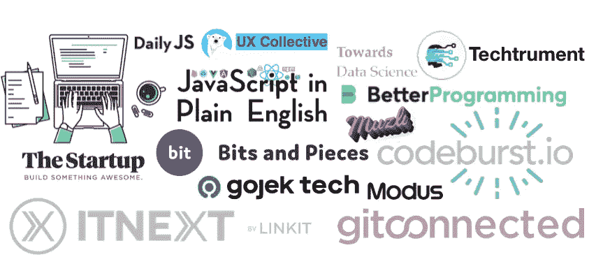

# 博客文章和编程:写作的 7 个理由

> 原文：<https://betterprogramming.pub/blog-posts-and-programming-7-reasons-to-write-e502350ff51a>

## 写科技相关的文章对你的职业生涯有什么帮助？

由[格伦·卡斯滕斯-彼得斯](https://unsplash.com/@glenncarstenspeters?utm_source=medium&utm_medium=referral)在 [Unsplash](https://unsplash.com?utm_source=medium&utm_medium=referral) 上拍摄的照片

当我第一次在熨斗学校开始我的旅程时，我被告知我们负责撰写五篇关于编码各个方面的博客帖子，从市场趋势到像[分解 ORM 和 Ruby](https://medium.com/better-programming/breaking-down-orm-and-ruby-aa8174c4b632)这样的事情。我其实很喜欢写作，所以我不太介意。然而，对一些人来说，这感觉像是给一个已经很大的程序增加了额外的负担。在这篇文章中，我想探究为什么像这样的文章会有很多好处，而且很大程度上取决于你对它们的理解。

对某些人来说，这可能看起来更像是一篇无关紧要的文章。考虑到这一点，我会说，如果我不相信我写的东西，那么我就不会写它。这篇文章的目的是反思为什么写关于编程的文章会有所帮助，不仅对同病相怜的学生，而且对整个技术作者都有帮助。事不宜迟，我们开始吧！

# 1.写一篇帖子可能会很赚钱

由 [Alexander Mils](https://unsplash.com/@alexandermils?utm_source=medium&utm_medium=referral) 在 [Unsplash](https://unsplash.com?utm_source=medium&utm_medium=referral) 上拍摄的照片

首先，这可能是本文被浏览最多的部分。它引人注目，激起了人们的兴趣。如果你的文章跟风，写得好，可以在 Medium 这样的网站上为你赚钱。到目前为止，我只赚了不到 10 美元，所以，虽然这不会马上带来账单，但它会给你一些额外的收入来做一些你最终可能不得不做的事情。

当你在帖子中获得恶名时，你就增加了赚更多钱的机会。有些作者在 Medium 上发表的文章一个月赚 500 美元，这种情况并不常见，但也不是闻所未闻。虽然你可能挣不了那么多，但我想我们都同意额外的钱是有用的。所以为什么不写点值得的东西呢？

# 2.写一篇文章可以成为简历的建设者

在 [Unsplash](https://unsplash.com?utm_source=medium&utm_medium=referral) 上由 [Helloquence](https://unsplash.com/@helloquence?utm_source=medium&utm_medium=referral) 拍摄的照片

当你进入就业市场，刚从新兵训练营或其他形式的教育机构出来时，你的投资组合可能会是雇主们关注的最重要的东西。然而，你可以将博客帖子视为一种“调味品”——如果你有许多写得很好的文章，它们只会对你有利。

这更多地与内容更具技术性的帖子有关，但任何关于该行业的发人深省的文章肯定会引起人们的兴趣。博客帖子可以是补充性的——例如，我正在写一个关于正则表达式的[系列。](https://medium.com/better-programming/the-joy-of-regular-expressions-part-1-what-is-regex-539dc581e282)我认为自己在使用它们方面相当熟练，但目前我的投资组合中没有任何特定的东西可以证明这一点。在我关于这个话题的帖子中，虽然他们没有深入探究其中的逻辑，但我已经表达了我知道它们是如何工作的，以及如何在不同的情况下应用这种逻辑。

对于潜在雇主来说，这是一个很好的方式，不仅可以看到你技能清单上没有的额外知识，还可以看到你如何组织专业文档，这可以反映你的组织作为一个整体。

# 3.写一篇文章可以让你发表文章

Matt Cummings 的媒体技术出版物拼贴

这与上面两个部分有联系。我非常幸运地发表了我的第一篇文章，一个叫 [Better Programming](https://medium.com/better-programming) 的人找到了我，要求将这篇文章发表在他们的出版物上。这不仅在简历上看起来很棒，而且也增加了读者看到你的帖子并为你赚钱的机会。更重要的是，出版可以带来新的联系，建立新的友谊和机会，否则你可能不会遇到。

# 4.写一篇文章可以促使你探索一个话题

照片由 [Jon Ly](https://unsplash.com/@jonatron?utm_source=medium&utm_medium=referral) 在 [Unsplash](https://unsplash.com?utm_source=medium&utm_medium=referral)

一个流行的说法是，如果你能以一种有意义的方式很好地解释一个话题，那么你对这个话题了解很多。我发现这是真的——事实上，记笔记可以被看作是对这一点的补充。将这种逻辑扩展到你的文章中，可以让你洞察到你对一个主题实际了解多少，以及你如何将你在这个主题上的知识传达给外部资源。能够向他人解释你的思维过程是一种很好的沟通技巧，在接下来的部分会有更多的涉及。

# 5.写文章可以提高你的语言技能

本尼·基鲁卡兰在 [Unsplash](https://unsplash.com?utm_source=medium&utm_medium=referral) 上的照片

我认为一个人能为自己做的最好的事情之一就是学习一项新技能。写作是一种简单易学、难以掌握的天赋，但不需要太多的资源来提高。如果你有任何用于文字处理的设备，不管是笔、电话还是像我现在正在打字的电脑，那么你就有机会改进你的写作风格并磨练它。

文学最棒的一点是，许多作者都有独特的天赋，这不仅来自他们的句子结构，还来自他们的遣词造句。词汇的选择可以完全改变一篇文章的基调，从平淡乏味到发人深省，并提高读者对该主题的兴趣。通过写连续的文章——这实际上类似于练习任何其他技能，比如弹钢琴——你会更多地了解你想要的写作方式，了解什么可行，什么不可行，以及什么可以改进。

我愿意认为我写的东西听起来很聪明。这很大程度上是因为我以前的写作经验，但也是因为我使用谷歌和词库来找到我需要的确切单词来表达我的观点。如果你发表了文章，看看编辑如何重构你的文章，看看他们做了什么改变，这很有趣。虽然你可能不同意所有的变化，但它为你提供了有价值的反馈，让你知道你是如何组织一切和你所做的语言决定的。

写关于编码的文章可能会显得枯燥和晦涩，尤其是当你刚刚进入 it 世界的时候。作为一个作者，你的工作就是让读者对这篇文章感兴趣并能理解。通过练习这种技巧，你显然会在技术写作方面变得更好，而且在整体写作方面也会变得更好。在任何工作环境中，这都是一项非常有价值的技能——任何能够就某个主题进行有效而明确的交流的人，都一定会成为与该主题相关的任务的关键人物。

# 6.写一篇文章可能会激发新的兴趣

[韩](https://unsplash.com/@madeyes?utm_source=medium&utm_medium=referral)在 [Unsplash](https://unsplash.com?utm_source=medium&utm_medium=referral) 上的照片

虽然在你作为一名技术作家的旅程开始时很难想到要写的内容，但毫无疑问，你会遇到一些至少让你稍微感兴趣的主题(否则，你到底为什么要写这个呢？).它甚至不一定是超级具体的东西。它可能是关于代码的组织，或者你觉得是一个未被探索的主题(这也是我为什么首先写 regex 的原因)。从那里，你可能会发现你对那个话题的兴趣增加了，或者可能会发现一个你想了解的相关领域。

自学有关该主题的新知识会给你带来两个好处:有东西可写，增加对该技能的理解和熟练程度，进一步将你与该领域的其他人区分开来。在简历上写一些独特的东西可以让你更有市场。如果你的某个兴趣与公司的目标或商业战略高度一致，很有可能一些雇主会更倾向于你。

# 7.写你的文章可以帮助别人

照片由[米米·蒂安](https://unsplash.com/@mimithian?utm_source=medium&utm_medium=referral)在 [Unsplash](https://unsplash.com?utm_source=medium&utm_medium=referral) 上拍摄

这应该是显而易见的，虽然它可能不会像我在这里写的其他部分那样直接影响到您，但它仍然是一个事实。我在这里看到了一些帖子，这些帖子确实有助于正确看待一些事情，我感谢写这些内容的人。我不会给你一些感觉良好，课后特殊排序的废话。首先，你写这些帖子的主要原因是向读者解释一个概念，阐述一个已经确定的话题，或者对某事发表意见。所以，你写的东西能对读者产生作用。既然你已经在键盘前了，为什么不把你正在做的事情变成最有益的事情呢？

我的帖子如此全面的一个主要原因是为了让读者能够明白——用简单的英语 *—* 我到底在说什么，以及他们如何使用我写的东西来创建他们自己的代码。我最大的挫折之一是，当我寻找关于某段代码如何工作的信息时，我发现许多解释变得如此费解和扭曲，以至于我感觉好像在穿越一个黑洞。你会看到一些你以前从未见过的外来代码片段，它们甚至没有被详细说明，或者是某种不起作用的隐喻，它们只是占据了页面上的空间，并没有真正阐明这个人想说什么。

我绝对不喜欢碰到这种情况，也不喜欢浪费时间去寻找写得好的有实际意义的东西。我的目标是尽可能清楚地表达我的观点。这就是为什么它们中的许多在结构上确实是程序性的，并且在某些点上过于详细。

为了防止自己东拉西扯，回到正题，写帖子时你需要考虑的最重要的事情之一是，其他人会阅读它。记住这一点，你会发现自己在确保你所写的东西是有条理的，易懂的，并且是有用的信息。这对消费者来说只会更好。

# 结论

正如我在引言中所说的，这篇文章的目的是让我们，作为作者，思考我们为什么要写这些文章，以及它们如何能让我们和阅读它们的读者受益。

所有这七个理由都是你在写作过程中可以参考的要点，无论是从你认为会提高帖子受欢迎程度的流行语，还是你在句子中的用词。我恳求你们所有人——即使你不认为自己有天赋，因为它会到来——继续写你感兴趣的话题，保持对我在这里所做的事情的认识。如果你坚持下去，你的写作质量会越来越高。这对每个人都有好处，包括作者和读者。