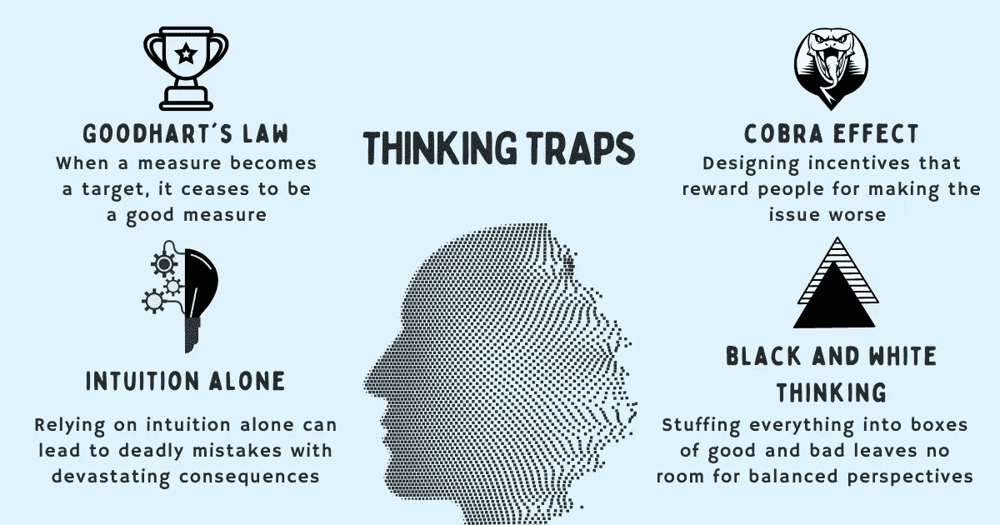

# 从这 4 个领导力思维陷阱中挣脱出来

> 原文：<https://betterprogramming.pub/break-free-from-these-4-leadership-thinking-traps-8e0f4996834c>

## 做出好的决定需要排除坏的选择

鸣谢:作者

在[的上一篇文章](/4-thinking-traps-of-ineffective-leaders-7802b0ae5ce2)中，我写道思维错误是导致领导力失效的最大原因。当领导者不注意他们是如何思考和决策的，它对组织和员工的影响，他们的行动——不管他们的意图多么好——就不会产生预期的效果。

做出好的决定不仅仅是做出正确的选择。这也是关于能够识别和消除不好的。

以下是导致领导力失效的另外四个思维陷阱:

1.  古德哈特定律
2.  黑白思维
3.  眼镜蛇效应
4.  单凭直觉

# 古德哈特定律

古德哈特定律指出，“当一个衡量标准成为目标时，它就不再是一个好的衡量标准。”换句话说，当你开始在特定的最终目标上衡量人们时，他们只会为了那个目标而优化，并试图不惜一切代价达到结果，而不考虑后果。

当领导者设计专注于实现既定目标的激励措施时，它会促进无意识的行为——对目标实现的主要关注导致最大化衡量人们的标准，而不关注产生这些结果的过程。这也导致忽视其他重要领域。

> “激励结构起作用了。因此，你必须非常小心你激励人们做的事情，因为各种激励结构会产生各种你无法预料的后果。”—史蒂夫·乔布斯

## 如何避开古德哈特定律

领导者可以通过使用多种措施，而不是只依赖一种措施，让员工难以玩弄系统，并激励正确的行为。这个伟大的战略来自*“衡量重要的东西”*的约翰·杜尔登，他建议将数量衡量与质量衡量结合起来。例如，不要只把准时交付作为绩效的衡量标准，也要把质量作为一个参数。报告了多少 bug，代码审查过程表明了什么，它是否能适应未来的需求？

通过评估多个参数——定性的和定量的——你鼓励人们做出更符合未来和他们目标的选择。

## 古德哈特定律的例子

如果一家广告公司只在点击率上受到激励，它会优化点击量而不关注目标用户。在这种情况下，即使广告宣传无效，高点击率也能实现目标。

为了避免古德哈特定律的影响，除了单独测量 CTR，还要将流量质量也包括在内。这将确保广告公司优化活动，将正确的广告放在正确的用户面前。

# 黑白思维

当领导者以非黑即白的方式思考时——正确或错误，好或坏，值得或不值得——他们在做出决定前不会考虑所有相关的事实和论据。

当他们的字典中的两个词“总是”和“从不”统治他们的生活时，很难区分事实和虚构。先入为主的观念加上这种思维上的僵化是危险的；它们阻止他们学习、改正和适应明天的需要。

把所有东西都塞进好的和坏的盒子里，就没有平衡观点的空间了。它不仅会导致糟糕的选择，还会引发领导者的自我怀疑、无价值感和不胜任感。

> “大多数人的判断都是二元的、瞬间的；也就是说，他们会立即将事物分为好或坏、真或假、黑或白、朋友或敌人。然而，一个真正有效的领导者需要能够看到局势中固有的灰色阴影，以便做出明智的决策。”—史蒂文样本

## 如何避免非黑即白的思维

停止非黑即白的思考，更接近客观事实:

1.  不要走极端，记住中间总是有灰色地带。像“也许”和“有时”这样的词比“总是”或“从不”更适合描述大多数情况
2.  重新构思这个情景。抓住自己妄下结论的机会，挑战自己以不同的方式思考。
3.  在高风险的情况下，不要在没有考虑不同观点的情况下做出决定。强迫自己从多个角度看待情况，考虑替代解释。
4.  问开放式问题，而不是封闭式问题。开放式问题鼓励探究，而封闭式问题导致非黑即白的思考。
5.  适应认知失调——拥有两种相反的想法而不丧失运作能力的能力。

## 黑白思维的例子

奥利维亚认为人们要么有天赋，要么没有。当她的一份新报告出错时，她把错误归咎于自己的无能。非黑即白的思维让她认为她的直接下属没有能力学习，再多的努力也无法帮助她提高和做得更好。

这些[固定的思维模式信念](https://www.techtello.com/fixed-mindset-vs-growth-mindset/)——某些人天生就有特殊才能，而其他天赋较低的人无法通过决心和努力变得更好——使她越来越不重视她的直接下属。没有适当的指导，她的直接下属表现得更差，进一步强化了她的信念。

奥利维亚可以通过寻找替代方法来解释错误，从而避免非黑即白思维的影响。她还必须练习发展成长心态的策略，这将有助于她认为智力不是固定的，而是可以通过坚持、努力和辛勤工作来提高的。

# 眼镜蛇效应

良好的意图并不总是带来好的结果。领导人解决问题或推动结果的用心良苦的解决方案可能会导致设计出有漏洞的激励机制，奖励让问题变得更糟或利用系统为自己谋利的人。

当尝试的解决方案没有经过深思熟虑时，它可能会导致意想不到的后果，从长远来看，这对业务是有害的。

经济学家霍斯特·西伯特根据英国政府统治印度的时期将这种现象称为眼镜蛇效应。故事是这样的:

英国政府担心德里有毒眼镜蛇的数量。为了减少眼镜蛇的数量，他们悬赏每一条死去的眼镜蛇。

这一策略在开始时非常奏效，因为为了奖励，大量的眼镜蛇被杀死了。然而，很快考虑到这是一个很好的收入来源，人们开始饲养眼镜蛇。当政府意识到他们的动机被欺骗时，这个项目最终被取消了。在没有激励的情况下，眼镜蛇饲养者释放了这些蛇，进一步增加了印度眼镜蛇的数量。

## 如何避免眼镜蛇效应

为了避免眼镜蛇效应:

1.  应用[反演原理](https://www.techtello.com/inversion-mental-model/)。而不是问，“它是如何工作的？”问:“怎么可能会出错？”
2.  让一个外部团体来唱反调——有人试图在决策中寻找漏洞——为什么它可能行不通或者它是如何失败的。
3.  进行一次生前预嘱——想象你的想法在未来已经彻底失败。你错过了哪些方面？你忽略了什么？
4.  运用[二阶思维](https://www.techtello.com/second-order-thinking/)来考虑你的决定的后果，不仅是现在，还有未来。

## 眼镜蛇效应的例子

Hacktoberfest 是一个长达十月的庆祝活动，旨在促进对自由和开源软件社区的贡献。在 2020 年，参与者被鼓励向任何公共免费或开源(FOS)存储库提交四个或更多拉请求，首批 75，000 名参与者将获得一件免费的“Hacktoberfest 2020”t 恤。

免费 t 恤在自由/开源软件项目上引起了成千上万无聊的拉取请求。用户发出的大量 pull 请求导致了对代码的适得其反的更改，包括将项目名称从“我的项目”更改为“我的了不起的项目”，将项目符号更改为破折号，有时甚至会破坏工作代码。

# 单凭直觉

领导者的角色包括遇到未知的情况，解决看不见的问题，以及做出艰难的决定。在这种情况下，直觉在做出更好的决定中起着至关重要的作用。有经验和专业知识的直觉是有利的——它使他们能够看到其他人可能错过的信息。

诺贝尔经济学奖得主丹尼尔·卡内曼将直觉定义为“在不知道为什么的情况下思考你知道的事情”他说直觉思维有利也有弊:它比理性方法更快，但也更容易出错。

仅仅依靠直觉会导致致命的错误和灾难性的后果。它会导致决策中的重大错误。

*   由于直觉依赖于过去的模式，它可以让领导者选择一个在过去行之有效的解决方案，即使当前的情况是独特的，需要一个新的解决方案。
*   直觉决策可以让领导者对不准确、不可靠和不完整的信息做出反应。
*   情绪有助于建立和运用直觉，但也会让位于偏见和成见。不区分有益和无益的情绪会妨碍有效的决策。
*   直觉也让位于确认偏差——让领导者拒绝可能迫切需要考虑的确凿证据。

> “有经验的决策者在最终接受一项决定之前，有一份需要注意的事项清单。在这些情况下，有经验的决策者和新手之间的很大一部分区别并不在于“判断”或“直觉”。"
> 
> 如果一个人可以打开盖子，可以说，看看有经验的决策者的脑袋里在想什么，他会发现他有可能采取行动的储备；他在行动前有很多事情要考虑。他的头脑中有机制来唤起这些，并在需要做出决定的情况出现时，让他有意识地注意到这些。”—希尔伯特·西蒙

## 如何避免单凭直觉

为了不再仅仅依赖直觉，领导者需要:

1.  将直觉与有意识的、深思熟虑的和分析性的思考结合起来。同时掌握直觉和分析技巧。
2.  相信内心的声音，不要对来自环境和人们的信号视而不见。
3.  考虑决策的复杂性及其范围——是否有太多的参数在变化，它与您以前的经验有什么相似之处，它与您迄今所做的一切有什么不同？
4.  在流程中建立反馈环，快速从情况中学习，并能够改变和适应。
5.  收集数据，倾听输入，延迟直觉思维。

## 仅直觉的例子

珍今天正在为她的新业务线采访营销主管。应聘者的简历脱颖而出，面试也是如此。她给出了很好的答案，拥有这份工作所需要的经验和技能，并且在面试中显得友好和放松。

然而，Jen 似乎无法消除这种感觉。她无法指出候选人到底哪里让她困扰，这进一步增加了她的不适和焦虑。

在这种情况下，仅凭直觉拒绝提供工作机会可能是一个错误。仅仅因为她的直觉告诉她这可能是不对的，并不意味着它就是对的。Jen 应该考虑从面试中得到的信息，理性地评估求职者的技能和工作所需的专业知识，而不是纯粹凭直觉做出决定。

> “无知是一张白纸，我们可以在上面写字；但错误是一个潦草的错误，我们必须首先抹去。”查尔斯·凯勒·科尔顿

# 摘要

1.  卓有成效的领导者通过关注自己思维中的错误并采取措施减少错误来做出好的决策。
2.  根据设定的目标来衡量员工，可以鼓励他们实现目标，而不考虑他们的行为或他们实现目标的途径。也被称为古德哈特定律，它鼓励不良和非故意的行为。使用定性和定量输入来降低其影响。
3.  非黑即白的思维让领导者忽略了至关重要的信息。从极端的想法转变为介于两者之间的解决方案，可以更好地做出决策。
4.  即使出于最好的意图，当领导人留下漏洞，激励人们滥用制度为自己谋利时，一些解决方案可能会加剧问题，而不是解决问题。为了避免这种情况，请主动确定是什么导致您的解决方案不起作用或变得更糟。
5.  当直觉与理性方法相结合时，它可能会成为领导者的超级力量。不能也不应该只使用直觉决策。

在 Twitter 上关注我，了解更多故事。这篇报道最初发表在 https://www.techtello.com 的 T2。