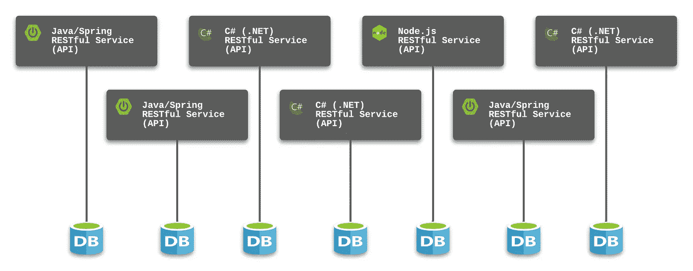
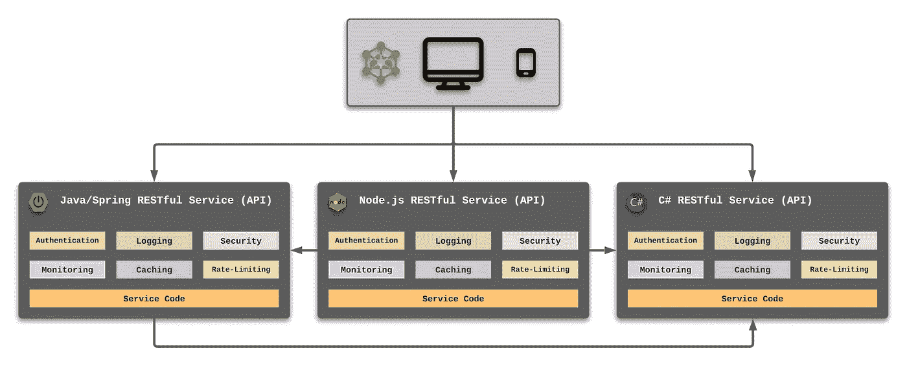
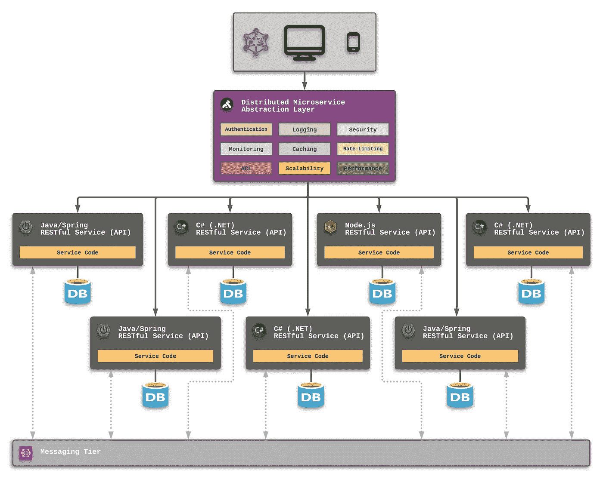

# 用孔破解了一个庞大的数据库

> 原文：<https://betterprogramming.pub/breaking-up-a-monolithic-database-with-kong-4a70f55d4f63>

## 如果您的微服务设计导致非常大的 API 或多个服务访问单个数据库，请查看 Kong Gateway


罗汉·古普塔在 [Unsplash](https://unsplash.com?utm_source=medium&utm_medium=referral) 上的照片

在我们的生活中，有些事情似乎只是例行公事，但却出乎意料地对我们的旅程产生了深远的影响。对我来说，一个事件是参加在佛罗里达州奥兰多举行的 2008 年 Gartner 会议。

那次活动不仅让我第一次接触到了 Salesforce 生态系统，还让我了解了以下概念:

*   [面向服务的架构](https://en.wikipedia.org/wiki/Service-oriented_architecture)(通过罗伊·舒尔特令人印象深刻的会议)
*   [Web 2.0](https://en.wikipedia.org/wiki/Web_2.0) 和[混搭](https://en.wikipedia.org/wiki/Mashup_(web_application_hybrid))
*   [RESTful API 设计](https://en.wikipedia.org/wiki/Representational_state_transfer)

虽然我对这一事件的期望不高，但在佛罗里达州中部的那几天成了我未来 13 年职业生涯中关注的一个重要方面，远远超出了我的任何预期。

一路走来，我从专注于这些概念的项目和倡议中学到了很多经验。在本文中，我将深入探讨从将 RESTful APIs 置于应用程序设计核心的项目中获得的一些经验。

# RESTful API 的缺陷

RESTful API 软件风格为客户端应用程序提供了一种简单的方式来访问满足业务需求所需的资源(数据)。事实上，用不了多久，Angular、React 和 Vue 等基于 Javascript 的框架就依赖 RESTful APIs，引领了基于 web 的应用程序市场。

这种 RESTful 服务 API 和前端 Javascript 框架的模式激发了许多组织对从单一或过时的应用程序中迁移出来的项目进行投资的愿望。RESTful API 模式也为仍在从大衰退影响中恢复的技术经济提供了急需的推动力。

将几个敏捷迭代快进到这个新的开发范例中，有两个陷阱被反复遇到而不是被避免:

1.  一个过时的应用程序设计最终被一个非常大的 RESTful API 和一个同样大的 Javascript 框架所取代。这给协调未来的功能和增强带来了挑战；基本上，一块巨石被另一块所取代。
2.  遗留应用程序设计采用了多个 RESTful APIs 和利用 Javascript 框架的组件化客户端，但是只使用了一个数据库。这种设计的结果导致了数据所有权冲突、高于预期的数据库连接数，以及支持/维护大型数据库的更高成本。

下面的例子说明了第二个陷阱是如何发生的，几个服务从一个数据库中竞争资源:


不幸的是，我也在绿地开发机会中看到过这些相同的场景，在这些场景中，人们倾向于为整个微服务集合使用单个数据库。

# 微服务应该从数据库开始

在大多数编程语言中，使用一个文件就可以创建一个全功能的应用程序。在 Java 中，所有东西都可以在同一个类文件中，只需调用`main()`方法即可:

```
public class SingleClassApplication {
    public static void main(String[] args) {
        // Start doing something really cool here
    }
}
```

然而，这种方法不太受支持，也不便于多个开发人员的轻松贡献。

当涉及到应用程序的各个方面时，还有“所有权”(或记录系统)的概念。在不止一个服务或功能声称拥有某样东西(比如客户)的情况下，当业务规则不同时，挑战就出现了。当多个 RESTful APIs 声明某个给定对象的所有权时，也会出现同样的情况。

当采用 RESTful API 设计时，这些相同的概念会转化到数据库层。请考虑以下准则:

> 单个 RESTful API 应该被视为应用程序特定方面的记录系统。因此，相应的数据层应该利用只关注应用程序这一方面的数据存储。

下图提供了一个遵循该准则的微服务设计:



成功的微服务设计始于数据库。一旦就位，为满足客户对给定服务的需求而进行的扩展不会对任何其他服务产生影响。

## 反驳:数据库约束呢？

我推荐的方法是用专用数据库隔离给定的微服务。这使得相关组件的数量和大小与用户需求相匹配，同时避免了不具有相同需求水平的元素的额外成本。

当应用程序的所有元素都驻留在单个数据库中时，数据库管理员会很快注意到约束和关系可以带来的好处，从而为单数据库设计辩护。例如，如果有与客户关联的订单排队等待删除，单个数据库设计可以阻止删除客户的请求。

虽然这无疑是拥有单个数据库的一个好处，但在选择将单个数据库用于所有微服务之前，请考虑以下几点:

*   将使用单个数据库获得的长期价值与扩展单个大型数据库的相关成本进行比较。未来扩展和支持单一数据库设计的预期成本是多少？
*   改为在 API 层实施这些约束的风险和价值是什么？请记住，单个微服务将被视为给定数据库的所有者，因此业务逻辑不允许删除有活动订单的客户。
*   考虑使用事件驱动(或基于消息)的设计来处理一个微服务如何处理请求取决于另一个微服务的响应的情况的好处。虽然这类似于单个应用程序/单个数据库设计，但是可以隔离和控制在需要时扩展和分配专用处理能力的能力。

当然，即使数据库只支持一个专用的服务实例，也应该实现和加强约束和关系。

# 应该抽象出公共元素

如果规划不当，采用真正的微服务设计可能会产生副作用。我继续看到的最大挑战是通用组件和服务层的复制。

下表提供了每个微服务中经常重复的元素示例:

*   证明
*   贮藏
*   记录
*   监视
*   安全

事实上，考虑一下这个例子，我在今年早些时候的“[我是如何用 Kong](https://medium.com/nerd-for-tech/how-i-stopped-coding-repetitive-service-components-with-kong-1308be4000e3) 停止编写重复的服务组件的”文章中介绍了这个例子。



像开发生命周期的所有方面一样，我们应该始终关注尽可能保持事情[干燥](https://en.wikipedia.org/wiki/Don%27t_repeat_yourself)(不要重复自己)。这包括可以在应用程序堆栈的公共级别或不同级别进行抽象和处理的元素。

我经常推荐的一种方法是由[孔](https://konghq.com/)提供的分布式微服务抽象层方法。

# 将孔置于理想设计的中心

[Kong Gateway](https://github.com/Kong/kong) 允许将服务层 API 的复杂性减少到一组端点(或 URIs ),集中满足一组业务需求和功能。经常重复的组件(如身份验证、日志记录和安全性)由网关处理，可以从服务层设计中删除。

每个 RESTful 微服务都维护一个专用的数据库实例，并抽象出重复的组件，一组目的驱动的微服务将如下图所示:



服务间通信是通过消息传递层利用通用的[企业集成模式](https://en.wikipedia.org/wiki/Enterprise_Integration_Patterns)来处理的，例如:

*   [命令消息](https://docs.wso2.com/display/EIP/Command+Message) —调用另一个服务执行后台动作
*   [文档消息](https://docs.wso2.com/display/EIP/Document+Message) —从另一个服务请求信息
*   [事件消息](https://docs.wso2.com/display/EIP/Event+Message) —向任何收听给定主题的人广播信息
*   [请求-回复](https://docs.wso2.com/display/EIP/Request-Reply) —向另一个服务发出请求并监听响应

有了这种设计，考虑一些现实生活中的好处:

*   如果 Node.js 服务的使用量高于预期，则扩展以满足需求的成本将由服务和专用数据库承担。
*   如果任何单个服务意识到数据存储改变是优选的(例如 SQL 到 NoSQL)，新的设计可以在对任何其他服务影响很小(如果有的话)的情况下部署——假设 RESTful API URIs 没有改变。
*   任何抽象层组件的更改(例如，使用新的日志记录方法)都可以在 Kong 网关层进行，不会对底层服务产生影响。

# 结论

从 2021 年开始，我一直努力按照以下使命宣言生活，我觉得这可以适用于任何 IT 专业人士:

> “将您的时间集中在提供扩展您知识产权价值的特性/功能上。将框架、产品和服务用于其他一切。”
> ——j·维斯特

虽然本文的主要目标是实现包含专用数据库的真正的微服务设计，但 Kong 为真正的微服务设计提供了可伸缩且易于采用的核心方面。事实上，Kong Gateway 允许开发人员保持干燥，引入通用组件驻留在分布式微服务抽象层中。

请记住，“微服务”包括“微”这个词，它通常被定义为“极小”在任何微服务实施过程中，牢记这一基本前提非常重要。

特性开发人员利用包和类对他们的程序代码进行分组，以获得可支持性和可维护性。在这些类中，定义了方法和函数——通常采用这样的规则，即每个代码块都很小并且易于理解。对我来说，一个理想的函数或方法是我不需要触摸鼠标就可以查看的。

微服务应该是程序员几十年来一直遵循的规则的延伸:保持事情小、有目的、高效……保持事情“微”

为了达到这个目标，设计必须包括数据库。