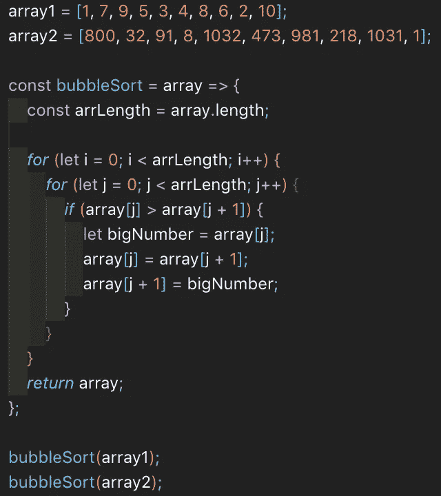

# 使用 JavaScript 进行冒泡排序

> 原文：<https://betterprogramming.pub/bubble-sort-with-javascript-fe679b3d52d9>

## 什么是气泡分类器以及如何构建一个气泡分类器



今天我们来看看气泡分类器是如何工作的。我会尽最大努力分解每一步正在发生的事情以及事情是如何运作的。与任何涉及编码的事情一样，通常有许多不同的方法来做事情。我将向您展示我最初学习构建气泡分类器的方法。

# 什么是气泡分拣机？

冒泡排序器获取数组中的第一个数字和第二个数字，并决定哪个数字更大。它将继续将较大的数字向右移动，直到到达数组的末尾或找到一个较大的数字。如果它找到了一个更大的数字，它就会抓住这个数字并继续向右移动。一旦到达数组的末尾，它将留下找到的最大数字，然后从数组的开头重新开始这个过程。它将继续这样做，直到将数字移动到正确的顺序。

# **走吧！**

我们需要做的第一件事是启动冒泡排序函数，并获取几个数组，这样它就有事情做了。对于一个数组，我们可以用很小的数。另一方面，我们会有一些数字来测试这个东西。

有了这个设置，我们将有一个名为`bubbleSort`的函数，它将有一个我称之为*数组*的参数。我们将调用这个函数，这样当我们运行这个文件时它也会运行。

为了使事情变得简单一点，让我们创建一个`const` ,这样我们就不必多次输入`array.length`。你可以给变量起任何你喜欢的名字，但是，对于这篇文章，我想尽可能保持它们的描述性。这样，我们还需要设置第一个`for loop`,看看我们是否可以迭代数组中的数字。

在最初的`for loop`中，我们将添加另一个`for loop`。就像`for loo` p 盗梦空间。内部循环是处理所有工作的循环。在这个循环中，我们将检查哪个数字更大，并决定它是移动还是保持不变。内部的`for loop`将继续运行，直到它移动到数组的末尾。

一旦完成，我们将被转移回第一个`for loop`并重新开始整个过程。它将再次开始遍历所有数字，抓住最大的数字，并继续向右移动，直到找到第二大的数字，以此类推。

当我第一次看气泡分类器如何工作的代码时，一切看起来都很好，很有意义，直到我点击了`if`语句。一旦我到了这一部分，我就不能完全理解发生了什么。所以，如果你看着这些代码，觉得自己迷路了，那完全没问题，我完全理解这种感觉。我会在这里尽我所能解释它。然后，我将使用`array2`中的数字来帮助进一步澄清。

只有当左边的数字大于右边的数字时,`if`语句才会运行。比较的是索引 J 处的数字和索引 J 处的数字加 1。因为我们想将索引 J 处的数字向右移动，所以我们使用一个变量来保存它的值。在下一行中，我们说索引 J 处的数字现在等于索引 J 处的数字加 1。我们不想把较小的数字放在两个地方，所以在 if 语句中的第三行，我们把较大的数字放在右边的位置，也就是索引 J 加 1。一旦完成，我们继续下一个数字，并重复，直到我们到达结束。

```
array2 = [800, 32, 91, 8, 1032, 473, 981, 218, 1031, 1]
```

我们这次用数字来分解一下`if`语句内部的情况。这样做有助于我更好地理解正在发生的事情。

我们要检查的前两个数字是 800 和 32。800 大于 32，所以我们将进入`if`语句。对于第一行，让`bigNumber` = 800，我们使用这个变量来保存 800 的值，同时将数字 32 向左调整。在第二行中，我们想把 800 (J)的值改为 32 (J + 1)。

如果我们停在这里，数组的前两个数字将是 32，因为现在我们说 J 的值等于 J + 1 的值。这不是我们想要的。所以在最后一行，我们想把 800 放进右边的槽里。这就是为什么我们用 J + 1 等于`bigNumber`。

完成后，我们的`for loop`将运行。现在 J 又会是 800，J + 1 会是 91。然后它会将`bigNumber`设为 800，J 和 J + 1 都是 91。我们再次将 800 放入右边的点，所以现在我们的`array2`中的前三个数字是 32，91，800。因为 800 大于 8，所以`if`语句将再次运行。但是当我们开始比较 800 和 1032 时，我们将不进入`if`语句，因为 800 现在是较小的数字。

上面的过程反复发生，直到我们到达数组的末尾。所以第一次通过数组时，最后一个数字是 1032。因为我们到达了数组的最后一点，所以内部的`for loop`将会结束。但是因为外部的`for loop`仍然在索引 0，它将移动到索引 1 并再次开始这个过程。外层的`for loop`的目的是确保我们遍历数组足够的次数来完全排序所有的数字。

有更多的方法可以使冒泡排序器更有效，比如在每次遍历后减少数组长度，因为我们知道最后一个数字是最大的，所以我们不需要检查它。同样，我们可以用一个`do-while loop`来设置它，如果它在一次传递中没有交换任何数字，它将在那里停止，因为数组已经被排序了。

# 结论

如果你想对数组进行排序，我不推荐冒泡排序器。我喜欢出于乐趣构建这样的东西，但是对于 JavaScript 的实际应用，您可以使用更像这样的东西:

阅读更多关于 [MDN 分类](https://developer.mozilla.org/en-US/docs/Web/JavaScript/Reference/Global_Objects/Array/sort)的信息。

我很感谢你花时间阅读这篇文章。我希望你发现它信息丰富。我有很多乐趣去分解它，把它打出来，并帮助自己巩固我在这个编码之旅中学到的东西。