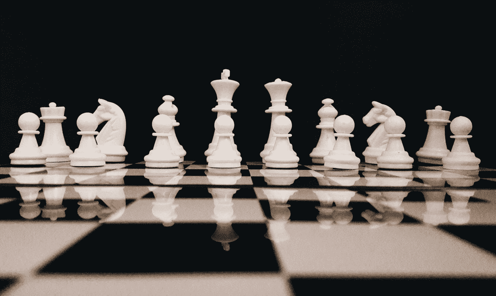
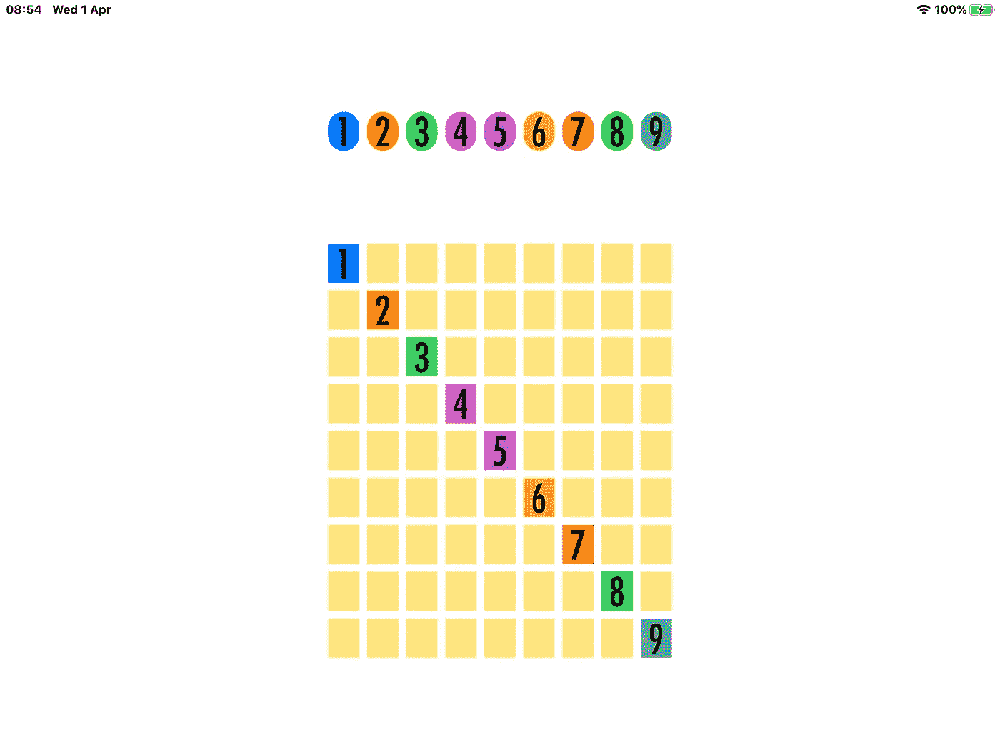
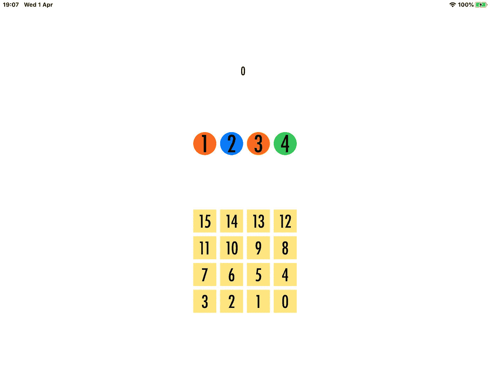

# 构建一个没有政治的棋盘游戏(第 3 部分)

> 原文：<https://betterprogramming.pub/build-a-board-game-without-the-politics-part-3-96ec5eebb366>

## 通过拖放使用 SwiftUI



[sk](https://unsplash.com/@rollelflex_graphy726?utm_source=medium&utm_medium=referral) 在 [Unsplash](https://unsplash.com?utm_source=medium&utm_medium=referral) 上拍照。

本文基于 iOS 11.4 和 2020 年 3 月下旬发布的 Swift 5 的一个版本。警告:如果你还没有更新你的 iDevice 和/或 Xcode，显然它不会工作。

在本文中，我将通过几个例子来介绍新的拖放协议的构建。最终目标是创建一个迷你数独板，然后您可以填充它。我们的目标只是创建一个你可以拖动棋子的板子。当然，它可以是你想尝试和构建的任何棋盘游戏的任何棋盘。

我最初打算只写两部分，但觉得工作没有完成，所以这里是第三部分。

第二部分之后我们将何去何从？我相信你差不多能猜到我想到的这个词:游戏化。



让我们缩小电路板的尺寸，并添加一个计时器来记录完成所需的时间——当然是正确的。“正确地”将是测试和编码中的挑战。

首先减少`textValue`字符串中值的数量和颜色的数量。你也可以把所有的东西缩小一点，把字体和高度改为 48，宽度改为 42。注意:我是在 iPhone 8 上测试的。如果你在 iPad 上，你可以使用不同的尺寸。

编译、运行它，并检查它是否还能工作。现在，在主循环中再添加几个状态。我们需要这些:

```
@State private var timerText = 0
@State private var startStop = false
```

接下来，添加一个定时器循环，其语法在 SwiftUI 下无法识别:

```
let timer = Timer.publish(every: 0.1, on: .main, in: .common).autoconnect()
```

接下来，让我们添加一些代码到我们的界面，使事情的工作:

这是什么？文本标签、变量和组合发布器。是的，又是那种。当然，当您将它剪切并粘贴到您的项目中时，您会得到一个错误。要清除它，您需要将它添加到文件的顶部:

```
import Combine
let timePublisher = PassthroughSubject<Void, Never>()
```

但是等等！虽然会编译，但是不行。你仍然需要启动和停止计时器。要启动它，在`dropUpdated`方法中将变量`startStop`设置为`true`，这是您的`dropDelegate`的一部分。下面的代码片段可以帮助您找到它。是的，我在这里偷偷加了一个变量。我们稍后将回到这一点:

为了停止它，你需要检查所有的盒子都被填满了。我们可以用这样一个简单的方法来实现，同样在`dropDelegate`中调用:

将该方法添加到`dropDelegate`方法`performDrop`内的调用中。您希望每次有人添加牌时都进行检查:

```
if boardFull(textColors: self.textColors, figures: self.rect.count) {
timePublisher.send()
}
}
```

在运行它之前，确保我前面提到的 odd 变量已经定义并设置为`true`:

```
var runOnce = true
```

好的，你应该可以再次出航了。把所有东西都编译好，然后试一试。计时器应该在您放置第一个牌时开始运行，并在您放置最后一个牌时停止。

然而，你可能想知道这个`runOnce`是什么。添加了检查之后，我发现每次我点击清除一个元素时，包含方块的位置和大小的数组实际上都在增长。在我使用`rect`变量来决定你是否完成了棋盘之前，这并不重要。我把`runOnce`放在适当的位置，以确保`rect`一旦被拉起就不再生长。我还需要对`InsideView`方法做一点小小的改动，以引用我们的`runOnce` bool:

```
.onAppear {
if runOnce {
self.rect.append(geometry.frame(in: .global))
}
}
```

这一切都很好，但这里需要添加另一个逻辑——一个关键的逻辑。您还记得这条规则:您可以在任何瓷砖上放置一个数字，但它不能是同一行(水平或垂直)上具有相同数字的另一个瓷砖。严格地说，我们也需要包括对角线。我确实写了代码。但是在尝试了几次之后，我决定去掉对角线。有了它们，完成起来就太难了。

在所示示例中，我们需要八个序列，图块从左到右排列(例如，图块 15 到 12、图块 11 到 8 等。)和从上到下(例如，瓦片 15 到 3、瓦片 14 到 2 等。).

我们需要检查每组中的瓷砖，以确保相同的数量/颜色不会出现两次。



它是器械包的完美应用。我挑选出放置在八个序列中每一行的元素，并将它们添加到八个集合中。然后，我查看添加到每个集合中的元素数量。根据上面的例子，如果一个集合中的元素少于四个，我知道我一定把同一个元素添加了两次。所以我复制了一份。

这是代码。也许比我的解释更有道理。我留下了最初的检查，以确保在我们寻找重复之前纸板是满的:

我还在那里留下了一些打印语句，以便您可以在运行它时看到发生了什么。

为了完成图片，您需要在`dropDelegate`方法中修改`performDrop`。下面是有问题的代码:

我们的验证方法还使用 Combine 向屏幕发布一条消息来警告用户。我们可以添加警告框的标签和下面的`onReceive`来使它工作:

当然，您还需要添加`showingAlert`状态变量和`alertPublisher`变量:

```
@State private var showingAlert = false
```

仅此而已。您已经准备好再次编译和运行了。尝试一下，看看你能多快正确地完成一个矩阵。试着改变它的大小。显然，集合越大，难度越大。我发现奇数组比偶数组更难。

我玩弄它太久了，真的，我突然想到，我发消息说你失败了，却没发消息说你成功了。让我们把它也添加到代码库中。我们可以将失败的模板用于我们的通过消息。这是一个快速的胜利:

```
let winPublisher = PassthroughSubject<Void, Never>()
```

当然，还有与之配套的 SwiftUI 代码:

您需要将`showingWin`状态添加到状态变量中。复制并粘贴代码，然后再次测试。这次的测试挑战是真正赢得比赛。

我们需要给我们的应用程序添加一点润色。当你完成后，它告诉你你通过了/失败了，会发生什么？

没什么。你说的…没什么。

我们需要一个重置方法。让我们用一个老式的摇动手势来触发重置。你还需要添加一个确认框，以防你在游戏中不小心开始晃动手机。

这个代码会让我们开始。它会检测到震动，并使用另一个`PassThroughSubject`来触发一个界面元素:

当然，我们需要声明另一个发布者以及相应的警告消息和重置代码:

```
let resetPublisher = PassthroughSubject<Void, Never>()
```

我和我 10 岁的儿子做了一些走廊测试。他喜欢它，但提出了两个改进要求:

*   将拖动添加到主板。
*   给我一个戳的手势来加数字。

我试了一下。用 poke 的 UI 我不太清楚。这感觉有点不平衡，因为在棋盘上戳一下就可以清除它，但是你可以自己决定。在这里，代码发生了变化。首先，您需要通过一个`onTap`向文本视图添加一个`poke`状态:

然后，您需要向主矩阵添加功能，我承认这已经变得有点像一个怪物:

我再次测试，但意识到新的戳行为引入了新的错误。它不仅没有启动计时器，而且在我完成时也没有检查电路板。只是稍微调整一下。我需要将这段代码添加到我刚刚在上面的要点中发布的`onTap`中:

仅此而已。最后，当你读到我们结束了，你会松一口气。我创建了一个图标，将它们添加到项目中的资产中，并上传到 Apple。我[称之为 Zudoku](https://apps.apple.com/sa/app/zudoku/id1506185461) 。

最后一点:在关于新拖放的第 1 部分中，我提到了这样一个事实，你看不到你正在拖动的东西。我在模拟器上测试了它，它工作了。我在我的真实设备上再次测试它，它没有。我记录了苹果的一个 bug。

我希望你能像我写这篇文章时一样喜欢阅读它——也许在阅读的过程中，你能对我提到的一些东西有更多的了解。