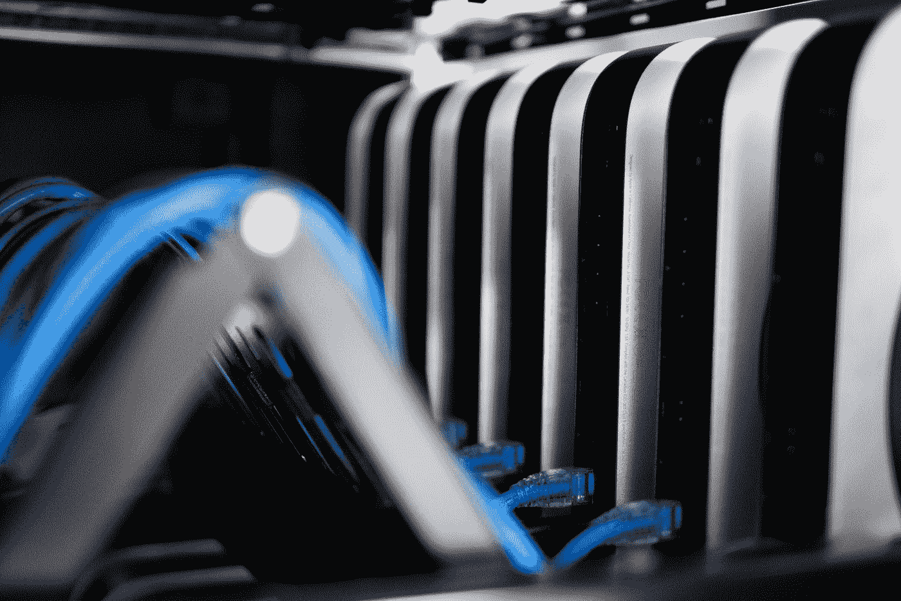
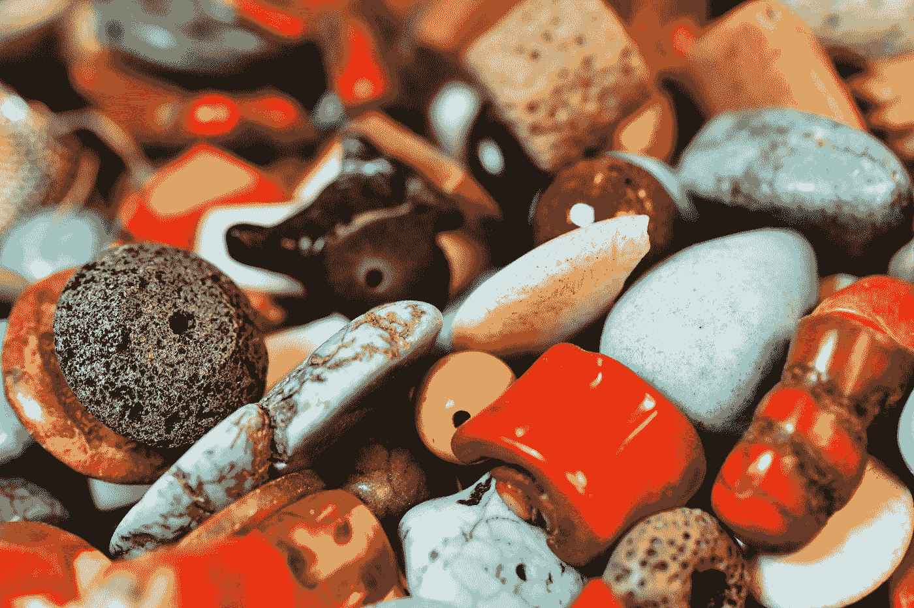

# 用 Flutter 和 Firebase 构建一个协作像素艺术应用程序

> 原文：<https://betterprogramming.pub/build-a-collaborative-pixel-art-app-with-flutter-and-firebase-d4a027b4534b>

## 创建您自己的休息/场所


帕斯卡尔·贝纳登在 [Unsplash](https://unsplash.com?utm_source=medium&utm_medium=referral) 上的照片

# 介绍

最近你可能听说过 [r/place](https://www.reddit.com/r/place/) 或 [z/place](https://place.zevent.fr/) ，如果你没有听说过，你可能会想我在说什么。这些是合作项目和社会实验，用户可以通过一次改变一个像素的颜色来编辑画布。在活动结束时，通常是两三天，你已经得到了一个美丽的像素艺术作品。你可以在[维基百科](https://en.wikipedia.org/wiki/R/place)上找到所有信息。

> 我决定把这篇文章分成两节。第一个致力于基本特性。第二个增加了一些高级功能，如认证，像素更新历史，放大/缩小和托管。

嘶！你可以在我的 GitHub 账户上找到完整的项目！它遵循`Clean Architecture`模式，但有一些自由。我没有为这篇文章全力以赴的冲动。

[](https://github.com/duribreux/place) [## GitHub — duribreux/place

### 一点一点地成为艺术家。

github.com](https://github.com/duribreux/place) 

> 我可能已经跳过了自愿(或不自愿)的一些实现细节。如果需要，请参考资料来源，并在评论区随意提问。如果你想经营自己的地方，也一定要查看自述文件。

# 你会得到什么

 [## 地方

### 一点一点地成为艺术家。

place-3fcc2.web.app](https://place-3fcc2.web.app/#/) 

# 基本要求

*   一种绘制像素并选择其颜色的方法。
*   存储像素的实时数据库，最重要的是，当发生变化时通知用户。

## 把我画成你的…


照片由[爱丽丝·迪特里希](https://unsplash.com/es/@alicegrace?utm_source=medium&utm_medium=referral)在 [Unsplash](https://unsplash.com?utm_source=medium&utm_medium=referral) 上拍摄

首先，让我们创建一个类来描述一个像素。没什么疯狂的。我们只需要一个`Offset`描述它在 2D 的位置，就可以知道在哪里抽签以及它当前的`Color`。在高级部分，我们可能会添加一些信息。

为了绘制像素，我们需要一个提供画布的小部件。这就是[定制绘画](https://api.flutter.dev/flutter/widgets/CustomPaint-class.html)的目的，它需要一个[定制画家](https://api.flutter.dev/flutter/rendering/CustomPainter-class.html)来指定我们想要表达什么以及如何表达我们的艺术

默认情况下，`CustomPaint`将占据整个屏幕，但我想为所有人提供相同的绘图体验，所以我将它固定为`1920x1080`——超过 200 万像素。绰绰有余！有趣的是，还有两个额外的属性我们没有使用。`isComplex`和`willChange`。如果你发疯了，你可能想把它们设置为`true`以从缓存中获益。

然后我们需要创建我们的`CustomPainter`和它的`Paint`设置。

这个稍微复杂一点。如你所见，我们的画师扩展了`CustomPainter`。这样做，我们需要覆盖`paint`和`shouldRepaint`方法。我们给它一个`List<Pixel>`作为参数画出来……就这样。我们不需要 repaint 参数，每当像素列表更新时，视图将被重新构建。那么很简单，我们只需要遍历像素列表，并在各自的`Offset`坐标上画出它们。

> 你可能已经注意到我已经将`*strokeWidth*`设置为 10，这是一些大的像素。这只是因为我想让它比 1x1 像素更直观。还有 20 万像素的乐趣。

此外，我们需要一种方法来确定像素的坐标。最简单的方法似乎是将`CustomPaint`包装成一个`Listener`小部件，并实现`onPointerDown`回调。通过这样做，我们受益于`localePosition`事件参数，给我们光标的位置。不要使用`position`。否则，你会得到绝对位置，我们想要画布中的相对位置，而不是在应用程序屏幕中。

> 你可能想检查是否没有键盘上的键被按下，否则当你试图在画布中移动的时候就会产生像素(alt / ⌥ + clic)

最后，为了挑选一种颜色，我决定使用`[flutter_colorpicker](https://pub.dev/packages/flutter_colorpicker)`包。我本可以自己实现一个小部件，但是，嘿…让我们不要重新发明轮子。

没什么好说的。`BlockPicker`小部件放在脚手架`AppBar`上，每当`onColorChanged`触发时，我保存新的`Color`，以便提供给`CustomPainter`。你可以使用默认布局，或者像我一样创建一个符合你需要的布局。

# 坚持



照片由 [imgix](https://unsplash.com/@imgix?utm_source=medium&utm_medium=referral) 在 [Unsplash](https://unsplash.com?utm_source=medium&utm_medium=referral) 上拍摄

建立数据库最快的方法之一可能是使用 [Firebase](https://firebase.google.com/) 。它易于使用，有很好的文档记录，并且大多数基本用法都是免费的。您只需要在 Firebase 控制台中创建一个项目，启用 [Firebase 实时数据库](https://firebase.google.com/products/realtime-database?gclid=CjwKCAjwpqCZBhAbEiwAa7pXeaAr2R7rR4MDrTirnuX8UghhQwTcguho8gIG73GNvN6-5_43s7giuhoCoScQAvD_BwE&gclsrc=aw.ds)，并在您的 flutter 项目中配置 [Firebase 数据库](https://pub.dev/packages/firebase_database)。现在，不要担心权限，只允许任何人读写您的数据库。

```
{
  "rules": {
    ".read": true,
    ".write": true,
  }
}
```

最坏的情况是我们会失去画布。我相信我们能应付得来。

# 网路层

让我们做得又快又干净！设置一个`[BLoC](https://pub.dev/packages/flutter_bloc)`和一个`FirebasePixelsRepository`分别与我们的表示层和 Firebase 数据库交互。

> 我也在用`[*injectable*](https://pub.dev/packages/injectable)`框架。这不是强制性的，如果不喜欢依赖注入，你可以自己实例化类。没什么大不了的！

让我们从存储库开始。正如我在引言中所说的，我们需要一种方法，以便在数据库发生修改时得到通知。这就是为什么我们使用一个`Realtime database`和……`[Streams](https://dart.dev/tutorials/language/streams)`。`listen`的目标是对数据的变化做出相应的反应。

`PixelsRepository`是一个简单的接口。让我们务实一点，我们只需要两个功能。

1.  `createPixel`创建一个基于其坐标的唯一散列所引用的像素。每当我们改变它的颜色时，这将给我们一个简单的方法来访问它，并防止我们盲目地在一个永远增长的列表中创建另一个。
2.  `listenPixels`订阅我们数据库中的任何添加或更改，并在新像素被创建或更新时通过将它们推入流来通知我们。了解更多关于 [StreamGroup](https://api.flutter.dev/flutter/async/StreamGroup-class.html) 的信息。

`PixelModel`看起来是这样的。注意，我已经创建了两个`converters`来平滑地序列化(反序列化)对象。花费不多。很有帮助。

现在，让我们在存储库和表示层之间建立一座小小的桥梁。[关注点分离原则](https://en.wikipedia.org/wiki/Separation_of_concerns) …你知道该怎么做！

不要害怕！真的没有什么。我们的集团正在监听`PixelsEventListen`和`PixelsEventAdd`匹配我们的存储库方法。我们还创建了一个自定义的`Stream`和一个`Map<int, Pixel>`来通过流提供给表示层。

有两件事值得一提:首先，我们使用`listen`来订阅流。第二，我们没有`cancelOnError`。让我们保持(数据)流动。

> 如果您非常细心，您可能已经发现了`*round*`方法调用。是因为我设置的`*strokeWidth*`。我需要计算 10x10 像素的原点坐标，而不是我点击的精确像素。如果我单击(19，12)，我希望保存的偏移量为(15，15)。这样，像素将覆盖从(10，10)到(20，20)的区域

只需将您的块添加到您的视图中，并将流提供给一个`StreamBuilder`小部件。然后将`data`发送到画布。您的应用程序小部件应该如下所示:

就是这样！此时，您应该能够在多个窗口中运行它，在一个窗口中创建像素，并看到它在其他窗口中复制。

# 让它发光



照片由 [shraga kopstein](https://unsplash.com/ja/@sfkopstein?utm_source=medium&utm_medium=referral) 在 [Unsplash](https://unsplash.com?utm_source=medium&utm_medium=referral) 上拍摄

从现在开始，我会加快一点速度。目标是提供一些额外的特性，以更接近真实的 r/place 规则，而又没有太多的限制。我不想禁止你乱来。

## 验证用户

添加`firebase_auth`包，启用 firebase 控制台中的`Authentication`功能，允许`anonymous`作为`sign-in method`。然后创建一个`firebase_auth_repository`来处理它。显然，添加其他注册方式(如电子邮件、谷歌等)取决于您。

既然我们已经有了一些非常基本的身份验证概念，我们可以稍微升级一下我们的安全规则。

```
{
  "rules": {
    ".read": true,
    ".write": “auth != null”,
  }
}
```

嘣！现在只有经过认证的用户才能写像素。接下来创建一个`AuthCubit`来与视图交互，给它添加一个按钮，一切都准备好了！

一个`Cubit`不会像集团那样要求你创建自定义事件。直接调用方法就行了！

## 修改历史

每当添加或修改像素时，记录所有更改的时间。让我们使用我们用来保存`Pixels`的同一个`Realtime database`。为此，只需更新`createPixel`方法。

完成了。在我们创建一个像素的同时，我们也`push`了一个新的唯一引用，并为其设置了我们像素的信息。唯一的区别是我们将永远坚持所有的改变。也许用它们来制作一个回放？

正如我们为像素的创建所做的那样，只需编写一个专用的流。在表示层，只需向包含一列`ListTile`的`ListView`提供数据，每一列都是像素更新。我将让您检查实现的存储库，这很简单。

## 放大/缩小

你还没准备好。直到现在，用户必须有一个非常大的屏幕才能看到整个画布。为了解决这个问题，首先你可能想添加某种双`SingleChildScrollView`小部件来进行垂直和水平滚动，但这将是一个错误，而且无论如何也不会顺利工作。

您需要将画布包装在一个`[InteractiveViewer](https://api.flutter.dev/flutter/widgets/InteractiveViewer-class.html)`小部件中，只需记住将`constrained`属性设置为 false，并根据您的需要调整`minScale`和`maxScale`。这样，无论你的屏幕大小如何，你都可以导航到任何你想去的地方。查看[文档](https://api.flutter.dev/flutter/widgets/InteractiveViewer-class.html)了解更多信息。

一定要检查[库](https://github.com/duribreux/place)来处理布局约束以及如何正确排序小部件。

## 主办；主持

老实说，就像遵循官方文档一样简单。

运行`flutter build web -—release`,然后运行`firebase init hosting`命令行，回答几个问题，你就会得到主机 URL。如果你想对你的域有更多的控制，检查 Firebase 控制台中的`hosting`配置。

```
? What do you want to use as your public directory? build/web
? Configure as a single-page app (rewrite all urls to /index.html)? No
? Set up automatic builds and deploys with GitHub? No
✔ Wrote build/web/404.html
```

确保将`build/web`设置为您的公共存储库。这是你的消息来源。然后运行`firebase deploy`你就活了！

我希望你喜欢读它，就像我喜欢写它一样。它非常密集，我确定我已经跳过了一些细节，但是如果需要的话记得检查[库](https://github.com/duribreux/place)。

## 想要更多吗？

[](/detect-user-inactivity-in-flutter-applications-af42b08101c) [## 检测颤振应用中的用户不活动

### 防止数据泄露

better 编程. pub](/detect-user-inactivity-in-flutter-applications-af42b08101c) [](/a-guide-to-handling-user-privacy-to-comply-with-gdpr-in-flutter-applications-9914ab479240) [## 颤振应用中符合 GDPR 的用户隐私处理指南

### 通过在收集数据前询问来保持合规性

better 编程. pub](/a-guide-to-handling-user-privacy-to-comply-with-gdpr-in-flutter-applications-9914ab479240)