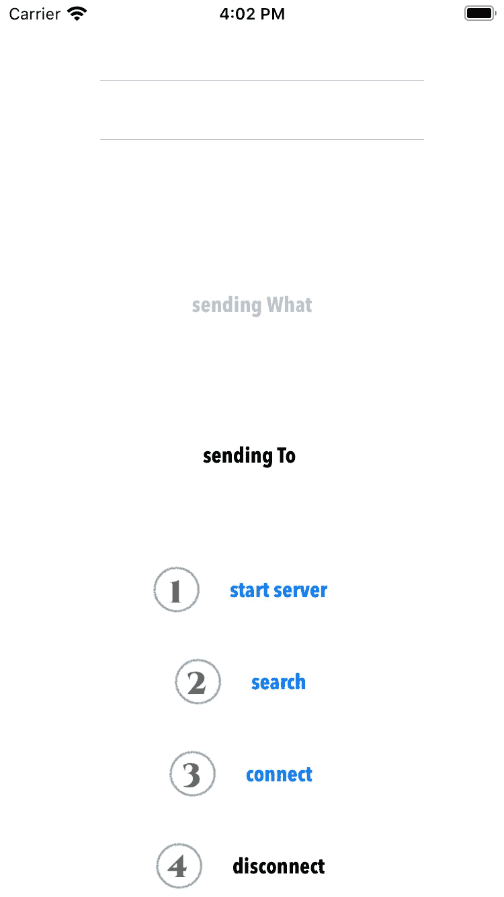

# 在 SwiftUI 中构建多米诺骨牌游戏(第 2 部分)

> 原文：<https://betterprogramming.pub/build-a-dominoes-game-in-swiftui-part-2-188b825cc35a>

## 在基于 SwiftUI 的多米诺骨牌游戏中加入网络


瑞安·昆塔尔在 [Unsplash](https://unsplash.com/s/photos/domino?utm_source=unsplash&utm_medium=referral&utm_content=creditCopyText) 上的照片

在[上一篇文章](https://medium.com/better-programming/build-a-dominoes-game-in-swiftui-part-1-75656a98d5e3)中，我们用 SwiftUI 创建了一个多米诺骨牌游戏。当我开始时，这听起来很简单，但并不像我想象的那么容易。

在本文中，我将研究如何使用 2018 年发布的[网络框架](https://developer.apple.com/documentation/network)创建网络版本。这是一个苹果试图更新经典 UNIX 套接字库的框架。抱歉，如果它不是一个博客，而更多的是最初的苦干；网络框架有点像 iCloud，装满了模板代码。

让我们开始吧。正如您已经知道的，我敢肯定，在套接字库中有两种类型的网络连接:TCP 和 UDP。我想在这里谈谈这两种方法，因为我怀疑我们最终会同时使用这两种方法。

我不想在这一点上编辑我们以前的项目。理解网络代码可能是一个挑战，但在一个新项目中会更容易理解。创建一个新项目和其中的三个新类。称他们为`UDPNetwork`、`TCPNetwork`和`BonjourBowser`。在它们之间，它们将拥有我们的核心网络功能。

在我们开始网络内容之前，让我们先做 SwiftUI 界面。



是的，是的，我知道，多米诺骨牌在哪里？我们首先需要理解网络代码，因此我将首先创建一个非常简单的服务器-客户端应用程序。然后我们将转向多米诺骨牌。

这里有什么？我在顶部添加了一个列表视图、一个文本字段和五个文本标签，其中下面的四个实际上是按钮。列表视图将显示您使用 Bonjour 协议找到的客户端。文本字段为您提供了键入消息的空间。第一个文本标签将显示您正在连接的另一个客户端的名称。

接下来的四个按钮按顺序工作。首先是启动一个守护进程运行(一个将通过 Bonjour 自我宣传的服务器)。第二个是启动 Bonjour 探针并填充列表视图(屏幕顶部)。第三种是连接到服务器(这样您将成为客户机)，最后一种是断开与服务器的连接(仅对 TCP 有意义)。显然，你需要在两个设备上运行，理想情况下，看到它的所有优点，虽然当然，你可以在一个设备上运行，如果你必须这样做。

将这段代码添加到项目中后，您还需要修改`sceneDelegate`中的一行代码来指向它。这有点像给你的`ViewController`取一个合适的名字，而不是 *viewController* 。

```
let contentView = TalkView()
```

大部分代码都不起眼，最显著的结构是对一个可观察对象的引用，详细内容可以在`BonjourBrowser.swift`文件中找到。这是一种结构，它的定义方式与我们的多米诺骨牌应用程序相同，因此我们将能够轻松地转移我们的代码。其中的类直接更新数组，这立即反映在接口本身中。我最初尝试过使用一个`PickerView` 作为我的设备列表，但是在 SwiftUI 下更新它是很痛苦的；相比之下,`ListVie` w 号简直是小菜一碟。也就是说，我最初的`ListView`是这样的(下图)。

它可以工作，但是我想要一个`ListView`,其中我可以改变背景行被选中时的颜色，这在这个版本中显然是不可能的；因此你会在要点中找到代码。

我最初也使用按钮来显示可操作的项目，但是我想在按下按钮时显示它们的状态。我也想让事情尽可能简单，所以我用一个`onTapGesture`增加了按钮标签。这样做，我有效地禁用了按钮，所以我放弃了按钮，只使用带有`onTapGestures`的文本标签，以保持简单。您会看到许多方法被注释掉了。那是故意的。我想显示对我们在网络类中定义的所有代码的所有调用。

那就是 SwiftUI 第一版，在本文结束之前我们会重新定义。现在来看看网络代码。

接下来，我们的`BonjourBrowser.swift`类(它具有与定义在其中的 SwiftUI 接口联系的数据结构)。它主要是访问`NWBrowser`方法的模板代码，用于查找使用 Bonjour 协议宣传自己的服务器。

接下来，我们有主要的网络代码，在 SwiftUI 文件中引用为`tcpCode`和`udpCode`。我们先来谈谈`TCPNetwork.swift`文件。尽管大部分代码本质上都是模板，但理解其背后的东西是很重要的。

我们首先定义两个变量:`NWConnection`(客户端)和`NWListener`(服务器)，然后定义使用它们的方法。我在这里展示的前两个选项是`listenTCP`或`bonjourTCP`，它们启动服务器守护进程(监听连接)。

它们之间唯一的区别是前者需要端口号和主机地址，而后者使用 Bonjour 服务。因为 TCP 可以是双向对话，所以假设只有两个玩家进行对话，您只需要运行一个服务器和一个客户端。

接下来的两个方法，`connectToTCP`和`bonjourToTCP`，是您需要采取的下一个步骤，这取决于您运行的是前面的哪一个方法。显然它们是成对的。如果你已经从`listenTCP`开始，并且没有宣传 Bonjour 服务，那么尝试运行`bonjourToTCP`是没有意义的。

接下来的两个方法，`receiv` e 和`receive65535`，顾名思义:读取客户端发送的数据流。他们之间的区别是他们如何回应你对他们说话的方式。后者被编码为只接受 1 个字节，但不超过 65，535 个字节，这是您可以通过 TCP 发送的最大数据包。第一种是 too，但是它希望您使用特定的发送方法。

接下来的三种方法——`sendTCP`、`specialTCPSend`和`superTCPSend` ——都是同一事物的变体。如果用`receive65535`的话，随便用一个都没问题。但是，如果使用`receive`方法，则需要使用后两种中的一种，而不是第一种。

如果你将`receive`方法和`sendTCP`方法一起使用，数据会被传送，但是其中的缓冲意味着你不会看到它，除非你发送大量的数据或者你关闭连接。至少，这是我的实验室结果显示的。

然后回到 SwiftUI 客户端。我们要执行四个调用来启动和停止我们的 TCP 对话，还有三个调用 UDP。正如你所看到的，我用多米诺骨牌数字来表示你在界面上使用它们的顺序。

现在，我们需要更多地了解发送客户端之间的区别。如果您在 TCP 下开始对话，您连接到的个人(服务器)将不会使用同一个客户端进行响应。他们将变量`tcpLink`设置为`true`，这将调用`specialTCPSend`。这个和普通的`sendTCP`唯一的区别就是，它会利用对方在 TCP 下已经建立的链接来回话。也就是说，建立链接的设备仍然是负责的设备，尽管一旦链接建立，双方都可以使用它来相互交谈。

转到 UDP:它几乎有相同的结构和相同的用法。你需要启动一个服务器，寻找它，连接到它，然后，嘿，很快，你就可以开始对话了。但是有一些关键的区别。第一个是你可以在一个包中发送的字节数。有了 UDP，是 8，192，比 TCP 少八倍。

其次，虽然我创建了`specialUDPSend`方法供您尝试，但它会失败，并显示以下错误消息:“与守护进程的连接无效。”这是因为 UDP 不像 TCP 那样建立链接。它是像 HTTP 一样的无状态协议，发送数据报，数据报是不同的数据包。它不会打开任何类型的流。值得注意的是，与 TCP 不同，它也不试图保证交付顺序。因此，您可以发送 packet1、packet2，然后是 packet3，但 UDP 可能会发送 packet3、packet1，然后是 packet2。

下面是 UDP 的代码。也就是说，在这个抽象层次上，其中的大多数方法几乎与 TCP 版本相同。

在我把你烦死之前，最后说几句话。`superUDPSend`和`superTCPSend`方法是一个有趣的变体，因为使用它们，您可以构建自己的包顺序/优先级。按照我的理解，从理论上讲，您可以不通过子系统本身，而是通过将这些元数据与数据包一起发送，并在您自己的数据流下对其进行重新排序，来尝试实施某种顺序(例如，对 UDP 数据包)。

这个网络框架够用一辈子了。让我们做一些多米诺骨牌。我们需要做什么？

*   你开始一个游戏，你在你的局域网上做广告。你的朋友运行搜索，看到你，选择你，并加入游戏。
*   您发回一条消息，其中包含您在候选名单中选择的瓷砖以及长名单瓷砖，这些瓷砖在未发行的那堆瓷砖中仍然面朝下。
*   你的朋友从你刚发给他的长列表中选择了七张牌作为回应，然后给你第一步棋。
*   您将一个牌放入游戏中，并将其 ID 和新位置发送给他们。你的朋友也一样。你们继续轮流玩，直到用完牌或不能玩为止。
*   在没有牌剩下或没有移动的情况下，你需要从长列表堆中取出一张牌。你这样做，并通知对方你得到了什么。如果他们不能玩，他们需要从长列表中取出一张牌，然后告诉你他们得到了什么。
*   如果你仍然不能移动，你需要拿另一块瓷砖，重复这个过程——对他们也是一样。
*   游戏的赢家将是没有剩余牌(假设不再有一长串牌可以取)并且已经将所有牌都放入游戏中的人。然而，有一种可能性，游戏结束时，你们都留下一两个瓷砖，所以我们不能把它作为一个终止条件。

这里有很多。这有点令人生畏，不知道从哪里开始。我没有提到这一点，但当涉及到小数据包时，UDP 几乎肯定比 TCP 更快，并且是大多数游戏的普遍首选路由。因此，让我们从网络方面入手。显然，我们的设备需要两个视图:一个用于设置游戏，另一个用于玩游戏。让我们做一个导航控制器，这样我们可以很容易地交换视图。我们需要从重温 SwiftUI 代码第二版开始。

远离 SwiftUI 专家(有人吗？)，我的第一个调用端口是 Stack Overflow，或者可能是 Medium 上更好的编程，来找一些 SwiftUI 下导航控制器的好例子。我找了几个，挑了一个，确定理解了。至少可以说，复制和粘贴你不理解的代码不是好的做法。

好了，我修改了导航的模板代码，加入了 UDP 代码，并把我的一些多米诺骨牌的界面粘贴进去。当然，我一在网络模式下运行这个东西，就发现了一个 bug。当我选择一个设备时，列表视图中所有项目上的所有设备都变成黄色。

我做了这个修复，这个修复很有效，但是在它崩溃之前，我的列表中限制了 32 个项目，这是不可接受的，在苹果的审查中肯定会失败。我回到绘图板，通过将这段代码移动到它自己的视图中来解决这个问题(你可以在要点中找到这段代码)。

一旦您选择了您的合作伙伴，我将切换到下一个视图。

但是等等。这里还有一个我没有提到的警告。您还记得使用 TCP 时，一旦建立连接，就可以进行双向对话。但是我们现在没有使用 TCP 我们选择了 UDP。所以在我们开始玩之前，我们都需要开始倾听对方。我们都需要选择另一台设备并连接。这不是一个错误，但这是一种会让用户困惑的操作模式，不是吗？

我将这些代码字节添加到每个页面，以做一个简单的测试。在启动守护进程并找到其他玩家后，将此添加到第一页:

```
DispatchQueue.main.asyncAfter(deadline: .now() + 2, execute: {
  self.udpCode.send("Hello World")
})
```

把这个加到第二页:

```
Text(message)
  .font(Fonts.avenirNextCondensedBold(size: 16))
  .padding()
  .onReceive(talkingPublisher) { ( data ) in
  self.message = "received " + data
}
```

(你会在我给你的要点中找到这段代码。)

这很有效，但是还有一个问题。显然，如果你在第二页，它只能接收一条消息(我们说的是出版商)。根据这个代码，你们两个需要在两秒钟内翻到第二页。这是一个竞赛风险，不是一个错误，但远非用户友好。

我还注意到，对于分页实现，当我返回到第一页时，它运行另一个监听守护进程。这是一个错误。我想我可能会开一个单子。

让我们停下来考虑下一步。事实上，你们两个都需要上第二页是一个挑战。也许，只是也许，如果我不能提出一个更好的设计，我们需要使用 TCP 和 UDP。

```
struct ContentView: View {
  var body: some View {
    Text("Hello World").onAppear {
    let communication = Connect()
    communication.listenUDP(port: 1854)
    }
  }
}
```

我们在这里所做的只是在 1854 端口启动我们的连接。回到`Connect.swift`文件，其中有两个方法。如果您将在端口 1854 上监听，第一个会启动一个守护进程。第二个方法是`receive`，传递它获得的所有连接，并打印出它看到的内容。这是我们 UDP 连接的基本框架。