# 为您的 iOS 应用程序建立帮助中心

> 原文：<https://betterprogramming.pub/build-a-help-center-for-your-ios-app-79b4884f77f1>

## 通过 Swift、Markdown 和 GitHub 页面

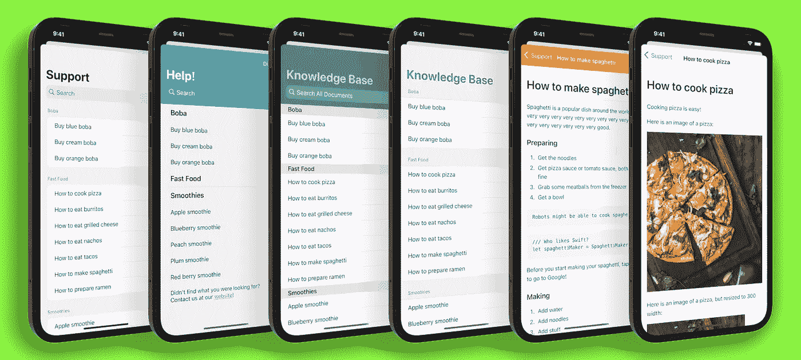

图片来源:作者

大多数大型应用程序都有某种帮助中心，也称为“知识库”你知道，“我们能帮你什么？”屏幕。

搜索“知识库软件”，你会找到无数提供这种功能的服务…但是你看过它们的定价吗？

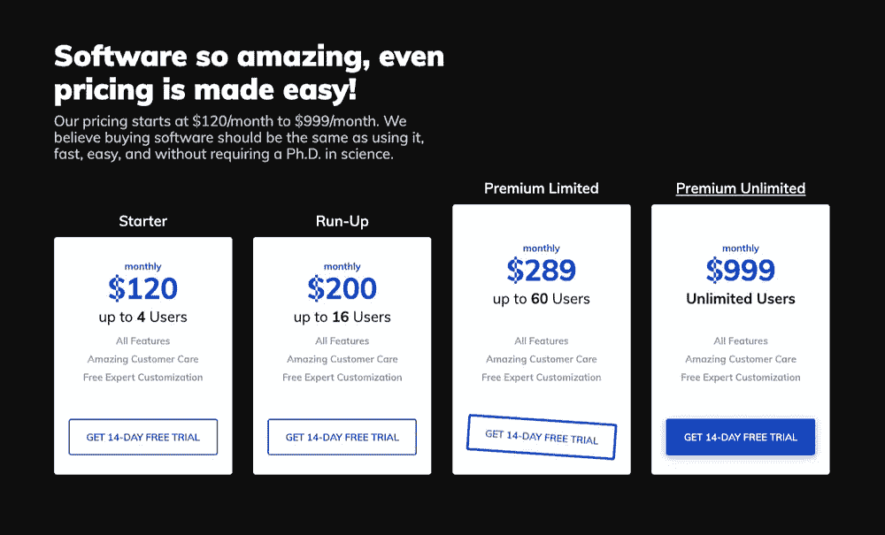

如果你像我认识的大多数开发者一样，你可能没有那么多钱花在你的应用程序的这么小的一部分上。说真的，每月 999 美元*？好吧，我有个好消息——你实际上已经拥有了自己制作一个所需的全部资源，而且是免费的！我想你有 GitHub 账户吧？*

# *这是我们要做的:*

*   *可以添加到应用程序中的帮助中心*
*   *帮助中心的数据源，您将在 GitHub 上编写它*
*   *你会得到这样的结果:*

*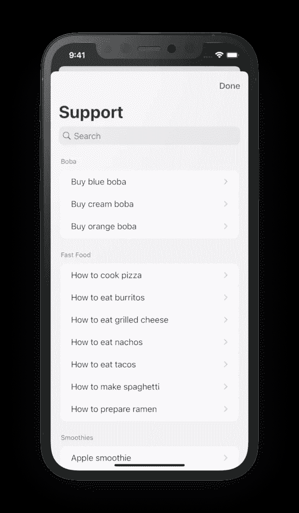****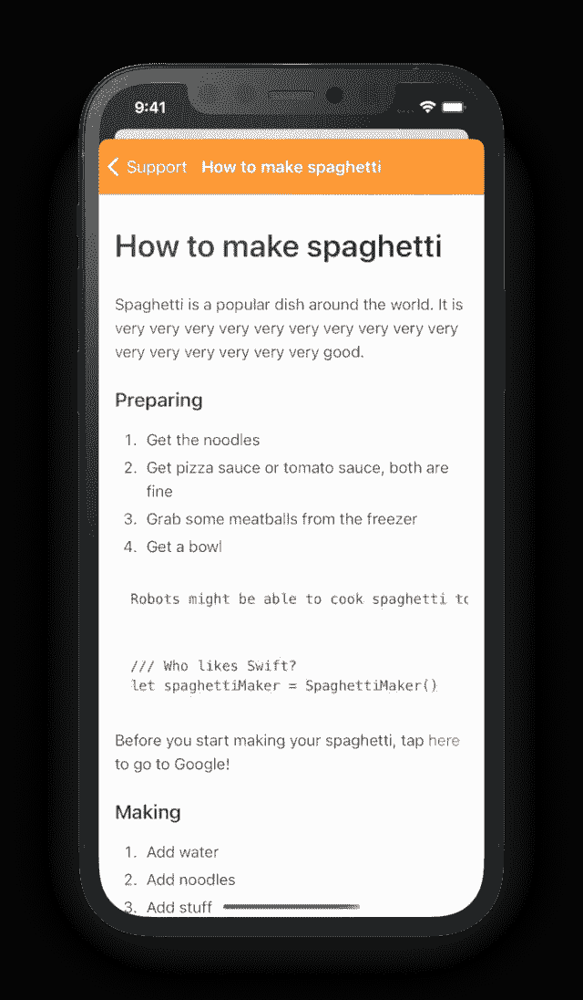*

*完整免责声明:我们将使用我和我的朋友 H. Kamran 在过去几个月里创建的开源库。这就设置好了一切，所以你不必做太多的编码工作。它在麻省理工学院的许可下，所以不要担心责任或任何事情。*

*所以，让我们开始吧！首先，转到 SupportDocs 存储库，此处为:*

*[](https://github.com/aheze/SupportDocs/) [## a Heze/支持文档

### 为您的 iOS 应用程序生成帮助中心。由 GitHub 托管并始终保持最新状态。

github.com](https://github.com/aheze/SupportDocs/) 

SupportDocs 是将完成所有繁重工作的库/工作流。请记住，这使用 SwiftUI，因此目前仅适用于 iOS 13 及以上版本。它是这样工作的:

1.  你在 GitHub 上的 Markdown 中编写帮助文档
2.  *自动* — GitHub Pages 会将它们转换成 HTML 并免费托管
3.  *自动*—GitHub 动作会将 HTML 编译成 JSON 文件
4.  在您的应用程序中，将 JSON URL 传递给库，并显示给用户

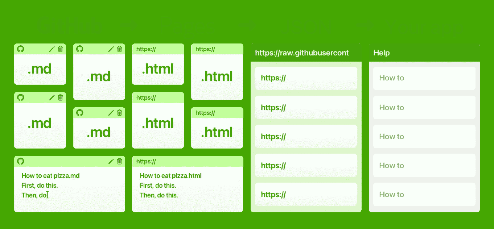

你负责编写你的文档，并调用在你的应用程序中呈现它们的函数。其他一切都是自动化的！* 

# *GitHub 方面*

*我们需要建立 GitHub 存储库，您可以在这里编写文档。*

1.  *向上滚动到[支持文档页面](https://github.com/aheze/SupportDocs)的顶部，并点击`Use this template`。这将复制整个存储库，其中包含 GitHub 动作的代码和其他资产。*
2.  *输入存储库名称—可以是您想要的任何名称。*
3.  *确保设置为`Public`(如果你的账户使用免费版 GitHub，GitHub Pages 只对公开回购有效)。*
4.  *务必检查`Include all branches`。这真的很重要。*
5.  *点击`Create repository from template`。*
6.  *在全新的存储库中，转到`Settings`选项卡。*
7.  *向下滚动到 GitHub 页面部分，选择`**DataSource**`分支和`**/ (root)**`文件夹。然后点击`Save`，GitHub 就这样了！*

*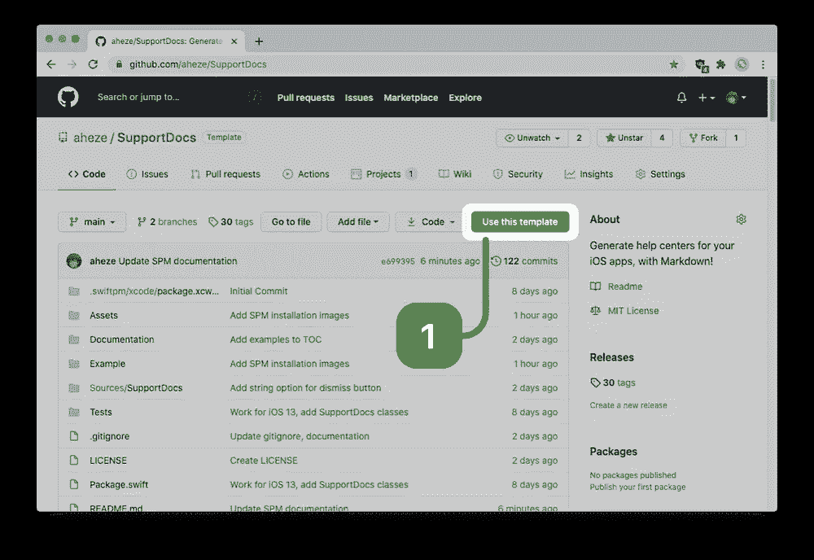**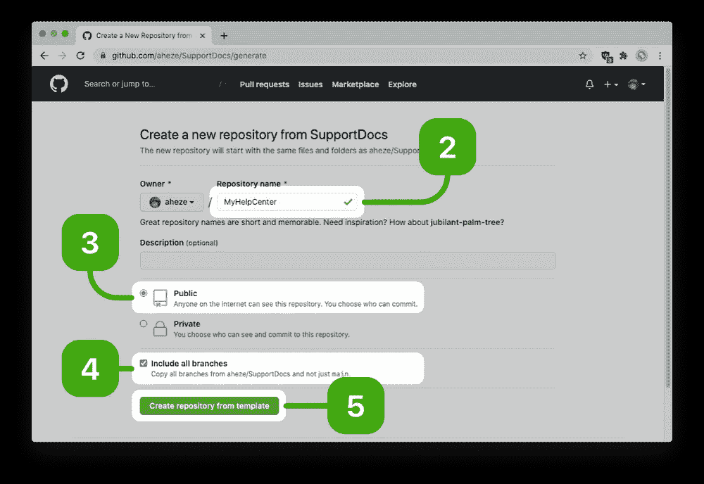****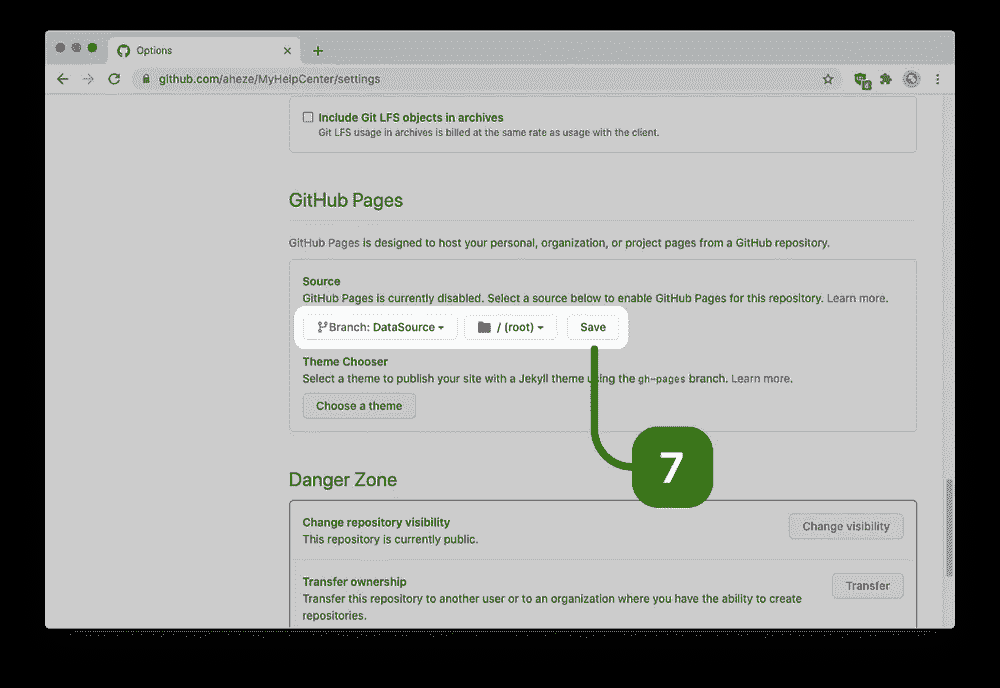*

*在您全新的存储库中，通过点击`main`下拉菜单并选择`DataSource`切换到`DataSource`分支。然后，检查“Sample-Boba”、“Sample-FastFood”和“Sample-Smoothies”文件夹中的文件。*

**

*你会发现一堆描述不同种类食物的减价文件。这只是出于演示的目的，但它们实际上是**将向用户展示的文档**。你可以用你自己的指南/常见问题来替换它们，就像编辑 GitHub 上的任何其他文件一样:只需点击右上角的铅笔图标，完成后提交你的更改。*

*要添加文档，请单击`Add file`按钮。为了让 GitHub 动作检测到它们，你必须**确保**:*

*   *文件扩展名以`.md`结尾。*
*   *在文档的顶部(这被称为[前置事件](https://jekyllrb.com/docs/front-matter/))，你有东西给`title`。我强烈建议你也添加[标签](https://github.com/aheze/SupportDocs#tagging-documents)(稍后会详细介绍)。*

*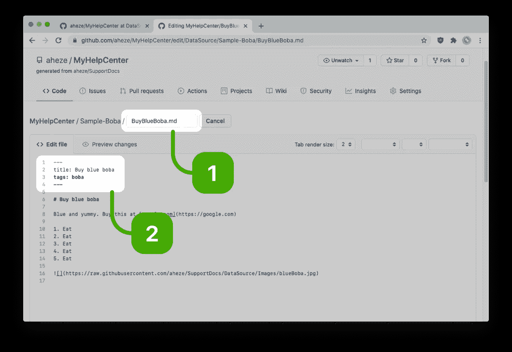*

*别担心，你的用户不会看到前面的内容——这只是针对 GitHub 页面和 GitHub 动作。他们只会看到第二个`---`之后的渲染(点击`Preview changes`按钮)降价。*

**

*您的用户将会看到什么*

*无论如何，你可以把你的文档放在任何地方，只要它们在`DataSource`分支中——它们可以在根目录,“Sample-Boba”文件夹，你自己的“CoolHelpDocuments”文件夹(你可以[制作](https://stackoverflow.com/questions/12258399/how-do-i-create-a-folder-in-a-github-repository/63635965#63635965)文件夹),无论什么！*

*现在，回到`DataSource`分支的主页。复制自述文件顶部的 URL。*

**

*复制这个。保持它的安全，因为 GitHub 操作为您生成了它！*

*这是 JSON 文件所在的位置。每当您在`DataSource`分支内进行更改时，GitHub 动作将更新 JSON，但是 URL 将总是相同的。*

*一旦你复制了你的网址，你就可以在你的应用程序中安装这个库了！*

# *应用程序方面*

*库是您的用户将看到的界面，大概是这样的，这取决于您对它的定制程度:*

*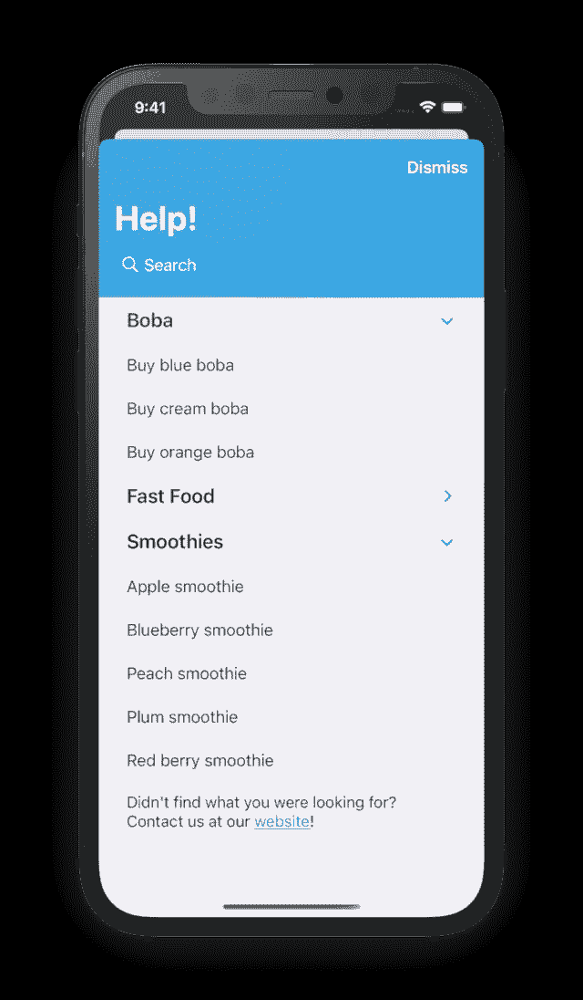**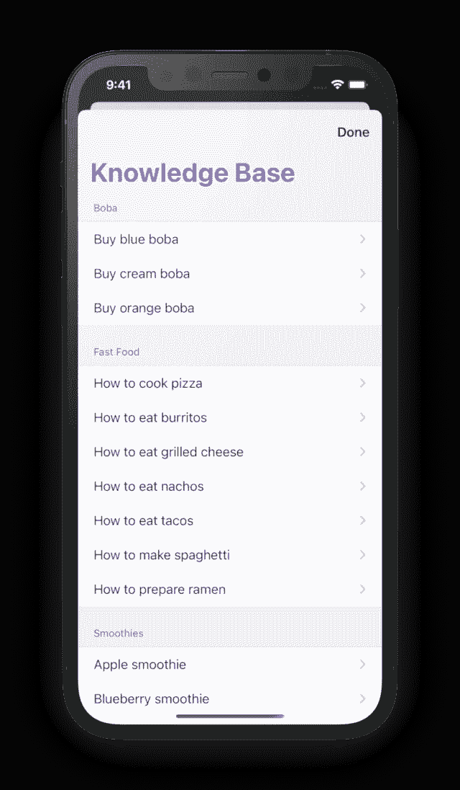**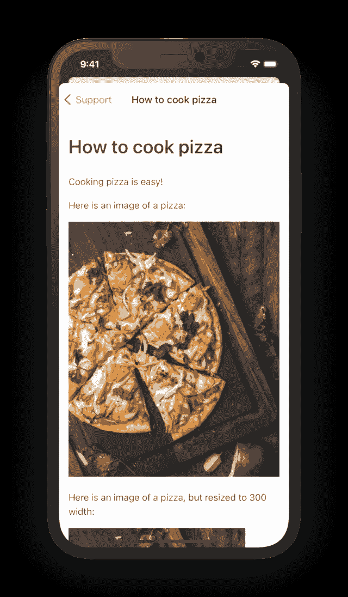*

*你可以使用 [Swift 包管理器](https://swift.org/package-manager/)或者 [CocoaPods](http://cocoapods.org/\) 来安装它。这取决于你，但我更喜欢 SPM，因为它内置于 Xcode 中。*

*对于 SPM，将其添加到 Swift Packages 选项卡中。完整说明[此处](https://github.com/aheze/SupportDocs#swift-package-manager)。*

```
*[https://github.com/aheze/SupportDocs](https://github.com/aheze/SupportDocs)*
```

*对于 CocoaPods，只需将其添加到您的`Podfile`:*

```
*pod 'SupportDocs'*
```

*完成后，您就可以在应用程序中展示该库了！获取您之前复制的 JSON URL。然后，在 SwiftUI 中是这样的:*

*对于 UIKit:*

*嗯，就这样吧！下面是它的样子:*

*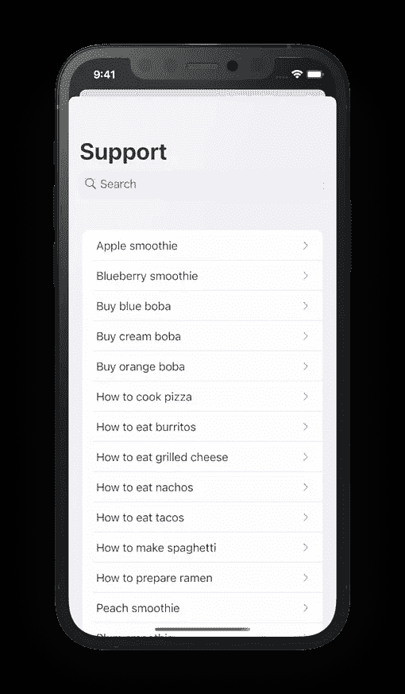**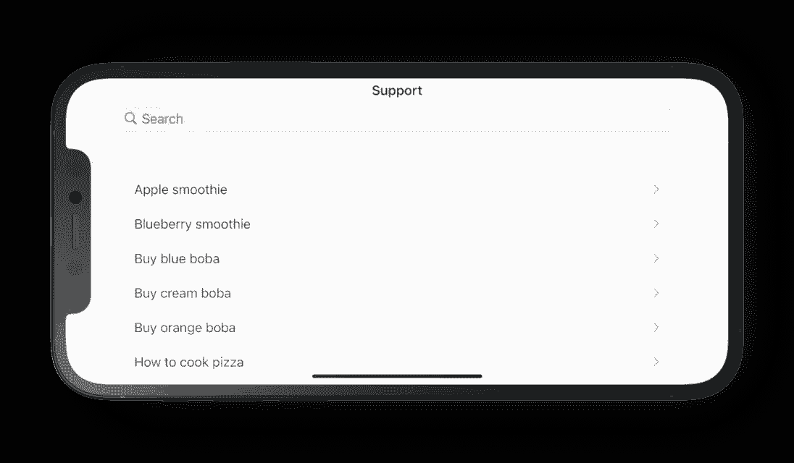*

*现在您已经设置好了一切并开始工作，您可能想要根据自己的喜好定制 SupportDocs 也许添加一个“解除”按钮或者只显示带有特定标签的文档。*

# *自定义文档呈现*

*这将改变 Markdown 的呈现方式，如页面的背景颜色。最有可能的是，默认的主题将为你工作——但是如果你想改变它，[这里是如何](https://github.com/aheze/SupportDocs/blob/main/Documentation/DocumentRenderingCustomization.md)。*

**

# *自定义库*

*这改变了你的用户看到的主屏幕，所以你得到了很多可定制性。您可以通过`SupportOptions`结构访问所有可配置的选项，您可以将它传递到库中。*

*比如想加一个“完成”按钮？*

**

*在 SwiftUI 中，只需这样做:*

*对于 UIKit，这是可行的:*

*简单吧？现在，还记得你放在前面的标签吗？只显示标有`boba`的文档怎么样？*

*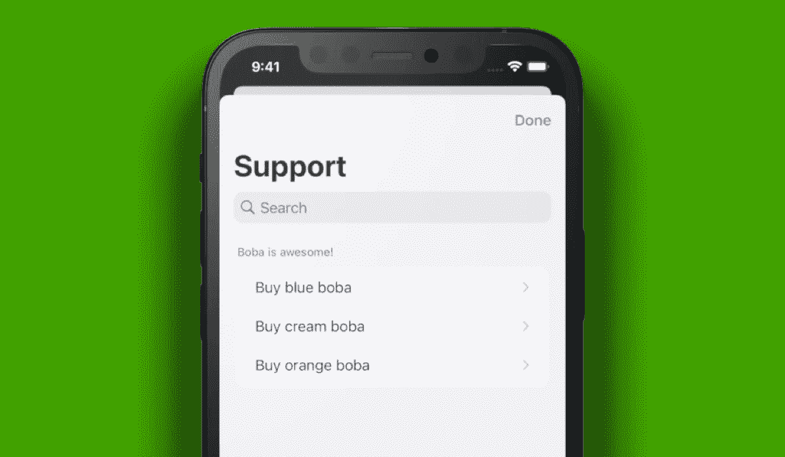*

*对于 SwiftUI:*

*对于 UIKit:*

*而这仅仅是开始。你可以在这里找到所有可定制的属性[…或者，使用](https://github.com/aheze/SupportDocs/blob/main/Documentation/LibraryCustomization.md#table-of-contents)[示例项目](https://github.com/aheze/SupportDocs/tree/main/Example)！*

*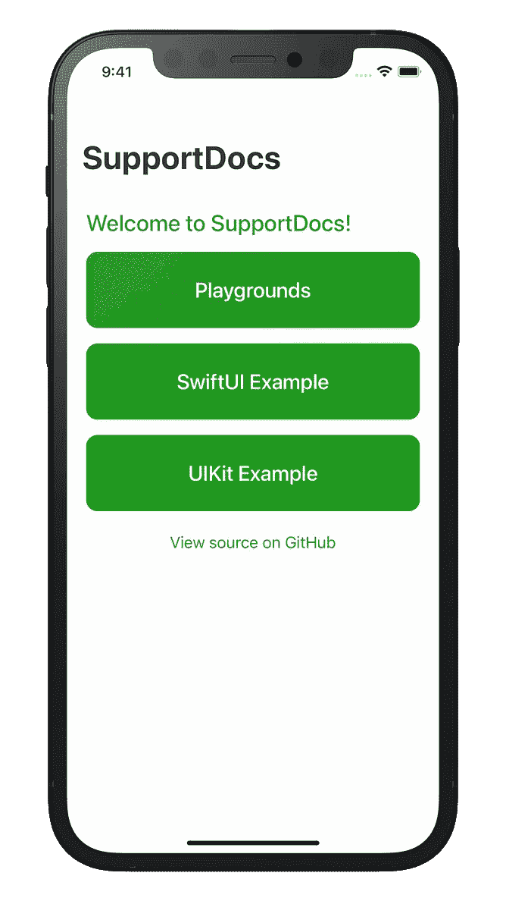*****

# *结论*

*作为一名开发人员，您必须在预算有限的情况下处理截止日期、EXC 坏访问等问题。*

*当我制作我的第一个应用程序时，我急于完成它，所以在提交给应用程序商店的前几天，我打开了一个杂乱的帮助中心。*

**

*我自己做的，因为我负担不起 Zendesk 这样的服务*

*它完成了工作，但就像两天内完成的任何事情一样，它看起来并不太好…嗯，这就是我们制作 SupportDocs 的原因。希望这个项目能帮你节省一些时间和金钱。感谢您的阅读，祝您编码愉快！*