# 用 1000 行代码从头开始构建一个 NoSQL 数据库

> 原文：<https://betterprogramming.pub/build-a-nosql-database-from-the-scratch-in-1000-lines-of-code-8ed1c15ed924>

## 介绍 LibraDB，这是我用 Go 创建的一个工作数据库

照片由 Pixabay 拍摄

# 第一章

我是个人项目的粉丝。这些年来，我有幸撰写了多个与数据库相关的博客/GitHub 项目。现在，我决定用一个项目来统治他们！

我已经在 Go 中实现了我的数据库，并决定通过写一篇描述所有步骤的博客来分享我的知识。这篇文章很长，所以我原本打算是一个 7 部分系列。最终，我决定把它保存在一篇分成 7 个部分的长文里。这样，你可以停下来，轻松地回到每一章。

数据库有意地简单和最小化，所以最重要的特性将适合，但仍然使代码简短。

代码在 Go 里，但并不复杂，不熟悉的程序员也能看懂。如果你知道围棋，我鼓励你继续努力！

整个代码库都在 GitHub 上，当你完成后，还有大约 50 个测试要运行。[在第二次回购](https://github.com/amit-davidson/Building-a-NoSQL-database-from-zero)中，代码被分成 7 个逻辑部分，每个部分放在不同的文件夹中。

我们将在 Go 中创建一个简单的 NoSQL 数据库。我将介绍数据库的概念，以及如何使用它们在 Go 中从头开始创建一个 NoSQL 键/值数据库。我们将回答以下问题:

*   什么是 NoSQL？
*   如何在磁盘上存储数据？
*   基于磁盘的数据库和内存数据库的区别
*   索引是如何制作的？
*   什么是 ACID，事务是如何工作的？
*   如何设计数据库以获得最佳性能？

第一部分将首先概述我们将在数据库中使用的概念，然后实现一个写入磁盘的基本机制。

## SQL 与 NoSQL

数据库分为不同的类别。与我们相关的是关系数据库(SQL)、键值存储和文档存储(这些被认为是 NoSQL)。最突出的区别是数据库使用的数据模型。

关系数据库将数据组织到由列和行组成的表(或“关系”)中，用唯一的键标识每一行。行表示实体的实例(例如“商店”)，列表示属于该实例的值(例如“收入”或“支出”)。

在关系数据库中，业务逻辑可能分布在整个数据库中。换句话说，单个对象的各个部分可能出现在数据库的不同表中。我们可能有不同的收入和支出表，因此要从数据库中检索整个商店实体，我们必须查询这两个表。

键值存储和文档存储是不同的。单个实体的所有信息都集中保存在集合/桶中。以前面的例子为例，商店实体在一个实例中包含收入和支出，并驻留在商店集合中。

文档存储是键值存储的子类。在键值存储中，数据被认为对数据库是固有的不透明的，而面向文档的系统依赖于文档的内部结构。
例如，在一个文档存储中，可以通过一个内部字段(如收入)查询所有商店，而键值只能通过它们的 id 来获取商店。

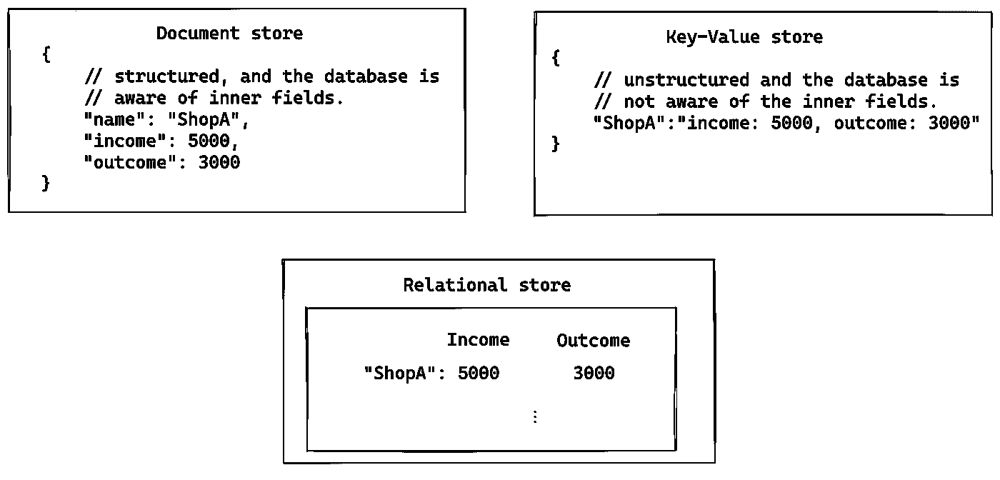

这些是基本的区别，尽管在实践中，有更多的数据库类型和更多的理由来选择一个。

我们的数据库将是一个**键值**存储(**而不是文档存储**)，因为它的实现是最简单和最直接的。

## 基于磁盘的存储

数据库在*数据库页面*中组织它们的数据(集合、文档……)。页面是数据库和磁盘交换数据的最小单位。有一个固定大小的工作单元很方便。此外，将相关数据放在附近是有意义的，这样就可以一次获取所有数据。

*数据库页面*连续存储在磁盘上，以最小化磁盘寻道。继续我们之前的例子，考虑 8 个商店的集合，其中一个页面被 2 个商店占据。在磁盘上，它看起来像下面这样:

[MySQL](https://dev.mysql.com/doc/refman/5.6/en/innodb-file-space.html) 默认页面大小为 16Kb， [Postgres](https://www.postgresql.org/docs/current/storage-page-layout.html) 页面大小为 8Kb， [Apache Derby](https://db.apache.org/derby/docs/10.0/manuals/tuning/perf24.html#Tune+the+size+of+database+pages) 页面大小为 4Kb。

更大的页面尺寸会带来更好的性能，但是它们也有损坏页面的风险。一种场景，其中系统在单个写事务的多个数据库页的写入过程中崩溃。

在实际数据库中选择页面大小时，需要考虑这些因素。这些考虑与我们的数据库无关，所以我们将任意选择数据库页面的大小为 4KB。

## 底层数据结构

如前所述，数据库跨许多页面存储其内部数据，这些数据存储在磁盘上。数据库使用数据结构来管理页面的数量。

数据库使用不同的数据结构来组织磁盘上的页面，主要是 [B](https://en.wikipedia.org/wiki/B-tree) / [B+](https://en.wikipedia.org/wiki/B%2B_tree) 树和[哈希桶](https://en.wikipedia.org/wiki/Hash_table)。每种数据结构都有自己的优点:读/写性能、支持更复杂的查询(如排序或范围扫描)、易于实现等等。

我们将使用 B 树，因为它易于实现，但它的原理接近于现实世界中的数据库。

## 我们的数据库

我们的数据库将是一个键值存储。它的底层数据结构是 B 树，每页的大小是 4KB。它将具有以下架构:

**数据库**管理我们的程序，并负责编排事务——那些是读写操作的序列。它还面对使用数据库的程序员，并为他们的请求服务。

**数据访问层(DAL)** 处理所有磁盘操作以及数据在磁盘上的组织方式。它负责管理底层数据结构，将数据库页面写入磁盘，并回收空闲页面以避免碎片。

## 开始编码

我们将自下而上构建我们的数据库，从**数据访问层(DAL)** 组件**开始。**我们将通过为它创建一个文件来开始编码。我们将有一个结构、一个构造函数和一个关闭方法。

## 数据库页面

DAL 将管理数据库页面的读写。我们将在`dal.go`中为`page`类型添加一个结构。它将包含一个作为唯一 ID 的数字，但它的作用更大。那个数字被用来访问带有指针算法的页面，比如(`PageSize*pageNum`)。我们还将为`dal`添加`PageSize`属性。

最后，我们将添加一个构造函数并对其进行读写操作。注意，在第 12 行和第 25 行，给定页面大小和页码，文件中正确的偏移量是如何计算的。

## 自由列表

管理页面是一项复杂的任务。我们需要知道哪些页面是免费的，哪些页面被占用了。如果页面变空，它们也可以被释放，所以我们需要回收它们以备将来使用，从而避免碎片化。

所有这些逻辑都由`freelist`管理。该组件是 DAL 的一部分。它有一个名为`maxPage`的计数器，保存着迄今为止分配的最高页码，还有一个名为`releasedPages`的属性，用于跟踪释放的页面。

分配新页面时，首先评估`releasedPages`是否有空闲页面。如果列表为空，则计数器递增，并给出新的一页，增加文件大小。

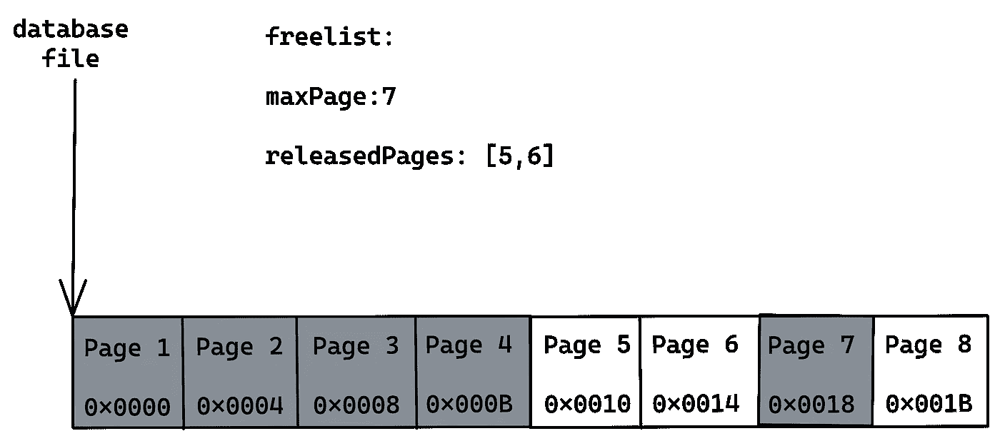

被占用的页面是灰色的。免费页面是白色的。

我们将首先创建文件`freelist.go`，为`freelist`定义类型，并添加一个构造函数`newFreeList`。然后，我们需要添加`getNextPage`和`releasePage`。我们的数据库使用第一页来存储元数据(这将在下一章中解释)，所以我们只能分配编号大于 0 的新页。

最后，我们将在 dal 结构中嵌入`freelist`,并在打开数据库时创建一个实例。

## 第一章结论

到目前为止，我们的数据库支持读写页面。为了测试我们的工作，我们可以创建一个 main 函数，编写一个页面，看看数据是如何存储的。

命令`hexdump`和`-C`标志一起用于显示二进制文件的内容。

前 4096 个字节(左边的 1000 个十六进制字节)是为元数据保留的，我们的数据就在它后面。

只要程序在运行，我们的数据库就在运行。如果程序被杀死，我们就无法知道哪些页面是空的，哪些包含实际数据。首先，这意味着需要将`freelist`持久化到磁盘上。这将是我们下一章的主题。

你可以在这里查看[这部分代码的完整版本](https://github.com/amit-davidson/Building-a-NoSQL-database-from-zero/tree/master/Part%201)。

# **第二章**

我们继续建立我们的数据库。在上一章中，我们看了数据库的一般架构。

然后我们实现了处理磁盘操作的数据访问层。到目前为止，它支持:打开和关闭数据库文件，将数据写入和读取到磁盘页面，还可以使用`freelist`管理空的和被占用的页面。

在这一章中，我们将实现磁盘持久性。将数据库状态保存到磁盘是非常重要的，这样它就可以在重新启动之间正常运行。DAL 将对此负责。

我们将从把`freelist`的状态提交到磁盘开始。

## 开始编码

为了保存`freelist`的状态，我们希望将它作为数据库页面写入磁盘。在数据库中，有一个保存数据库元数据的页面是很常见的。

在我们的例子中，它可以是基本页面的页码- `freelist`。它还可以保存幻数——一个用于标识文件格式的常量数值或文本值(我们将在最后一章中遇到它)。对我们来说，两者都是。

为了跟踪`freelist`页码，我们将添加一个名为`meta`的新页面。这是一个特殊的页面，因为它固定在 0 号上。这样，在重启时，我们可以从页码 0 开始读取元页面，并跟随它加载`freelist`内容。

## 元页面持久性

我们数据库中的一个典型模式是定义`serialize`和`deserialize`方法，用于将实体转换成适合单个页面的原始数据。并用返回实体本身的读写方法包装它们。

我们将创建一个名为`meta.go`的新文件，定义一个新的类型`meta`和一个构造函数。

我们需要将`meta`序列化为`[]byte`，这样我们就可以将它写入磁盘。不幸的是，如果不使用`Unsafe`包(出于显而易见的原因，我们不会使用它), Go 不支持像 C 语言那样简单地将结构转换成二进制，所以我们必须自己实现它。

在每个方法中，我们将有一个位置变量(`pos`)来跟踪缓冲区中的位置。它类似于文件中的光标。

我们还将创建一个新文件`const.go`来保存大小，并声明一个新的常量`pageNumSize`。它包含页码的大小(以字节为单位)。

文件`const.go`回答**如何为每个变量存储多少字节，序列化和反序列化负责**将它保存在页面内。****

最后，我们将使用前面的元序列化/反序列化和读/写页面方法添加方法`writeMeta`和`readMeta`。

## 自由列表持久性

我们已经定义了元页面，所以我们知道在哪里找到数据。现在，我们需要添加读/写`freelist`本身的方法。和以前一样，我们将添加序列化和反序列化的方法。

接下来，我们将把`meta`嵌入到`dal`结构中。

使用位于`meta`结构中的页码添加读写`freelist`页面的方法。

最后，更新`dal`构造函数来检查数据库是否存在。如果没有，就创建一个新的`meta`文件，并初始化`freelist`和`meta`页面。如果是的话，读取`meta`页来找到`freelist`页码并反序列化它。

## 第二章结论

好吧！我们有毅力。我们可以创建一个新的数据库，关闭它，然后再打开它。

注意第 0 页上的元页面(从第 1 行开始)包含第 1 个`freelist`页面。

正下方(第三行)是`freelist`。我们有四个一个四个。前 4 个数字表示分配的最大页数。1 显示了已发布页面列表的长度，最后 4 位表示唯一已发布的页面。

最后，我们有了数据，正如您在右栏中看到的，它在数据库重新启动后表现正常。

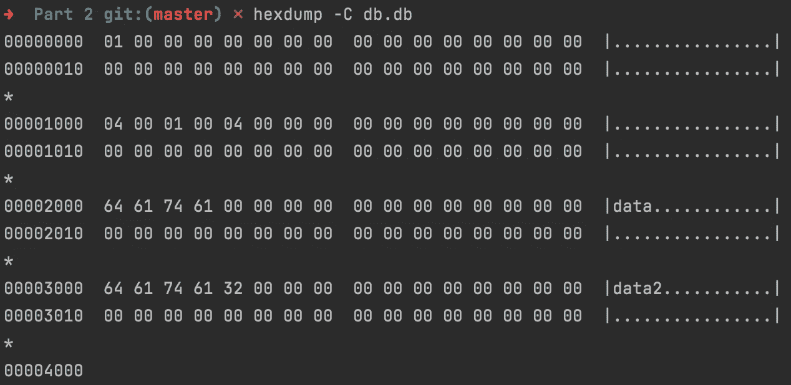

在下一集，我们将开始探索 B 树，它是数据库的主要明星。我们需要几集才能完全覆盖它。我们将讨论它们如何帮助我们组织数据以及如何将它们存储在磁盘上。

你可以点击[这里](https://github.com/amit-davidson/Building-a-NoSQL-database-from-zero/tree/master/Part%202)查看这部分代码的完整版本。

# 第三章

在前两章中，我们完成了数据库在磁盘上的持久化。这意味着我们的数据库可以在两次重启之间恢复到以前的状态。它还支持对磁盘的读写，但是我们必须负责数据的簿记。换句话说，当从数据库中获取一个项目时，我们必须记住它被插入的位置。

今天，我们将谈论 B 树，数据库的主要明星。我们将看到它们如何帮助我们组织数据，这样用户就不必跟踪每个对象在磁盘上的位置。

## 二叉查找树

二叉查找树(也称为 BST)是一种用于以有序方式存储数据的数据结构。树中的每个节点都由一个键、一个与该键相关联的值和两个指向子节点的指针(因此命名为 binary)来标识。不变量声明左侧子节点必须小于其直接父节点，右侧子节点必须大于其直接父节点。

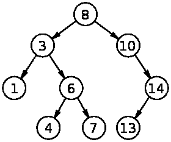

二叉查找树

这样，通过查看每个节点的值和相应的下降，我们可以很容易地找到元素。如果搜索到的值小于当前值，则下降到左边的子节点；如果更大，就下降到右边。

二叉查找树允许快速查找、添加和移除数据项，因为 BST 中的节点被布置成使得每次比较跳过剩余树的大约一半。

## 动机

为什么我们首先需要一棵树？一种简单的方法是创建一个文本文件，然后按顺序写入数据。写入速度很快，因为新数据被附加到文件的末尾。另一方面，读取特定项目需要搜索整个文件。如果我们的文件变大，读取将需要很长时间。

显然，它不适合许多现实生活中的应用程序。与前面的方法相比，BST 提供了更慢的书写速度，有利于更好的阅读。这种平衡的方法是通用数据库的理想选择。

另一个考虑因素是磁盘访问。它的成本很高，因此在设计驻留在磁盘上的数据结构时，必须将它保持在最低限度。

一个二叉树节点有 2 个子节点，因此，例如，拥有 2⁵=32 项将导致一个有 5 层的树。在最坏的情况下，在树中搜索一个项目将需要下降 5 层，依次地，每层需要 5 次磁盘访问。5 不算多，但我们能做得更好吗？

## b 树

b 树是二叉查找树的推广，允许节点有两个以上的子节点。每个节点都有介于 *k* 到 *2k* 键-值对和 *k+1* 到 2 *k+1* 子指针之间的子指针，只有少至 *2* 子节点的根节点除外。

通过在每个节点中有更多的孩子，树的高度变得更小，因此需要更少的磁盘访问。

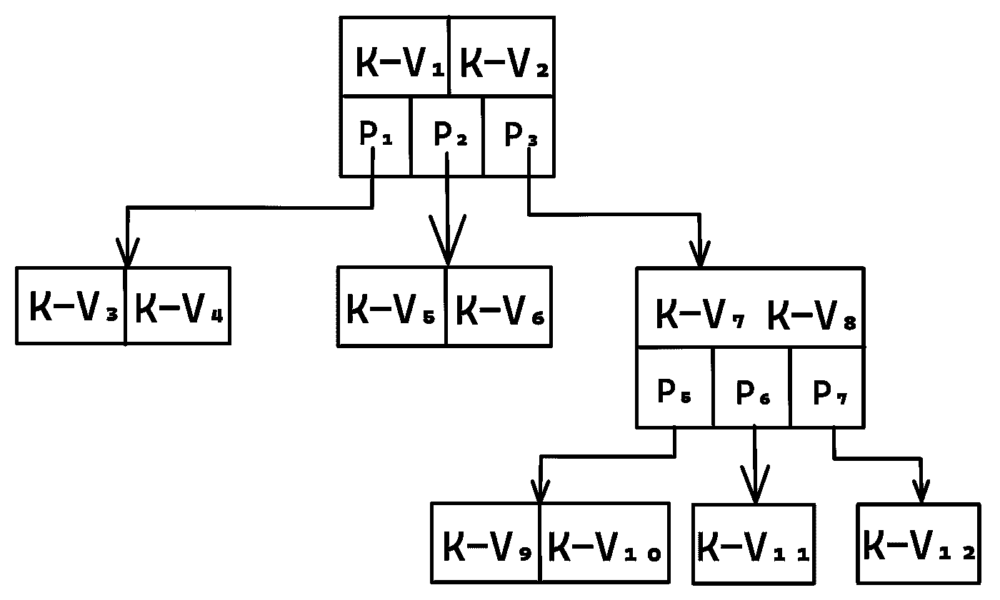

K-V 表示一个键值对。p 表示子指针

## 编码

我们将从创建一个新文件`node.go`开始，并为 B 树节点的`Node`和代表键值对的`Item`定义新的类型。

我们还将为`Node`和`Item`添加`isLeaf`和一个构造函数。

## 节点页面结构

我们想在磁盘上存储`Node`内容。一种简单的方法是“键值-子指针”三元组的串联，但是它有一个明显的缺点。

项包含不同大小的键和值。这意味着迭代键值对成为一项重要的任务，因为我们不知道游标每次迭代应该前进多少字节。

页面用 **p 表示，**键用 **k，**表示，值用 v 表示

为了解决这个问题，我们将使用一种叫做*的技术。该页面被分成两个存储区域。页面末尾是键和值，而开头是对记录的固定大小的偏移。*

我们还将添加一个包含页面中记录数量的标题和一个指示页面是否为叶子的标志(因为叶子没有子指针)。

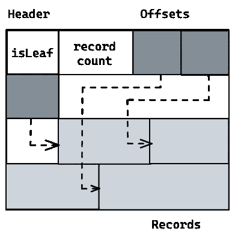

这种设计允许以最小的努力对页面进行更改。通过对单元格偏移量进行排序来保持逻辑顺序，因此不必重新定位数据。

每个节点都被序列化为一个页面，但是理解两者之间的区别很重要。

`Node`只包含键-值对，在更高的层次上使用。`Page`另一方面，工作在存储级，保存任何类型的数据，只要它的大小是 4KB。它可以包含以*开槽页面*结构组织的键值对，也可以包含以不太严格的形式放置的`freelist`和`meta`。

## 节点持久性

正如我们在前面章节中所做的，我们将添加数据库节点的序列化和反序列化。这些方法将数据从开槽页面格式转换成开槽页面格式。

实现是冗长的和技术性的，上面的细节没有什么新东西。最好关注上面描述的一般设计，而不是实现本身(尽管我鼓励您阅读代码)。

我们还将添加`getNode`、`writeNode`和`deleteNode`来返回一个节点。
前两个方法返回`node`结构本身，因此它们与我们对`freelist`和`meta`所做的相同。

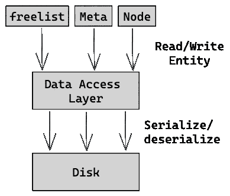

`deleteNode`向`freelist`发信号通知可以删除一个节点，因此它的页面 id 可以标记为已释放。

## 搜索、插入和删除

在实现搜索、插入和删除算法之前，假设我们会多次调用接收和写入节点是安全的。
我们将使用自己的层来包装对`dal`的调用。在未来的部分，这将派上用场。

## 搜索

使用二分搜索法来搜索 B 树。该算法从根节点开始，遍历所有键，直到找到第一个大于搜索值的键。然后，我们使用相应的子指针下降到相关的子树，并重复这个过程，直到找到值。

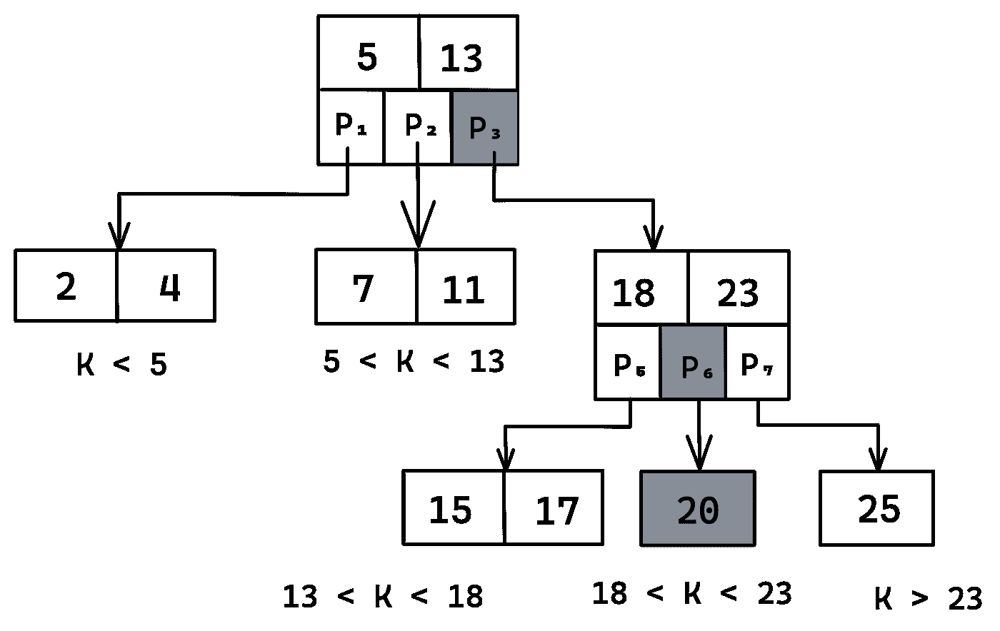

在示例中，提供了 20。在第一级中，没有一个键与 20 完全匹配，所以该算法下降到正确的范围内——所有大于 13 的数字。在第二层中最右边的节点上重复该过程

函数`findKeyInNode`在节点内搜索一个键，如上图所示。它将搜索到的关键字与每个级别中的关键字进行比较。如果找到匹配，那么函数返回。如果键不存在，则返回正确的范围。

现在我们想遍历整个树，并在搜索每个节点时使用前面的函数。我们将执行类似于二分搜索法的搜索。唯一的区别是搜索是对许多子节点而不是两个子节点执行的，如上图所示。

`findKey`功能是围绕`findKeyHelper`的包装器，在这里执行重物提升。

如前所述，搜索是从给定的节点(通常是根节点)开始递归进行的。每个节点都可以从它的父节点到达，但是因为根节点没有父节点，所以我们通过在元页面中保存它的页码来到达它。

`root`属性被添加到元结构中，`serialize`和`deserialize`也将处理这个字段。

## 第三章结论

让我们测试一下我们的搜索方法。我们的数据库在 B 树中执行搜索，因此它希望数据库页面以 B 树格式放置。

我们还没有办法创建一个，所以我添加了一个名为`mainTest`的模拟文件，它已经用这种方式构建好了。该文件包含一个键值对。键是“Key1”，值是“Value1”。

在接下来的两章中，我们将实现对数据库的写入和删除。你可以在这里找到这部分[的代码。](https://github.com/amit-davidson/Building-a-NoSQL-database-from-zero/tree/master/Part%203)

# 第四章

在上一章中，我们讨论了 B 树。它们是二叉查找树的推广，允许节点有两个以上的子节点。树的高度被最小化，从而减少了磁盘访问。

我们还讨论了开槽页面。一种布局，通过在开头放置固定大小的偏移量，在结尾放置实际数据本身来组织不同大小的键值对。

最后，我们开始在 B 树上实现基本操作:搜索、插入、删除。在前一章中，我们实现了搜索操作。我们将在这一个中做插入。

## 问题

插入新项目可能会导致节点包含太多项目。例如，当所有新对都插入到同一个节点中时。

这使得操作速度变慢，因为每次访问节点时我们都要迭代更多的条目。除此之外，它还会导致一个更严重的问题。节点被转换成固定大小的*数据库页面，*因此基于键值对的总大小，每个节点中的键值对的数量是有限制的。

删除也有类似的问题。从同一个节点中删除键值对可以收缩一个节点，所以它包含的键值对非常少。此时，最好以某种方式将这些对重新分配到不同的节点。

要知道一个节点是达到最大值还是使用率不足，我们必须首先定义它。我们将添加一个上限和下限，即页面大小的百分比。

在代码中，我们引入了`Options`，它将由用户初始化并在我们的 DB init 函数中使用。

我们还将为`dal`和`node`添加新的方法，用于计算节点大小(以字节为单位)并将其与阈值进行比较。`elementSize`计算给定索引处的单个键值子三元组的大小。`nodeSize`对节点头大小以及所有键、值和子节点的大小求和。

## 解决办法

当树中的一个节点有太多的键值对时，解决方案是将它分成两个节点。

拆分是通过分配一个新的节点，将一半的键-值对转移到那里，并将它的第一个键和指向该节点的指针添加到父节点来完成的。如果它是一个非叶节点，那么拆分点之后的所有子指针也将被移动。

第一个键和相应的指针被移动到父项，从而增加了它的占用率。该过程可能导致溢出，因此必须沿树向上递归重复重新平衡。

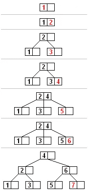

插入 4 和 7 时会进行拆分。图片取自维基百科

## 插入

插入项目的算法如下:

1.  搜索树以找到应该插入新元素的叶节点并添加它。
2.  如果节点超过最大占用率，如上所述重新平衡树:
    a .找到分裂索引
    b .小于分离值的值留在现有节点中，大于分离值的值放入新创建的右节点中。
    c .分离值被插入到节点的父节点中。
3.  重复步骤 2，从插入节点开始到根节点。

## 辅助方法

我们将从算法的第一步开始。方法`addItem`在给定的索引处添加一个键值对，然后移动所有的键值对和子键值。这个简单的方法可以很容易地与标准库一起提供。

对于步骤 2，我们将添加四种方法来确定节点是否达到最大占用率。(或删除所需的最小占用率)

我们将为`node`添加相应的方法进行解耦，这将在后面对我们有所帮助。

既然我们已经知道了重新平衡是否必须发生，我们将编写重新平衡本身。关注 2.a，`getSplitIndex`根据元素大小和最小节点大小计算应该拆分节点的索引。它以字节为单位对键值对的大小求和。一旦积累到足够的数量，就返回索引。

最后，我们将添加`split`来处理步骤 2.b 和 2.c。它在一个节点上被调用，并接收它的一个子节点和它在`childNodes`列表中的索引。

如前所述，首先确定分裂指数。拆分索引左侧的对保持不变，而右侧的对被移动到一个新节点。如果存在子指针，后半部分也会被移动。

拆分索引中的对被移动到父节点，指向新创建的节点的指针被添加到父节点中的正确位置。

## 把它们放在一起

在我们将上述方法结合到插入函数之前，我们将引入集合*的概念。一个*集合*是一组键值对。一个*集合*相当于一个 RDBMS 表。*集合*中的键值对有类似的用途。*

我们将在后面的文章中回到集合的概念。现在，我们将添加一个名为`Collection`的结构以及`Find`和`Put`方法。

集合本身就是 B 树。因此，每个集合都有一个名称和一个标记树根节点的根页面。

`Find`方法加载集合根节点，并在该节点上执行`findKey`来定位键。如果没有找到键，则返回`nil`。

本章总结了我们在这一章中所做的所有工作。它从用户那里接收一个键值对，并将其插入到集合的 B 树中。

在第 9–23 行，该方法检查一个根节点是否已经初始化或者它的第一次插入，因此必须创建一个新的根节点。

在第 26–36 行，我们搜索应该插入的树。`findKey`返回应该插入的节点和索引。如果我们需要重新平衡树，它还返回指向修改节点的路径中的节点(作为索引——每个节点都可以从其父`childNodes`数组中检索)。

在第 31–41 行，我们执行实际的插入。我们首先检查密钥是否已经存在。如果是这样，我们只用新值覆盖它。如果没有，我们插入它。由于 B 树的工作方式，新项目只能添加到叶节点。这意味着我们不需要照顾孩子。

最后，如果需要，我们在第 49–56 行和第 59–71 行重新平衡。第一个块重新平衡了插入路径，不包括根。第二个块重新平衡根并更新集合的根指针。

## 第四章结论

这一部分的重点是插入数据库。现在，我们可以像用户一样在数据库中插入和查找项目。

在下面的代码中，我们用`MinFillPercent`和`MaxFillPercent`创建了一个新的数据库，当一个节点有六个或更多条目时，这将导致一个节点被分割。我们创建一个新的集合，将 DB 根页面指定为集合根页面。最后，我们模拟一个实际的用户操作，向集合中添加新的条目并搜索它们。

在我们的文件上运行`hexdump`,我们可以观察到发生了分割。我们有一个包含 4 的根节点。然后，我们有两个子节点，一个节点包含对 1–3，另一个节点包含键 5–6。

此外，由于节点被设计为分槽页，请观察上下地址是如何写在每页上的，并且中间的空间保持为空。

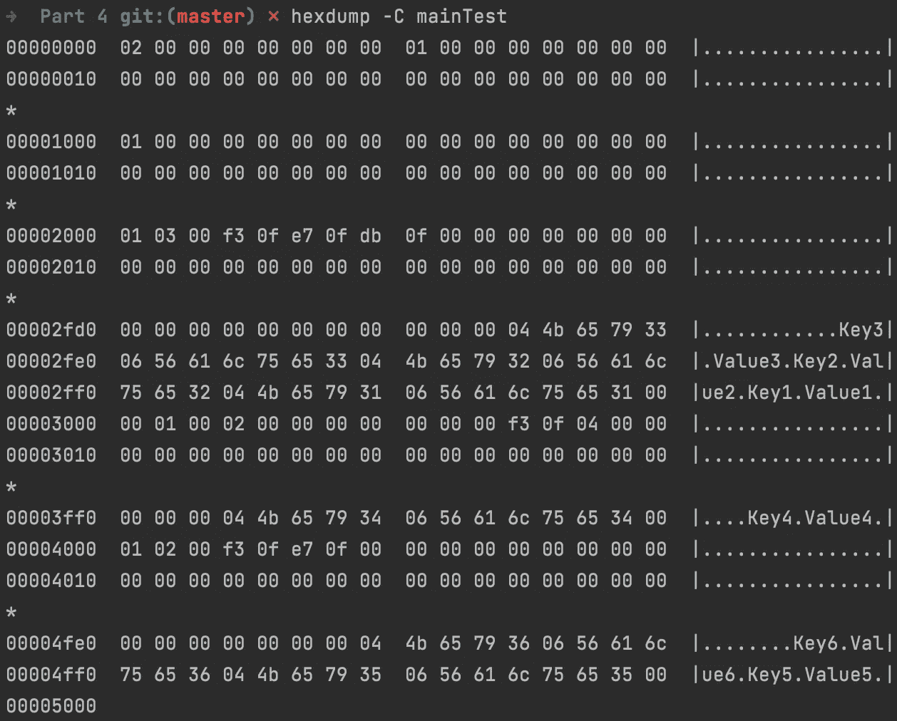

在下一部分中，我们将重点讨论删除。它不会像这一部分那么密集，因为我们在这一部分中添加的许多函数将在以后使用。

你可以在这里查看这部分[的代码。](https://github.com/amit-davidson/Building-a-NoSQL-database-from-zero/tree/master/Part%204)

# 第五章

在前两部分中，我们讨论了 B 树并实现了查找和插入方法。在这一部分，我们将实现删除操作，并结束对 B 树的讨论。

## 删除

删除项目的算法如下:

1.  找到要删除的项目。
2.  删除项目:
    a 如果值在叶节点中，只需从节点中删除即可。
    b 否则，(值在内部节点中)，选择一个新的分隔符——左子树中最大的元素，将其从所在的叶节点中删除，并用新的分隔符替换要删除的元素
3.  重新平衡树，从叶节点或根据上述情况选择分隔符的节点开始。

## 删除实现

我们将关注第二点。

我们需要处理两种情况。第一个(2.a)是从叶节点中删除一个节点。这种情况很简单，因为我们只需要将它从节点中移除。

另一方面，如果我们遇到一个内部节点(2.b ),我们需要定位它的前身并使它成为新的分隔符。在第 15 行，我们选择左边的子树，并在第 20–27 行下降到最右边的子树，得到左边子树中包含最大项目的节点。

在第 30–32 行，我们用它的前身——左子树中最右边的一对——替换要删除的项，并将其从它所在的叶节点中删除。

## 为…修复平衡

我们将关注第三点。

当向一个节点输入一个新项时，可能会导致其中一个节点溢出，导致树失去平衡。删除会导致下溢，所以我们必须立即重新平衡树。

与插入不同，在插入中，重新平衡只能通过拆分节点来完成，删除操作后的重新平衡可以是合并或旋转节点。

可以向右或向左旋转，这取决于哪个节点有备用项目。例如，右旋转是通过将分隔符从父节点复制到下溢节点的开始，并用其左兄弟节点的最后一个元素替换分隔符来完成的。当旋转非叶节点时，左兄弟的最后一个子指针被移动到不平衡节点的开始。当执行向左旋转时，采用类似的方法。

在下面的示例中，删除了 15，导致右边的孩子拥有的项目太少。这导致右旋转。

向右旋转

如果没有兄弟节点可以保留一个元素，那么有缺陷的节点必须与兄弟节点合并。合并会导致父级丢失分隔符元素，因此父级可能会变得不足，需要重新平衡。再平衡可能会一直持续到根本。

在这种情况下，15 被删除。向右旋转是不能进行的，因为这会使左边的孩子处于赤字状态。因此，解决方案是将这些节点合并成一个节点。

合并

与前一章类似，我们将开始添加一些辅助函数，并将它们组合成一个位于`collection`结构下的函数。

我们的前两个函数是左右旋转。这两个函数几乎相同，所以让我们来看看向右旋转的情况。

旋转是按照注释中的解释完成的。给定节点 A，我们删除它的最后一项。我们将它替换为父节点中正确索引中的项目，并将最初在父节点中的项目放入 B 节点中。

正确的索引是父节点中这两个节点之间的项目的索引。如果存在任何子指针，它们也会被移动。

两种旋转的代码是相似的。区别在于受影响的节点和被移动的键值对。

接下来，是`merge`。merge 函数接收一个节点及其索引。然后，它将该节点与其左边的兄弟节点合并，传输其键值对和子指针。该函数完成后，它会删除该节点。

最后，我们将编写`reblanceRemove`来决定当树失去平衡时应该应用什么算法。

在每次旋转中(第 9–19 行和第 22–32 行)，我们确保不平衡节点不在边上，因此它有一个左/右兄弟节点。我们还确保兄弟元素可以保留一个元素，这意味着它的兄弟元素在操作后不会下溢。如果两个条件都为真，则选择旋转。

如果两个条件都不成立，那么我们执行一个合并(第 36–45 行)。merge 函数将一个节点与其左边的兄弟节点合并。如果我们在最左边的兄弟节点上，使用右边的一个节点，这就是第 36 行的`if`条件。

## 把它们放在一起

我们将添加一个新方法`Remove`到集合中。在第 8–11 行，加载根节点，然后在第 13–16 行，我们执行算法中的步骤 1，定位要删除的项目。如果它不存在，我们在第 18–20 行返回。

在第 22–30 行，我们根据算法中的步骤 2 删除项目。我们扩展我们的祖先列表来跟踪可能受叶节点移除影响的任何节点。

最后，在第 32–47 行，我们跟踪`ancestorsIndexes`列表中可能受到影响的节点，并在需要时重新平衡它们。

最后，在第 51–53 行，如果根节点是空的(例如，如果它原来有一个项目，但被删除了)，那么我们忽略它，并将其子节点指定为新的根节点。

## 结论

在下面的代码中，我们用第 29 行的 remove 操作扩展了上一章的程序。

运行它，我们得到预期的移除后的`nil`。

请记住，在上一部分中，在插入 6 之后出现了拆分。您可以在下图的左侧查看它的状态。

删除键 1 导致合并

移除操作之后，树会失去平衡。右边的兄弟只有两个项目，不足以执行左旋转。因此，选择了合并平衡策略。合并操作后的树在右边。

运行`hexdump`，我们如预期的那样到达第 3 页(从`00002000`开始)。所有对都在同一个节点上。

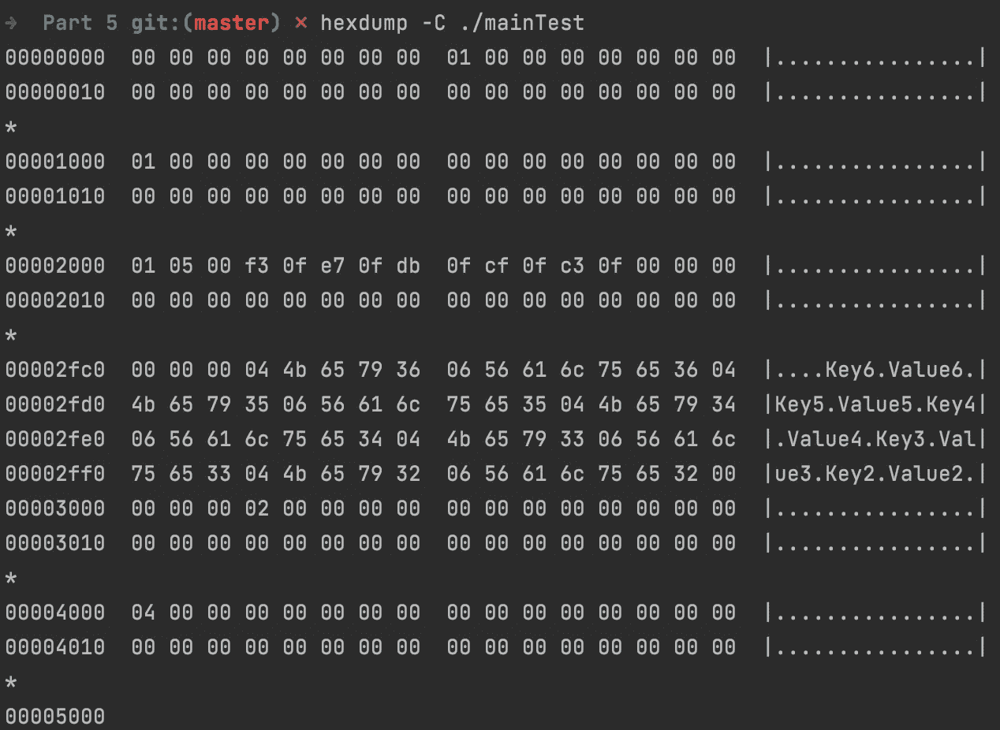

需要注意的是，这个过程并没有就此结束。请记住，在合并过程中，会删除一个节点。该节点被`freelist`标记为空闲。当更新的`freelist`被提交时，它被写入第 5 页，在第 5 页中，5 和 6 在`Insert`操作后驻留(查看前一部分末尾的文件状态)。

提交`freelist`是笨拙的，但却是必要的，还有在一系列读/写操作之后应该执行的其他操作。

在下一章，我们将介绍数据库事务的概念。一个工作单元由对数据库执行的一系列操作组成。他们将处理在一系列操作开始和结束之前需要执行的工作，以及许多其他工作。

# 第六章

在前三部分，我们讨论了 B 树。我们实现了 B 树方法，如查找、插入和删除。这些方法接近于磁盘级别，因为它们定义了哪些布局页面应该保存在磁盘上。

## 处理

今天，我们介绍交易的概念。事务是一个更高层次的概念。事务是一个工作单元，由对数据库执行的一系列操作组成。

例如，从账户 A 向账户 B 转账包括:

1.  读取账户 a 的余额。
2.  从那笔金额中扣除 50 美元，写回账户 a。
3.  读取账户 b 的余额。
4.  在这个数额上加 50 美元，它又回到 b 账户。

所有这些操作合在一起就是一个事务。

## 酸

酸代表原子性、一致性、隔离性和持久性。它是数据库的一组属性，保证事务得到可靠的处理。

*   **原子性**意味着要么所有事务都成功，要么都不成功。它确保数据库不会处于未定义的状态。
    我们的数据库不是原子的，因为如果事务中途失败(如果数据库崩溃)，事务的一部分被提交，而另一部分没有。
    我构建了数据库，以便可以轻松扩展来支持它，但这也涉及更多代码，超出了我们数据库的范围。
*   **一致性**确保在事务完成后，根据所有定义的规则，写入数据库的数据必须有效。例如，银行账户的余额必须是正数。
*   **隔离**是衡量事务如何彼此隔离发生的尺度。换句话说，交易对他人的影响到什么程度。在下一节中，我将更多地关注这一点。
*   **持久性**意味着一旦事务被提交，即使在系统出现故障的情况下，数据也会被保留。
    我们的数据库是持久的，因为数据库持久存储在磁盘上。与内存(RAM)数据库不同，崩溃后数据仍保留在磁盘上。

# 隔离

首先，我们将描述当多个事务同时运行**和**时可能发生的三种异常。

## **脏读**

当允许事务从已被另一个正在运行的事务修改但尚未提交的行中读取数据时，就会发生*脏读*。

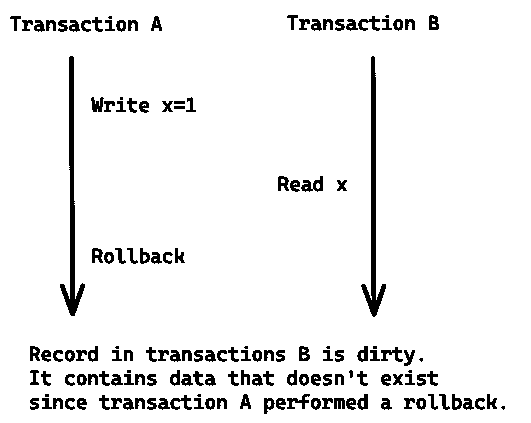

## 不可重复读取

*不可重复读取*发生在事务过程中，当一行被检索两次，并且行内的值在两次读取之间不同时。

## 幻像读取

*幻像读取*发生在事务过程中，当另一个事务向正在读取的记录中添加或删除新行时。

*脏读* 从另一个事务读取**未提交的**数据。
*不可重复读取* 从另一个事务的**更新**查询中读取**提交的**数据。
*幻影读取*从另一个事务的**插入**或**删除**查询中读取**提交的**数据。
*虚拟读取*是*不可重复读取*的更复杂变体。*幻像读取*涉及范围扫描，因此问题不像*不可重复读取*那样出现在单个文档中，而是出现在多个文档中。

## 隔离级别

SQL 标准根据以下现象定义了四个隔离级别:

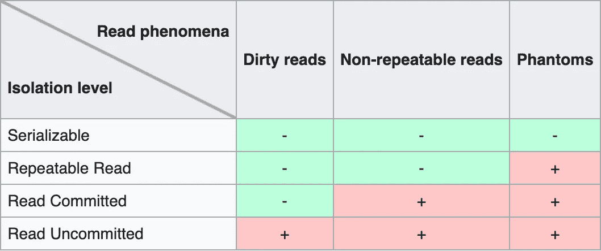

摘自维基百科

在我们的数据库中，我们将有一个*可序列化的*隔离级别。每个事务在下一个事务开始之前执行完毕。

我们将通过在事务开始前获取一个 RW 锁，并在事务结束时释放它来实现这一点。一个 RW 锁可以由任意数量的读取器或单个写入器持有。

这意味着我们的数据库可以在任何给定时间支持单个写入者或多个读取者，但不能同时支持两者。

# 开始编码

## 分贝

我们将创建一个名为`db.go`的新文件。我们将添加一个名为`DB`的新结构以及方法`Open`和`Close`。`DB`包含`dal`和一个 RW 锁。如上所述，它管理对磁盘的访问，并确保并发事务不会导致任何异常。

`DB`是面向用户的，所以我们将使用公共方法包装`dal`层。

我们还将添加两个方法`ReadTx`和`WriteTx`，用于打开事务和获取锁。

## 处理

我们将添加一个名为`tx.go`的新文件。我们将添加一个新的`tx`结构和构造函数。

`write`标志表示交易是否为只读。当只读事务试图进行更改时，我们将向`const.go`添加一个新的错误。

然后在前面几集的`Put`和`Remove`方法中使用它。

一旦事务开始，它要么提交并保存所有修改的数据，要么回滚并忽略所有更改。提交更改很容易，正如我们在前面的部分中已经做的那样，但是回滚更复杂。

一种更简单的方法不是在执行回滚时恢复更改，而是将修改后的节点临时存储在 RAM 中，然后一次将它们传播到磁盘。然后要执行回滚，我们必须什么都不做，因为数据没有提交。

为此，`dirtyNodes`持有已修改的节点，等待提交。`pagesToDelete`保存等待删除的页面。并且`allocatedPageNums`保存我们在事务期间由`freelist`分配的任何新的`pageNums`。

如果事务被读取，执行回滚很简单，因为只需要释放互斥体。如果是写事务，我们必须释放由`freelist`给出的页面，将片标记为`nil`并释放互斥体。

执行`Commit`也很简单。在读事务中，只有互斥体必须被释放。在写操作中，将保存修改的节点，删除删除的节点，并标记所有获取的页面。最后，互斥体被释放。

现在我们想把我们在前面几集添加的读/写/删除操作重定向到`dirtyNodes`和`pagesToDelete`而不是磁盘。这意味着我们必须检查代码，将对`dal`的访问替换为对`tx`的访问。

例如，进行以下更改:

或者集合文件中的以下内容:

这个过程很漫长，但是你可以在 [Github](https://github.com/amit-davidson/Building-a-NoSQL-database-from-zero/tree/master/Part%206) 上检查所有的改动。

重要的是要注意，一旦我们写一个节点，它实际上不是写到磁盘，而是写到一个临时缓冲区。如果系统中途失败，我们将无法从崩溃点继续交易。

为了解决这个问题，可以使用 *WAL* 来跟踪变更。它代表*预写日志*，用于提供原子性和持久性。它通常被实现为一个只附加的日志文件，记录对数据库的更改。

然后，每次调用(或删除)write node 方法时，我们可以在单独的日志文件中记录更改(而不是在 B 树中！).如果系统崩溃，我们可以从最后一次调用中恢复数据库。

这也超出了我们数据库的范围，但是我们的数据库是专门构建的，因此可以很容易地通过这种改进进行扩展。

## 第六章结论

在这一部分，我们不会展示我们的新功能，但是在下一部分，我们将有一个自底向上的工作数据库。我们将添加新的方法来处理集合，这将总结我们数据库的所有关键特性。

# 第七章

在这一部分，我们将完成数据库。我们将深入了解之前已经看过的系列。这部分也将是我们的最后一集。

## 收集

我们已经介绍了集合的概念。它们存储具有类似目的的键值对，相当于 RDBMS 表。

我们讨论了在给定的集合中添加/移除/搜索**，但是我们没有讨论如何**创建**它们。**

这个想法是有一个主集合来保存其他集合(*根集合*)。它将包含键值对，其中**键**是集合名称。

在 B 树中，每个节点都是子 B 树的根，因此每个集合本身就是 B 树，并且是整个 B 树的子 B 树。**值**将指向作为集合子树的根的页码。

记住,`meta`页面保存了 B 树根的页码。`root`字段将指向*根集合*的根页面。

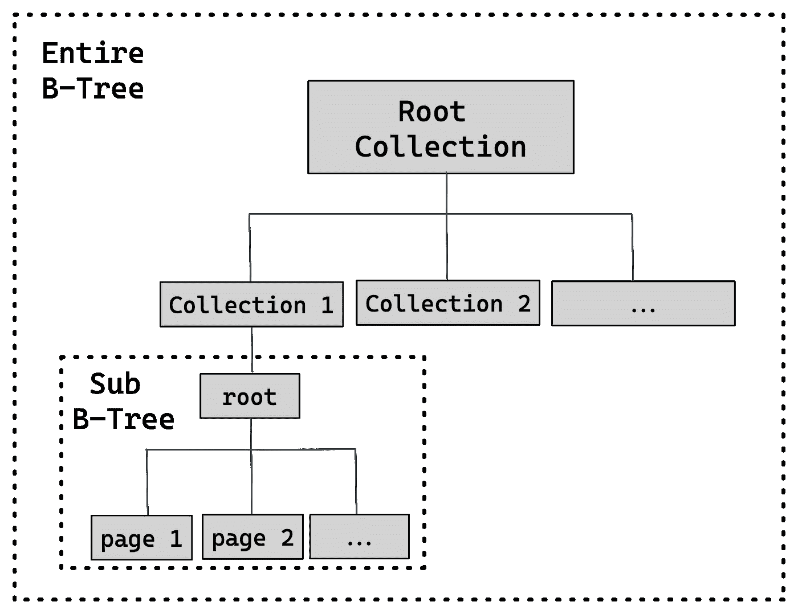

在数据库中搜索键值对的实际流程如下:

1.  首先检索要在其中执行搜索的所需存储桶。数据库将在*根集合*中搜索给定的集合。
2.  获取集合子树根页面
3.  从根页面开始，在集合子树中找到所需的元素。

第 1 步和第 3 步都使用了我们在第 4 部分中实现的`Find`方法。不同之处在于搜索到的集合。下图显示了流程，其中每个箭头对应流程中的一个步骤。

## 开始编码

我们将从实现检索根集合的方法开始。关键部分是将它的根页面分配给整个数据库的根页面。

然后我们会像上面讨论的那样加上`GetCollection`。在根集合中搜索集合名称，反序列化内容，并返回。

创建和删除集合是相似的。在*根部集合*上涂抹`Put` / `Remove`。此外，确保调用事务是写事务。

## 神奇的数字

我们将添加最后一个不错的特性。幻数是用于标识文件格式的常量数值或文本值。程序在第一个字节中存储一个标识符，比如`CA FE BA BE`(例如 Java 类文件)。当程序加载时，它将第一个字节与预期的签名进行比较，并确保它们相等。

我们将把我们的幻数定义为`D00DB00D`(但它可以是您选择的任何值)。在将元页面写入磁盘时，我们将包括幻数。当数据库启动时从磁盘加载它时，我们会将文件内容与预期的签名进行比较。

## 第七章结论

这是一个漫长的旅程，但我们的数据库现在已经完成。如果你跟着我走到这一步，你应该感到欣慰。

要测试我们的数据库，您可以使用在 [Github](https://github.com/amit-davidson/LibraDB) 上完成的测试中的一个，或者编写您的场景。并发或非并发的读/写操作的任意组合都可以工作。

# 总结和结束语

在第 1 章中，我们介绍了一些宽泛的术语，如 SQL 与 NoSQL、数据结构和基于磁盘的存储。我们讨论了我们的数据库，特别是 *dal* 层及其组件，例如 *freelist* 和*数据库页面。*

**第 2 章**是关于磁盘的持久性。我们在文件的第一页引入了一个特殊的页面，叫做 *meta。它保存了我们的数据库正确启动所需的所有信息。我们还增加了写入磁盘的方法，比如: *meta* 和 *freelist* 页面的`serialize` / `deserialize`和`read` / `write`。每当有新的实体添加到数据库中时，这些方法就会重新出现。*

第 3、4 和 5 章是关于 B 树的。在第 3 章中，我们介绍了二分搜索法树，并讨论了数据库中 B 树的基本原理。我们决定使用*开槽页面。*一种在磁盘上组织数据的技术，将数据存储在每页的末尾，并将固定大小的指针指向数据的开头。

然后，我们开始编写 B 树，并通过搜索操作完成了这一部分。

**在第 4 章**中，我们使用 B 树对数据库进行编码插入。我们首先看到了保持 B 树平衡的重要性，并增加了确定树是否失去平衡的方法——节点中的元素是否过多/过少。然后我们编写了处理再平衡的`split`方法和插入方法本身。我们也第一次看到了`collection`实体。

**在第 5 章**，我们通过实现删除和适当的平衡方法——左/右旋转和合并，完成了 B 树的编码。

第 6 章不同于之前的部分，因为我们没有处理磁盘操作。我们提出了事务的主题——一个由对数据库执行的一系列操作组成的工作单元。

我们讨论了 ACID——可靠处理事务的一组属性。我们还仔细研究了隔离，并使用锁来确保并发事务不会相互干扰。

**最后，在第 7 章**，我们添加了收集机制，这是数据库运行的最后一部分，以及完全封闭它的幻数。

下面你可以看到我们的数据库的一般架构。

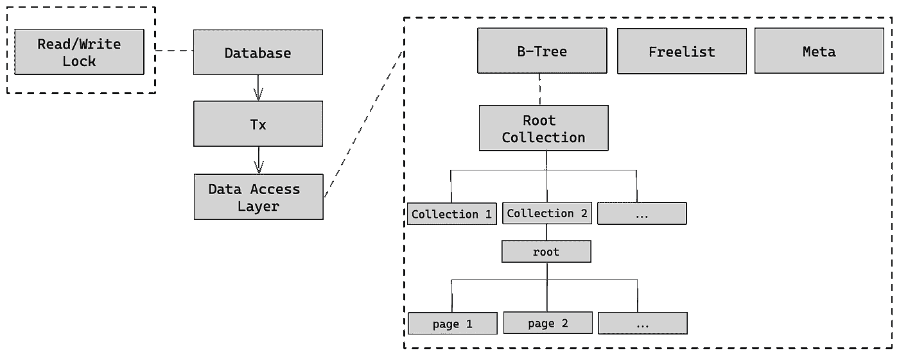

从我开始写数据库到文章完成已经一年了。我希望你喜欢读我的帖子，就像我喜欢为你写一样。请务必在 [GitHub](https://github.com/amit-davidson/LibraDB) 上查看名为 LibraDB 的完整数据库。