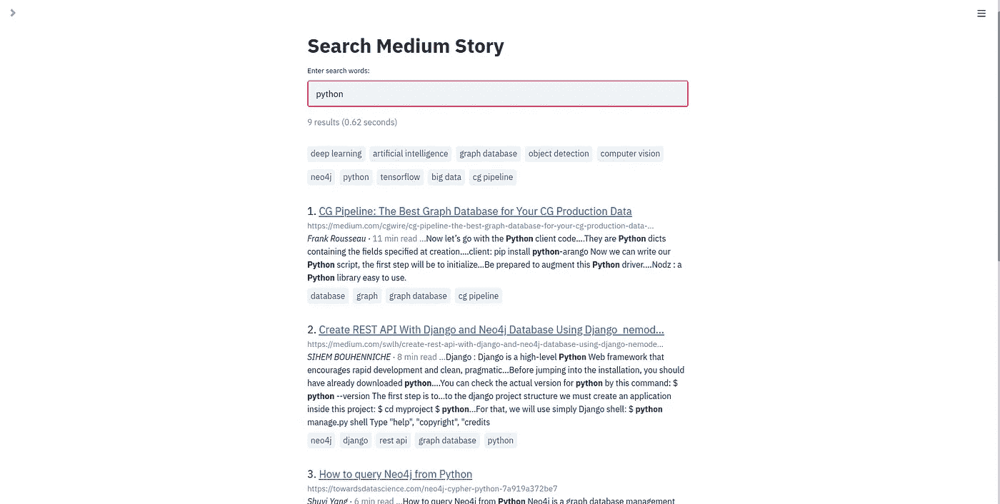

# 使用 Streamlit 和 Elasticsearch 为中型故事建立搜索引擎

> 原文：<https://betterprogramming.pub/build-a-search-engine-for-medium-stories-using-streamlit-and-elasticsearch-b6e717819448>

## 在你自己的应用程序中搜索媒体报道


照片由[Firmbee.com](https://unsplash.com/@firmbee?utm_source=medium&utm_medium=referral)在 [Unsplash](https://unsplash.com?utm_source=medium&utm_medium=referral) 上拍摄

当你读了一个中等的故事，发现它对你很有趣或有用，你会把它保存到你的中等列表中吗？我会的。我有数百个故事被分类并保存在我的列表中。但是当我需要回顾一些我知道我以前见过的东西时，我不会经常回头去看它们。原因之一是因为滚动和浏览一长串故事需要时间。

我宁愿在浏览器中打开一个新标签，在谷歌搜索中输入关键词。虽然我们也可以在媒体搜索中做同样的事情，但如果你以前尝试过，你就会知道为什么我不这样做。在这篇文章中，我将与你分享我是如何做到的，以及我学到了什么。坐下来喝杯咖啡，聊聊这个长故事。

该代码可在 [GitHub](https://github.com/chiachong/medium-search-app) 上获得。首先，构建搜索引擎的主要工具有:

*   python 3——构建并连接 UI (Streamlit)和搜索引擎。
*   elastic search——一个基于 Lucence 的全文搜索引擎。
*   docker——帮助我们轻松打包和部署应用程序的虚拟化工具。

# 细流

让我们从 Streamlit 开始。运行`pip3 install streamlit`安装 Python 包，然后在文件夹`srcs/streamlit_app`中创建一个 py 文件

然后，在终端运行`streamlit run srcs/streamlit_app/app.py`启动 streamlit app。您将看到主页面上有一个文本栏，用于输入搜索词。


图片由作者提供。

# 连接弹性搜索

现在我们需要通过在终端中运行`pip3 install elasticsearch`来安装 Python Elasticsearch。之后，在一个新的 py 文件中创建一些辅助函数。

在`check_and_create_index()`函数中，我们定义每个故事有五个属性——作者姓名、故事长度、标题、标签和故事内容。而在`index_search()`函数中，我们定义了 Elasticsearch 查询来进行索引搜索，查询 API 的细节可以在[这里](https://www.elastic.co/guide/en/elasticsearch/reference/current/query-dsl-query-string-query.html)找到。

请注意，我们在搜索查询中添加了一个聚合术语`tags`来对结果中的每个标签进行分组和计数，并将其降序排序为`sorted_tags`。这些标签将显示在结果的顶部，可用于过滤搜索结果。

使用以下代码将两个助手函数添加到`app.py`中:

现在我们可以输入关键字和搜索，但它会失败，因为 Elasticsearch 还没有开始，我们稍后会这样做，因为在 Docker 的帮助下非常简单。

# 显示搜索结果

假设我们已经启动并运行了 Elasticsearch，下一个任务是显示搜索结果。让我们在同一个文件夹中创建另一个 py 文件`templates.py`。

上面的函数用于生成一些 HTML 和 CSS 脚本来显示在 UI 中。`load_css()`函数用于设计用作过滤器的故事标签的样式。

由`tag_boxes()`呈现的 story 标签可以通过 URL 参数`search`和`tags`点击，这对于保持应用程序的状态很重要，我们将在后面讨论。`search_result()`函数是显示故事的 URL、作者姓名、故事长度和简短突出显示的文本片段的主要组件。

现在我们可以用以下代码显示搜索结果:

`st.write()`是呈现 HTML 和定制用户界面的神奇命令。

# 过滤

在这个阶段，我们可以搜索并显示搜索结果(假设 Elasticsearch 已经启动并运行)。



图片由作者提供。

搜索结果顶部的灰色矩形框是结果中最受欢迎的标签，我们可以单击其中的任何一个来过滤搜索结果。由于它们是包含 URL 参数`search`和`tags`的超链接，单击它们中的任何一个都会刷新应用程序状态，但是我们可以使用`st.experimental_get_query_params()`捕获 URL 参数并将这些值设置为新的应用程序状态。

我之前写过一篇关于 Streamlit 会话状态的[文章](https://towardsdatascience.com/advanced-streamlit-session-state-and-callbacks-for-data-labelling-tool-1e4d9ad32a3f)。请随意查看更多细节。

# 页码

我们完成 UI 需要做的最后一件事是结果分页。与故事标签一样，我们也将分页按钮呈现为超链接，带有 URL 参数`search`、`tags`和一个新参数`page`。在`templates.py`中增加以下功能:

我们需要捕获新的 URL 参数并设置会话状态。以下代码将帮助我们做到这一点:

这里我们有完整的 UI 来进行搜索、过滤和分页。下一步是使用 Docker 将我们的 Streamlit 应用程序容器化。

# 码头工人

老实说，这是我构建的第一个容器图像。我从 Prakhar Srivastav 的一个很棒的[教程](https://docker-curriculum.com/?fbclid=IwAR1uDIaodWqSCt90J0DHONTkmfhXonWUK7j-M0ZKDFTsKpeiOvIqznt7sas)中学到了很多。如果你是 Docker 新手，我强烈建议你阅读教程。

我们唯一需要将应用程序容器化的是一个名为`Dockerfile`的文件(当然我们还需要在机器上安装 Docker)。Dockerfile 是一个文本文件，包含自动创建图像过程的命令列表。以下是创建 Streamlit 应用程序映像的 Dockerfile 文件示例:

在上面的例子中，我们告诉 Docker 客户端从 Python 3.7 开始，然后将本地目录中的`requirements.txt`复制到映像中，并安装所有的依赖项。之后复制所有源代码，启动端口`8501`上运行的 Streamlit app。最后，我们只需要一个终端命令来构建映像:

```
docker build -t medium-search-app .
```

一旦构建了映像，我们可以使用终端命令启动映像:

```
docker run -p 8501:8501 medium-search-app
```

搜索应用程序现在已经启动并在`localhost:8501`上运行。

等等，我们是不是忘了什么？Elasticsearch！是时候启动“引擎”了。

```
*docker run -p 9200:9200 -p 9300:9300 \
    -e "discovery.type=single-node" \
    elasticsearch:7.11.2*
```

如果 Elasticsearch 图像不存在，将自动提取该图像。我们可以通过运行以下命令来检查 Elasticsearch 的状况:

```
curl 0.0.0.0:9200# {
#  "name" : "32746bf3501e",
#  "cluster_name" : "docker-cluster",
#  "cluster_uuid" : "DGEsSP6pTPqV4o4eKgxVgw",
#  "version" : {
#    "number" : "7.11.2",
#    "build_flavor" : "default",
#    "build_type" : "docker",
#    "build_hash" : "3e5a16cfec50876d20ea77b075070932c6464c7d",
#    "build_date" : "2021-03-06T05:54:38.141101Z",
#    "build_snapshot" : false,
#    "lucene_version" : "8.7.0",
#    "minimum_wire_compatibility_version" : "6.8.0",
#    "minimum_index_compatibility_version" : "6.0.0-beta1"
#  },
#  "tagline" : "You Know, for Search"
# }
```

搜索应用现在应该可以连接到 Elasticsearch 了。借助 Docker 设置 Elasticsearch 很简单。

# Docker 撰写

上一节展示了运行单个容器的简单性，但是我们必须用两个命令运行两个容器，如果我们有更多的容器呢？有没有更简单的方法来管理多容器？其中一种方法是编写 bash 脚本，但是还有一种更优雅的方法——docker compose。

我们需要做的第一件事是安装 docker-compose 包`pip3 install docker-compose`，然后准备一个配置文件`docker-compose.yml`。

使用 docker-compose 的一个好处是它会自动创建一个 docker 网络。docker 网络的用法在我上面提到的[教程](https://docker-curriculum.com/?fbclid=IwAR1uDIaodWqSCt90J0DHONTkmfhXonWUK7j-M0ZKDFTsKpeiOvIqznt7sas#docker-network)中有解释。现在，我们可以将搜索应用程序`app.py`中定义的 Elasticsearch 托管域从`DOMAIN='0.0.0.0'`更改为`DOMAIN='es'`，这是 Elasticsearch 图像的容器名称。Docker 会自动解析域`'es'`，所以搜索 app 图片会通过 docker 网络直接连接到 Elasticsearch 图片。

此外，`docker-compose.yml`中的`volumes`参数对我们也很重要，因为我们不希望我们的应用程序在关机或重启时丢失数据。我们需要在 Elasticsearch 图像中指定挂载点来持久化数据。

最后，通过运行终端命令启动搜索应用程序:

```
docker-compose up
```

# 包裹

这篇文章是关于如何使用 Streamlit 和 Elasticsearch 创建一个搜索应用程序，以及如何使用 Docker 容器化应用程序。

源代码可在 [GitHub](https://github.com/chiachong/medium-search-app) 上获得。请随意尝试。感谢您的阅读，我希望您喜欢这本书，并学到一些新东西。我很想听听你的反馈。

# 参考

[Docker 博客](https://docker-curriculum.com/?fbclid=IwAR1uDIaodWqSCt90J0DHONTkmfhXonWUK7j-M0ZKDFTsKpeiOvIqznt7sas)