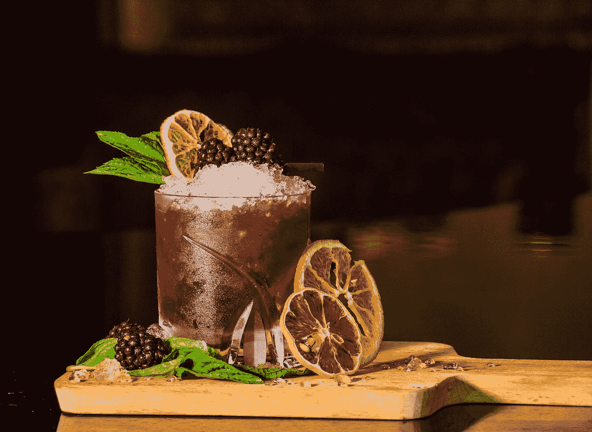
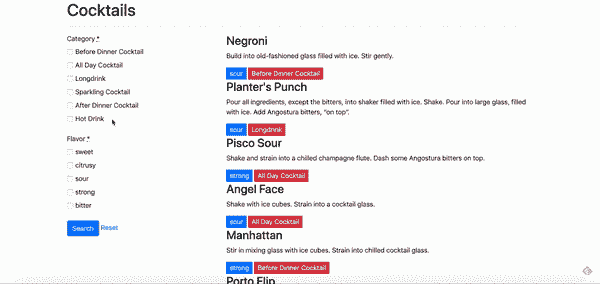

# 为您的 Rails 5 应用程序从头构建一个过滤搜索

> 原文：<https://betterprogramming.pub/build-a-smart-filter-for-your-rails-5-application-using-simple-form-and-acts-as-tattable-afac128e4159>

## 当你的搜索算法很好的时候，没有人会注意到，但是当一个搜索算法很差的时候…它真的很差


谢尔盖·佐尔金在 [Unsplash](https://unsplash.com/photos/_UeY8aTI6d0) 上的照片

向任何应用程序添加搜索总是比看起来要难。事情是这样的，当你的搜索算法好的时候，没有人会注意到，但是当一个搜索算法不好的时候……真的很不好。我在想上海这个特别的餐厅应用，怎么可能在你附近找到好吃的早午餐。

有几种方法可以在 Rails 5 应用程序中构建搜索和过滤器。我正在写一篇将过滤器与命名范围集成在一起的文章，但是我想先用`acts-as-taggable`创建一篇文章。那是因为对我来说，这真的是 gem 最重要的部分:**如何使用特定的搜索标准找到完全不相关的信息？**

我将从使用我在 Medium 上写的[简单搜索教程](https://medium.com/le-wagon/build-a-simple-search-with-the-simple-form-gem-in-rails-5-b247168282d1)中的鸡尾酒应用开始，并给它添加标签。如果你想从我的样板文件开始，你可以在 GitHub 上找到它。

使用标签是在 Rails 应用程序中连接不相关数据模型的一种强大方式。在这个例子中，我们将比较这两种鸡尾酒(你是在餐前、餐中、餐后等时候上鸡尾酒吗？)和口味笔记(鸡尾酒是甜的，酸的，果味的？).这两件事都与鸡尾酒的整体描述有关，但它们相互独立。


由[思想目录](http://www.quotecatalog.com.)在 [Unsplash](https://unsplash.com/photos/505eectW54k) 上拍摄的照片

# 1.将标签添加到应用程序中

我将从安装 gem 并运行其迁移开始。

```
#Gemfile
gem 'acts-as-taggable-on', '~> 6.0'#Terminal
rails acts_as_taggable_on_engine:install:migrations
rails db:migrate 
```

# 2.给鸡尾酒添加标签

一旦标签出现在应用程序中，我就可以将它们添加到我的`Cocktail`模型中。通常，Acts As Taggable 将标签添加到一个通用的“tag_list”中，但对于这个应用程序，我创建了两个过滤器，一个用于鸡尾酒的一般类别(“晚饭后”、“晚饭前”等)。)和一个味觉(“甜”、“酸”、“柑橘味”)。

```
#app/models/cocktail.rb acts_as_taggable_on :tags (the typical way of adding tags, you don’t need this line if you are adding the next two lines)acts_as_taggable_on :categories
acts_as_taggable_on :flavors
```

现在，我不是给`tag_list`添加标签，而是给`category_list`和`flavor_list`添加两组标签。

*注意，cocktails 表中没有标记列:数据存在于 gem 生成的迁移中。*

# 3.添加带标签的鸡尾酒种子

我正在用我在搜索教程中使用的 JSON 列表中的鸡尾酒为我的数据库播种。为了添加类别，我从 JSON 列表中添加了饮料“类别”,并随机为鸡尾酒分配口味以节省时间。

```
require 'json'
require 'open-uri'url = "[https://raw.githubusercontent.com/maltyeva/iba-cocktails/master/recipes.json](https://raw.githubusercontent.com/maltyeva/iba-cocktails/master/recipes.json)"Cocktail.delete_all if Rails.env.development?flavors = ['sweet', 'citrusy’, 'sour', 'strong', 'bitter']cocktails = JSON.parse(open(url).read)cocktails.each do |cocktail|
  Cocktail.create!(name: cocktail["name"],
                   glass: cocktail["glass"],
                   preparation: cocktail["preparation"],
                   category_list: cocktail["category"],
                   flavor_list: flavors.sample)
end
```

对于这个例子，每种鸡尾酒只有一个标签，但是`acts-as-taggable`的伟大之处在于你可以向列表中添加任意多的项目。



此时，你可能会觉得你需要一杯鸡尾酒。照片由 [kyryll ushakov](https://unsplash.com/@ushakov_kyryll?utm_source=medium&utm_medium=referral) 在 [Unsplash](https://unsplash.com?utm_source=medium&utm_medium=referral) 上拍摄

# 4.添加过滤器表单

首先，我们从前端来了解一下表单。我使用简单表单教程中的基本表单，但是让我们一步一步地分解输入:

*   `:flavors` —这是我将在后端使用的字段的名称。它将对应控制器内部的`params[:search][:flavors]`
*   `label: “Category`—标签字段将使用自定义标签，但省略它将默认为字段名称(在本例中为 Flavors)
*   `collection: $categories` —这个集合将从`Cocktail`模型中提取并返回一个全局变量，该变量包含一个与我的数据库相对应的类别数组。
*   `as: :check_boxes` —这是完全可选的，但是它将我的过滤器设置为多选复选框，而不是默认的下拉菜单

```
#app/views/cocktails/index.html.erb<%= simple_form_for :search, url: root_path, method: "GET" do |f| %>
  <%= f.input :flavors, label: "Category",  collection: $categories, as: :check_boxes %>
  <%= f.input :strengths, label: "Flavor", collection: $flavors, as: :check_boxes %>
  <%= f.submit "Search", class: "btn btn-primary" %>
  <%= link_to "Reset", root_path  %>
<% end %>#app/models/cocktail.rb$flavors = ['sweet', 'citrusy', 'sour', 'strong', 'bitter']
$categories = ["Before Dinner Cocktail", "All Day Cocktail", "Longdrink", "Sparkling Cocktail", "After Dinner Cocktail", "Hot Drink"]
```

一旦我的搜索表单填写完毕，我想将结果发送到后端并返回结果。

# 5.添加基于标签的过滤机制

因为我同时过滤了口味和优点，我想说明用户填写了表单的两个部分或其中一个部分(我想他们也可以什么都不填写，提交为空，所以我们也要考虑这种情况)。

结果将以两个数组的形式出现，类似于[“酸的”、“果味的”]和[“浓的”]，或者偶尔是[" "]。为了组合这两个数组，我将连接并展平它们，然后拒绝任何意外的空白值。

```
#app/controllers/cocktails_controller.rbdef index
    if params["search"]
      @filter = params["search"]["flavors"].concat(params["search"]["strengths"]).flatten.reject(&:blank?)
      @cocktails = @filter.empty? ? Cocktail.all : Cocktail.all.tagged_with(@filter, any: true)
    else
      @cocktails = Cocktail.all
    end
 end
```

# 6.就是这样！



基本的过滤器是完整的，但是仍然有一些限制。现在，它返回任何当前参数的匹配，这并没有像我希望的那样帮助我缩小搜索范围。

我还需要每次搜索都刷新页面。

如果我们可以创建一个动态过滤器，自动刷新结果，并将它们限制在我正在寻找的精确搜索组合范围内，会怎么样？

为此，我们需要引入 AJAX 并支持我们的过滤机制。

GitHub 库[这里](https://github.com/maltyeva/simple_search_with_filtering)。

Heroku 在这里演示。