# 使用 GraphQL 引擎构建电子商务后端

> 原文：<https://betterprogramming.pub/build-an-e-commerce-backend-using-a-graphql-engine-c5f3bb9d9ca>

## 让我们使用 Hasura 通过最小化代码量来加快开发时间


由[罗曼·辛克维奇](https://unsplash.com/@synkevych?utm_source=medium&utm_medium=referral)在 [Unsplash](https://unsplash.com?utm_source=medium&utm_medium=referral) 上拍摄的照片

在构建全栈应用程序的传统方法中，您需要手动构建后端和前端。

手动构建后端意味着您需要决定是使用 REST 还是 GraphQL。根据您选择使用的内容，您需要定义 GraphQL 模式和解析器，编写数据库查询，并创建视图、控制器等等。

虽然这种方法既没有错也没有坏，但是您可以通过自动化一些东西来加速您的开发。这就是哈苏拉出现的原因。

在本文中，您将使用 Hasura 构建一个电子商务应用程序的后端。最终，您将拥有一个实用的基本电子商务应用程序。

# 哈苏拉是什么？

Hasura 是一个 GraphQL 引擎，可以将您的 Postgres 数据库转换为即时、实时的 GraphQL API。

更简单地说，将 PostgreSQL 数据库连接到 Hasura，它会根据数据库表/视图自动生成 GraphQL 模式和解析器。之后，您可以开始查询和变更您的数据。

但是，如果应用程序需要支持 REST 端点呢？如果应用程序需要支持 REST 端点，您可以从命名查询和变异中创建它们。有了 Hasura，你可以同时支持 GraphQL 和 REST。

此外，Hasura 允许您将定制的 GraphQL/REST API 分别与远程模式和操作一起插入 Hasura。

概括一下:

*   Hasura 将您的 Postgres 数据库转换成一个 GraphQL API。
*   您的应用程序也可以支持 REST 端点。
*   Hasura 使您能够插入自定义 API。

# 电子商务数据建模

让我们通过构建一个简单的电子商务应用程序来看看 Hasura 的能力。该过程的第一步是确定数据库的结构。

图 1 展示了应用程序的数据库模式。


*图 1 —电子商务数据建模*

该数据库由四个表组成:

*   用户
*   制品
*   订单项目
*   命令

`users`和`order`是一对多的关系，也就是说一个用户可以有多个订单，但是一个订单只能属于一个用户。两个用户不能有相同的订单。

`order`和`order_item`的关系也是一对多的关系。一个订单可以包含多个项目，但同一订单项目不能属于多个订单。

`order_item`和`product`具有一对多的关系，这意味着一个订单项只与一个产品相关联。本质上，一旦用户将产品添加到购物车中，它就变成了订单项。`order_item`在`product`和`order`之间创建了一个链接。

现在我们已经完成了数据建模，下一步是在 Hasura 中实现它。

# Hasura 实现

有两种方法可以使用 Hasura。可以用 Docker 在本地机器上使用，也可以用 Hasura Cloud。教程使用 Hasura Cloud 来实现电子商务后端。

如果你是第一次使用 Hasura，你需要建立一个帐户和一个项目。遵循本指南[和](https://bit.ly/3FPvzot)，您应该在几分钟内就可以开始运行。

设置好您的帐户和项目后，您应该在项目仪表板中。图 2 展示了您应该看到的页面。

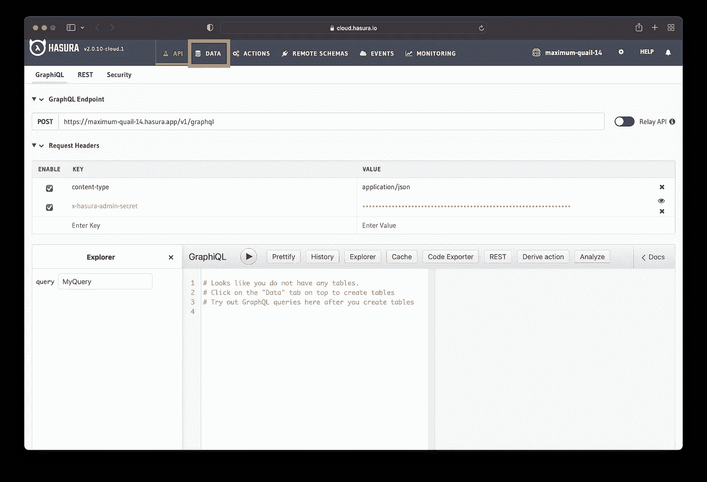

*图 2 — Hasura 项目仪表板*

实施包括:

*   创建数据库表
*   建立表之间的关系
*   定义权限规则
*   添加带有操作的自定义业务逻辑

# 创建数据库

实现的第一步是创建数据库。点击“数据”选项，如图 2 所示。这将把您带到数据库页面，在这里您可以连接一个现有的数据库或创建一个新的数据库。

对于本教程，建议创建一个新的数据库。需要注意的是，您需要一个 Heroku 帐户来创建一个新的数据库。如果您没有 Heroku 帐户，也不想创建一个，您可以将 Hasura 连接到一个现有的数据库。


*图 3 — Heroku 项目数据库页面*

图 3 展示了创建新数据库的过程。这个过程很快，所以你应该在几秒钟内就有一个新的数据库。

一旦数据库准备就绪，您就可以通过点击“public”来访问它，如图 4 所示。

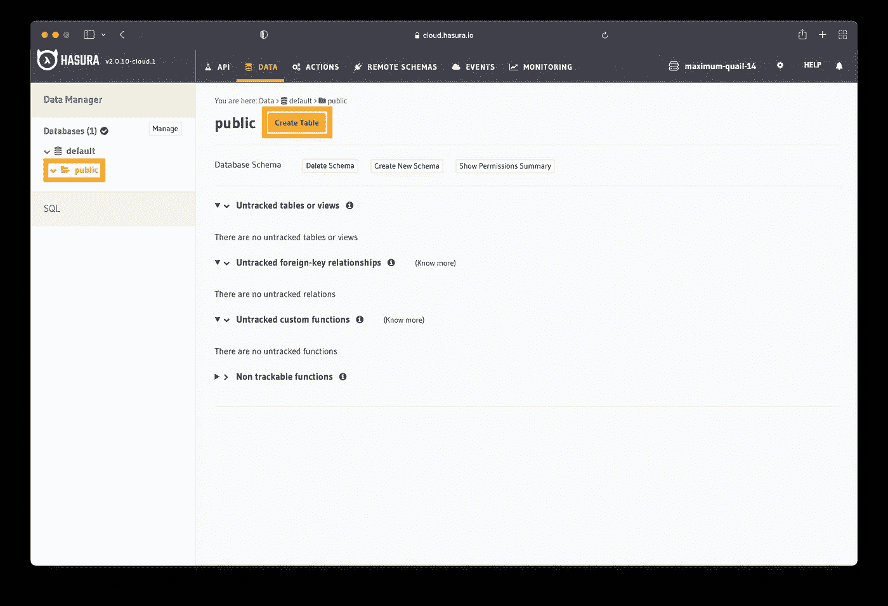

*图 4 —数据库仪表板*

下一阶段涉及构建表和关系。

# 数据库表

既然已经建立了数据库，那么就该创建表了。在这一步中，您将创建四个表:用户、产品、订单、订单项目。

# 用户表

我们先实现`user`表。点击“Create Table”来创建一个新的表，如图 4 所示。

`users`表格有以下字段和类型:

*   `id`(主键)= > UUID
*   `name` = >正文
*   `username` = >正文
*   `email` = >正文
*   `password` = >文本
*   `updated_at` = >时间戳

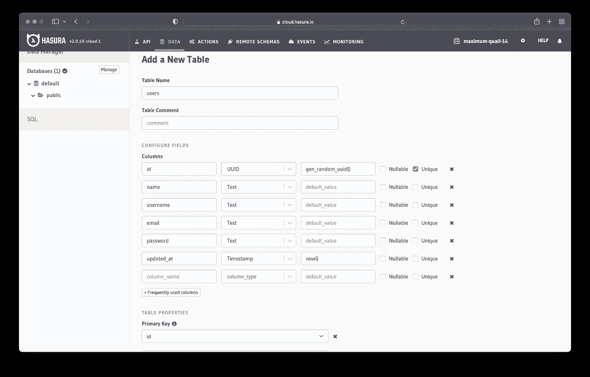

*图 5 —创建“用户”表*

在图 5 中，您可以看到所有的字段、它们的类型以及用于主键的字段。

添加所有字段并选择主键后，按“添加表”创建表。

# 产品表

您还需要实现 product 表，该表具有以下字段和类型:

*   `id`(主键)= > UUID
*   `name` = >正文
*   `description` = >文本
*   `price` = >数字


*图 6 —创建“产品”表*

创建字段并选择主键后，将表保存到数据库中。

# 订单表

下一个要创建的表是“Order”表，它有以下字段:

*   `id`(主键)= > UUID
*   `city` = >正文
*   `country` = >文本
*   `street_name` = >正文
*   `house_number` = > Int
*   `zip_code` = >正文
*   `ordered` = >布尔型
*   `total` = >数字
*   `created_at` = >时间戳
*   `user_id`(外键)= > UUID

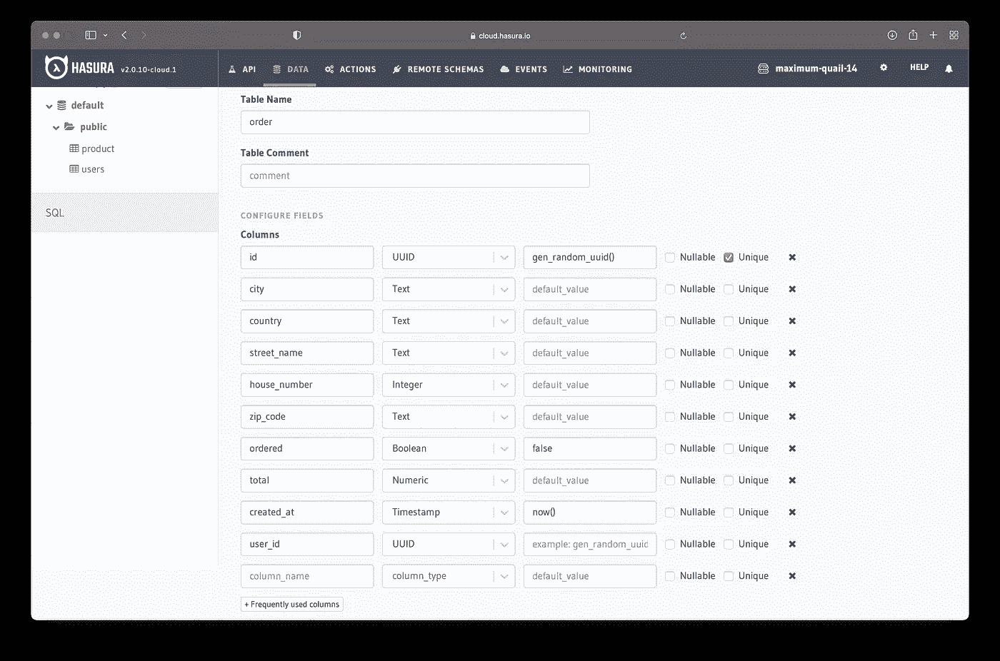

*图 7 —创建“订单”表*

图 7 展示了您的表应该是什么样子。完成设置后，将表添加到数据库中。

# 订单项目表

最后创建的表格是`order_item`。该表包含以下字段和类型:

*   `id`(主键)= > UUID
*   `quantity` = > Int
*   `product_id`(外键)= > UUID
*   `order_id`(外键)= > UUID

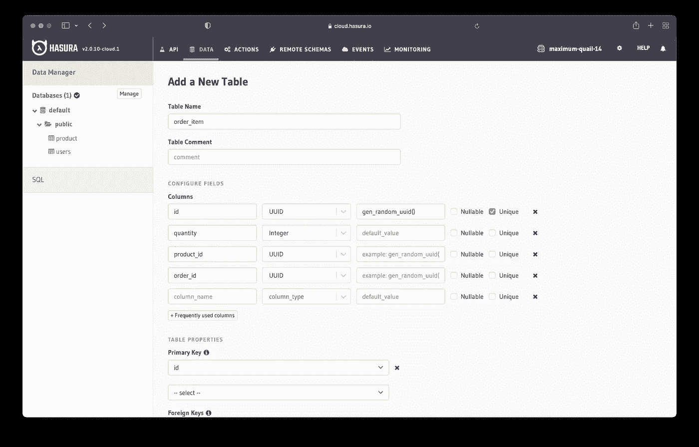

*图 8 —创建“订单 _ 项目”表*

保存表，表的创建就完成了。

# 关系

虽然创建了表，但它们之间没有任何联系。下面的步骤是创建表之间的关系。在 Hasura 中，有两种方法可以创建关系:

1.  根据外键约束定义的关系
2.  手动创建的关系(当不可能使用外键约束时)

在这个电子商务应用程序中，我们将从外键约束创建关系。

# 用户-订单关系

第一步是导航到“order”表中的“Modify”选项卡，并单击“Add a foreign key”按钮。

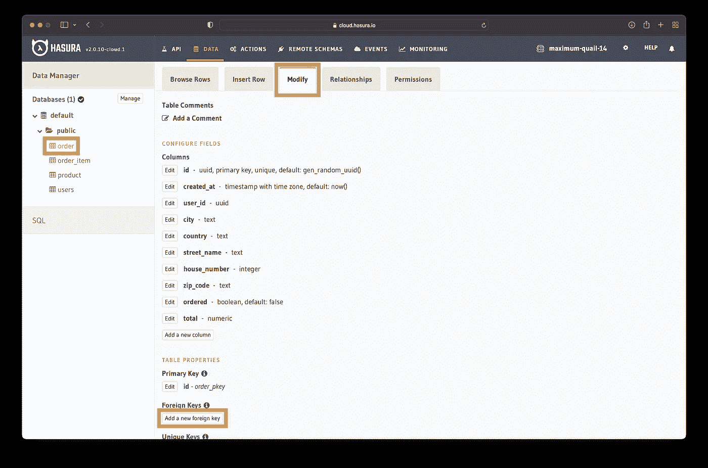

*图 9 —修改表格*

点击按钮后，您就可以设置外键了。添加`user_id`作为`users`表中`id`列的外键。

图 10 展示了添加外键的过程。


*图 10 —添加外键*

完成后，点击“保存”按钮。

Hasura 很聪明，可以根据添加的外键建议潜在的关系。因为您添加了外键，所以 Hasura 知道:

*   一个订单只属于一个用户
*   一个用户可以有多个订单

如果您转到“关系”选项卡*(图 9 中“修改”选项卡旁边)*，您应该会看到建议的关系。

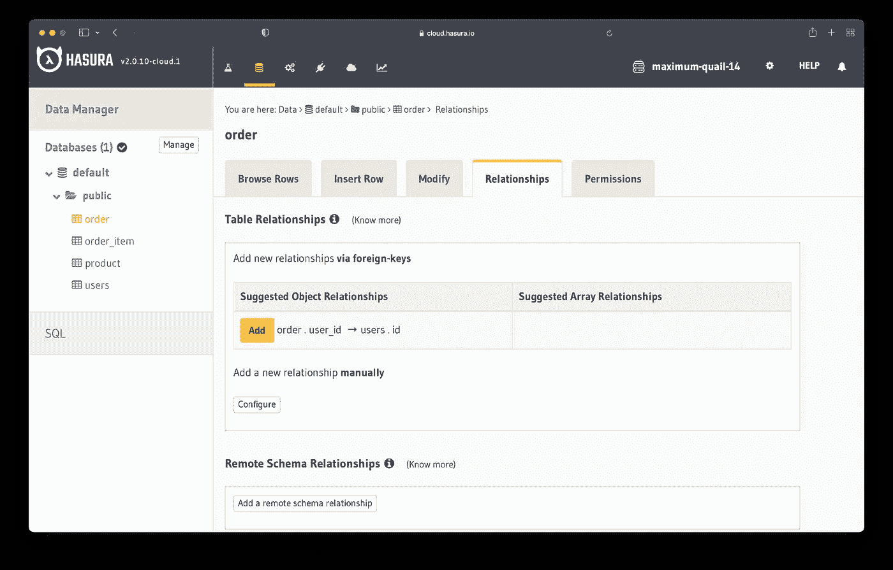

*图 11 —建议的关系*

点击“添加”按钮，命名你的关系(或保留默认名称)，按“保存”，你就完成了一半。

现在转到被引用表“用户”中的“关系”选项卡

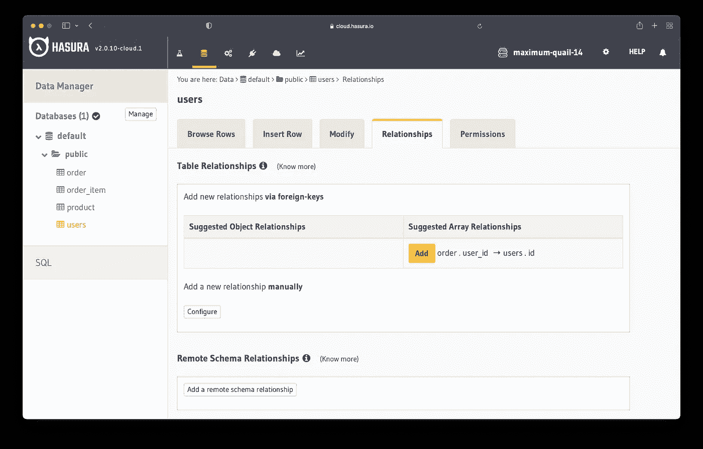

*图 12 —建议的关系*

你可以看到它再次暗示了一段新的关系。这一次，隐含的关系是一个“数组关系”，这意味着用户可以拥有一个名为 orders 的嵌套对象数组。简单来说，用户可以有多个订单。

# 订单-订单项目关系

在表`order`和`order_item`之间建立关系的过程类似。

转到`order_item`表，添加`order_id`作为`order`表中`id`列的外键。

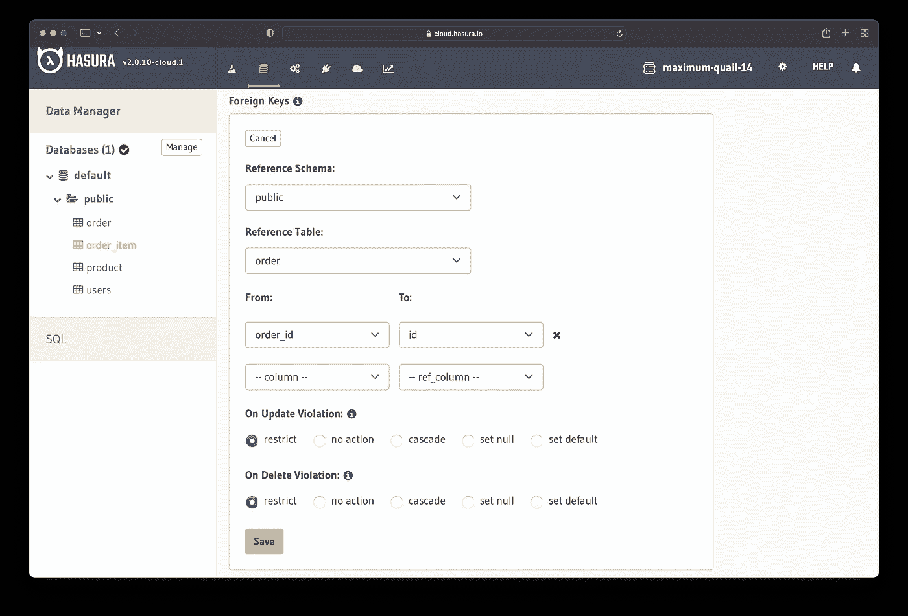

*图 13 —添加外键*

作为练习，从两个表转到“Relationships”选项卡，接受建议的关系。请记住，一个订单项目只能属于一个订单，而一个订单可以有多个项目。

`order_item`表中的关系应该是对象关系，而“`order`表中的关系应该是数组关系。

# 订单项目-产品关系

最后一个关系是表`order_item`和`product`之间的关系。

通常，进入`order_item`表中的“修改”选项卡。然后添加`product_id`作为`product`表中`id`列的外键。

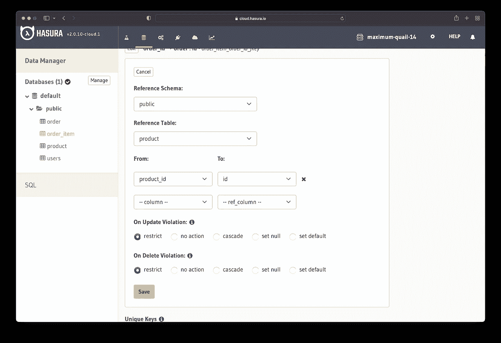

*图 14 —添加外键*

下一步是转到两个表的“Relationships”选项卡，接受建议的关系。`order_item`表中的关系应该是对象关系，而`product`表中的关系应该是数组关系。

表和关系都已就位。这意味着剩下的唯一事情就是设置权限！

关于创建关系的更深入的信息，我建议查看关于[关系](https://bit.ly/3nSbyYo)的文档。

# 权限规则

使用 Hasura，您可以在三个级别定义访问控制规则:

1.  角色级别
2.  表格级别
3.  操作(插入、选择、更新、删除)级别

在本文中，您将使用所有这些工具。

# 用户表权限

让我们为`users`表定义权限规则。首先选择`users`工作台，然后点击`Permissions`选项卡。

进入权限页面后，添加一个名为**用户**的新角色。图 15 中的箭头说明了应该在哪里添加新角色。


*图 15 —用户表权限*

在继续之前，让我们定义一下用户应该能够做什么:

*   用户应该只能看到自己的详细信息，而不能看到其他用户的详细信息。
*   用户应该能够更新他们的记录。

基于这些规则，您只需要更新操作“选择”和“更新”

## **选择(读取)**

单击“选择”，您将能够添加规则。

如图 16 所示，您需要添加以下自定义检查:

```
{
    "id": {
         "_eq": "X-Hasura-User-Id"
     }
}
```

您可以通过使用下拉框来添加检查—您不需要手动编写它。上述检查确保用户只能访问他们的记录。


*图 16 —定义的权限规则*

请确保您还检查了您希望对用户可用的字段。在这种情况下，用户可以看到他们的:

*   `id`
*   `email`
*   `name`
*   `username`
*   上次更新的时间

完成后保存权限。

## **更新**

Hasura 的一个有用之处是您可以重用自定义检查。选择与“更新”动作选择相同的自定义检查选项**，如图 17 所示。**

此外，用户应该能够更新除了 ID 以外的一切。选中除 ID 之外的所有框，并保存权限。


*图 17 —定义权限规则*

已经为用户设置了规则，至此，您已经在所有三个级别定义了访问控制规则。

## **插入—公共角色**

稍后，您将添加允许人们注册的附加功能。注册过程将散列人们的密码，并将他们的详细资料添加到数据库中。

因为“用户”角色指的是注册的人，所以您需要另一个角色来代表未经身份验证的人。你可以称之为“公共”

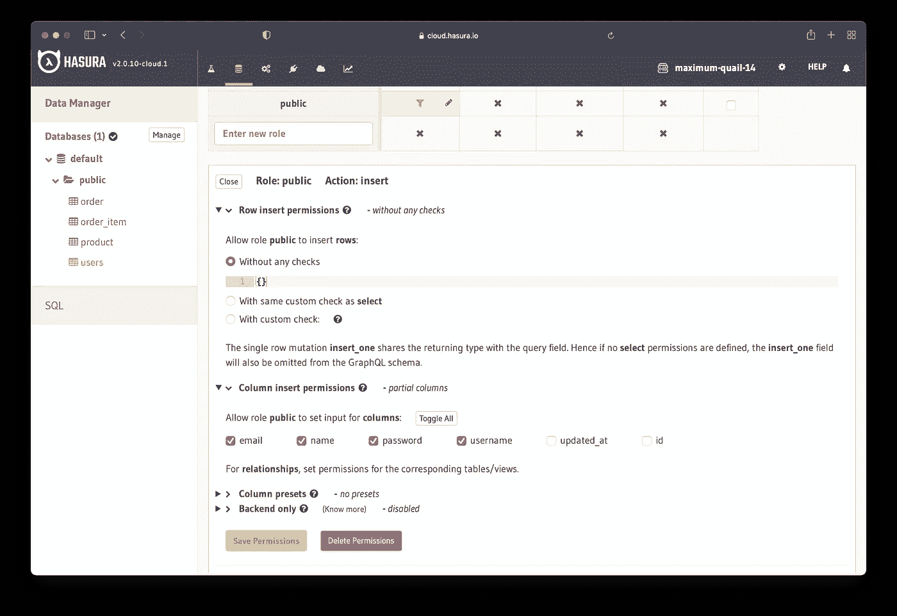

*图 18 —定义公共许可规则*

作为一个公共角色，不需要任何检查。配置权限规则，如图 18 所示。

## **选择—公共角色**

当一个未经身份验证的人注册时，服务器返回新创建的用户的 ID。为此，您需要为“选择”操作定义权限规则。

添加图 19 中的自定义检查是必要的。如果检查不存在，未经身份验证的用户可以看到所有其他用户的个人详细信息。


*图 19 —定义公共许可规则*

因为注册只返回新创建用户的 id，所以只检查`id`字段。

# 产品表权限

无论用户是否登录，都应该可以看到这些产品。这意味着您可以重用“公共”角色。

## **选择(读取)**

转到“权限”选项卡，添加新的权限。启用选项**而不进行任何检查**并选择应该显示的产品字段。

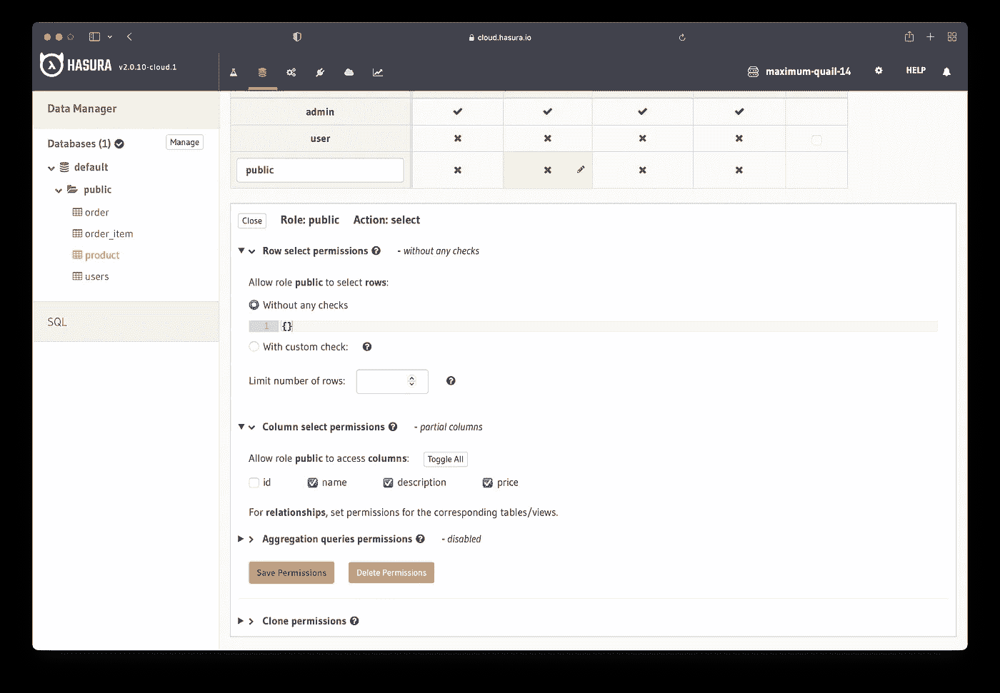

*图 20 —定义公共权限*

在继续之前，您还需要允许登录的用户获取产品。对“用户”角色应用与“公共”角色相同的权限。此外，还要检查`id`字段。登录的用户应该能够看到所有产品字段。

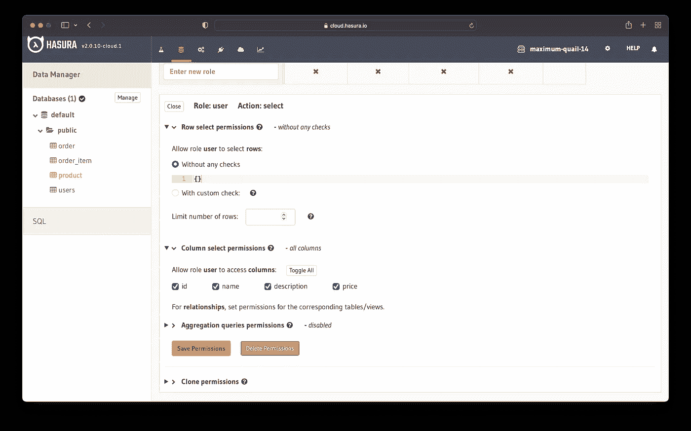

*图 21 —定义用户权限*

经过身份验证和未经身份验证的用户都应该只能看到产品，而不能改变它们。这意味着他们无权创建、更新或删除产品。

# 订单表权限

对于订单，用户应该只能看到他们的订单。他们不应该得到其他人的命令。

## **选择(读取)**

转到`order`表，然后转到“权限”选项卡。单击“用户”角色的“选择”操作，并添加以下自定义检查:

```
{
    "user_id": {
        "_eq":" X-Hasura-User-Id"
     }
}
```

上面的自定义检查确保只有下订单的用户才能访问它。此外，检查您希望查询返回的字段。在这种情况下，它应该返回所有的字段，因为用户应该能够访问关于订单的所有信息。


*图 22 —订单的用户权限*

## **插入**

除了看到他们的订单，用户还应该能够创建新的订单。单击“插入”操作添加权限规则。

！【Hasura 定义权限规则】(截图 2021–12–06 at 22 . 44 . 41 . png)(https://cdn . hash node . com/RES/hash node/image/upload/v 1638823532467/88 fjv 8 rd 0 . png)*图 23 —订单的用户权限*

添加与图 23 相同的权限规则。

## **更新**

用户还需要更新订单的权限。单击“更新”操作，选择除以下列之外的所有列:

*   `created_at`
*   `id`
*   `user_id`


*图 24 —订单的用户权限*

用户可以插入、读取和更新订单，但不能删除现有订单。

# 订单项目权限

要创建订单项目，登录用户应该有权插入它们。

## **插入**

转到`order_item`中的“权限”选项卡，添加以下规则:

*   允许登录用户插入`quantity`、`product_id`和`order_id`


*图 25 —订单项目的用户权限*

图 25 展示了插入订单项目的用户权限。

## **选择**

用户还应该能够从他们的订单中看到项目。为了避免用户访问其他人的订单项目，您需要添加一个自定义检查。

它检查订单项所属的用户订单是否与发出请求的用户 id 匹配。如果您查看图 26 中的检查，会更有意义。

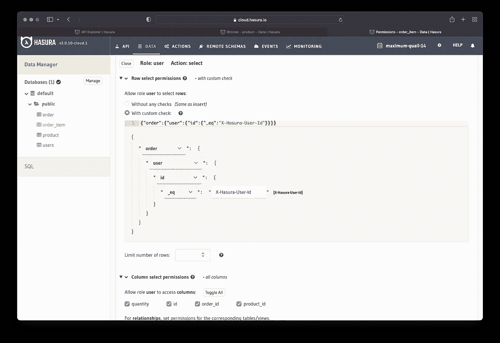

*图 26 —订单项目的用户权限*

既然所有的权限都到位了，我们可以进入下一章——用 Hasura 动作实现定制的业务逻辑。

我建议查看关于[配置权限规则](https://bit.ly/3CZ2VzA)的文档部分，以获得关于权限规则的深入信息。

# 自定义业务逻辑

尽管 Hasura 生成了您需要的大部分内容，但您可能需要添加定制的业务逻辑，比如定制查询或变异。

Hasura 允许您通过 Hasura 操作添加自定义业务逻辑。此外，您可以使用动作进行数据验证和转换。

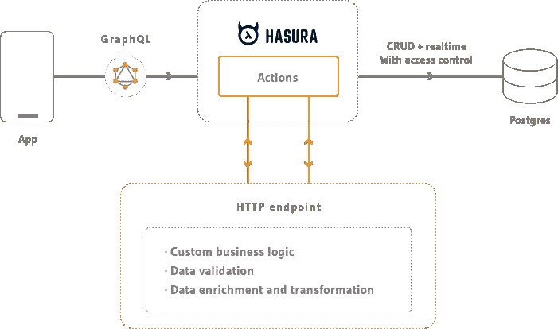

*图 27 — Hasura 动作*

对于电子商务应用程序，您可以使用 Hasura 操作来:

*   注册和登录用户
*   将商品添加到购物车
*   下订单

“Actions”是一个强大的工具，使您能够定制您的 Hasura 应用程序，以满足您的需要和要求。

## 存取关键字

在编写定制业务逻辑之前，您需要检索 Hasura 访问键。访问键使您能够向 Hasura 的 GraphQL 端点发出请求。

转到 Hasura 主仪表板，其中列出了您的所有项目。然后点击齿轮图标打开你的项目设置。


*图 28 — Hasura 仪表盘*

一旦你进入设置页面，进入“环境变量”选项来获取你的管理密码/访问密钥。

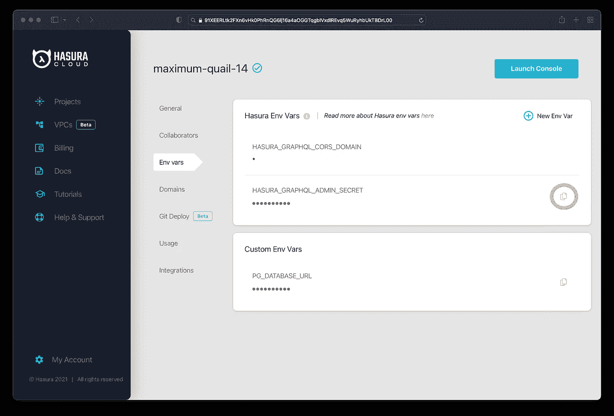

*图 29 —项目设置*

对于这个项目，您将使用 Node.js 并在 Heroku 上部署代码。部署代码后，您需要将密钥作为环境变量添加到项目中。您将在对 Hasura GraphQL 端点的每个请求中传递它。

稍后当您编写自定义逻辑时，会详细介绍这一点。

## 证明

该应用程序应该允许人们注册，但目前，没有办法做到这一点。让我们创建一个允许人们注册的自定义变异。

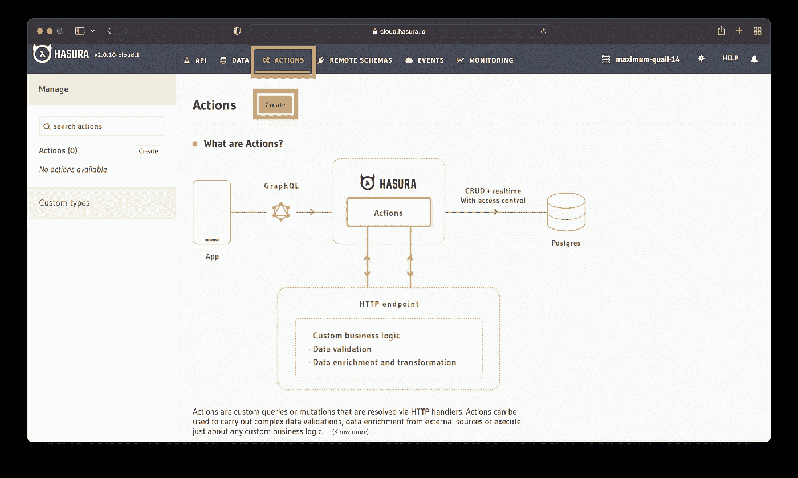

*图 30 —哈苏拉行动*

转到操作页面，点击“创建”按钮将打开一个新页面，您可以在其中设置新操作。

在此页面上，您可以定义以下内容:

*   操作的类型—查询或变异
*   行动本身
*   处理程序—执行您希望运行查询或变异的逻辑
*   通信类型—同步或异步


*图 31 — Hasura 操作页面*

让我们从定义类型和动作开始。动作类型和定义如下:

```
type Mutation {
  register(
    name: String!
    username: String!
    email: String!
    password: String!
  ): RegisterResponse
}
```

这个动作也应该返回一些东西。在这种情况下，让我们返回新注册用户的`id`。

```
type RegisterResponse {
  id: uuid!
}
```

对于“Handler”选项，您可以暂时保持不变。实现操作后，您将部署代码并用适当的 URL 更新处理程序。

例如，如果处理程序 URL 是`apps-aws.hasuractions.com/register`，您需要用这个 URL 更新“动作处理程序”。

现在，保存动作，让我们开始构建处理程序。

## 派生动作

但是还有另一种方法来创建动作。Hasura 可以从一个突变或查询中自动派生出一个动作。转到项目仪表板中的“API”选项卡。

在 GraphiQL 中，编写以下变体:

```
mutation ($name: String!, $username: String!, $email: String!, $password: String!) {
  insert_users_one(object: {
    name: $name,
    username: $username,
    email: $email,
    password: $password
  }) {
    id
  }
}
```

在编写完变异之后，点击“Derive action”按钮，如图 32 所示。


*图 32 —衍生动作*

这将带您进入可以创建新操作的页面。这与图 31 中显示的页面相同。按照手动创建动作时的相同步骤进行操作，并保存它。

此外，Hasura 还会为您生成代码。如果您转到“Codegen”选项卡，您应该会看到生成的代码。


*图 33 —代码生成*

在这种情况下，我们只需要对自动生成的代码做一点小小的修改。即加密存储在数据库中的密码。

%[https://gist . github . com/catalinpit/9 E1 b5 a 36 f 4d 420034 a 20 a 304 e 008 CAC 9]

上面的要点显示了注册突变的代码。唯一添加到自动生成代码中的是第 40 行，它对密码进行加密。

## 部署代码

在使用新创建的操作之前，您需要部署代码。因此，让我们为部署准备服务器。

点击“代码生成”选项卡中的 *Starter-kit.zip* 选项，下载启动代码(图 33)。您下载的初学者工具包是一个简单的 Node.js 服务器。您可以专注于编写定制的业务逻辑，而不是从头开始启动和配置服务器。

在您最喜欢的代码编辑器中打开初学者工具包，然后转到`src/server.js`。您应该会看到以下代码:

您可以删除`/hello`路线，并将上面要点中的代码添加到它的位置。您可以在这个[库](https://github.com/catalinpit/hasura-actions/tree/main/register-action)中看到完整的服务器代码。

现在，您的应用程序已经可以部署了。可以免费部署 Node.js 服务器的一个地方是 Heroku。查看本[指南](https://devcenter.heroku.com/articles/git)关于部署到 Heroku。

部署应用程序后，确保设置 Hasura 访问密钥(来自第[节访问密钥](#heading-access-key))。您需要在 Heroku 中将它添加为环境变量。查看这篇文章，了解如何在 Heroku 中设置环境变量。

## 更新处理程序

成功部署后，您的应用程序应该有一个可以访问它的公共 URL。比如，我的申请网址是`crorit.herokuapp.com`。

要更新处理程序 URL:

*   转到 Hasura Dashboard 中的“注册”操作
*   选择“修改”选项卡
*   添加处理程序 URL

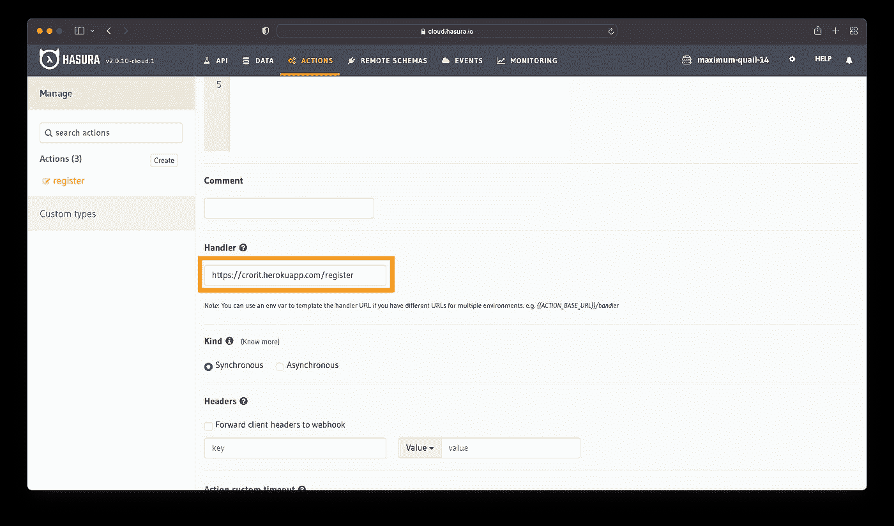

*图 34 —更新的处理器 URL*

保存更改，您就完成了！用户现在可以注册。

# 操作权限

默认情况下，操作被配置为仅供管理员使用。这意味着只有管理员可以执行这些突变。

但是您可能需要其他类型的用户来执行这些改变。在这种情况下，未经授权的人应该能够注册。


*图 35 —动作权限*

在动作的“权限”选项卡中，允许**公共**角色的动作。点击“x ”,然后点击“保存”。

如果你需要更多的信息，Hasura 文档详细介绍了[认证和授权](https://hasura.io/docs/latest/graphql/core/auth/index.html)。

## 测试动作

让我们通过运行以下变异来测试注册过程:

```
mutation {
    register(
        name: "Hasura Action",
        username: "haac",
        email: "haac@gmail.com",
        password: "this_IS_password1!"
    ) {
        id
    }
}
```

注意:在运行变异之前，不要忘记将`x-hasura-role`设置为“公共”。

我们可以通过检查 Hasura 中的记录来检查突变是否成功。查询所有用户表明操作成功。

图 36 展示了通过“注册”操作添加的用户。


*图 36 —用户表*

每当您需要扩展应用程序的功能时，您可以通过“操作”创建自定义查询或变异。

## 创建订单项目

该应用程序还需要一个定制的变异来创建订单项。在 GraphiQL 中，编写以下变体:

```
mutation createOrderItem($product_id: uuid, $quantity: Int!, $order_id: uuid){
  insert_order_item_one(object: {
    product_id: $product_id,
    quantity: $quantity,
    order_id: $order_id
  }) {
    id
  }
}
```

在编写完变异之后，点击选项“Derive Action”，就像您对注册操作所做的那样(图 32)。

Hasura 自动生成动作定义和类型。对于这个定制的变异，您不需要修改任何东西。您可以在不更改处理程序 URL 的情况下保存操作，因为您将在部署应用程序后更新它。

保存新动作后，转到“Codegen”选项卡(图 33 ),查看由 Hasura 生成的代码，并下载初学者工具包。

自动生成的代码是这个操作的良好起点，但是我们还需要编写定制的业务逻辑。

这个动作的逻辑是什么？

1.  在创建`order`项目之前，检查用户是否有未结订单。
2.  如果用户没有未完成的订单或有已完成的订单，请先创建一个订单。之后，创建`order`项，并将其添加到新创建的订单中。
3.  如果用户有一个未结订单，创建`order`项目并将其添加到现有订单中。

# 执行功能

首先，我们先来概括一下`execute`函数。该函数应采用以下参数:

*   变量
*   操作 GraphQL 查询或变异
*   请求标题

现在，您可以针对不同的查询和变化重用该函数。

## 附加查询/突变

Hasura 给出了在自动生成的代码中创建新的`order`项的第一个突变。

```
const CREATE_ORDER_ITEM = `
mutation createOrderItem($product_id: uuid, $quantity: Int!, $order_id: uuid) {
  insert_order_item_one(object: {
    product_id: $product_id,
    quantity: $quantity,
    order_id: $order_id
  }) {
    id
  }
}`;
```

但是在创建`order`项目之前，您需要检查用户是否有任何未完成的订单。为此，您需要另一个查询，如下所示:

```
const USER_ORDER_EXISTS = `query getUserOrder($user_id: uuid) {
  users(where: {id: {_eq: $user_id}}) {
    orders(order_by: {created_at: desc}) {
      created_at
      id
      ordered
    }
  }
}`;
```

如果用户没有任何订单，上述查询将返回一个空数组。因此，如果它返回一个空数组，我们需要创建一个新的订单。

您可以使用以下变体创建新订单:

在这种情况下，订单充当购物车。这意味着您创建了一个没有地址的新订单。它的目的是简单地跟踪用户想要购买的商品。

在这种情况下，订单充当购物车。这意味着您创建了一个没有地址的新订单。它的目的是简单地跟踪用户想要购买的商品。

## 构建处理程序

下一阶段包括构建处理程序本身。让我们从将请求输入和消息头存储在单独的变量中开始，这样就可以更容易地访问它们。

为最新的订单创建一个空变量。该变量将被赋予用户的顺序。

```
app.post('/createOrderItem', async (req, res) => {
    const { product_id, quantity } = req.body.input;
    const user_id = req.body.session_variables['x-hasura-user-id'];
    let latest_order = '';
});
```

第一步是检查用户是否有订单。您使用以下参数调用`execute`方法:

*   发出请求的用户的 ID
*   GraphQL 查询`USER_ORDER_EXISTS`

```
// check if the user has any orders
const { data: orderExists, errors: orderExistsErr } = await execute({ user_id }, USER_ORDER_EXISTS, req.body.session_variables);

if (orderExistsErr) {
    return res.status(400).json({ error: orderExistsErr[0].message });
}
```

`USER_ORDER_EXISTS`查询返回一个名为`orders`的数组。如果用户没有任何订单，它将返回一个空数组。如果用户有订单，它将返回一个包含所有订单的数组。

在图 37 中，您可以看到一个没有任何订单的用户的例子。

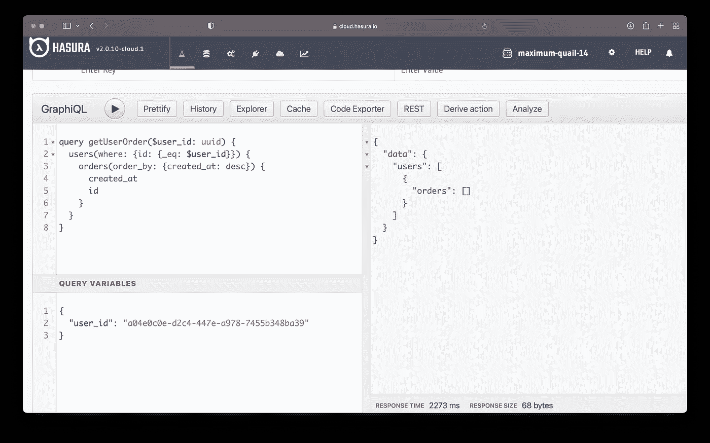

*图 37 —无用户订单*

图 38 展示了一个用户订购的例子。该查询返回订单的创建时间和订单 ID。

订单 ID 是必需的，因为您将需要它来向订单追加订单项目。

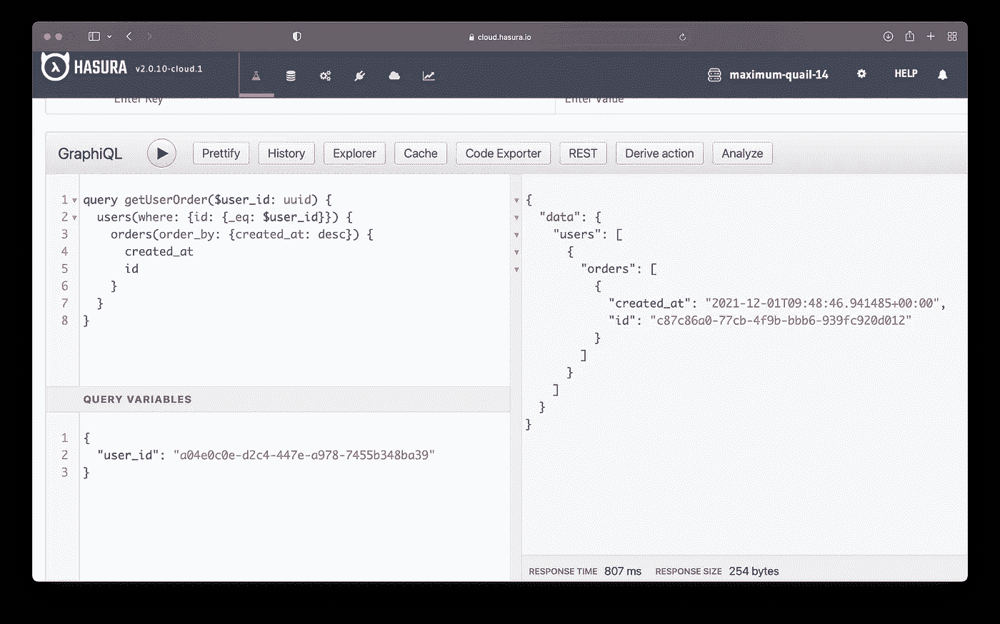

*图 38 —用户订单*

这将我们带到下一步，我们将订单分配给`latest_order`变量。

上面的代码检查`orders`数组是否为空，或者最新的订单是否完成。如果数组为空或者最新的订单已完成，它将运行`CREATE_USER_ORDER`变异为发出请求的用户创建一个新订单。考虑到变异是成功的，它将新创建的订单的 ID 赋给`latest_order`变量。

否则，如果`orders`数组不为空或最新订单未完成，它将最后一个未完成订单的 id 分配给`latest_order`。

此时，无论用户已经有了一个订单还是创建了一个新订单，都有一个活动订单。这意味着可以创建`order`商品并将其添加到订单中。

操作代码已经完成，您可以使用它来创建订单项目。你可以在这个[要点](https://gist.github.com/catalinpit/51dbb1691e23431237d83ffd0d6da9d9)中看到动作的完整代码。

## 部署代码

在使用新创建的操作之前，您需要部署新代码。为了保持事物的分离并使其更容易理解，我们将为所有的动作提供一个单独的 Node.js 服务器。

这意味着您需要创建一个新的节点服务器。这些步骤类似于您对`register`动作所做的:

*   下载初学者工具包
*   添加必要的代码(用`src/server.js`文件中上述要点的代码替换`/hello`路线)
*   部署应用程序

你可以在这个[库](https://github.com/catalinpit/hasura-actions/tree/main/create-order-item)中看到完整的服务器代码。

## 修改操作

查看图 37(如上)，您可以看到动作定义包含了`order_id`字段。

然而，我们不必再手动传递它了。只有经过身份验证的用户才能创建订单项，因此根据发出请求的用户自动传递`order_id`。

转到`createOrderItem`操作，点击“修改”选项卡。之后，删除带有`order_id`的行并保存。


*图 39 — Hasura 修改动作*

图 39 展示了此时的操作。

您需要更新的最后一件事是动作处理程序。用 URL 更新处理程序，就像对`register`动作那样。

现在是测试动作的时候了，看看它是否正常工作。

# 操作权限

类似于设置注册的动作权限，允许“用户”角色执行`createOrderItem`突变。

参考图 35。

## 测试动作

让我们通过运行以下变异来尝试创建一个新的订单项:

```
mutation {
    createOrderItem (
        product_id: "00209df6-d11a-4b04-b7e2-9cf1fa122215",
        quantity: 10
    ) { id }
}
```

该操作工作正常，并创建了新的订单项目。在图 40 中，您可以看到它返回了新创建的订单项的 id。

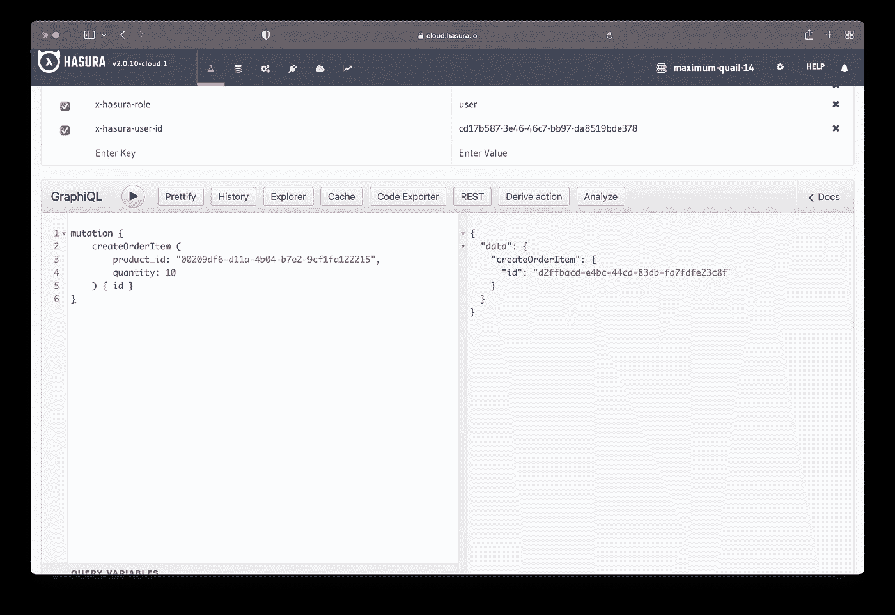

*图 40 —创建订单项目突变*

如果查看数据库，您可以看到,`order`商品已成功创建并添加到订单中。


*图 41 —新订单项目*

这将带我们进入下一步——下订单！

## 订购

最后，我们需要一个定制的变异，允许用户下订单。下订单将使用户能够输入他们的详细地址，计算支付总额，并将`ordered`变为真。

从 Hasura 仪表板转到 GraphiQL 编辑器，编写以下变化:

变异可能看起来很复杂，所以让我来解释一下。突变:

*   查找具有特定 ID 的订单
*   用用户传递的详细信息更新订单
*   返回订单 id、订单状态和总金额

编写完变异之后，像前面的操作一样，单击“派生操作”选项。

像往常一样，Hasura 自动生成动作定义。这一次我们将通过从定义中删除`order_id`来修改它。

图 42 展示了新动作应该是什么样子。

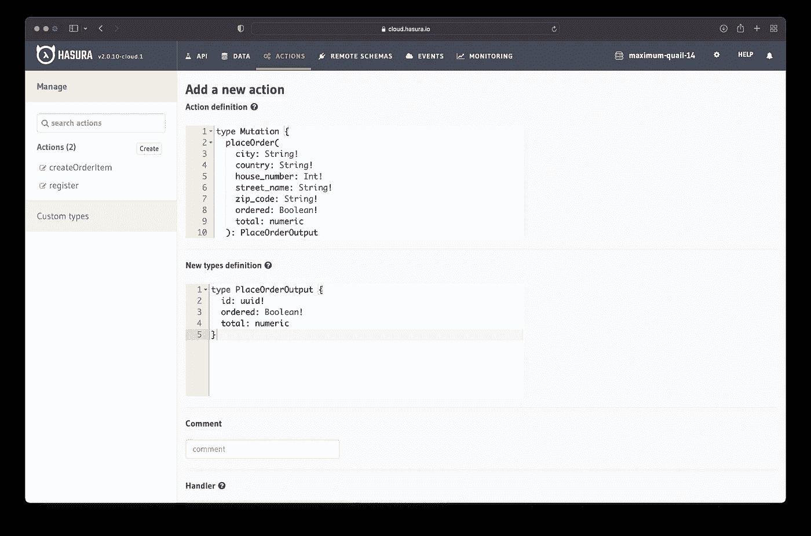

*图 42 —下单操作*

字段`order_id`被删除，因为它将在操作代码中自动传递。

保存操作后，您可以转到“Codegen”选项卡查看自动生成的代码。我们还需要编写定制的业务逻辑，因为`order_id`是自动传递的。此外，我们需要计算订单需要支付的总金额。

# 附加查询和变异

Hasura 总是在生成的代码中给你主要的突变。下单的突变如下:

```
const PLACE_ORDER = `mutation placeOrder($order_id: uuid, $city: String!, $country: String!, $house_number: Int!, $street_name: String!, $zip_code: String!, $ordered: Boolean!, $total: numeric) {
  update_order(where: {id: {_eq: $order_id}}, _set: {city: $city, country: $country, house_number: $house_number, ordered: $ordered, street_name: $street_name, zip_code: $zip_code, total: $total}) {
      returning {
        id
        ordered
        total
    }
  }
}`;
```

我们还需要一个查询来获取属于经过身份验证的用户的订单。该查询应返回以下信息:

*   订单 ID
*   `ordered`字段
*   所有的`order`项
*   每个订单项目的`id`
*   它所代表的`product`
*   产品的`name`
*   产品的`price`
*   `quantity`

下面的查询返回所有这些信息。

对于这个操作，这些是所有需要的查询和突变。下一步是构建处理程序。

## 构建处理程序

您可以重用同一个`[execute](#heading-execute-function)`函数来运行查询和变异。它的功能与前面动作的功能相同。

下一步是处理来自用户的数据和发出请求的用户的 id。

```
app.post('/placeOrder', async (req, res) => {
  // get request input
  const { city, country, house_number, street_name, zip_code, ordered } = req.body.input;
  const user_id = req.body.session_variables['x-hasura-user-id'];
```

一旦有了用户 ID，就可以执行`LATEST_USER_ORDER`查询来检索所有的用户订单。

如果操作成功，您将最新订单的 id 存储在一个单独的变量中。您将使用这个`id`来下订单。

这让我们进入了下一步。这是您循环订单中的项目并计算每个项目的总数的地方。

一旦您获得了每个订单项目的总金额，您就可以计算整个订单的总金额。

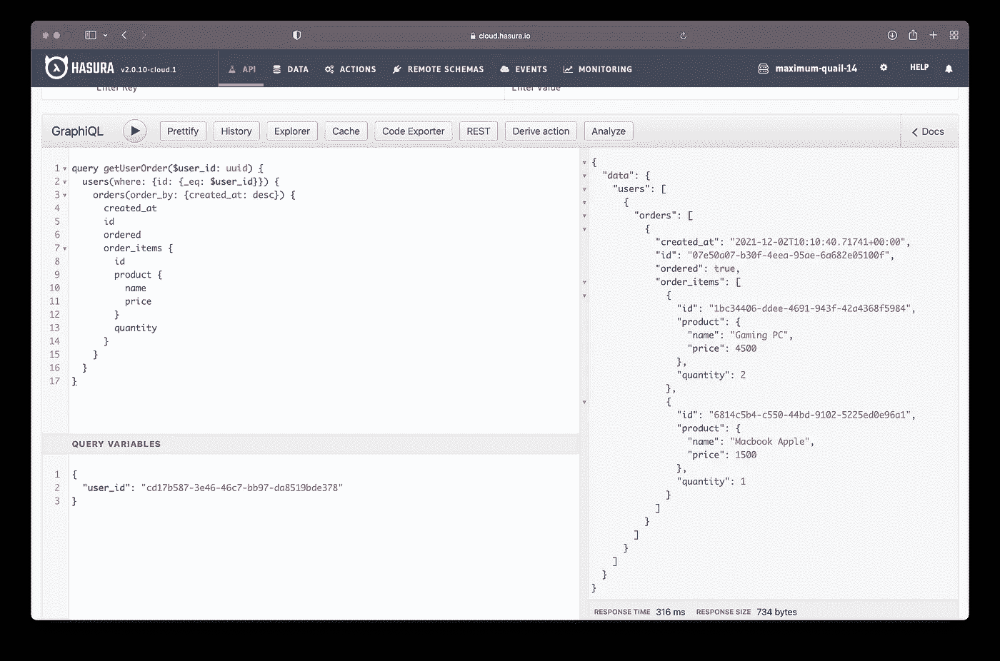

*图 43 —订单示例*

让我们以图 43 中的顺序为例。订单有两个`order`项目:

*   包含两台游戏电脑的订单项目
*   包含一台 Macbook 的订单项目

对于每个订单项，它将产品的价格乘以数量，得出每个订单项的总金额。

`orderItemsTotal`是一个数组，包含每个订单项目的总金额。对于此示例，`orderItemsTotal`是以下数组:

```
const orderItemsTotal = [ 9000, 1500 ];
```

现在，我们需要计算订单的总和。我们可以通过将来自`orderItemsTotal`数组的所有金额相加来实现。支付订单的总金额存储在`amountToPay`中。

```
const orderItemsTotal = orderExists.users[0].orders[0].order_items.map(orderItem => {
    const total = orderItem.product.price * orderItem.quantity;

    return total;
  });

  const amountToPay = orderItemsTotal.reduce((acc, curr) => acc + curr, 0);
```

此时，您有了订单`id`和要支付的总金额。这意味着该下订单了。

```
const { data: placeOrder, errors: placeOrderErr } = await execute({ order_id, city, country, house_number, street_name, zip_code, ordered }, PLACE_ORDER, req.body.session_variables);

if (placeOrderErr) {
    return res.status(400).json({ error: placeOrderErr[0].message });
}

return res.json({
    ...placeOrder.update_order.returning[0]
});
```

操作代码已完成，现在您可以下订单了。你可以在这个[要点](https://gist.github.com/catalinpit/0416bedb8929632c5bb05dc22a6e031c)中看到这个动作的完整代码。

## 部署代码

您为这个操作部署 Node.js 服务器，就像您为前面的操作所做的那样。您可以在这个[库](https://github.com/catalinpit/hasura-actions/tree/main/place-order)中看到完整的服务器代码。

## 更新处理程序

您需要更新的最后一件事是动作处理程序。添加您的 URL 并保存操作。

现在你可以用行动了！

## 操作权限

类似于为前两个操作设置操作权限，允许“用户”角色执行`placeOrder`变异。

参考图 35。

## 测试动作

在下订单之前，您需要创建一个订单并向其中添加订单项目。否则，应用程序会抛出一个错误，因为您试图向一个不存在的订单添加项目。

假设您有一个开放的商品订单，在 Hasura 仪表板的 GraphiQL 中运行以下变化:

```
mutation {
  placeOrder(
    city: "London"
    country: "England"
    house_number: 10
    ordered: true
    street_name: "Potter Street"
    zip_code: "AA21JJ"
  ) {
    id
    ordered
    total
  }
}
```

在图 44 中，您可以在项目仪表板中看到突变和响应。

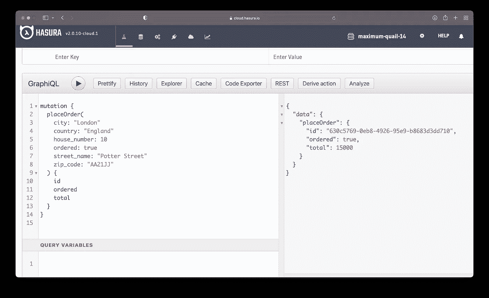

*图 44 —订单突变*

运行突变后检查数据库，显示订单已经发出。图 45 展示了数据库中的新订单。


*图 45 —完成订单*

现在，认证用户也可以下订单了！但是，在这个应用程序中下订单并不处理付款。一个完整的下订单过程也需要处理付款。Hasura 有一个视频展示了如何用 Stripe 和 Actions 创建一个[支付 API](https://youtu.be/NEZ5ceGt_PM) 。

总之，当您想要扩展或定制应用程序的功能时，Hasura 的“Actions”特性非常方便。

# 结论

在本教程中，您将通过编写最少的代码来构建一个基本电子商务应用程序的后端。Hasura 通过最大限度地减少构建应用程序时编写的代码量来帮助您加快开发时间。

从这里去哪里？从这里开始，您可以尝试从头开始构建应用程序的后端，然后再构建前端。之后，您可以尝试使用动作和远程模式将您的自定义 REST 和 GraphQL APIs 插入到 Hasura 中。