# 使用 Truffle 套件构建一个端到端的 NFT 项目

> 原文：<https://betterprogramming.pub/build-an-end-to-end-nft-project-using-truffle-suite-d1814ee290f9>

## 了解 Truffle 套件以及它们如何适应 web3 开发生命周期。然后，我们将创建一个端到端的 NFT 项目。

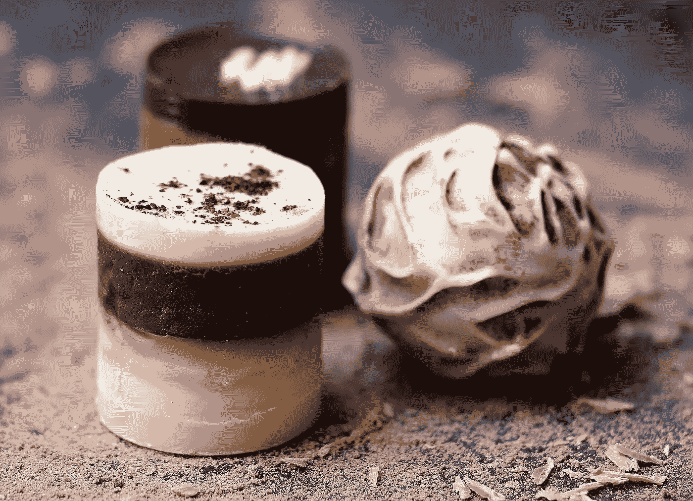

不可替代令牌(NFT)是 Web3 迄今为止最大的(也是最受欢迎的)创新之一。虽然他们的能力仍在探索中，但艺术行业和游戏世界都从这项技术中受益。这是因为 NFTs 创建了一个无可争议的数字所有权记录。

构建 NFTs 并不像您想象的那么复杂，尤其是使用工具套件，如 [Truffle 套件](https://trufflesuite.com/)本文将向您介绍 Truffle 工具套件，并教您如何使用它们来构建端到端的 NFT 项目，包括以下内容:

*   项目设置和安装使用松露 NFT 盒。
*   块菌 VS 代码扩展简介。
*   如何使用 Truffle 仪表板构建和部署 NFT 智能合约。
*   使用松露 NFT 盒子从内置 React 客户端铸造 NFT 的说明。
*   在 block explorer 和 OpenSea / Rarible 上验证。

# 松露套房介绍

为了让以太坊开发者的生活更轻松，Truffle 提供了开发环境、测试框架和资产管道。

它有几个特性吸引了有经验的和刚接触 Web3 的开发人员，它使开发人员能够为许多用例构建和部署 dapps。Truffle 工具套件有几个组件，包括:

*   用于构建控制台和 web 应用程序的可编程构建管道。
*   开发过程中的即时资产重建(`truffle watch`)
*   一个控制台，使使用你编译的契约变得简单(`truffle console`)。
*   合同编译和部署，内置对 JavaScript、CoffeeScript、ES6 和 JSX 的支持，使用您选择的 RPC 客户端。

## 松露套房

Truffle 包含帮助任何人快速构建和部署 Web3 项目的基本工具。堆栈中的工具包括:

*   [松露](https://trufflesuite.com/) —开发环境和测试框架。
*   [Ganache](https://trufflesuite.com/ganache/) —以太坊开发的个人区块链。
*   用于 VS 代码扩展的 Truffle[——一个使创建和管理 Truffle 项目更加容易的扩展。](https://github.com/trufflesuite/vscode-ext?ref=hackernoon.com)
*   [Truffle Dashboard](https://trufflesuite.com/docs/truffle/how-to/use-the-truffle-dashboard/) —使用现有元掩码钱包进行部署和其他需要从命令行上下文发送的事务的简单方法。
*   [松露盒子](https://trufflesuite.com/boxes/?ref=hackernoon.com) —样板项目快速启动并运行。

虽然不是 Truffle 工具套件的一部分，但以下工具与堆栈很好地结合在一起，使开发和部署更加简化:

*   [Infura](https://infura.io/) —一家 Web3 后端和基础设施即服务(IaaS)提供商，为区块链开发者提供各种服务和工具。
*   [MetaMask](https://metamask.io/) —一个加密钱包和区块链应用的网关。

# 如何使用 Truffle 堆栈启动端到端 NFT 项目

现在您已经对所涉及的工具有了一个概念，让我们将它们放在一起创建一个 NFT 项目。

# 先决条件

在开始之前，我们需要以下先决条件:

*   Node.js 和它的包管理器 NPM。
*   使用以下终端命令验证我们是否安装了 Node.js:

```
node -v && npm -v
```

*   [一个不真实的账户](https://docs.infura.io/infura/getting-started)
*   [块菌 VS 代码扩展](https://trufflesuite.com/blog/build-on-web3-with-truffle-vs-code-extension/)
*   对 JavaScript 和 Solidity 有基本的了解

# 创建一个 Infura 帐户来访问网络

访问 Infura 网站[注册一个新账户](https://infura.io/register)或[登录](https://infura.io/login)如果您已经有一个账户。

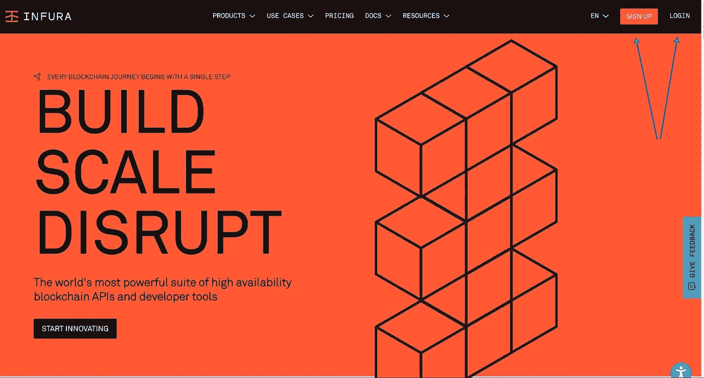

成功注册后，该页面重定向到我们的仪表板，在这里我们可以创建一个新的密钥，如下所示。

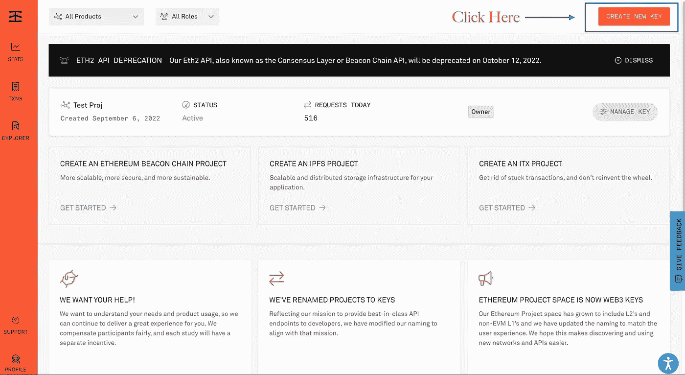

点击**新建密钥**按钮，填写所需信息。


创建您的密钥后，您的项目 ID 将出现在仪表板上的 **API 密钥**部分，如下所示。复制并保存在某个地方；在本教程的后面，您将需要它。

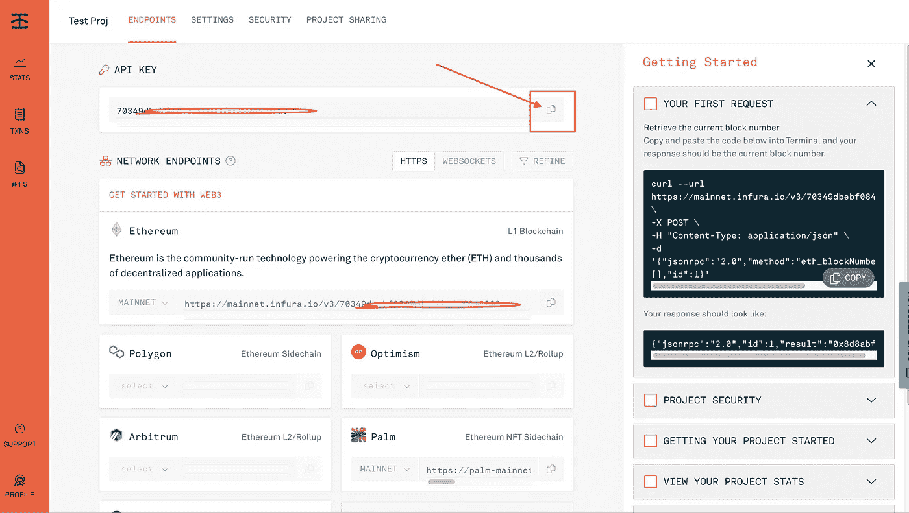

# 使用 Infura RPC 设置元掩码

我们将需要使用 Infura RPC 端点在 MetaMask 上配置和设置 Goerli 测试网络，因为您将通过 Truffle Dashboard 构建和部署您的应用程序。

前往 [metamask.io](https://metamask.io/) 下载你的浏览器扩展。使用 MetaMask 这样的加密钱包时，了解钱包的安全性是必不可少的。

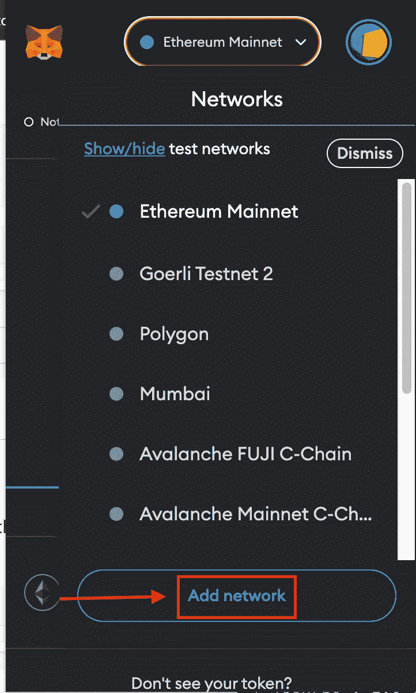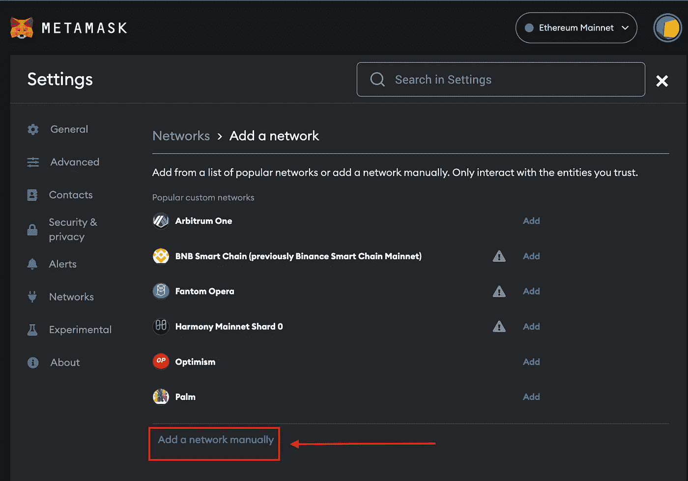

点击**手动添加网络**，如上图所示，然后输入以下信息:

```
Network Name: Goerli Testnet - Infura
New RPC URL: https://goerli.infura.io/v3/<Paste-your-project-id-here>
Chain ID: 5
Currency Symbol: ETH
Block Explorer URL: https://goerli.etherscan.io/
```

恭喜您，您已经成功地用 Infura RPC 配置了 Goerli Testnet。

# 使用 Truffle NFT 盒和 Truffle for VS 代码扩展的端到端 NFT 项目设置

在本节中，您将使用 Truffle NFT 盒和 Truffle for VS 代码扩展来建立一个 NFT 项目。从你想处理的文件夹中打开 VS 代码，导航到扩展标签，搜索“Truffle for VS Code”


安装了扩展后，您可以轻松地从 Truffle Box 创建一个新的 Truffle 项目。按 ctrl+shift+P 打开命令对话框，键入“truffle”这将显示可用的 Truffle 命令列表。

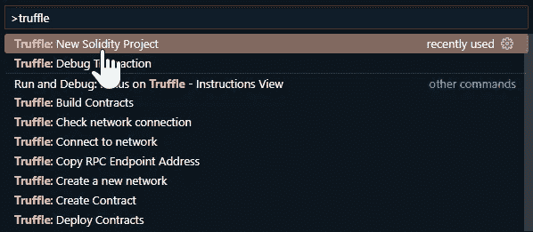

选择**新建实体项目**，然后**从块菌盒**创建项目。接下来，将显示可用松露盒的列表。选择 **nft-box** 创建项目。


或者，如果您没有使用 VS 代码作为您的主要编辑器，您仍然可以跟随。使用以下命令从您选择的任何目录中的块菌盒创建一个 NFT 项目:

```
mkdir nft-project-demo && cd nft-project-demo
npx truffle unbox nft-box
```

或者你可以全局安装 Truffle 并运行`unbox`命令。

```
npm install -g truffle
truffle unbox nft-box
```

这个命令应该下载和拆箱松露 NFT 盒。

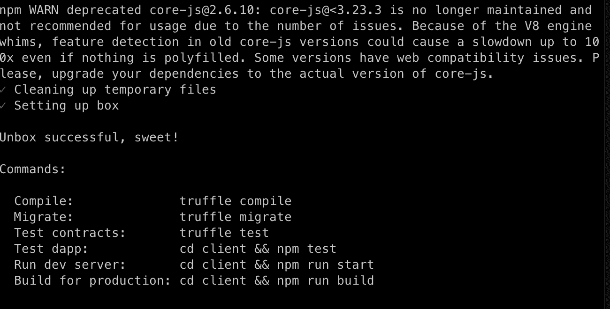

接下来，`cd`进入新目录，并通过运行`npm install`下载所有项目依赖项。

最后，在您喜欢的代码编辑器中打开项目。不管您是如何创建项目的，您都应该有一个类似于下面所示的项目结构。

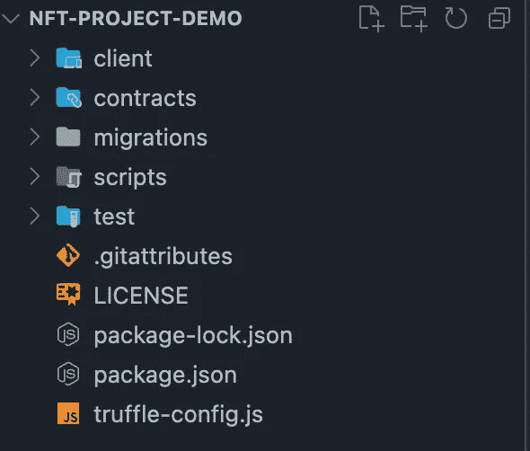

# 在 IPFS 上传 NFT 元数据

我们的 NFT 图像和元数据将使用 IPFS 存储。打开你的 Infura 仪表板，创建另一个项目，这次选择 IPFS，如下所示。

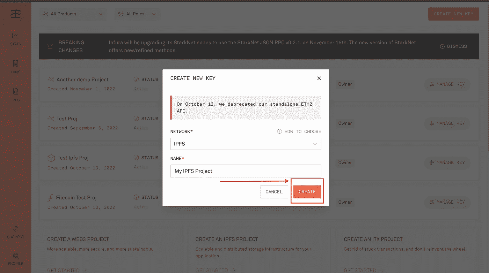

接下来，点击**管理密钥**查看项目详情。

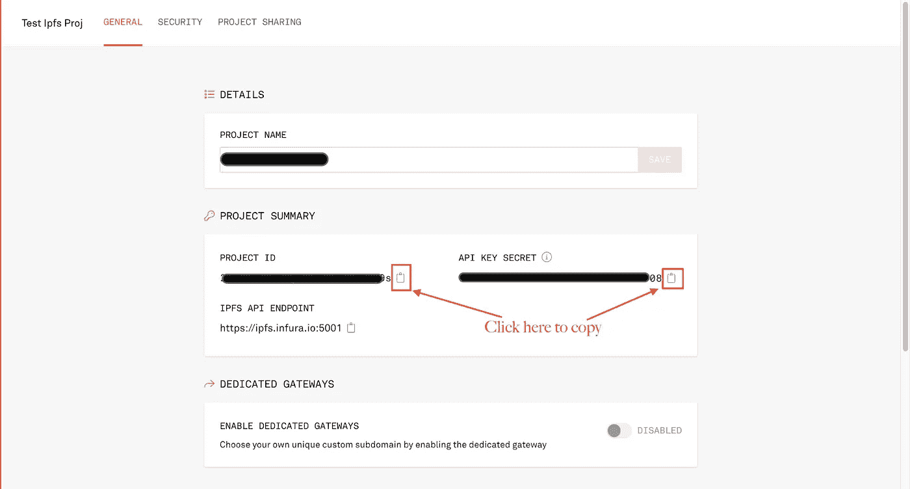

您将需要**项目 ID** 、**项目秘密**和**端点 URL** 来完成以下任务。

使用下面的命令，让我们上传图像到 IPFS。要上传图像，请将 cd 放入保存图像的文件夹中。

```
curl -X POST -F file=@yourfile -u "PROJECT_ID:PROJECT_SECRET" 
"https://ipfs.infura.io:5001/api/v0/add"
```

*   *将* `*@yourfile*` *替换为当前文件夹中图像文件的名称，如* `*image-name.jpeg*` *。*
*   *依次用您的项目 id 和密码替换* `*“PROJECT_ID:PROJECT_SECRET”*` *。*

该命令的输出应该类似于下图所示。


您可以通过将哈希粘贴到以下 URL 来验证图片是否上传成功:https://ipfs.io/ipfs/YOUR_HASH_HERE.

***注意*** *:首次尝试通过 URL 访问图像时，可能需要几分钟的加载时间。*

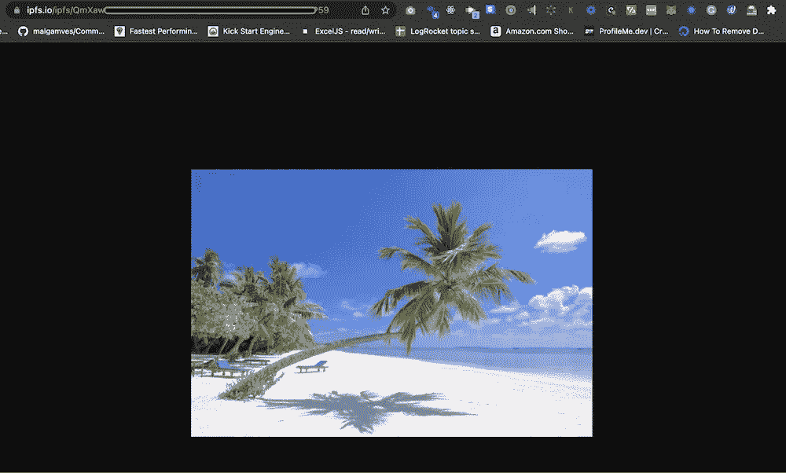

既然图像已经存在，让我们将元数据存储在 IPFS 上。为了符合 [OpenSea 要求](https://docs.opensea.io/docs/metadata-standards)，您将需要您的元数据采用以下 JSON 格式:

```
{ 
  "name": "My Nature NFT",     
  "description": "Amazing nature NFT deployed to the Goerli Network using Infura RPC",
  "image": "ipfs://YOUR_HASH_HERE" 
}
```

您将使用类似于前面步骤中使用的命令来上传图像。

```
curl -X POST -F file=@yourjsonfile -u "PROJECT_ID:PROJECT_SECRET" 
"https://ipfs.infura.io:5001/api/v0/add"
```

*   *将* `*@yourjsonfile*` *替换为当前文件夹中 json 文件的名称，如* `*nft-metadata.json*` *。*
*   *依次用你的项目 id 和秘密替换* `*“PROJECT_ID:PROJECT_SECRET”*` *。*


您可以通过将散列粘贴到以下 URL 来验证 JSON 文件是否成功上传:https://ipfs.io/ipfs/YOUR_HASH_HERE


您已经完全设置了我们使用 Truffle Dashboard 构建和部署智能合同所需的所有工具。让我们在下面的步骤中这样做。

# 使用 Truffle 仪表盘构建和部署智能合同

带着我们之前安装的松露 NFT 盒子前往 NFT 项目；在本节中，您将构建和部署智能合约。

在 migrations 文件夹的`1_deploy_contracts.js`文件中，用下面的代码片段更新它。

```
var NFTCollection = artifacts.require("./NFTCollection.sol");

module.exports = function (deployer) {
  deployer.deploy(
    NFTCollection,
    "https://ipfs.io/ipfs/YOUR_IPFS_HASH_HERE",
    "NFT DEMO",
    "NFTD"
  );
};
```

在上面的代码片段中，我们添加了 IPFS 上托管的 JSON 文件的 URL、令牌名称和符号作为`deployer.deploy()`函数的参数。

接下来，您将使用 Truffle Dashboard 进行构建和编译，它消除了在整个开发生命周期中与您的钱包的助记短语或私钥进行手动交互的需要。

在单独的终端窗口中，键入以下命令:

```
truffle dashboard
```

该命令将自动启动位于 [http://localhost:24012](http://localhost:24012) 的 Truffle Dashboard，并在您现有的浏览器会话中打开一个新选项卡。


连接钱包后，确保切换到我们之前使用 Infura RPC 设置和配置的 Goerli testnet。成功连接后，您应该会看到如下所示的内容。

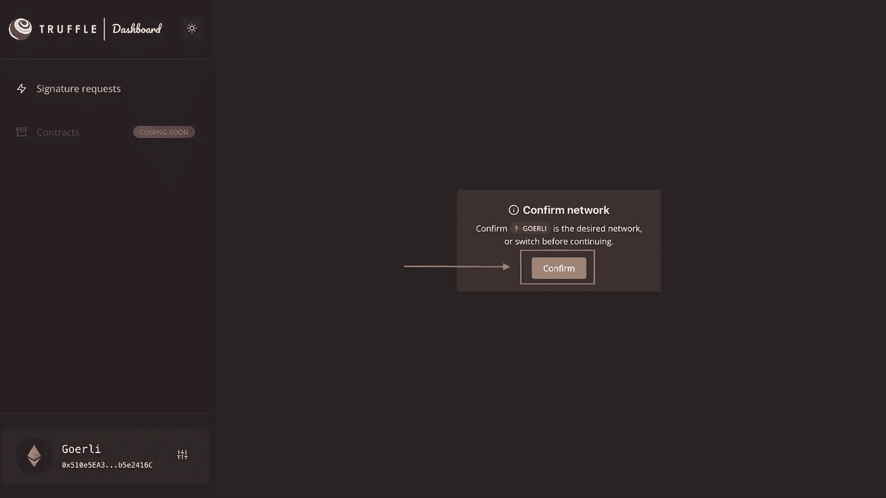

接下来，使用以下命令编译和部署智能合约:

```
truffle migrate --network dashboard
```

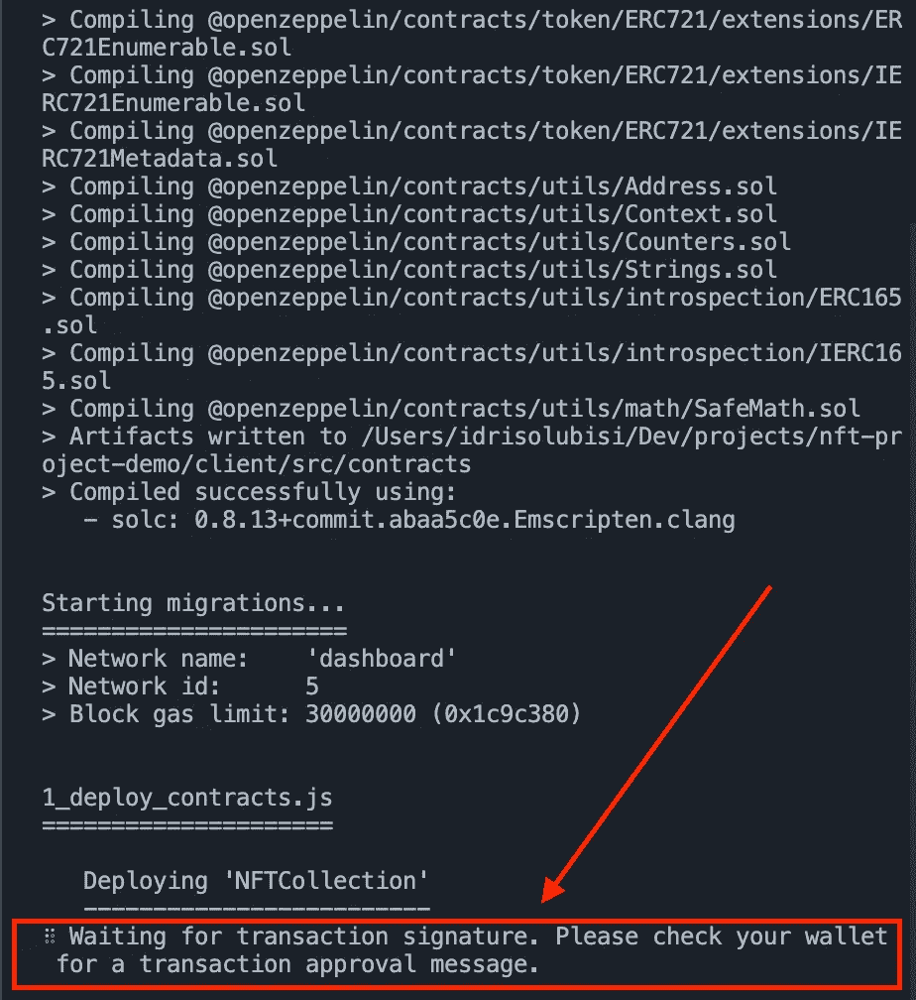

根据终端上的提示，通过浏览器上的 Truffle 仪表板批准交易。

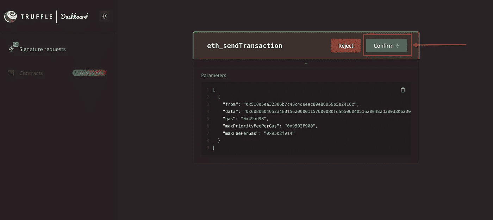

成功部署后，您应该在终端上看到类似下面所示的内容。

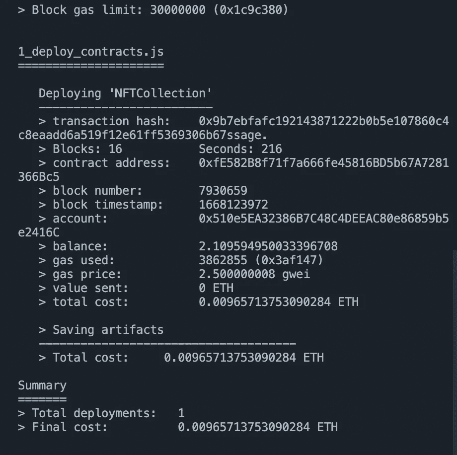

# 在 Goerli Testnet 块资源管理器上验证合同创建

在本节中，通过粘贴合同地址或从 MetaMask 确认，在 Goerli Testnet 块资源管理器上通过 [testnet URL](https://goerli.etherscan.io/) 验证合同创建，这将重定向到 Goerli Testnet 块资源管理器，如下所示。

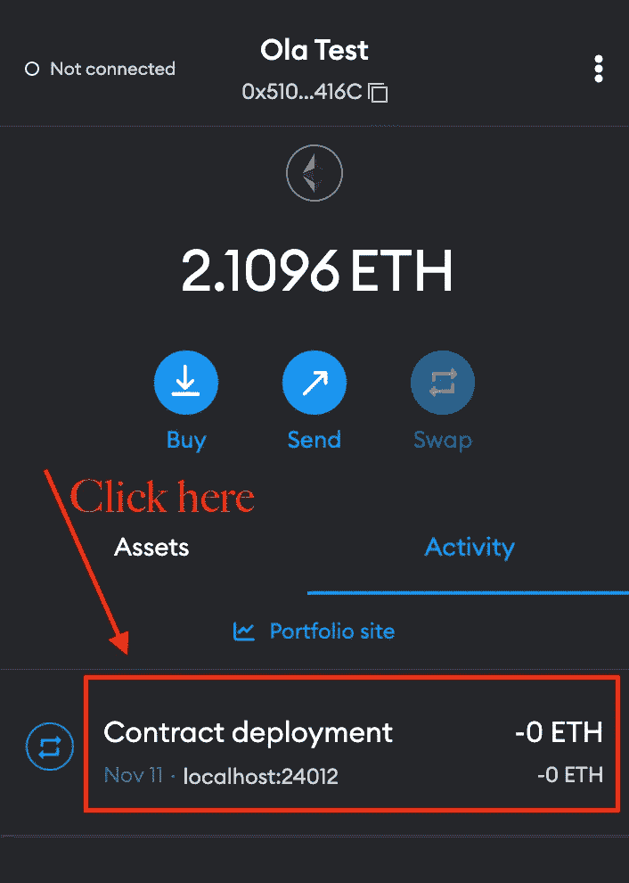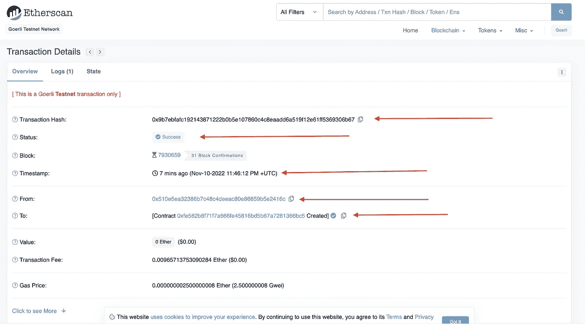

# 配置前端客户端并创建一个 NFT

打开一个单独的终端，运行以下命令来配置前端客户端。这将允许我们从我们刚刚部署的智能合同中创造 NFT。

```
cd client
npm install
npm start
```


如果您遇到类似上面显示的错误，在客户端文件夹中创建一个`.env`文件，添加 `SKIP_PREFLIGHT_CHECK=true`，然后运行下面的命令。

```
npm start
```

React 服务器将在 [http://localhost:3000/](http://localhost:3000/) 的浏览器上自动启动，显示类似下图的内容:

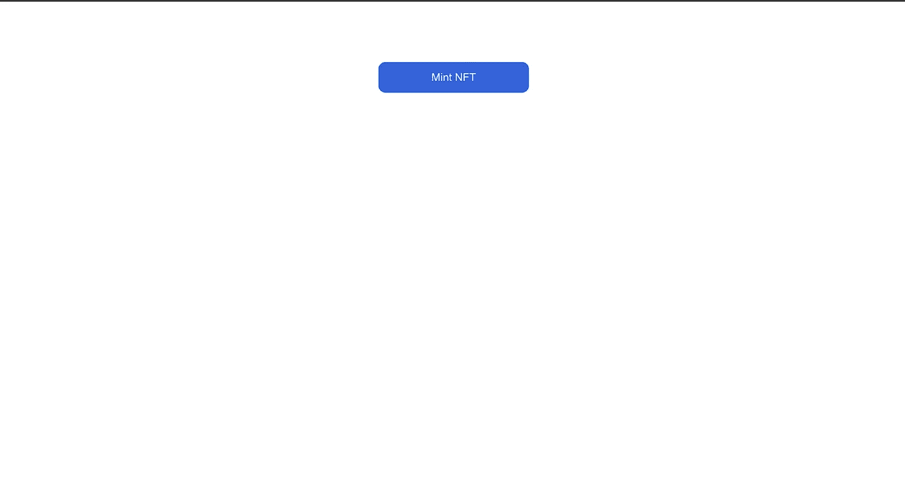

# 测试端到端 NFT 项目

在本节中，让我们测试一下应用程序，看看您是否可以通过点击**铸造 NFT** 按钮来成功铸造 NFT。

按下按钮后，您将看到一个类似于下图所示的 MetaMask 弹出窗口。


通过点击下面的交易，您可以确认 MetaMask 上的铸造是否成功。

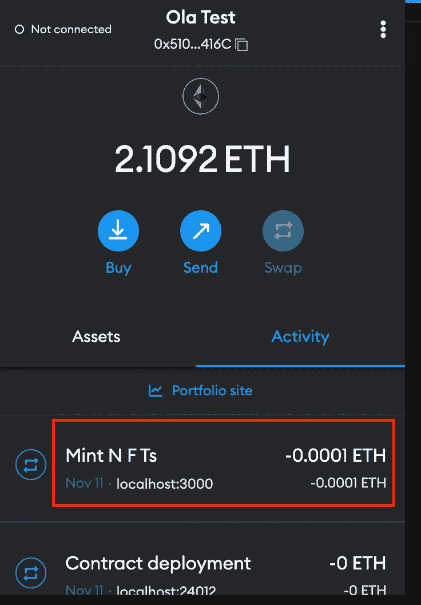

# 在 OpenSea & Rarible 上验证铸造的 NFT

在前面的步骤中，我们使用 Truffle 堆栈成功构建并部署了一个端到端的 NFT 项目。在本节中，让我们在 OpenSea 和 Rarible 上验证我们的铸造 NFT。

如下所示复制合同地址。


将您的合同地址粘贴到搜索栏中，在 opensea 上查看您的新 NFT。如果元数据输入正确，您的 NFT 应该会正确显示。

**注意:** OpenSea 有时显示您的 NFT 元数据和图像会很慢。

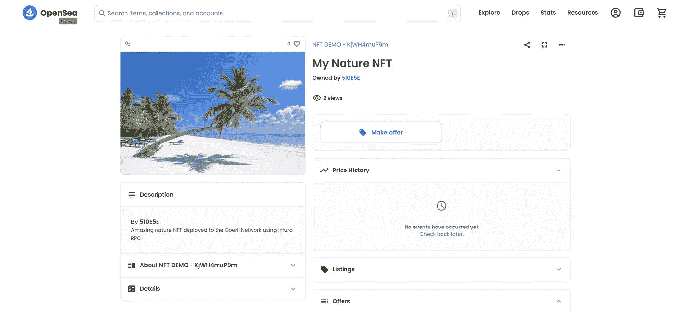

你可以粘贴你的合同地址并在[https://testnet.rarible.com/](https://testnet.rarible.com/)上查看，因为他们检索 NFT 元数据的速度比 OpenSea 快，如下所示。


正如您所看到的，我们的 NFT 在 OpenSea 和 Rarible testnet 平台上都正常显示，从而验证了成功的部署。

就是这样！你可以在这个 [GitHub](https://github.com/Olanetsoft/nft-project-with-truffle-stack) 库上找到完整的代码。

# 结论

本文向您介绍了 Truffle 工具套件，以及如何将它们与 Infura 和 MetaMask 结合使用来创建一个端到端的 NFT 项目。您还了解了块菌盒是快速构建项目的简单方法。

Web3 的开发并不一定很难，尤其是在开发过程的每一步都有工具可用的时候。要了解更多关于松露栈的信息或继续建造，[查看他们的文档](https://trufflesuite.com/docs/)。

祝你今天过得愉快！