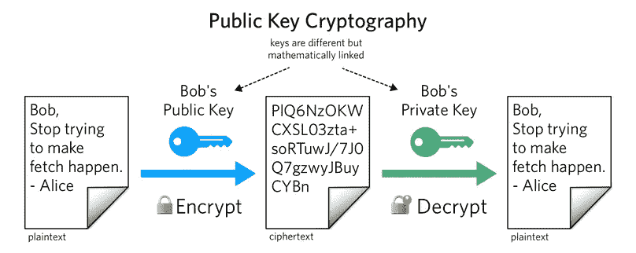
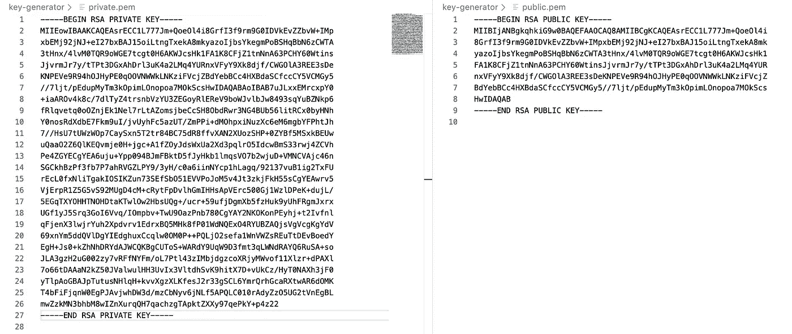

# 在 Go 中构建一个 RSA 非对称密码生成器

> 原文：<https://betterprogramming.pub/build-an-rsa-asymmetric-cryptography-generator-in-go-d202b18bcfd0>

## 编写一个小的便携式 Go 应用程序来生成一对 RSA 密钥



作为加密的非对称(公钥)加密用例。从[提里奥](https://www.twilio.com/blog/what-is-public-key-cryptography)

# **背景**

安全通信对于企业提供强大的信任至关重要。此外，大多数政府强制要求在向其他业务方发送信息时加密个人身份信息(PII)。

非对称加密是信息交换应用中的一种通用加密方法。

根据我的经验，我发现一些新企业很难生成他们的非对称密钥对。然后他们要求我的团队为他们生成密钥对。

从原则上讲，这是一种违反安全惯例的做法。因为私钥应该只由所有者看到和保存，如果我的团队为他们创建了私钥，他们实际上冒着商业信息泄露到我的团队的风险，因为他们已经看到了。

我经常注意到的另一种情况是另一方生成的密钥与规范不符。我们要求 2048 位，但我们从业务合作伙伴那里得到了 1024 位。

根据观察，我认为构建一个可以在任何地方运行的便携式非对称密码生成器是一个好主意。

不费吹灰之力就能在大多数平台上运行的应用程序是一个有用的工具——拥有这种能力可以解决建立安全通信的大部分初始阶段。

# **目标**

创建一个可重用和可移植的非对称密码生成器。输出是一个私钥和一个公钥，可用于加密目的。

# **伪代码**

1.  生成以位大小作为输入的私钥。
2.  从私钥生成公钥。
3.  将私钥格式化为 PEM 格式。
4.  将公钥格式化为 PEM 格式。
5.  将私钥和公钥写入不同的文件。

# **代码**

该应用程序需要一个密码术和编码库。

```
 "crypto/rand"
 "crypto/rsa"
 "crypto/x509"
 "encoding/pem"
 "errors"
 "fmt"
 "io/ioutil"
```

基于伪代码，我们创建了一个接受一个数字作为 RSA 密钥大小的函数。

函数`generateRsaKeyPair` 的输出是 RSA 私钥和公钥。PEM 需要格式化以将密钥存储在字符串类型文件中，如伪代码编号 3 和 5 中所述。

以下是 PEM 格式化代码。

函数`exportKeytoPEM`的输出是两串 PEM 格式的密钥。我们需要将值存储在一个持久文件中，这样我们就可以移动键。下面是将值写入文件的函数。

我们需要执行函数`writeFile`两次，让私钥和公钥写入不同的文件。

我们生成密钥的函数已经完成。现在，让我们将所有这些函数放在`main`函数中。

# **测试应用**

一旦`main` 函数准备就绪，我们就可以使用 Go 命令运行 [Go](https://golang.org/) 应用程序。

```
go run main.go
```

输出两个文件:`private.pem`和`public.pem`。这些文件可以在与`main.go`文件相同的目录下访问。


生成的密钥与 Go 应用程序位于同一位置

该文件的示例如下所示。



PEM 格式的私钥和公钥示例

最后，为了使应用程序可移植，我们可以使用 Go 命令将应用程序构建到一个可移植文件中:

```
go build -o key-generator
```

# **总结**

应用程序可以在基于文本的文件中生成许多对 RSA 密钥。这个密钥对解决了加密和签名文档的业务需求。

*   完整代码— [Git 存储库](https://github.com/purnaresa/secureme/tree/master/key-generator)。

虽然这个应用程序是可移植的，可以在大多数类型的操作系统上运行，但是这个应用程序仍然需要在机器上安装 Go。

为了扩展应用程序的功能，我们可以编写一个端点来触发密钥生成器，并用一对 RSA 密钥回复触发器。这样，我们只能在一台服务器上运行应用程序，并根据需要生成任意多的密钥对。

你觉得那有意思吗？或者你觉得离线生成密钥对就够了？让我们在评论中讨论这个问题。