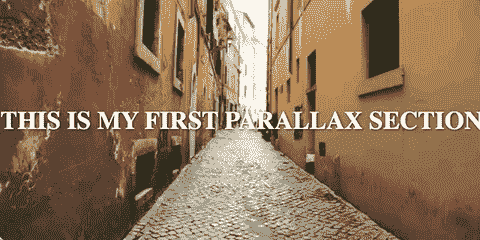
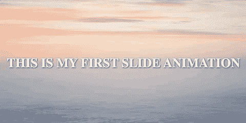

# 在角度上构建漂亮的页面过渡

> 原文：<https://betterprogramming.pub/build-beautiful-page-transitions-in-angular-28e40fa7e3bf>

## 滚动时的视差、淡入淡出和幻灯片过渡


照片由[马蒂亚斯·穆利](https://unsplash.com/@matthiasmullie)在 [Unsplash](https://unsplash.com/photos/OiO0tfESWls) 上拍摄。

当今世界，仅仅有一个网站是不够的。此外，网站应该有一个干净的用户界面和直观的。最重要的是，应该有一个互动的元素。

交互性让用户更长时间地粘在你的网站上。因此，它增加了将用户转化为客户的机会。此外，更长的互动时间会导致更低的跳出率，从而在搜索引擎上获得更高的排名。

当用户在你的网站上滚动时，最常见和最基本的交互形式之一就发生了。如果用户不停地滚动你的长静态页面，岂不是相当无聊？在本教程中，我们将看看三个基本的动画可以发生在滚动。视差、淡入淡出和幻灯片动画是最常用的动画。让我们看看如何实现这些动画。

在我们继续下一步之前，以下是最终结果:



视差([查看演示](https://animations-demo-ffcb4.web.app/parallax))


淡化([查看演示](https://animations-demo-ffcb4.web.app/fade))



幻灯片([观看演示](https://animations-demo-ffcb4.web.app/slide))

# 项目设置

## 先决条件

我们将使用 Angular 11 来创建我们的项目。VS 代码将作为一个 IDE 使用。

为了实现动画，我们将使用精彩的[绿袜子动画平台(gsap)](https://greensock.com/gsap/) 。这是最好的 JavaScript 动画库之一。

## 创建项目

通过执行下面的命令创建一个角度项目。*注意:确保在询问时启用路由。*

```
ng new animations --style css
code animations
```

这将创建一个名为*动画*的新项目，样式格式为 CSS。其次，它将在 VS 代码中打开项目。接下来，让我们安装 gsap。在 VS 代码终端中，执行以下命令:

```
npm install --save gsap @types/gsap
```

这将通过`@types/gsap`安装 gsap 库和打字文件。

最后，让我们创建三个组件。执行以下命令:

```
ng g c parallax
ng g c fade
ng g c slide
```

## 设置路线

让我们创建三条独立的路线:`/parallax`、`/fade`和`/scroll`。打开你的`app-routing.module.ts` ，添加路线如下:

# 视差动画

既然我们现在已经建立了项目，让我们从视差动画开始。

在创建页面动画时，通常使用节。因此，打开您的`parallax.component.html`文件并粘贴下面的代码:

让我们给这些部分添加一些样式。因为我们将在所有三个组件中使用节，所以我们将向公共的 `styles.css` 文件添加样式。打开你的`styles.css` 文件，粘贴下面的 CSS:

上面，我们使截面的高度和宽度等于视口的高度和宽度。其次，我们将内容对齐到部分的中心。最后，我们正在设置文本显示的字体样式。

由于`parallax.component.html`中使用的`bg`类是针对视差的，我们将在`parallax.component.css` *中定义它的属性。*打开文件并粘贴下面 CSS:

为了设置视差动画，我们需要添加一些 TypeScript 代码。因此，打开您的`parallax.component.ts` 文件，并将下面的代码添加到您的`ngOnInit`函数中:

我已经为解释添加了行内注释。如果你需要任何澄清，请在评论中告诉我。

最后，将下面的导入添加到 ts 文件的顶部，这样就不会出现任何编译时错误:

```
import { gsap } from 'gsap';
import { ScrollTrigger } from 'gsap/all';
```

就是这样！你现在可以访问[http://localhost:4200/parallax](http://localhost:4200/parallax)来看看精美的动画。

# 淡化动画

对于渐变动画，打开`fade.component.html`文件并粘贴以下 HTML 代码:

在`fade.component.css`中，粘贴下面的 CSS:

我们将一次只显示一个部分。因此，我们隐藏了除第一部分以外的所有部分。此外，因为我们没有随着滚动移动这些部分，所以它的位置被标记为固定的。

让我们添加动画代码，使滚动的其他部分可见。打开`fade.component.ts`文件并粘贴以下内容:

我添加了行内注释，使代码不言自明。对于任何澄清，请在下面评论。

访问[http://localhost:4200/fade](http://localhost:4200/parallax)查看滚动时平滑淡入淡出的动画。

# 幻灯片动画

这是最容易理解和实现的。打开你的`slide.component.html` 文件，粘贴下面的代码。它类似于`fade.component.html`，除了类从第一部分中被删除。

不需要添加 CSS。接下来，打开`slide.component.ts`文件并添加下面的代码:

同样，为了更好地理解代码，我添加了内联注释。如有任何疑问，请在下面评论。

打开[http://localhost:4200/slide](http://localhost:4200/slide)在你滚动的时候可以看到一个迷人的幻灯片动画。

# 结论

动画在让用户留在你的网站上增加了很多价值。和所有事情一样，合理使用动画。不要用笨重的图片和古怪的动画来搞乱网站。保持简单&保持微妙(KIS 和 KIS)。

在本教程中，我们看到了如何为页面部分添加简单的视差、淡入淡出和幻灯片动画。你有什么好的动画或者知道什么有很棒的动画的网站吗？

最后，非常感谢 [Lorem Picsum](https://picsum.photos/) 提供了这么棒的照片。

*注:在 GitHub* *上可以找到整个项目* [*。*](https://github.com/shenanigan/animations-demo)