# 使用安全区域构建复杂的堆叠布局

> 原文：<https://betterprogramming.pub/build-complex-stacked-layouts-with-the-safe-area-fd2cef780d75>

## 让您的设计在任何设备上看起来都很棒

自从苹果发布 iPhone X 以来，使用安全区域一直是开发者的必做之事。你不希望你的作品藏在凹槽下面，或者夹在状态栏下面，或者圆角下面，等等。

iPhone X 和安全区的推出是在 2017 年，所以我认为可以肯定地说每个 iOS 开发者都知道如何使用它——如果不知道，这里有[文档](https://developer.apple.com/documentation/uikit/uiview/positioning_content_relative_to_the_safe_area)。

但有时你需要潜得更深。您可能希望安全区域出现在某些视图中，而不出现在其他视图中——可能是状态栏下方的一个模糊区域，其高度足以包含一个按钮。谢天谢地，你用安全区建造的任何东西真的很容易！

在这篇文章中，我将回顾其中的一些设计以及如何构建它们。所有的事情都将在故事板中完成，没有一行代码…所以坐下来，放松，享受吧！

# 延伸到顶部的自定义页眉

让我们从一个普通的`UIView`开始——从现在开始我就叫它`View`。将它的背景颜色改为白色以外的颜色，这样更容易看到。我们将把`top`、`leading`和`trailing`限制在“安全区域”内。现在，也将`height`约束到`100`。

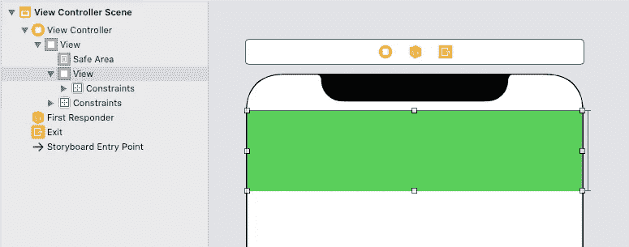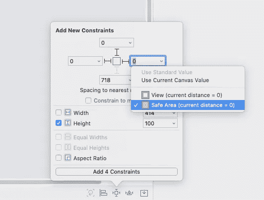

现在，我们在`View`里面加一个`UILabel`。将`top`、`leading`和`bottom`约束到`View`，偏移量为`16`。

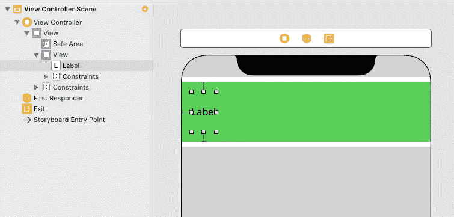

有一种叫做[内在内容大小](https://www.hackingwithswift.com/example-code/uikit/what-is-a-views-intrinsic-content-size#:~:text=For%20example%2C%20the%20intrinsic%20content,height%20without%20us%20forcing%20one.)的东西，基本上就是它们理想的宽度和高度。目前，只有`Label`的固有宽度是活动的——因为顶部和底部被约束到`View`，固有高度被覆盖。

让我们启用固有高度！只需删除`View`对`100`的高度约束。现在`Label`可以自由选择它的理想尺寸，而`View`将会收缩以适应。

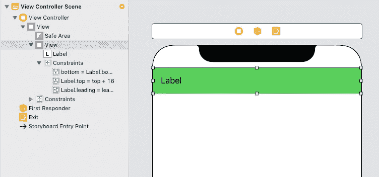

左:之前。右:后。

好的，看起来不错……但是如果你建造并运行，绿色`View`上方的空白区域会变得非常明显。这是因为我们将`View`的顶部限制在了安全区域，而安全区域正好在缺口下方停止。

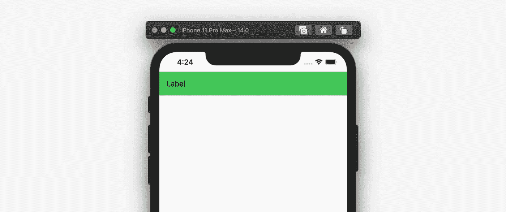

把绿色延伸到屏幕顶部不是很好吗？大概是这样的:

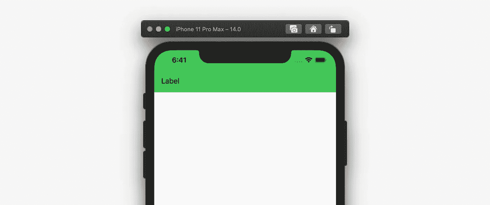

一个快速的解决方法是将标题的顶部限制在`Superview`而不是安全区域。这是结果:

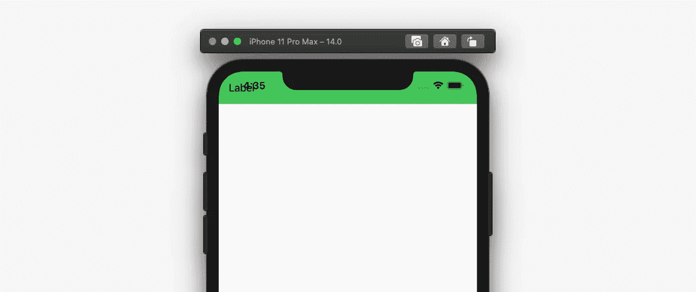

但是后来标签被盖住了！嗯，我们可以通过将`Label`的`top`约束从`16`改为类似于`40`的东西来解决这个问题:

好吧，看起来不错——但是在没有凹槽的手机上运行看起来怎么样？

嗯，还不错…但是，你不应该使用硬编码的值。假设我们横向旋转，这里没有状态栏:

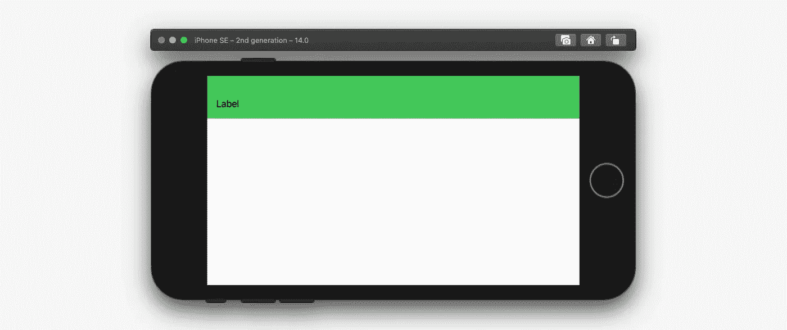

那是对空间的巨大浪费！

# 安全区域布局指南

那么我们如何将绿色的`View`约束到`Superview`(这样它就可以在凹槽和状态栏下面)但仍然将`Label`约束到安全区域呢？答案就在一个名为“安全区域布局指南”的属性中。

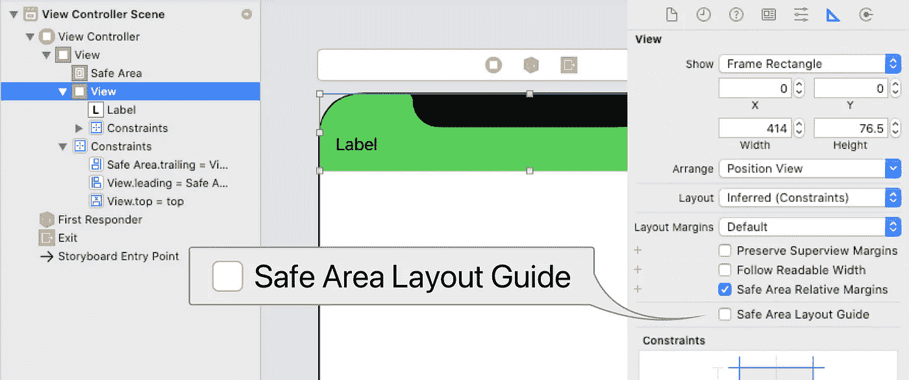

默认情况下，这是未选中的。那么检查的时候会发生什么呢？

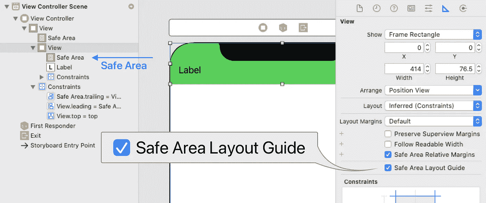

一个安全区域出现了！

哇——我们现在在绿色的`View`里面有一个安全区域*！*

安全区域布局指南为每个视图启用/禁用安全区域。这就是为什么当你第一次创建项目时有一个安全区域——默认情况下，基础`UIView`选中了“安全区域布局指南”。

现在让我们比较一下原始的默认安全区域和新的安全区域:

显然，原来的那个要大得多——但是如果我告诉你它们是一样的，你会相信吗？

原来的安全区域属于每个`UIViewController`自带的底座`UIView`。新的、更小的安全区域属于我们添加的绿色`View`。然而，它们只是同一个安全区的一些片段。这就像一个维恩图——只要安全区域和视图重叠，重叠的部分就是切片。

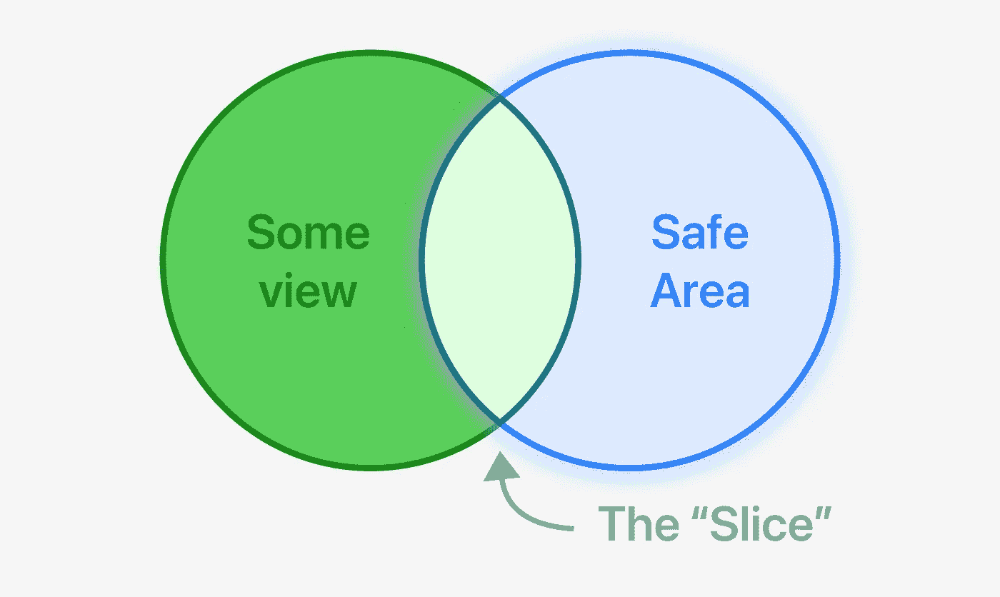

根据视图与安全区域重叠的位置，切片可能会更大或更小，但安全区域将始终相同。

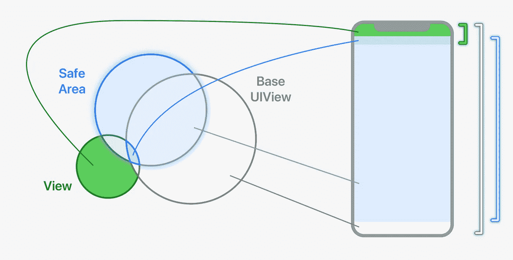

现在我们已经有了安全区域布局指南，我们可以适当地约束我们的标题！还记得`Label`的硬编码`top`约束吗？

既然我们已经为绿色`View`启用了安全区域，我们可以将`Label`的`top`约束固定到安全区域！要编辑约束，首先双击它:

然后，选择“第二项”下的“安全区域”

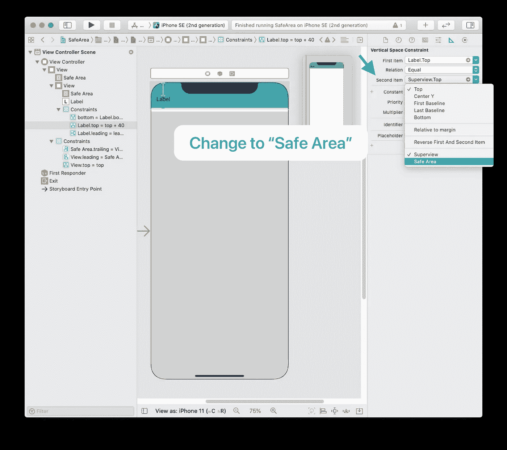

最后，将“常量”从`-4`改为具有更多填充的值，比如`16`。

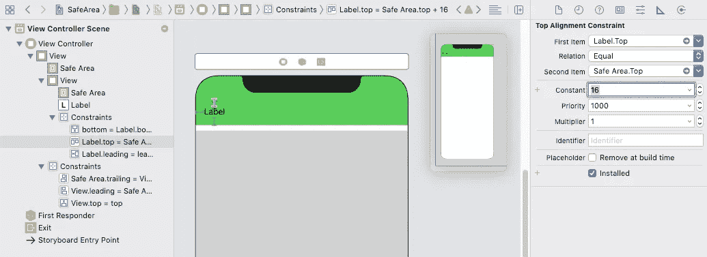

太好了！现在，构建并运行—它可以在任何方向和设备上完美运行。

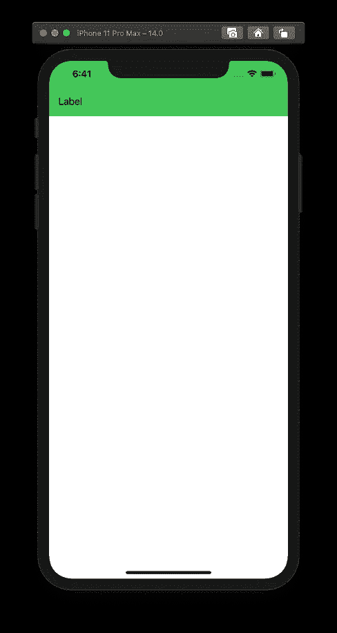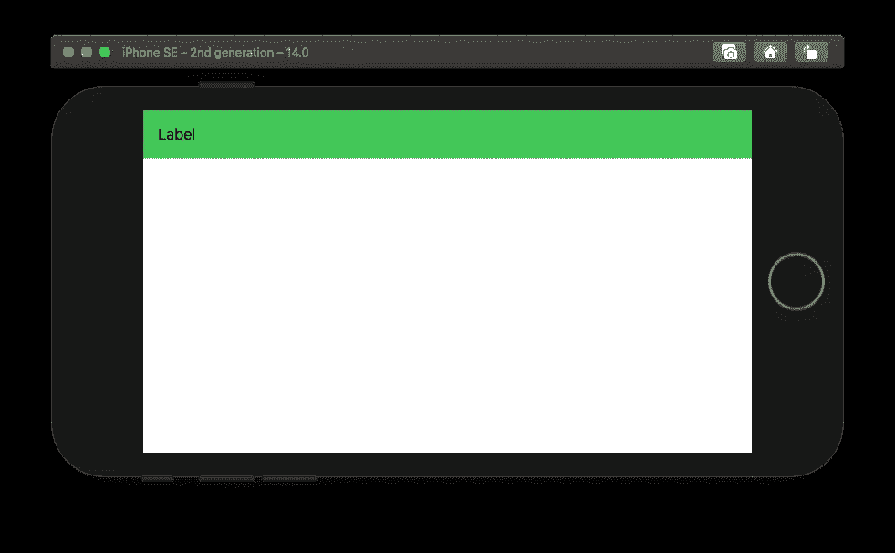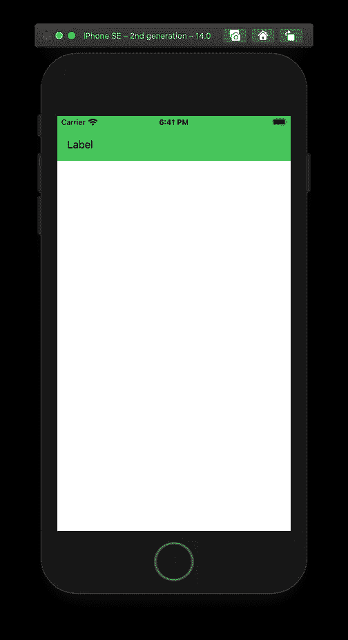

还有一件事:注意到在 iPhone X 上，绿色标题的两侧有一个缺口吗？

这是因为绿色`View`的电流限制是:

*   `Top`至`Superview`
*   `Leading`到安全区域
*   `Trailing`到达安全区域

如果我们希望左侧和右侧延伸到安全区域并进入设备的边缘，我们只需将`leading`和`trailing`设置为`Superview`即可！

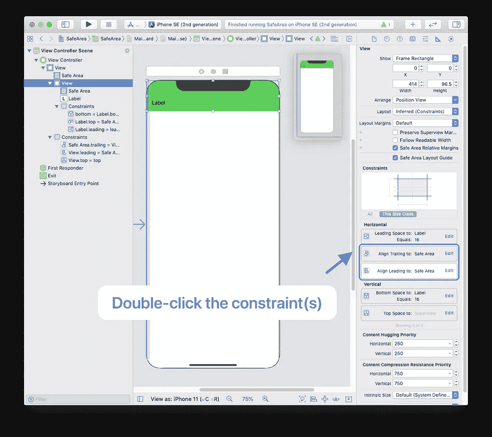

因为安全区域总是相同的，将绿色`View`的`leading`和`trailing`更改为`Superview`根本不会影响`Label`的约束！让我证明一下:

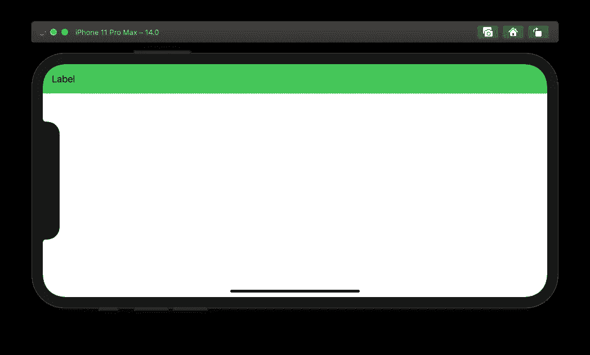

等等，哎呀…绿色的`View`现在延伸到两侧，但是`Label`也跟着延伸。那是因为我们忘记更新`Label`的`leading`约束:目前，它仍然被约束到`Superview`。我们希望那里成为安全区。

到目前为止，您可能已经是改变约束的专家了！连按，选择“第二项”，并将其更改为“安全区域”结果如下:

厉害！

# 无尽的设计可能性

从现在开始，一帆风顺。因为我们已经了解并知道如何激活安全区域布局指南，所以设计的可能性是无穷无尽的！以下是一些例子:

## 自定义标签栏

## 自定义导航栏

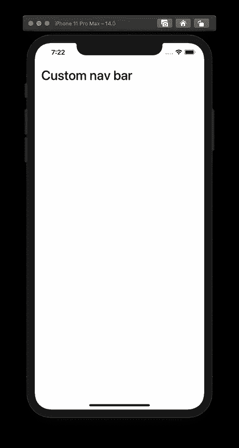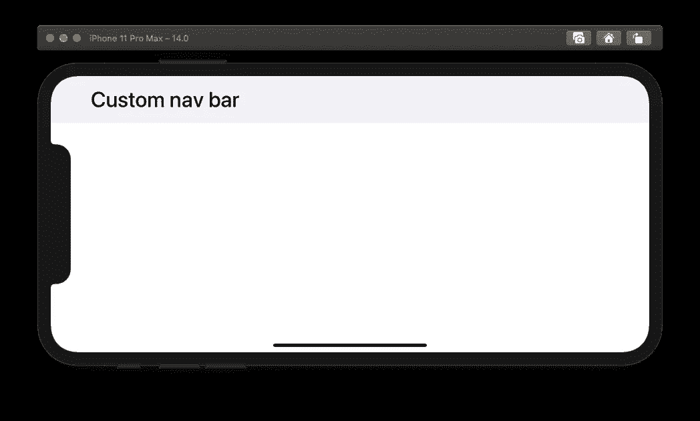

# 自定义相机应用程序

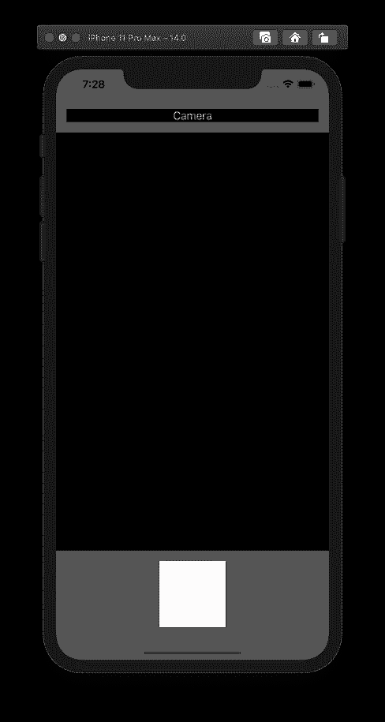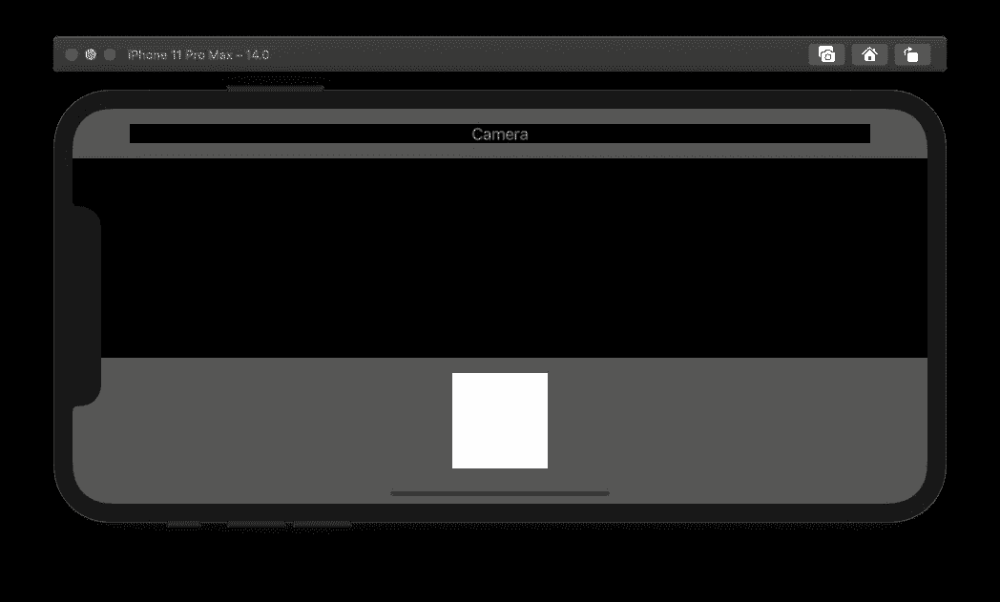

你能想到什么就造什么！

# 在你走之前，我要提醒你一下…

每当你制作一个将启用“安全区域布局指南”的`UIView`时，它**需要被约束在所有 4 个边上**。这意味着钉住`leading`、`trailing`、`top`和`bottom`——或者，用它们中的一个来代替`width`或`height`约束。

*   这样就可以了:`leading = 0`、`trailing = 0`、`top = 0`、`bottom = 0`
*   这将起作用:`leading = 0`、`trailing = 0`、`top = 0`、`height = 100`
*   这个不行:`leading = 0`、`trailing = 0`、`top = 0`

您必须在添加任何子视图之前完成此操作**。还记得在添加`UILabel`之前，将`leading = 0`、`trailing = 0`、`top = 0`和`height = 100`约束到绿色`View`吗？这是为了满足 Xcode——没有`height` , `View`的安全区不能正确激活……没有安全区，`Label`的固有内容大小就没用了。**

如果视图没有被完全约束，就会出现这种情况:

呀！但是在添加了`height`约束(正确激活安全区域)之后，您可以安全地添加子视图并使用它们固有的内容大小。就像我们在本文开头所做的，您可以添加一个`UILabel`，约束它的`top`和`bottom` …然后，您可以安全地移除`height`约束。

这一次就到此为止。感谢阅读！